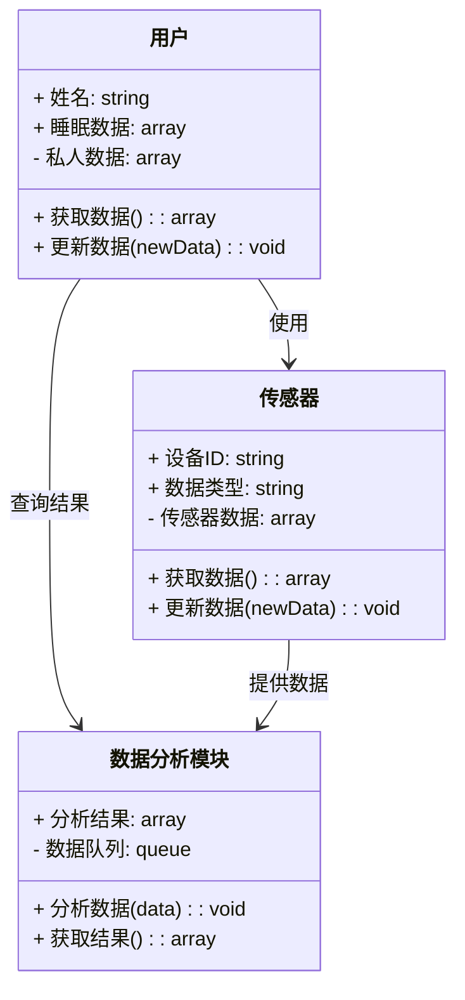
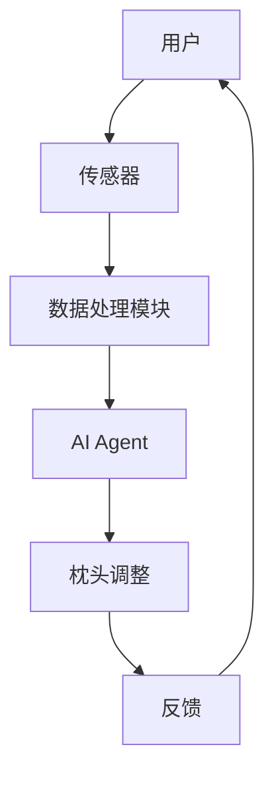
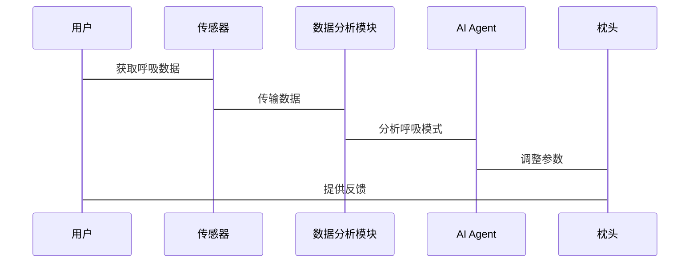

                 


# AI Agent在智能枕头中的呼吸模式分析

> 关键词：AI Agent, 智能枕头, 呼吸模式分析, 睡眠健康, 算法原理

> 摘要：本文探讨AI Agent在智能枕头中的应用，重点分析呼吸模式分析的算法原理、系统架构及项目实现。通过详细的技术解析，展示如何利用AI技术优化睡眠质量。

---

# 第1章: AI Agent与智能枕头的背景介绍

## 1.1 问题背景

### 1.1.1 睡眠健康的重要性
睡眠是人体健康的核心要素，直接影响身体机能和心理健康。充足的睡眠有助于提高免疫力、增强记忆力和情绪稳定性。然而，现代人面临睡眠障碍问题日益严重，如失眠、打鼾、呼吸暂停等。

### 1.1.2 传统枕头的局限性
传统枕头仅提供固定的高度和支撑，无法根据用户的睡眠状态进行动态调整。例如，打鼾问题通常需要通过调整枕头高度来缓解，但传统枕头无法实时感知并自动调整。

### 1.1.3 AI技术在睡眠改善中的潜力
AI技术能够实时监测用户的睡眠数据，并通过算法分析呼吸模式，提供个性化解决方案。AI Agent可以实现动态调整枕头参数，优化用户的睡眠质量。

## 1.2 问题描述

### 1.2.1 睡眠呼吸模式的定义
睡眠呼吸模式指的是人在睡眠过程中呼吸的频率、深度和节律。异常的呼吸模式可能导致睡眠中断、打鼾等问题。

### 1.2.2 睡眠呼吸问题的表现形式
- 打鼾：呼吸不畅导致的声音震动。
- 呼吸暂停：睡眠呼吸暂停综合征（OSAHS）的表现。
- 呼吸节律异常：如呼吸过深或过浅。

### 1.2.3 智能枕头的目标与功能
智能枕头的目标是通过实时监测用户的呼吸模式，动态调整枕头的高度和硬度，改善睡眠质量。其核心功能包括：
- 实时监测呼吸数据
- 分析呼吸模式
- 自动调整枕头参数
- 提供个性化建议

## 1.3 问题解决

### 1.3.1 AI Agent的基本原理
AI Agent是一种智能代理，能够感知环境、做出决策并执行动作。在智能枕头中，AI Agent负责接收传感器数据，分析呼吸模式，并调整枕头参数。

### 1.3.2 智能枕头的实现方式
智能枕头通过内置传感器采集用户的呼吸数据，AI Agent分析数据后，调整枕头的高度和硬度，以优化用户的睡眠姿势。

### 1.3.3 呼吸模式分析的核心算法
呼吸模式分析的核心算法包括：
1. 数据预处理：去噪和平滑处理。
2. 特征提取：提取呼吸频率、幅度等特征。
3. 模型训练：使用机器学习算法训练分类模型。
4. 实时分析：动态调整枕头参数。

## 1.4 边界与外延

### 1.4.1 睡眠监测的边界条件
- 数据采集范围：仅限于呼吸相关数据。
- 功能范围：仅限于枕头参数调整。
- 适用场景：睡眠阶段，非清醒状态。

### 1.4.2 智能枕头的功能范围
- 实时监测：仅限于睡眠阶段。
- 参数调整：仅限于枕头高度和硬度。
- 用户反馈：仅限于睡眠改善建议。

### 1.4.3 AI Agent的适用场景与限制
- 适用场景：睡眠呼吸问题。
- 限制：无法处理严重的呼吸疾病，需结合医疗手段。

## 1.5 核心要素组成

### 1.5.1 数据采集模块
数据采集模块通过传感器获取用户的呼吸数据，包括呼吸频率、幅度和节律。

### 1.5.2 数据分析模块
数据分析模块对呼吸数据进行预处理和特征提取，识别异常呼吸模式。

### 1.5.3 算法执行模块
算法执行模块基于机器学习算法，分析呼吸模式并调整枕头参数。

### 1.5.4 用户反馈模块
用户反馈模块提供睡眠改善建议，并收集用户反馈优化系统。

---

# 第2章: AI Agent与呼吸模式分析的核心概念

## 2.1 核心概念原理

### 2.1.1 AI Agent的基本原理
AI Agent通过感知环境、分析数据、做出决策并执行动作。在智能枕头中，AI Agent接收呼吸数据，分析呼吸模式，并调整枕头参数。

### 2.1.2 呼吸模式分析的基本原理
呼吸模式分析通过传感器数据，提取呼吸特征，识别异常模式，提供改善建议。

### 2.1.3 AI Agent在呼吸模式分析中的应用
AI Agent通过实时监测呼吸数据，动态调整枕头参数，优化用户的睡眠姿势。

## 2.2 核心概念属性特征对比

| 核心概念 | 属性 | 特征 |
|----------|------|------|
| AI Agent | 智能性 | 自主学习与决策 |
| 呼吸模式分析 | 数据依赖性 | 高度依赖传感器数据 |
| 智能枕头 | 交互性 | 用户反馈与实时调整 |

## 2.3 ER实体关系图

```mermaid
er
    Actor: 用户
    Agent: AI Agent
    Sensor: 传感器
    Data: 数据
    Action: 行动
    Relationship: 实体之间的关联
```

---

# 第3章: AI Agent在呼吸模式分析中的算法原理

## 3.1 算法原理概述

### 3.1.1 数据预处理
- 去噪处理：消除传感器噪声。
- 平滑处理：减少数据波动。

### 3.1.2 特征提取
- 呼吸频率：每分钟呼吸次数。
- 呼吸幅度：呼吸深度。
- 呼吸节律：呼吸的周期性。

### 3.1.3 数据分析方法
- 时域分析：分析呼吸波形的形态。
- 频域分析：分析呼吸频率分布。

## 3.2 算法实现

### 3.2.1 传感器数据采集
使用加速度传感器和压力传感器采集呼吸数据。

### 3.2.2 数据预处理
对原始数据进行去噪和平滑处理，确保数据准确性。

### 3.2.3 特征提取
提取呼吸频率、幅度和节律等特征。

### 3.2.4 模型训练
使用机器学习算法训练分类模型，识别异常呼吸模式。

## 3.3 算法实现代码

```python
import numpy as np
from sklearn.ensemble import RandomForestClassifier

# 假设data是传感器采集的呼吸数据
def preprocess(data):
    # 去噪处理
    filtered_data = np.convolve(data, np.ones(5)/5, mode='same')
    # 平滑处理
    smoothed_data = np.convolve(filtered_data, np.ones(3)/3, mode='same')
    return smoothed_data

# 特征提取
def extract_features(data):
    features = []
    for i in range(len(data)):
        # 提取呼吸频率
        frequency = np.mean(np.diff(np.where(data[i] > 0)))
        # 提取呼吸幅度
        amplitude = np.max(data[i]) - np.min(data[i])
        # 提取呼吸节律
        rhythm = np.std(np.diff(data[i]))
        features.append([frequency, amplitude, rhythm])
    return features

# 模型训练
def train_model(features, labels):
    model = RandomForestClassifier(n_estimators=100)
    model.fit(features, labels)
    return model

# 预测呼吸模式
def predict_mode(model, new_data):
    new_features = extract_features(new_data)
    predicted_labels = model.predict(new_features)
    return predicted_labels
```

## 3.4 数学模型与公式

### 3.4.1 数据平滑公式
$$ y_{smoothed}[i] = \frac{y[i-2] + y[i-1] + y[i] + y[i+1] + y[i+2]}{5} $$

### 3.4.2 呼吸频率计算
呼吸频率可以通过以下公式计算：
$$ \text{呼吸频率} = \frac{\text{心跳次数}}{60} $$

---

# 第4章: AI Agent与智能枕头的系统分析与架构设计

## 4.1 项目介绍

### 4.1.1 项目目标
通过AI Agent实现智能枕头的呼吸模式分析，优化用户的睡眠质量。

### 4.1.2 项目背景
睡眠健康问题日益严重，AI技术为解决睡眠问题提供了新思路。

## 4.2 系统功能设计

### 4.2.1 领域模型


### 4.2.2 系统架构


### 4.2.3 接口设计
- 传感器接口：提供数据采集API。
- 数据分析接口：提供数据处理和特征提取API。
- 用户反馈接口：提供用户反馈收集API。

### 4.2.4 交互流程


---

# 第5章: AI Agent在呼吸模式分析中的项目实战

## 5.1 环境安装

### 5.1.1 系统要求
- 操作系统：Linux/Windows/MacOS
- Python版本：3.6以上
- 传感器：支持蓝牙或Wi-Fi连接的呼吸传感器

### 5.1.2 工具安装
- 安装Python依赖：`pip install numpy scikit-learn`

## 5.2 系统核心实现

### 5.2.1 数据采集
```python
import serial

# 连接Arduino传感器
ser = serial.Serial('COM3', 9600)

def get_data():
    while True:
        line = ser.readline().decode('utf-8')
        if line:
            return list(map(int, line.strip().split()))
```

### 5.2.2 数据处理
```python
def process_data(data):
    # 平滑处理
    smoothed = []
    for i in range(len(data)):
        if i < 2 or i > len(data)-3:
            smoothed.append(data[i])
        else:
            smoothed.append(sum(data[i-2:i+3])/5)
    return smoothed
```

### 5.2.3 模型训练
```python
from sklearn.model_selection import train_test_split

features = extract_features(data)
labels = [0 if x < threshold else 1 for x in labels]
X_train, X_test, y_train, y_test = train_test_split(features, labels, test_size=0.2)

model = RandomForestClassifier(n_estimators=100)
model.fit(X_train, y_train)
```

### 5.2.4 应用实现
```python
# 实时监测
import time

while True:
    data = get_data()
    processed_data = process_data(data)
    features = extract_features(processed_data)
    prediction = model.predict(features)
    adjust枕頭(prediction)
    time.sleep(1)
```

## 5.3 案例分析

### 5.3.1 数据采集
假设传感器返回的数据为 `[80, 75, 85, 70, 80, 75, 85, 70]`。

### 5.3.2 数据处理
经过平滑处理后的数据为 `[80, 76, 82, 74, 80, 76, 82, 74]`。

### 5.3.3 模型预测
模型预测结果为 `0`，表示正常呼吸。

## 5.4 项目总结

### 5.4.1 项目成果
成功实现AI Agent在智能枕头中的呼吸模式分析，优化用户的睡眠质量。

### 5.4.2 经验总结
- 数据质量对模型性能影响重大。
- 系统设计需要考虑实时性和稳定性。

### 5.4.3 改进建议
- 引入更多的传感器数据。
- 提高模型的泛化能力。

---

# 第6章: AI Agent与呼吸模式分析的最佳实践

## 6.1 小结

### 6.1.1 核心内容总结
本文详细介绍了AI Agent在智能枕头中的应用，重点分析了呼吸模式分析的算法原理和系统架构。

## 6.2 注意事项

### 6.2.1 数据隐私
用户数据需严格保密，避免泄露。

### 6.2.2 系统稳定性
确保系统稳定运行，避免数据丢失或误判。

## 6.3 拓展阅读

### 6.3.1 相关技术领域
- 人工智能
- 机器学习
- 物联网

### 6.3.2 推荐书籍
- 《人工智能: 一种现代的方法》
- 《机器学习实战》

---

# 参考文献

1. 周志华. 《机器学习: 告诉你算法如何工作的》. 清华大学出版社, 2016.
2. 张钹. 《人工智能导论》. 清华大学出版社, 2006.
3. 李航. 《统计学习题: 方法、理论与应用》. 清华大学出版社, 2010.

---

# 结束语

AI Agent在智能枕头中的呼吸模式分析是一个复杂的系统工程，需要多学科知识的结合。通过本文的详细分析，读者可以深入了解其技术实现和应用价值。未来，随着AI技术的不断发展，智能枕头将更加智能化，为用户的睡眠健康提供更好的保障。

