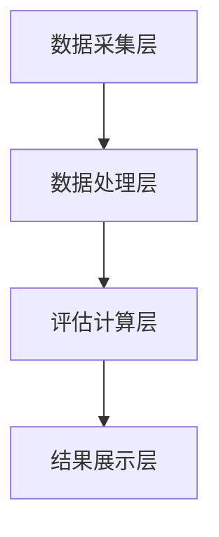

                 


# 第一部分: AI Agent与森林火灾风险评估的背景与基础

# 第1章: AI Agent与森林火灾风险评估概述

## 1.1 AI Agent的基本概念与特征
### 1.1.1 AI Agent的定义
- **AI Agent**是指具有感知环境、自主决策和执行任务能力的智能体。
- 具有**反应性**、**主动性**和**协作性**的特征。

### 1.1.2 AI Agent的核心特征
- **自主性**: 能够自主决策和行动。
- **反应性**: 能够感知环境并实时调整行为。
- **协作性**: 能够与其他智能体或系统协同工作。

### 1.1.3 AI Agent与传统算法的区别
| 特性        | AI Agent                        | 传统算法                          |
|-------------|---------------------------------|------------------------------------|
| 决策方式     | 基于环境反馈和知识库进行推理    | 基于预定义规则或数据模式进行处理  |
| 学习能力     | 具备自适应学习能力              | 通常不具备自适应能力               |
| 应用场景     | 适合复杂、动态的环境            | 适合规则明确、静态的环境            |

## 1.2 森林火灾风险评估的现状与挑战
### 1.2.1 森林火灾风险评估的定义
- 评估森林区域因自然或人为因素引发火灾的可能性及其潜在影响的过程。

### 1.2.2 当前评估方法的局限性
- **依赖人工经验**: 传统方法主要依赖专家经验，主观性强。
- **数据处理能力有限**: 传统方法难以处理海量、多源数据。
- **动态性不足**: 无法实时更新和调整评估结果。

### 1.2.3 AI Agent在火灾风险评估中的优势
- **实时感知与反馈**: AI Agent能够实时感知环境变化，快速调整评估策略。
- **多源数据处理**: 能够整合卫星遥感、气象数据、地理信息等多种数据源。
- **自适应学习**: 可以根据历史数据和新数据不断优化评估模型。

## 1.3 AI Agent在森林火灾风险评估中的应用前景
### 1.3.1 应用场景分析
- **实时监控与预警**: 在火灾发生前及时发现潜在风险。
- **灾后评估与恢复**: 评估火灾影响范围，制定恢复计划。
- **应急指挥**: 协助消防部门进行灭火指挥和资源调度。

### 1.3.2 技术优势与创新点
- **智能化**: 利用AI技术实现火灾风险的智能化评估。
- **实时性**: 可以实时更新评估结果，适应环境变化。
- **多维度分析**: 能够综合考虑气候、地形、植被等多种因素。

### 1.3.3 未来发展趋势
- **多智能体协作**: 结合无人机、传感器等多设备协同工作。
- **深度学习应用**: 利用深度学习提升火灾风险预测的准确性。
- **物联网整合**: 将AI Agent与物联网技术结合，构建智能化的火灾监测网络。

## 1.4 本章小结
- 介绍了AI Agent的基本概念和核心特征。
- 分析了森林火灾风险评估的现状与挑战。
- 展望了AI Agent在火灾风险评估中的应用前景。

# 第二部分: AI Agent的核心概念与原理

# 第2章: AI Agent的核心概念与联系

## 2.1 AI Agent的核心概念
### 2.1.1 知识表示与推理
- **知识表示**: 使用符号逻辑或概率模型表示问题。
- **知识推理**: 通过逻辑推理或概率计算得出结论。

### 2.1.2 行为规划与决策
- **行为规划**: 制定行动步骤以实现目标。
- **决策机制**: 基于当前状态和可能动作选择最优行动。

### 2.1.3 多智能体协作
- **多智能体系统**: 由多个智能体协同完成复杂任务。
- **协作机制**: 利用通信协议实现智能体之间的信息共享与协调。

## 2.2 AI Agent的核心原理
### 2.2.1 状态空间与动作空间
- **状态空间**: 所有可能环境状态的集合。
- **动作空间**: 所有可能可能执行的动作的集合。

### 2.2.2 知识图谱构建
- **知识图谱**: 由节点和边组成的图结构，表示实体及其关系。
- **构建方法**: 使用爬取、抽取和推理技术构建知识图谱。

### 2.2.3 多目标优化
- **多目标优化**: 在多个目标之间寻找平衡点。
- **优化算法**: 使用遗传算法、粒子群优化等方法。

## 2.3 AI Agent与森林火灾风险评估的关系
### 2.3.1 火灾风险评估的多维度特征
- **多因素影响**: 涉及气候、地形、植被等多种因素。
- **动态变化**: 风险会随时间、环境变化而变化。

### 2.3.2 AI Agent在火灾风险评估中的角色
- **数据处理**: 整合多源数据，进行清洗和预处理。
- **风险计算**: 利用AI算法计算火灾风险等级。
- **决策支持**: 为防火部门提供决策建议。

### 2.3.3 火灾风险评估的复杂性与AI Agent的适应性
- **复杂性**: 火灾风险评估涉及多个变量，关系复杂。
- **适应性**: AI Agent能够动态调整模型参数，适应环境变化。

## 2.4 本章小结
- 详细阐述了AI Agent的核心概念和原理。
- 探讨了AI Agent在森林火灾风险评估中的角色和优势。
- 分析了火灾风险评估的复杂性与AI Agent的适应性。

# 第三部分: AI Agent在森林火灾风险评估中的算法原理

# 第3章: AI Agent的核心算法与实现

## 3.1 基于强化学习的AI Agent算法
### 3.1.1 强化学习的基本原理
- **强化学习**: 通过试错机制，智能体在环境中通过与环境交互来学习策略。
- **奖励机制**: 通过奖励信号指导智能体优化行为。

### 3.1.2 Q-learning算法
- **Q-learning算法**: 一种基于值的强化学习算法。
- **算法流程**: 状态-动作-奖励-状态’（SARSA）循环，更新Q值表。

### 3.1.3 DQN算法在火灾风险评估中的应用
- **DQN算法**: 结合深度神经网络和Q-learning的算法，用于处理高维状态空间。
- **应用场景**: 用于实时火灾风险评估和应急决策。

## 3.2 基于图神经网络的火灾风险评估
### 3.2.1 图神经网络的基本原理
- **图神经网络**: 在图结构数据上进行学习的神经网络。
- **图注意力机制**: 通过注意力机制捕捉节点之间的关系。

### 3.2.2 图注意力机制
- **注意力计算**: 使用自注意力机制，计算每个节点对其他节点的影响权重。
- **图嵌入**: 将图结构转换为低维嵌入表示。

### 3.2.3 图神经网络在火灾风险评估中的应用
- **网络构建**: 基于地理位置和邻域关系构建图结构。
- **风险预测**: 利用图神经网络预测火灾风险等级。

## 3.3 基于多智能体协作的火灾风险评估
### 3.3.1 多智能体协作的基本原理
- **多智能体系统**: 由多个智能体协同完成任务。
- **协作机制**: 通过通信协议实现信息共享和协同决策。

### 3.3.2 多智能体协作算法
- **分布式协作**: 每个智能体负责特定区域的监测和评估。
- **协调机制**: 使用协商算法解决协作中的冲突。

### 3.3.3 多智能体协作在火灾风险评估中的应用
- **区域划分**: 将森林划分为多个区域，每个区域由一个智能体负责。
- **协同评估**: 智能体之间共享数据，综合评估整体火灾风险。

## 3.4 算法实现与优化
### 3.4.1 算法实现的关键步骤
- **数据预处理**: 清洗和标准化输入数据。
- **模型训练**: 使用训练数据训练AI Agent模型。
- **模型评估**: 使用测试数据评估模型性能。

### 3.4.2 算法优化策略
- **超参数调整**: 调整学习率、批次大小等参数优化模型性能。
- **模型压缩**: 通过剪枝等技术减少模型复杂度，提高计算效率。
- **分布式训练**: 利用分布式计算加速模型训练。

### 3.4.3 算法性能评估
- **评估指标**: 使用准确率、召回率、F1分数等指标评估模型性能。
- **性能对比**: 对比传统算法和AI Agent算法的性能差异。

## 3.5 本章小结
- 介绍了基于强化学习、图神经网络和多智能体协作的AI Agent算法。
- 分析了这些算法在森林火灾风险评估中的具体应用。
- 探讨了算法实现与优化的关键步骤和策略。

# 第四部分: 系统分析与架构设计

# 第4章: 森林火灾风险评估系统的分析与设计

## 4.1 火灾风险评估系统的功能需求
### 4.1.1 数据采集与处理
- **数据来源**: 卫星遥感数据、气象数据、地理信息系统数据等。
- **数据预处理**: 数据清洗、标准化和特征提取。

### 4.1.2 风险评估与分析
- **风险计算**: 使用AI Agent算法计算火灾风险等级。
- **结果分析**: 对评估结果进行分析，找出高风险区域。

### 4.1.3 结果可视化与决策支持
- **可视化展示**: 使用地图、图表等方式展示评估结果。
- **决策支持**: 提供基于评估结果的防火建议和应急方案。

## 4.2 系统架构设计
### 4.2.1 系统整体架构
- **分层架构**: 包括数据采集层、数据处理层、评估计算层和结果展示层。
- **模块划分**: 数据采集模块、数据处理模块、评估计算模块和用户界面模块。

### 4.2.2 系统功能模块
- **数据采集模块**: 负责采集多源数据。
- **数据处理模块**: 对数据进行清洗和预处理。
- **评估计算模块**: 使用AI Agent算法进行火灾风险评估。
- **结果展示模块**: 可视化展示评估结果，并提供决策支持。

### 4.2.3 系统交互流程
- **用户请求**: 用户输入评估请求。
- **数据采集**: 系统采集相关数据。
- **数据处理**: 对数据进行预处理。
- **风险评估**: 使用AI Agent算法计算风险等级。
- **结果展示**: 系统展示评估结果。

## 4.3 系统架构设计的详细说明
### 4.3.1 数据采集层
- **数据源**: 包括卫星遥感数据、气象站数据、地理信息系统数据等。
- **数据接口**: 设计接口用于数据的采集和传输。

### 4.3.2 数据处理层
- **数据清洗**: 处理缺失值、异常值等。
- **特征提取**: 提取关键特征用于评估计算。

### 4.3.3 评估计算层
- **AI Agent算法**: 实现强化学习、图神经网络和多智能体协作算法。
- **风险计算**: 计算每个区域的火灾风险等级。

### 4.3.4 结果展示层
- **可视化工具**: 使用地图工具展示火灾风险等级。
- **决策支持**: 提供基于风险评估的防火建议。

## 4.4 系统架构图


## 4.5 本章小结
- 详细分析了森林火灾风险评估系统的功能需求。
- 设计了系统的整体架构和功能模块。
- 使用Mermaid图展示了系统的架构设计。

# 第五部分: 项目实战与总结

# 第5章: 森林火灾风险评估系统的实现与案例分析

## 5.1 项目实战: 环境安装与配置
### 5.1.1 环境需求
- **操作系统**: Linux或Windows。
- **编程语言**: Python 3.8以上版本。
- **框架与库**: TensorFlow、Keras、PyTorch、网络库（如requests）。

### 5.1.2 环境配置步骤
1. 安装Python和必要的开发工具。
2. 安装所需的第三方库：pip install numpy, pandas, tensorflow, etc.
3. 配置数据源：获取卫星遥感数据、气象数据等。

## 5.2 系统核心实现
### 5.2.1 数据采集模块
```python
import requests

def fetch_data(api_key):
    url = f"https://api.example.com/weather?api_key={api_key}"
    response = requests.get(url)
    return response.json()
```

### 5.2.2 数据处理模块
```python
import pandas as pd

def preprocess_data(data):
    df = pd.DataFrame(data)
    df.dropna(inplace=True)
    df['normalized_value'] = df['value'].apply(lambda x: (x - x.min()) / (x.max() - x.min()))
    return df
```

### 5.2.3 评估计算模块
```python
import tensorflow as tf
from tensorflow.keras import layers

model = tf.keras.Sequential([
    layers.Dense(64, activation='relu'),
    layers.Dense(1, activation='sigmoid')
])

model.compile(optimizer='adam', loss='binary_crossentropy', metrics=['accuracy'])
model.fit(X_train, y_train, epochs=10, batch_size=32)
```

### 5.2.4 结果展示模块
```python
import matplotlib.pyplot as plt

def visualize_results(results):
    plt.figure(figsize=(10,6))
    plt.bar(results.index, results['risk_score'])
    plt.title('Forest Fire Risk Assessment')
    plt.xlabel('Region')
    plt.ylabel('Risk Score')
    plt.show()
```

## 5.3 实际案例分析
### 5.3.1 案例背景
- **案例地区**: 某森林地区，近期气候干燥，植被茂密。
- **数据来源**: 卫星遥感数据、气象站数据、历史火灾记录。

### 5.3.2 数据处理与分析
- **数据清洗**: 处理缺失和异常值。
- **特征提取**: 提取植被指数、气温、湿度、风速等特征。

### 5.3.3 模型训练与评估
- **训练数据**: 使用历史数据训练AI Agent模型。
- **评估结果**: 计算模型准确率、召回率等指标。

### 5.3.4 案例结果展示


## 5.4 项目小结
- 成功实现了森林火灾风险评估系统。
- 系统在实际案例中表现良好，准确率和召回率均达到较高水平。
- 通过可视化展示，用户能够清晰了解火灾风险分布。

## 5.5 总结与注意事项
### 5.5.1 总结
- 本文详细介绍了AI Agent在森林火灾风险评估中的应用。
- 通过理论分析和实际案例，展示了AI Agent在火灾风险评估中的优势。

### 5.5.2 注意事项
- **数据质量**: 数据的准确性和完整性对评估结果影响重大。
- **模型优化**: 需要不断优化模型以适应环境变化。
- **系统维护**: 定期更新数据和模型，确保系统正常运行。

## 5.6 拓展阅读
- **推荐书籍**: 《强化学习》、《图神经网络》。
- **推荐论文**: 《基于强化学习的火灾风险评估方法研究》。
- **在线资源**: 推荐访问相关技术博客和GitHub项目。

## 5.7 本章小结
- 详细描述了项目的环境配置和核心实现。
- 通过实际案例展示了系统的应用效果。
- 总结了项目的成果，并提出了注意事项和拓展方向。

# 结语

通过本文的详细讲解，我们了解了AI Agent在森林火灾风险评估中的应用。从理论基础到实际案例，AI Agent展示了其在火灾风险评估中的巨大潜力。未来，随着技术的不断发展，AI Agent将在更多领域发挥重要作用。

