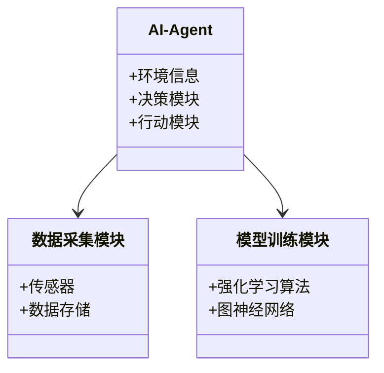
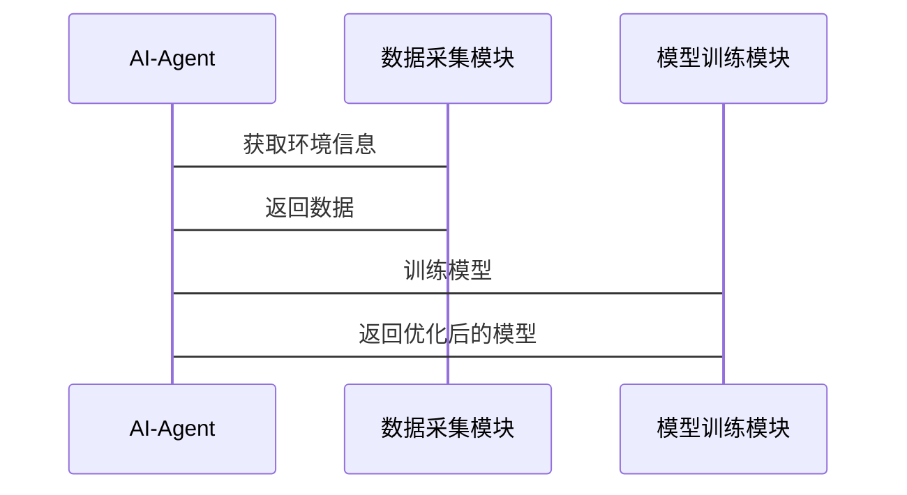

                 


# AI Agent在智能森林资源管理中的实践

> 关键词：AI Agent，森林资源管理，强化学习，图神经网络，多智能体系统，资源优化，生态平衡

> 摘要：本文探讨了AI Agent在智能森林资源管理中的应用，分析了AI Agent的核心技术及其在森林资源管理中的优势，详细介绍了系统设计、项目实战和最佳实践。通过具体案例展示AI Agent在森林资源管理中的实际应用，为读者提供全面的技术视角。

---

# 第1章: AI Agent与智能森林资源管理概述

## 1.1 AI Agent的基本概念与特点

### 1.1.1 AI Agent的定义与核心属性
AI Agent（人工智能代理）是一种能够感知环境并采取行动以实现目标的智能实体。其核心属性包括自主性、反应性、主动性、社会性和社会性。AI Agent能够通过传感器获取环境信息，通过算法进行决策，并通过执行器与环境交互。

### 1.1.2 AI Agent在森林资源管理中的优势
AI Agent能够在复杂环境中实时感知、分析和决策，具备高效性、适应性和智能化的特点。在森林资源管理中，AI Agent能够帮助实现资源优化配置、灾害预警和生态平衡维护。

### 1.1.3 森林资源管理的复杂性与AI Agent的结合
森林资源管理涉及多个维度，包括资源监测、生态平衡和灾害应对。AI Agent能够通过多智能体协同工作，实现对森林资源的全面感知和优化管理。

## 1.2 智能森林资源管理的背景与问题背景

### 1.2.1 森林资源管理的传统模式与挑战
传统森林资源管理依赖人工巡护和经验判断，存在效率低下、覆盖范围有限和应对能力不足的问题。随着森林资源的重要性日益凸显，智能化管理成为必然趋势。

### 1.2.2 数字化与智能化转型的必要性
数字化技术的快速发展为森林资源管理提供了新的工具和方法。AI Agent的引入能够提升管理效率，降低成本，并增强应对复杂环境的能力。

### 1.2.3 AI Agent在森林资源管理中的应用场景
AI Agent可以应用于森林防火、资源监测、病虫害防治等多个方面。例如，通过多智能体协同，实现对森林火灾的实时监测和快速响应。

## 1.3 AI Agent在森林资源管理中的核心问题

### 1.3.1 资源监测与优化
AI Agent能够实时监测森林资源的状态，优化资源分配，提高管理效率。

### 1.3.2 森林防火与灾害预警
通过AI Agent的实时感知和决策能力，能够实现对森林火灾的早期预警和快速响应。

### 1.3.3 森林生态系统的动态平衡维护
AI Agent能够通过多智能体协同，维护森林生态系统的动态平衡，防止生态失衡。

## 1.4 本章小结
本章介绍了AI Agent的基本概念和特点，分析了其在森林资源管理中的优势，探讨了森林资源管理的复杂性与AI Agent的结合，为后续章节奠定了基础。

---

# 第2章: AI Agent的核心技术基础

## 2.1 多智能体系统（Multi-Agent System, MAS）

### 2.1.1 多智能体系统的定义与特点
多智能体系统是由多个智能体组成的协作系统，能够通过分布式计算实现复杂任务。多智能体系统具有分布式、协作性和自适应性等特点。

### 2.1.2 多智能体系统在森林资源管理中的应用
在森林资源管理中，多智能体系统可以用于协调不同区域的资源监测和管理任务，实现高效的协同工作。

### 2.1.3 多智能体系统的优缺点分析
多智能体系统的优势在于能够实现分布式协作，但同时也面临通信延迟和协调复杂性的问题。

## 2.2 强化学习（Reinforcement Learning, RL）

### 2.2.1 强化学习的基本原理
强化学习是一种通过智能体与环境交互来学习最优策略的算法。智能体通过不断试错，逐步优化其决策策略。

### 2.2.2 强化学习在森林资源管理中的应用
在森林资源管理中，强化学习可以用于动态决策，例如在火灾发生时，智能体能够快速制定灭火策略。

### 2.2.3 强化学习算法的优缺点分析
强化学习的优势在于能够适应动态环境，但同时也面临训练时间长和样本需求大的问题。

## 2.3 图神经网络（Graph Neural Network, GNN）

### 2.3.1 图神经网络的基本原理
图神经网络是一种处理图结构数据的深度学习模型，能够通过节点间的关系进行信息传播和特征提取。

### 2.3.2 图神经网络在森林资源管理中的应用
在森林资源管理中，图神经网络可以用于建模森林的结构，分析树木的健康状况和生态关系。

### 2.3.3 图神经网络的优缺点分析
图神经网络的优势在于能够处理复杂的关系网络，但同时也面临计算资源消耗大的问题。

## 2.4 本章小结
本章详细介绍了AI Agent的核心技术基础，包括多智能体系统、强化学习和图神经网络的基本原理和应用，为后续章节的系统设计奠定了技术基础。

---

# 第3章: 森林资源管理系统的架构设计

## 3.1 系统整体架构设计

### 3.1.1 系统功能模块划分
森林资源管理系统包括数据采集模块、模型训练模块、监控模块和决策模块。

### 3.1.2 系统架构的层次化设计
系统架构分为感知层、数据层、计算层和应用层，各层之间通过接口进行数据交互。

### 3.1.3 系统架构的优缺点分析
层次化设计能够实现模块化管理，但同时也可能增加系统的复杂性。

## 3.2 系统功能设计

### 3.2.1 数据采集与预处理
通过传感器和无人机等设备，实时采集森林资源的数据，并进行预处理和清洗。

### 3.2.2 模型训练与优化
基于强化学习和图神经网络，训练AI Agent的决策模型，并通过优化算法提升模型性能。

### 3.2.3 监控与决策
通过监控模块，实时监测森林资源的状态，并根据AI Agent的决策进行相应的管理操作。

## 3.3 系统架构设计

### 3.3.1 系统架构的类图


### 3.3.2 系统交互的序列图


## 3.4 本章小结
本章详细设计了森林资源管理系统的架构，包括功能模块划分、系统架构设计和系统交互流程，为后续的系统实现奠定了基础。

---

# 第4章: 项目实战——森林资源管理系统的实现

## 4.1 项目背景与目标

### 4.1.1 项目背景
随着森林资源的重要性日益增加，智能化管理成为必然趋势。本项目旨在通过AI Agent实现森林资源的智能化管理。

### 4.1.2 项目目标
实现森林资源的实时监测、火灾预警和资源优化配置。

## 4.2 系统核心实现

### 4.2.1 数据采集与预处理
通过无人机和传感器，采集森林资源的实时数据，并进行清洗和标准化处理。

### 4.2.2 模型训练与部署
基于强化学习和图神经网络，训练AI Agent的决策模型，并部署到实际系统中。

### 4.2.3 系统监控与优化
通过监控模块，实时监测系统运行状态，并根据反馈优化模型性能。

## 4.3 系统实现的代码示例

### 4.3.1 数据采集模块
```python
import numpy as np

def collect_data():
    # 模拟数据采集
    data = np.random.randn(100, 5)
    return data
```

### 4.3.2 模型训练模块
```python
import tensorflow as tf
from tensorflow.keras import layers

def build_model():
    model = tf.keras.Sequential()
    model.add(layers.Dense(64, activation='relu'))
    model.add(layers.Dense(1, activation='sigmoid'))
    model.compile(optimizer='adam', loss='binary_crossentropy')
    return model
```

## 4.4 项目小结
本章通过具体的项目实战，详细介绍了森林资源管理系统的实现过程，包括数据采集、模型训练和系统部署，为读者提供了实际的应用参考。

---

# 第5章: 最佳实践与未来展望

## 5.1 实施中的挑战与解决方案

### 5.1.1 数据质量问题
数据采集中的噪声和缺失值会影响模型性能，可以通过数据清洗和增强技术解决。

### 5.1.2 模型优化策略
通过调参和模型融合，可以进一步提升AI Agent的决策能力。

## 5.2 未来研究方向

### 5.2.1 新型AI技术的应用
探索更先进的AI技术，如元学习和自适应算法，提升系统性能。

### 5.2.2 多智能体协同优化
通过多智能体协同，进一步提高森林资源管理的效率和精度。

## 5.3 本章小结
本章总结了AI Agent在森林资源管理中的实践经验，并展望了未来的研究方向，为读者提供了进一步的思考方向。

---

# 结语

AI Agent在智能森林资源管理中的应用前景广阔，通过技术创新和实践探索，能够为森林资源的可持续管理提供有力支持。未来，随着AI技术的不断发展，AI Agent将在森林资源管理中发挥更大的作用。

---

# 参考文献

[此处列出相关的参考文献]

---

# 附录

[此处列出相关的附录内容]

