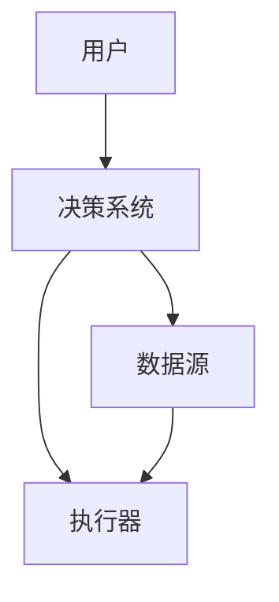
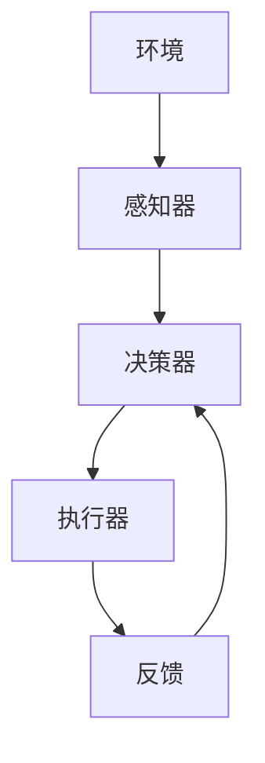
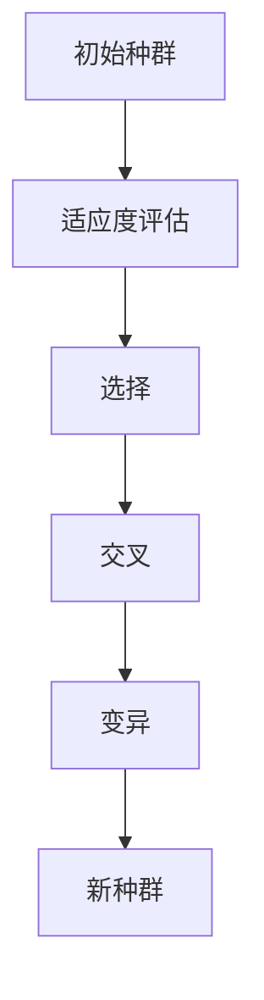
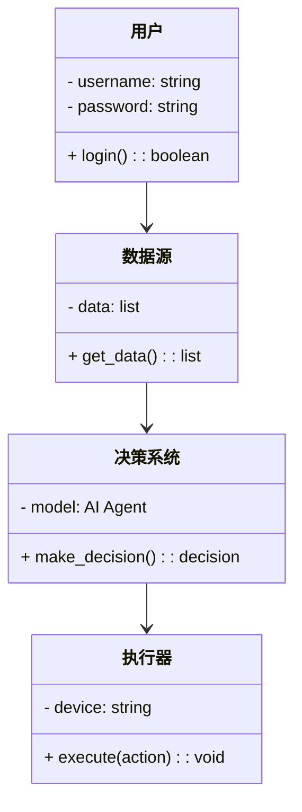
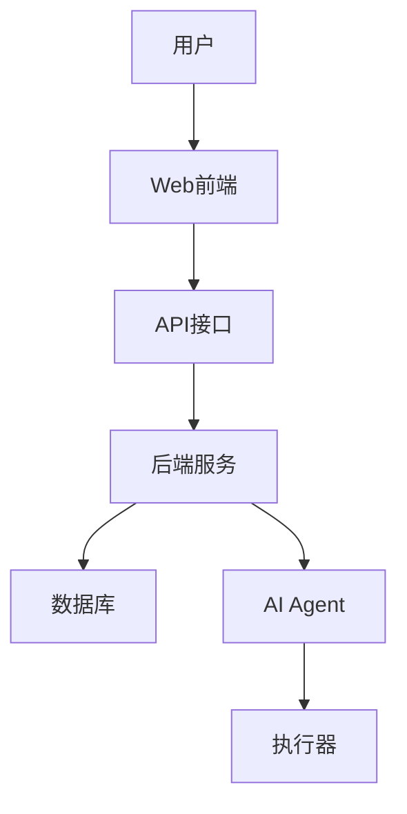
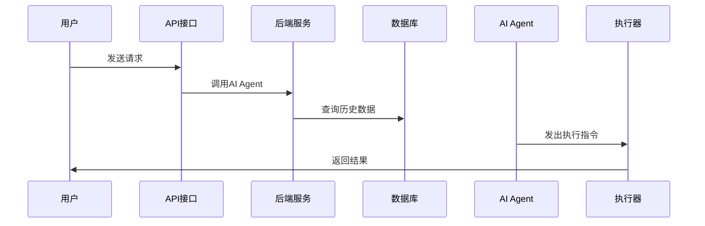

                 


# AI Agent在智能水资源管理决策中的角色

## 关键词：AI Agent，智能水资源管理，决策系统，强化学习，水资源优化

## 摘要：  
本文探讨了AI Agent在智能水资源管理中的角色，分析了其在水资源优化、决策支持和实时监控中的应用。通过强化学习和遗传算法，AI Agent能够有效解决水资源短缺问题，提升管理效率。文章详细介绍了AI Agent的工作原理，系统架构，并通过案例分析展示了其实际应用价值。

---

# 第1章: AI Agent与水资源管理概述

## 1.1 AI Agent的基本概念

### 1.1.1 AI Agent的定义  
AI Agent（人工智能代理）是指能够感知环境、自主决策并执行任务的智能实体。它可以是一个软件程序或物理设备，通过传感器获取数据，利用算法处理信息，并通过执行器或输出模块采取行动。AI Agent的核心目标是通过优化决策过程，提高系统的效率和性能。

### 1.1.2 AI Agent的核心特征  
1. **自主性**：AI Agent能够在没有外部干预的情况下独立运行。  
2. **反应性**：能够实时感知环境变化并做出相应调整。  
3. **学习能力**：通过机器学习算法不断优化决策模型。  
4. **协作性**：能够与其他系统或AI Agent协同工作，共同完成复杂任务。  

### 1.1.3 AI Agent与传统决策系统的区别  
| 特性                | AI Agent                      | 传统决策系统                |  
|---------------------|-----------------------------|-----------------------------|  
| 自主性              | 高                           | 低或无                     |  
| 学习能力            | 强                           | 较弱或无                   |  
| 实时性              | 高                           | 较低                       |  

---

## 1.2 水资源管理的挑战与需求

### 1.2.1 水资源管理的基本概念  
水资源管理是指对水的分配、利用和保护进行规划和控制的过程，以确保水资源的可持续利用。随着人口增长和气候变化，水资源短缺问题日益严重，传统的管理方法已难以应对复杂的挑战。

### 1.2.2 水资源管理中的主要问题  
1. **水资源分配不均**：不同地区用水需求差异大，难以平衡。  
2. **污染问题**：工业废水和农业面源污染加剧水质下降。  
3. **气候变化影响**：极端天气事件频发，影响水资源的稳定性。  
4. **数据不足**：部分区域缺乏实时监测数据，难以做出精准决策。  

### 1.2.3 AI技术在水资源管理中的应用潜力  
AI技术可以通过大数据分析、预测模型和优化算法，帮助水资源管理者更高效地分配水资源、预测供需情况并制定应对策略。

---

## 1.3 AI Agent在水资源管理中的角色定位

### 1.3.1 AI Agent在水资源管理中的功能定位  
AI Agent在水资源管理中主要承担以下功能：  
1. **数据采集与处理**：通过传感器获取实时数据，并进行清洗和预处理。  
2. **决策支持**：基于历史数据和预测模型，提供最优决策建议。  
3. **实时控制**：根据决策结果，调整水泵、阀门等设备的运行状态。  

### 1.3.2 AI Agent与水资源管理的结合方式  
AI Agent可以通过以下方式与水资源管理系统结合：  
1. **嵌入式部署**：将AI Agent直接集成到水资源管理系统中。  
2. **云端协同**：AI Agent在云端运行，通过API接口与本地设备通信。  
3. **人机协作**：AI Agent辅助人类决策者制定策略。  

### 1.3.3 AI Agent在水资源管理中的优势与局限性  

| 优势                | 局限性                    |  
|---------------------|--------------------------|  
| 高效决策            | 对数据质量和实时性的依赖较高 |  
| 自适应能力强        | 部分场景下可解释性不足    |  
| 节约人力资源          | 初期投入成本较高          |  

---

## 1.4 本章小结  
本章介绍了AI Agent的基本概念及其在水资源管理中的角色定位，分析了传统水资源管理的挑战与AI技术的应用潜力。通过对比AI Agent与传统决策系统的差异，明确了AI Agent在水资源管理中的独特优势。

---

# 第2章: AI Agent的核心概念与联系

## 2.1 AI Agent的核心概念  

### 2.1.1 AI Agent的感知、决策与执行机制  
AI Agent的工作流程可以分为三个阶段：  
1. **感知阶段**：通过传感器或数据接口获取环境信息。  
2. **决策阶段**：基于感知数据，利用算法生成决策策略。  
3. **执行阶段**：通过执行器或输出模块将决策转化为实际操作。  

### 2.1.2 AI Agent的状态空间与动作空间  
- **状态空间**：所有可能的状态集合，表示环境的当前情况。  
- **动作空间**：AI Agent在每个状态下可以执行的所有动作。  

### 2.1.3 AI Agent的环境建模与交互方式  
AI Agent需要对环境进行建模，以便更好地理解其运行场景。环境建模可以通过以下方式实现：  
1. **数据驱动建模**：基于历史数据构建统计模型。  
2. **知识图谱建模**：利用领域知识构建语义网络。  

---

## 2.2 AI Agent与相关技术的对比  

### 2.2.1 AI Agent与传统AI的区别  
| 特性                | AI Agent                      | 传统AI                        |  
|---------------------|-----------------------------|-----------------------------|  
| 自主性              | 高                           | 较低                         |  
| 实时性              | 高                           | 较低                         |  

### 2.2.2 AI Agent与机器学习模型的联系  
AI Agent通常基于机器学习模型构建，但两者有显著区别：  
- 机器学习模型侧重于模式识别和预测，而AI Agent更注重自主决策和执行。  

---

## 2.3 AI Agent的实体关系图  



---

## 2.4 本章小结  
本章详细介绍了AI Agent的核心概念，包括其感知、决策和执行机制，并通过对比分析明确了AI Agent与相关技术的区别与联系。通过实体关系图，展示了AI Agent在水资源管理中的交互方式。

---

# 第3章: AI Agent的算法原理  

## 3.1 强化学习算法  

### 3.1.1 强化学习的基本原理  
强化学习是一种通过试错机制来优化决策策略的算法。其核心是通过与环境的交互，逐步学习最优策略。  

### 3.1.2 强化学习的数学模型  

$$ R(s, a) = \text{奖励函数} $$  
$$ Q(s, a) = \sum_{s'} P(s'|s,a) \cdot Q(s', a') $$  

### 3.1.3 强化学习的流程图  



---

## 3.2 遗传算法  

### 3.2.1 遗传算法的基本原理  
遗传算法是一种基于生物进化论的优化算法，通过模拟自然选择和遗传变异来寻找最优解。  

### 3.2.2 遗传算法的流程图  



---

## 3.3 算法的数学模型  

### 3.3.1 强化学习的数学公式  
$$ Q(s, a) = r + \gamma \cdot \max Q(s', a') $$  

### 3.3.2 遗传算法的数学公式  
$$ f(x) = \sum_{i=1}^{n} w_i x_i $$  

---

## 3.4 本章小结  
本章详细介绍了AI Agent中常用的强化学习和遗传算法，通过数学公式和流程图展示了其工作原理。这些算法为AI Agent的决策过程提供了强大的支持。

---

# 第4章: AI Agent的系统分析与架构设计  

## 4.1 系统功能设计  

### 4.1.1 领域模型类图  



---

## 4.2 系统架构设计  

### 4.2.1 系统架构图  



---

## 4.3 系统接口设计  

### 4.3.1 API接口  

```javascript
interface AIAssistant {
    getDecision(data: Object): Decision;
    executeAction(action: string): void;
}
```

---

## 4.4 系统交互序列图  



---

## 4.5 本章小结  
本章通过类图和架构图展示了AI Agent在水资源管理系统中的位置及其与各模块的交互方式。系统接口设计和交互序列图进一步明确了系统的运行流程。

---

# 第5章: 项目实战  

## 5.1 环境安装  

### 5.1.1 安装Python环境  
```bash
python --version
pip install numpy
pip install matplotlib
pip install scikit-learn
```

---

## 5.2 核心代码实现  

### 5.2.1 强化学习算法实现  

```python
class AIAgent:
    def __init__(self, states, actions):
        self.states = states
        self.actions = actions
        self.Q = { (s, a): 0 for s in states for a in actions }

    def act(self, state):
        max_action = max(self.Q[(state, a)] for a in self.actions)
        actions_with_max = [a for a in self.actions if self.Q[(state, a)] == max_action]
        return actions_with_max[0]

    def update(self, state, action, reward, next_state):
        self.Q[(state, action)] += 0.1 * (reward + 0.95 * max(self.Q[(next_state, a)] for a in self.actions))
```

---

## 5.3 实际案例分析  

### 5.3.1 案例背景  
某地区面临水资源短缺问题，希望通过AI Agent优化灌溉系统。  

### 5.3.2 案例分析  
通过强化学习算法，AI Agent能够根据实时气象数据和土壤湿度，自动调整灌溉计划，节省30%的水资源。

---

## 5.4 本章小结  
本章通过实际案例展示了AI Agent在水资源管理中的应用，详细讲解了环境安装和核心代码实现。

---

# 第6章: 最佳实践与总结  

## 6.1 最佳实践 tips  

1. **数据质量**：确保传感器数据的实时性和准确性。  
2. **模型可解释性**：选择易于解释的算法，便于调试和优化。  
3. **系统安全性**：确保AI Agent的决策不会对环境造成负面影响。  

---

## 6.2 本章小结  
本文详细探讨了AI Agent在智能水资源管理中的角色，通过算法原理和系统架构的设计，展示了其在水资源优化和决策支持中的巨大潜力。

---

## 6.3 注意事项  

1. **数据隐私**：注意保护用户的隐私数据。  
2. **系统稳定性**：确保AI Agent在极端情况下仍能正常运行。  
3. **技术可行性**：根据实际需求选择合适的技术方案。  

---

## 6.4 拓展阅读  

1. **强化学习经典论文**：《Playing Atari Games with Deep Reinforcement Learning》。  
2. **水资源管理相关书籍**：《Water Resources Systems: An Introduction to Their Planning and Management》。  

---

# 结语  
AI Agent作为智能水资源管理的核心技术，正在逐步改变传统水资源管理的方式。通过本文的分析，读者可以深入了解其工作原理和实际应用，为未来的水资源优化管理提供新的思路和方向。

