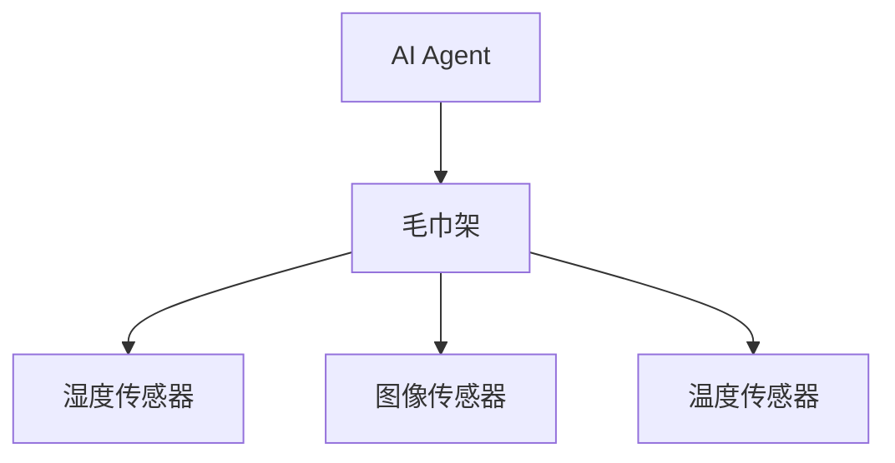
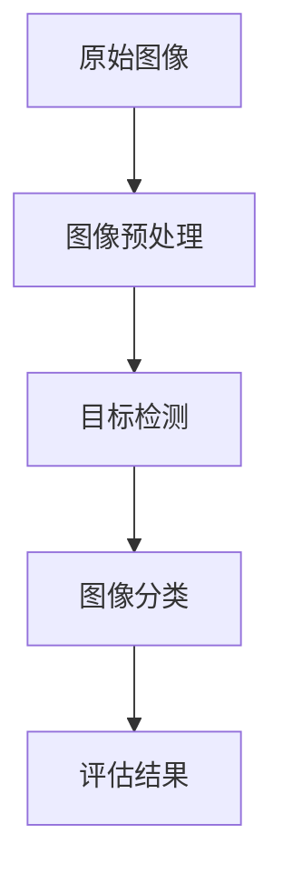
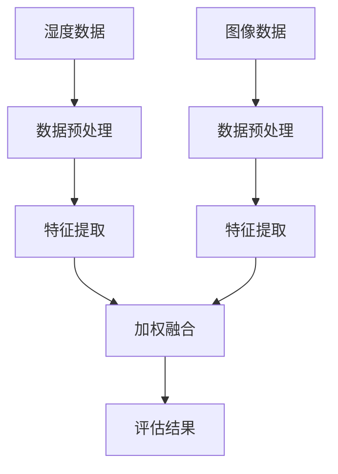
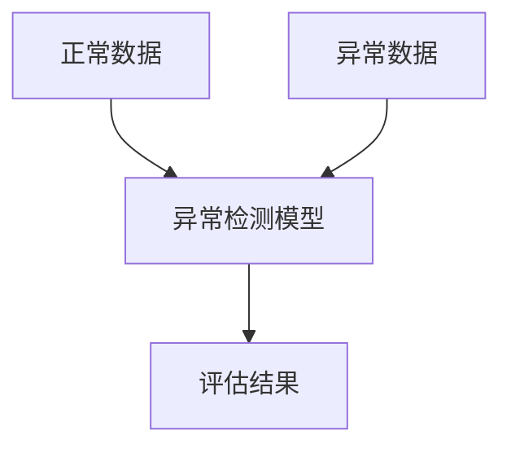
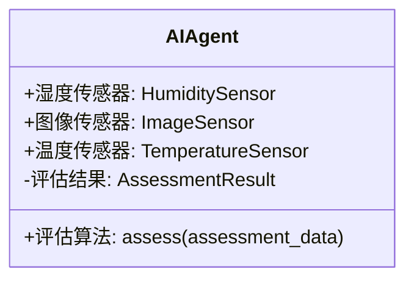
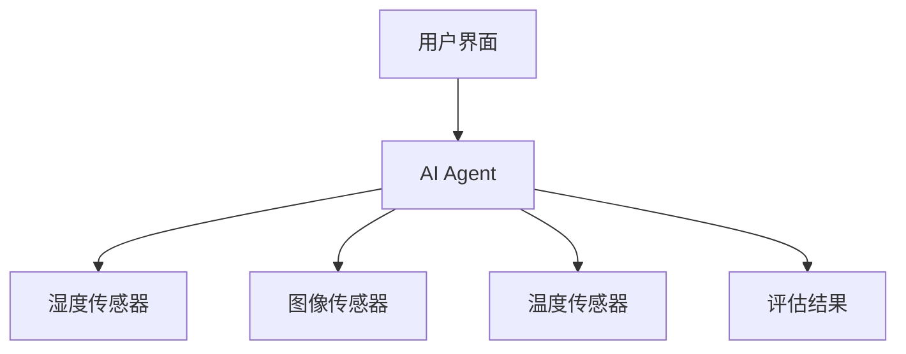
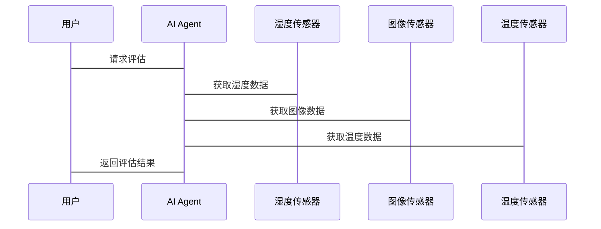

                 


# AI Agent在智能浴室毛巾架中的卫生状况评估

> 关键词：AI Agent, 智能浴室, 毛巾架, 卫生评估, 多模态数据, 传感器融合, 异常检测

> 摘要：本文探讨了AI Agent在智能浴室毛巾架中的卫生状况评估应用。通过分析浴室环境的卫生问题，提出了一种基于多模态数据融合的解决方案，结合图像处理、传感器数据融合和异常检测算法，构建了一个高效的卫生评估系统。文章详细讲解了AI Agent的核心概念、算法原理、系统架构设计和项目实战，为读者提供了从理论到实践的全面指导。

---

## 第1章: 背景介绍

### 1.1 问题背景

#### 1.1.1 浴室环境的卫生问题
浴室是一个高湿度、高使用频率的环境，毛巾架上的毛巾容易受到细菌、霉菌的污染。传统的卫生评估方式依赖人工检查，效率低且容易遗漏问题。因此，需要一种自动化、智能化的解决方案来实时监测和评估浴室毛巾架的卫生状况。

#### 1.1.2 毛巾架的使用场景与挑战
毛巾架是浴室中常用的物品，其卫生状况直接影响用户的健康。然而，浴室环境复杂，湿度高、光照不足，且毛巾容易积累灰尘和污垢，导致传统清洁和评估方式效率低下。

#### 1.1.3 AI Agent在卫生评估中的作用
AI Agent（人工智能代理）能够通过多模态数据（如图像、湿度、温度等）实时感知环境，并结合机器学习算法进行分析，为浴室毛巾架的卫生评估提供高效、准确的解决方案。

### 1.2 问题描述

#### 1.2.1 卫生状况评估的核心问题
如何通过智能化手段实时监测毛巾架的卫生状况，包括细菌滋生、霉菌污染、灰尘积累等。

#### 1.2.2 智能毛巾架的现有解决方案
目前市场上的智能毛巾架主要依赖单一传感器（如湿度传感器）进行简单的状态监测，缺乏多模态数据融合和智能分析能力。

#### 1.2.3 AI Agent在智能毛巾架中的应用边界
AI Agent的应用边界包括数据采集、数据融合、卫生评估、异常检测和用户反馈。通过AI Agent实现毛巾架卫生状况的实时监测和智能评估。

### 1.3 问题解决思路

#### 1.3.1 AI Agent的核心功能
AI Agent通过多模态数据采集、数据融合、智能分析和决策，实现浴室毛巾架卫生状况的实时评估。

#### 1.3.2 多模态数据的融合与分析
AI Agent整合图像数据、湿度数据、温度数据等多模态信息，通过数据融合技术提升卫生评估的准确性和可靠性。

#### 1.3.3 卫生状况评估的数学模型
基于机器学习的分类模型（如卷积神经网络）对多模态数据进行分析，生成卫生状况评估结果。

### 1.4 核心概念与联系

#### 1.4.1 AI Agent的定义与属性
AI Agent是一种能够感知环境、处理数据、做出决策的智能系统。其核心属性包括感知能力、数据融合能力、决策能力和自适应能力。

#### 1.4.2 多模态数据的特征对比
表1.1：不同传感器的特征对比

| 传感器类型 | 特征 | 优点 | 缺点 |
|------------|------|------|------|
| 湿度传感器 | 检测湿度 | 实时监测环境湿度 | 易受温度影响 |
| 图像传感器 | 检测颜色和形状 | 高精度识别 | 易受光照影响 |
| 温度传感器 | 检测温度 | 辅助判断环境状态 | 单一维度数据 |

#### 1.4.3 ER实体关系图


---

## 第2章: 核心概念与联系

### 2.1 AI Agent的原理

#### 2.1.1 感知层: 多模态数据的采集与处理
AI Agent通过图像传感器、湿度传感器、温度传感器等多模态传感器采集浴室环境数据。

#### 2.1.2 计算层: 数据融合与分析
AI Agent将多模态数据进行融合，通过数据预处理、特征提取和融合算法生成综合评估结果。

#### 2.1.3 决策层: 卫生状况的评估与反馈
AI Agent根据融合后的数据，利用机器学习模型进行卫生状况评估，并通过用户界面反馈结果。

### 2.2 核心概念对比表
表2.1: 不同传感器的特征对比

| 传感器类型 | 特征 | 优点 | 缺点 |
|------------|------|------|------|
| 湿度传感器 | 检测湿度 | 实时监测环境湿度 | 易受温度影响 |
| 图像传感器 | 检测颜色和形状 | 高精度识别 | 易受光照影响 |
| 温度传感器 | 检测温度 | 辅助判断环境状态 | 单一维度数据 |

### 2.3 ER实体关系图


---

## 第3章: 算法原理讲解

### 3.1 图像处理算法

#### 3.1.1 图像分割与目标检测
通过图像分割技术识别毛巾架上的污渍、霉菌等目标。

#### 3.1.2 基于深度学习的图像分类
使用卷积神经网络（CNN）对图像进行分类，判断卫生状况。

#### 3.1.3 图像处理流程图


### 3.2 传感器数据融合算法

#### 3.2.1 数据预处理与特征提取
对湿度、温度等传感器数据进行标准化处理，提取特征。

#### 3.2.2 融合算法: 加权融合与投票融合
通过加权融合和投票融合算法对多模态数据进行融合。

#### 3.2.3 数据融合流程图


### 3.3 异常检测算法

#### 3.3.1 基于统计的方法
使用均值、标准差等统计指标检测异常。

#### 3.3.2 基于深度学习的异常检测
使用自动编码器（Autoencoder）进行异常检测。

#### 3.3.3 异常检测流程图


---

## 第4章: 数学模型与公式

### 4.1 图像分类模型

#### 4.1.1 卷积神经网络（CNN）模型
$$
y = f(Wx + b)
$$

其中，$W$ 是权重矩阵，$x$ 是输入图像，$b$ 是偏置项，$f$ 是激活函数。

#### 4.1.2 实例分析
假设输入一张毛巾架图像，经过卷积层、池化层和全连接层处理后，输出卫生状况的概率分布。

### 4.2 传感器数据融合模型

#### 4.2.1 加权融合公式
$$
y = \sum_{i=1}^{n} w_i x_i
$$

其中，$w_i$ 是传感器的权重，$x_i$ 是传感器的输入。

#### 4.2.2 投票融合公式
$$
y = \argmax_{i} \sum_{j=1}^{m} vote_j[i]
$$

其中，$vote_j[i]$ 是第$j$个传感器对第$i$个评估结果的投票。

---

## 第5章: 系统分析与架构设计

### 5.1 项目介绍

#### 5.1.1 项目背景
本项目旨在开发一种基于AI Agent的智能浴室毛巾架，实现卫生状况的实时评估。

#### 5.1.2 项目目标
通过多模态数据融合和机器学习算法，实现毛巾架卫生状况的高效评估。

### 5.2 系统功能设计

#### 5.2.1 领域模型


#### 5.2.2 系统架构设计


#### 5.2.3 系统接口设计
- 用户界面：接收用户的输入，显示评估结果。
- AI Agent：与传感器交互，执行评估算法，输出评估结果。
- 传感器：采集环境数据，发送到AI Agent。

#### 5.2.4 系统交互流程图


---

## 第6章: 项目实战

### 6.1 环境安装

#### 6.1.1 安装Python环境
```bash
python --version
pip install numpy
pip install tensorflow
pip install pillow
```

#### 6.1.2 安装AI框架
```bash
pip install keras
pip install scikit-learn
```

### 6.2 核心代码实现

#### 6.2.1 图像处理代码
```python
import numpy as np
from PIL import Image

def preprocess_image(image_path):
    # 读取图像
    image = Image.open(image_path)
    # 转换为数组
    image_array = np.array(image)
    # 归一化处理
    normalized_image = image_array / 255.0
    return normalized_image
```

#### 6.2.2 传感器数据融合代码
```python
import numpy as np

def fuse_data(humidity, temperature):
    # 加权融合
    weight_humidity = 0.7
    weight_temperature = 0.3
    fused = weight_humidity * humidity + weight_temperature * temperature
    return fused
```

#### 6.2.3 异常检测代码
```python
from sklearn.ensemble import IsolationForest

def detect_anomaly(data):
    # 训练异常检测模型
    model = IsolationForest(n_estimators=100, contamination=0.1)
    model.fit(data)
    # 预测异常
    predictions = model.predict(data)
    # 返回异常标志
    return predictions == -1
```

### 6.3 实际案例分析

#### 6.3.1 案例1: 正常情况
输入湿度为60%，温度为25°C，图像显示毛巾干净。评估结果为正常。

#### 6.3.2 案例2: 异常情况
输入湿度为80%，温度为30°C，图像显示毛巾有霉菌。评估结果为异常。

---

## 第7章: 最佳实践与总结

### 7.1 最佳实践 tips

#### 7.1.1 数据采集
确保传感器数据的准确性和完整性。

#### 7.1.2 模型优化
定期更新模型，提高评估精度。

#### 7.1.3 用户反馈
收集用户的反馈，优化系统功能。

### 7.2 小结
本文详细介绍了AI Agent在智能浴室毛巾架中的卫生状况评估应用，从背景介绍到项目实战，为读者提供了全面的技术指导。

### 7.3 注意事项
- 确保系统的安全性和隐私性。
- 定期维护传感器和系统。
- 提供用户友好的界面。

### 7.4 拓展阅读
- 《深度学习实战》
- 《传感器数据融合技术》
- 《智能系统设计》

---

通过本文的详细讲解，读者可以深入了解AI Agent在智能浴室毛巾架中的应用，并通过实际案例掌握相关技术的实现方法。

