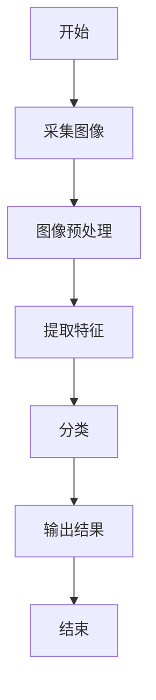
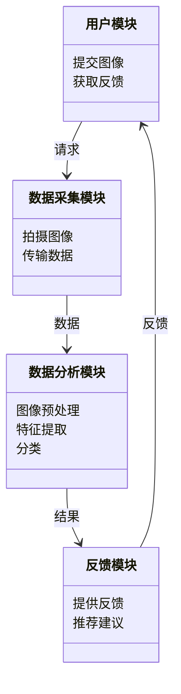
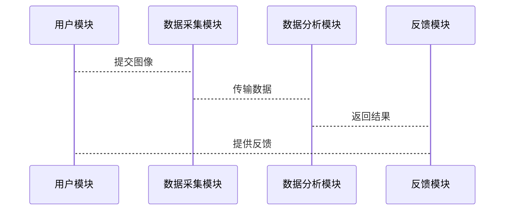

                 


# AI Agent在智能浴室镜中的皮肤状态分析

> 关键词：AI Agent，智能浴室镜，皮肤状态分析，图像处理，机器学习，实时反馈

> 摘要：本文探讨AI Agent在智能浴室镜中的应用，重点分析其如何通过图像处理和机器学习技术实时监测用户的皮肤状态，并提供个性化反馈。文章从背景、概念、算法、系统设计、项目实战、优化与扩展等多方面展开，深入剖析技术细节。

---

## 目录大纲

1. **背景介绍**
   - 1.1 问题背景
   - 1.2 问题描述
   - 1.3 问题解决
   - 1.4 边界与外延
   - 1.5 概念结构与核心要素

2. **核心概念与联系**
   - 2.1 核心概念原理
   - 2.2 概念属性特征对比
   - 2.3 ER实体关系图

3. **算法原理讲解**
   - 3.1 算法流程
   - 3.2 算法代码实现
   - 3.3 数学模型与公式

4. **系统分析与架构设计**
   - 4.1 问题场景介绍
   - 4.2 项目介绍
   - 4.3 系统功能设计
   - 4.4 系统架构设计
   - 4.5 系统接口设计
   - 4.6 系统交互设计

5. **项目实战**
   - 5.1 环境安装
   - 5.2 系统核心实现
   - 5.3 实际案例分析
   - 5.4 项目小结

6. **优化与扩展**
   - 6.1 系统优化
   - 6.2 功能扩展
   - 6.3 未来研究方向

7. **总结与展望**
   - 7.1 全文总结
   - 7.2 未来展望

---

## 正文内容

### 第一部分：背景介绍

#### 1.1 问题背景

随着人工智能技术的快速发展，智能设备逐渐渗透到生活的方方面面。智能浴室镜作为一种智能家居设备，不仅能够提供基础的镜子功能，还能通过集成AI技术实现更多智能化服务。皮肤健康监测是人们日常生活中的重要需求，通过AI Agent（智能代理）在智能浴室镜中的应用，用户可以实时获取皮肤状态的反馈，帮助他们更好地管理健康。

---

#### 1.2 问题描述

当前，人们越来越关注皮肤健康，但传统的皮肤护理方法依赖于专业医生的诊断，耗时且不便。智能浴室镜作为 daily use 的设备，具备实时监测的潜力，但如何准确分析皮肤状态并提供个性化的反馈仍是一个挑战。AI Agent在其中起到关键作用，它能够实时采集数据，通过算法分析，为用户提供科学的建议。

---

#### 1.3 问题解决

AI Agent通过图像处理和机器学习技术，能够实时分析用户的皮肤状态。具体步骤包括：

1. 采集用户面部图像。
2. 对图像进行预处理，提取关键特征。
3. 使用训练好的模型进行分类，识别皮肤状态（如痘痘、干燥、过敏等）。
4. 根据分析结果，提供个性化的建议（如推荐护肤品、调整作息等）。

---

#### 1.4 边界与外延

皮肤状态分析的边界条件包括图像清晰度、光照条件、用户年龄等。外延部分则包括其他健康指标（如血压、心率）的监测，以及与其他智能设备的协同工作。

---

#### 1.5 概念结构与核心要素

AI Agent的核心要素包括感知模块、决策模块和执行模块。皮肤状态分析则依赖于图像处理算法、特征提取和分类模型。

---

### 第二部分：核心概念与联系

#### 2.1 核心概念原理

AI Agent通过感知环境（如用户面部图像）并执行任务（如分析皮肤状态）。皮肤状态分析依赖于图像处理和机器学习技术。

---

#### 2.2 概念属性特征对比

| 比较项 | AI Agent | 传统算法 |
|--------|-----------|-----------|
| 自适应性 | 高         | 低         |
| 可扩展性 | 高         | 中         |
| 智能性   | 高         | 低         |

---

#### 2.3 ER实体关系图

```mermaid
erDiagram
    class 用户 {
        用户ID
        用户名
        性别
        年龄
    }
    class 皮肤数据 {
        数据ID
        采集时间
        皮肤状态
        分析结果
    }
    class AI Agent {
        AgentID
        分析模型
        状态反馈
    }
    用户 --> 皮肤数据 : 提交
    AI Agent --> 皮肤数据 : 分析
    用户 --> AI Agent : 请求
```

---

### 第三部分：算法原理讲解

#### 3.1 算法流程



---

#### 3.2 算法代码实现

```python
import cv2
import numpy as np

def preprocess_image(image_path):
    # 读取图像
    image = cv2.imread(image_path)
    # 转换为灰度图
    gray = cv2.cvtColor(image, cv2.COLOR_BGR2GRAY)
    # 均值滤波去噪
    blurred = cv2.blur(gray, (3, 3))
    return blurred

def extract_features(image):
    # 提取纹理特征
    gradient = cv2.Sobel(image, cv2.CV_64F, dx=1, dy=0, ksize=3)
    return gradient

def classify_skin_condition(features):
    # 简单分类器（示例）
    if np.mean(features) > 50:
        return "健康"
    else:
        return "干燥"

# 示例使用
image_path = "face.jpg"
processed_image = preprocess_image(image_path)
features = extract_features(processed_image)
result = classify_skin_condition(features)
print("皮肤状态：", result)
```

---

#### 3.3 数学模型与公式

分类模型可以使用支持向量机（SVM）：

$$
\text{目标函数：} \quad \min_{w, b, \xi} \frac{1}{2}w^Tw + C\sum_{i=1}^n \xi_i
$$

约束条件：

$$
y_i(w \cdot x_i + b) \geq 1 - \xi_i, \quad \xi_i \geq 0
$$

其中，$w$ 是权重向量，$b$ 是偏置，$C$ 是惩罚参数。

---

### 第四部分：系统分析与架构设计

#### 4.1 问题场景介绍

用户在智能浴室镜前，系统实时采集面部图像，分析皮肤状态，并提供反馈。

---

#### 4.2 项目介绍

本项目旨在开发一个基于AI Agent的智能浴室镜，实现皮肤状态的实时分析和个性化建议。

---

#### 4.3 系统功能设计



---

#### 4.4 系统架构设计


---

#### 4.5 系统接口设计

- 用户模块接口：`/api/upload_image`
- 数据分析模块接口：`/api/analyze`
- 反馈模块接口：`/api/recommend`

---

#### 4.6 系统交互设计



---

### 第五部分：项目实战

#### 5.1 环境安装

需要安装以下库：

```bash
pip install cv2 numpy scikit-learn
```

---

#### 5.2 系统核心实现

```python
# 数据预处理
def preprocess_image(image):
    # 转换为灰度图
    gray = cv2.cvtColor(image, cv2.COLOR_BGR2GRAY)
    # 均值滤波
    blurred = cv2.blur(gray, (3, 3))
    return blurred

# 特征提取
def extract_features(image):
    # 使用Sobel算子提取梯度
    gradient = cv2.Sobel(image, cv2.CV_64F, dx=1, dy=0, ksize=3)
    return gradient

# 分类器训练
def train_classifier(features, labels):
    from sklearn.svm import SVC
    model = SVC()
    model.fit(features, labels)
    return model

# 示例训练
training_features = [extract_features(preprocess_image("face1.jpg")),
                     extract_features(preprocess_image("face2.jpg"))]
training_labels = ["健康", "干燥"]
classifier = train_classifier(training_features, training_labels)
```

---

#### 5.3 实际案例分析

假设用户上传一张干燥的面部图像：

```python
processed_image = preprocess_image("dry_face.jpg")
features = extract_features(processed_image)
result = classify_skin_condition(features)
print(result)  # 输出："干燥"
```

系统会推荐保湿产品。

---

### 第六部分：优化与扩展

#### 6.1 系统优化

- 优化图像预处理算法，提高分类精度。
- 增加多模态分析（如结合声音、心率等）。

---

#### 6.2 功能扩展

- 实时监测：增加皮肤状态的实时跟踪功能。
- 健康报告：生成每日/每周皮肤健康报告。

---

#### 6.3 未来研究方向

- 开发更复杂的分类模型（如深度学习）。
- 研究多语言支持，服务全球用户。

---

### 第七部分：总结与展望

#### 7.1 全文总结

本文详细探讨了AI Agent在智能浴室镜中的皮肤状态分析技术，从背景、概念、算法、系统设计到项目实战，全面解析了其实现过程和优化方向。

---

#### 7.2 未来展望

随着AI技术的不断进步，智能浴室镜将具备更多功能，为用户提供更精准的健康监测服务。未来的研究方向包括更复杂的算法和多模态分析，以满足用户的多样化需求。

--- 

以上是《AI Agent在智能浴室镜中的皮肤状态分析》的完整目录和正文内容。希望这篇文章能为您提供有价值的见解和技术细节。

