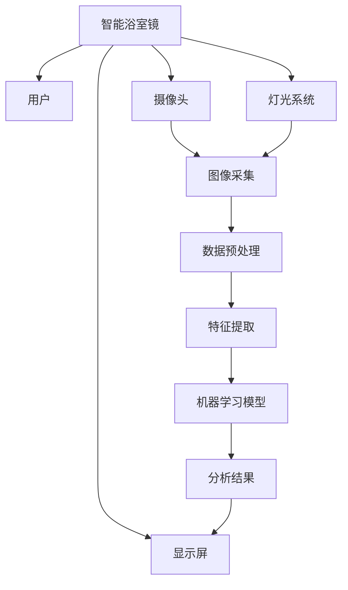
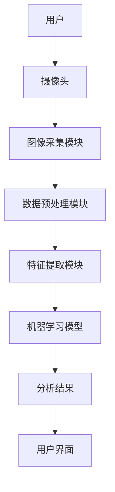
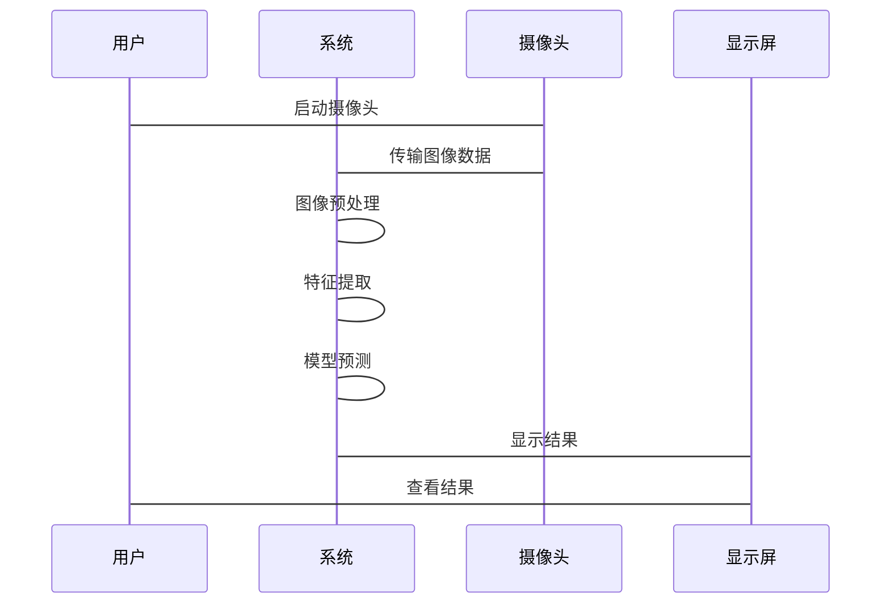

                 


# AI Agent在智能浴室镜中的肤质分析

> 关键词：AI Agent, 肤质分析, 智能浴室镜, 深度学习, 图像处理, 机器学习

> 摘要：  
随着人工智能技术的快速发展，AI Agent（智能代理）在智能设备中的应用越来越广泛。本文探讨了AI Agent在智能浴室镜中的应用，重点分析其在肤质分析中的技术实现。通过介绍AI Agent的基本原理、肤质分析的核心算法、系统架构设计以及实际应用场景，本文详细阐述了AI Agent如何通过图像处理和机器学习技术实现对用户肤质的智能分析。文章还结合实际案例，探讨了系统的优化与性能提升，为相关领域的研究和应用提供了参考。

---

## 第一部分: AI Agent与智能浴室镜的背景介绍

### 第1章: AI Agent与肤质分析的背景概述

#### 1.1 AI Agent的核心概念
- **AI Agent的定义**：AI Agent（人工智能代理）是一种能够感知环境、自主决策并执行任务的智能系统。它能够通过传感器获取信息，利用算法处理数据，并通过执行器与环境交互。
- **AI Agent的特点**：
  - 智能性：能够理解并处理复杂数据。
  - 自主性：能够在没有外部干预的情况下执行任务。
  - 适应性：能够根据环境变化调整行为。
- **肤质分析的基本原理**：通过采集面部图像，提取皮肤特征，利用AI算法进行分类和评估，给出肤质改善建议。

#### 1.2 肤质分析的背景与问题描述
- **问题背景**：皮肤健康是人们关注的重要问题，但传统肤质分析方法依赖人工经验，效率低且不够准确。
- **问题描述**：智能浴室镜作为一种新兴的智能设备，可以通过AI Agent实时分析用户肤质，提供个性化的健康建议。
- **解决方法**：利用图像处理技术和机器学习算法，构建AI Agent系统，实现高效、精准的肤质分析。

#### 1.3 智能浴室镜的应用场景
- 用户可以在早晨或晚上使用智能浴室镜进行肤质分析。
- 系统可以实时提供皮肤状况报告，包括水分、油分、色素沉着等指标。
- 结合用户的使用习惯，提供个性化护肤建议。

---

### 第2章: AI Agent与智能浴室镜的核心功能

#### 2.1 系统组成与功能模块
- **硬件部分**：
  - 高分辨率摄像头：用于采集面部图像。
  - 灯光系统：提供均匀的光照条件。
  - 显示屏：用于显示分析结果和建议。
- **软件部分**：
  - 数据采集模块：负责图像采集和预处理。
  - AI分析模块：包括图像特征提取和机器学习模型。
  - 用户界面模块：展示结果并提供交互功能。

#### 2.2 系统架构图


---

## 第二部分: AI Agent的核心概念与原理

### 第3章: AI Agent的核心原理

#### 3.1 图像处理与特征提取
- **图像预处理**：
  - 图像去噪：消除环境光线干扰。
  - 图像增强：提高图像对比度和清晰度。
- **特征提取**：
  - 使用卷积神经网络（CNN）提取皮肤特征，如纹理、颜色、形状等。
  - 通过主成分分析（PCA）降低特征维度。

#### 3.2 机器学习模型的构建
- **分类与回归模型**：
  - 分类模型用于识别皮肤类型（干性、油性、中性）。
  - 回归模型用于预测皮肤健康指数（如水分含量）。
- **深度学习模型**：
  - 使用预训练的深度学习模型（如ResNet、Inception）进行迁移学习。
  - 通过数据增强技术（如旋转、翻转、缩放）提升模型泛化能力。

#### 3.3 AI Agent的决策机制
- **多模态数据融合**：
  - 结合图像数据和用户生活习惯数据（如睡眠、饮食）进行综合分析。
- **实时反馈与优化**：
  - 根据分析结果实时调整护肤建议。
  - 通过用户反馈不断优化模型。

---

### 第4章: 肤质分析的核心算法

#### 4.1 图像处理与特征提取
- **图像处理流程**：
  ```python
  import cv2
  img = cv2.imread('face.jpg')
  gray = cv2.cvtColor(img, cv2.COLOR_BGR2GRAY)
  blurred = cv2.GaussianBlur(gray, (5,5), 0)
  edges = cv2.Canny(blurred, 50, 150)
  ```
- **特征提取方法**：
  - 使用OpenCV提取皮肤区域的边界。
  - 通过HOG（方向直方图）提取纹理特征。

#### 4.2 机器学习模型的构建
- **卷积神经网络（CNN）模型**：
  ```python
  model = tf.keras.Sequential([
      tf.keras.layers.Conv2D(32, (3,3), activation='relu', input_shape=(224,224,3)),
      tf.keras.layers.MaxPooling2D((2,2)),
      tf.keras.layers.Conv2D(64, (3,3), activation='relu'),
      tf.keras.layers.MaxPooling2D((2,2)),
      tf.keras.layers.Flatten(),
      tf.keras.layers.Dense(128, activation='relu'),
      tf.keras.layers.Dense(4, activation='softmax')
  ])
  ```
- **损失函数与优化器**：
  - 损失函数：交叉熵损失（$-\sum y_i \log p_i$）。
  - 优化器：Adam优化器（$ \alpha = 0.001$）。

---

## 第三部分: 系统分析与架构设计

### 第5章: 系统功能设计

#### 5.1 系统功能模块
- **用户数据采集**：通过摄像头采集面部图像。
- **数据预处理**：图像去噪、标准化处理。
- **AI分析**：特征提取、模型预测。
- **结果展示**：显示分析结果和建议。

#### 5.2 系统架构图


### 第6章: 系统交互设计

#### 6.1 系统交互流程
- 用户打开智能浴室镜。
- 系统启动摄像头，采集面部图像。
- 图像预处理后提取特征。
- 通过AI模型分析肤质。
- 显示分析结果并提供建议。

#### 6.2 序列图


---

## 第四部分: 项目实战

### 第7章: 项目实现与案例分析

#### 7.1 环境安装
- 安装Python、TensorFlow、OpenCV等库。
  ```bash
  pip install tensorflow opencv-python
  ```

#### 7.2 核心代码实现
- 图像预处理与特征提取：
  ```python
  def preprocess_image(image_path):
      img = cv2.imread(image_path)
      gray = cv2.cvtColor(img, cv2.COLOR_BGR2GRAY)
      blurred = cv2.GaussianBlur(gray, (5,5), 0)
      return blurred
  ```

- 模型训练与预测：
  ```python
  model.fit(X_train, y_train, epochs=10, batch_size=32, validation_data=(X_val, y_val))
  predictions = model.predict(X_test)
  ```

#### 7.3 案例分析
- 通过实际案例分析模型的准确率、召回率等性能指标。
- 总结项目中的问题与优化方向。

---

## 第五部分: 总结与展望

### 第8章: 总结与最佳实践

#### 8.1 总结
- AI Agent在智能浴室镜中的应用为用户提供了便捷的肤质分析工具。
- 通过图像处理和机器学习技术，实现了精准的肤质评估。

#### 8.2 最佳实践
- 定期更新模型，提升准确率。
- 优化系统交互设计，提升用户体验。
- 结合更多传感器数据，提供更全面的健康建议。

#### 8.3 展望
- 结合5G和物联网技术，构建更智能的健康监测系统。
- 开发更多AI Agent应用场景，推动智能化生活的普及。

---

通过以上内容，您可以逐步完成《AI Agent在智能浴室镜中的肤质分析》的完整技术博客文章。文章从背景、原理、设计到实现，全面覆盖了AI Agent在智能浴室镜中的应用，为相关领域的研究和实践提供了参考。

