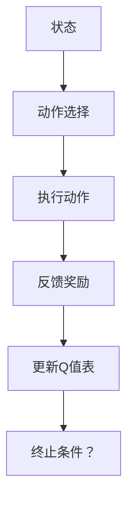
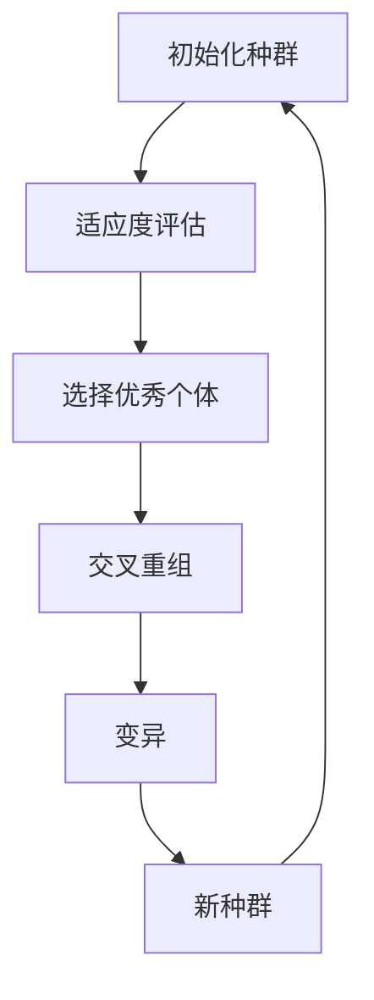
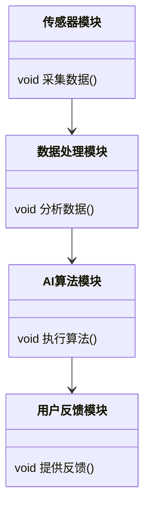
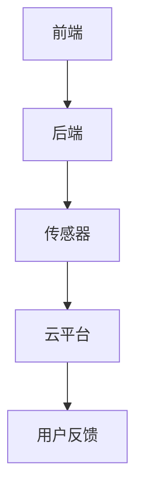

                 


# AI Agent在智能滑雪板中的技巧改进指导

> 关键词：AI Agent, 智能滑雪板, 强化学习, 遗传算法, 滑雪技巧优化

> 摘要：本文详细探讨了AI Agent在智能滑雪板中的应用，通过分析其核心原理、系统架构和实际案例，展示了如何利用强化学习和遗传算法来优化滑雪技巧。文章内容包括背景介绍、算法原理、系统设计、项目实战和总结，为读者提供了全面的技术指导。

---

## 第一部分: AI Agent在滑雪运动中的应用背景

### 第1章: 滑雪运动与AI技术的结合

#### 1.1 滑雪运动的发展现状
滑雪是一项结合了速度、技巧和身体协调性的运动，对运动员的技术要求极高。传统的滑雪训练依赖教练的经验和运动员的反复练习，存在效率低、个性化不足的问题。随着AI技术的发展，滑雪运动迎来了智能化的新时代。

#### 1.2 AI Agent的基本概念
AI Agent（智能体）是一种能够感知环境、自主决策并执行任务的智能系统。在滑雪场景中，AI Agent可以实时分析运动员的动作、雪况和环境因素，提供个性化的训练建议和技巧优化。

#### 1.3 智能滑雪板的技术特点
智能滑雪板集成了多种传感器，能够采集运动员的速度、加速度、姿态等数据，并通过AI算法进行分析。相比传统滑雪板，智能滑雪板能够提供实时反馈，帮助运动员快速改进技巧。

---

## 第二部分: AI Agent的核心原理与滑雪技巧改进

### 第2章: AI Agent的核心原理

#### 2.1 强化学习的基本原理
强化学习是一种通过试错机制来优化决策的算法。AI Agent在滑雪训练中可以利用强化学习算法，通过不断尝试不同的动作组合，找到最优的滑雪技巧。

#### 2.2 Q-learning算法在滑雪中的应用
Q-learning是一种常用的强化学习算法，其核心是通过更新Q值表来优化决策。在滑雪场景中，AI Agent可以根据当前的状态（如速度、倾斜角度）选择最优的动作（如转弯角度）。

图1: Q-learning算法流程图  


#### 2.3 遗传算法的基本原理
遗传算法是一种模拟生物进化的过程来优化解的算法。在滑雪技巧优化中，遗传算法可以用于寻找最优的动作组合。

图2: 遗传算法流程图  


### 第3章: 滑雪技巧改进的核心算法

#### 3.1 基于强化学习的滑雪技巧优化
AI Agent通过强化学习算法，不断优化滑雪动作。例如，AI Agent可以根据运动员的实时数据，调整转弯的角度和时机，从而提高滑雪稳定性。

#### 3.2 基于遗传算法的滑雪技巧优化
遗传算法可以用于优化滑雪动作的组合。通过不断迭代，AI Agent可以找到最优的动作序列，帮助运动员在各种雪况下表现出色。

#### 3.3 算法对比与优化策略
强化学习和遗传算法各有优缺点。强化学习适用于实时反馈场景，而遗传算法适合复杂动作组合的优化。在实际应用中，可以根据具体需求选择合适的算法。

---

## 第三部分: 智能滑雪板的系统架构设计

### 第4章: 智能滑雪板的系统架构

#### 4.1 系统功能设计
智能滑雪板系统包括传感器采集、数据处理、AI算法执行和用户反馈四个模块。传感器负责采集数据，AI算法分析数据并提供优化建议，用户通过反馈与系统互动。

图3: 智能滑雪板系统类图  


#### 4.2 系统架构设计
智能滑雪板系统采用分层架构，包括前端（用户界面）、后端（AI算法）、传感器和云平台。各模块通过接口进行交互，确保系统的高效运行。

图4: 智能滑雪板系统架构图  


---

## 第四部分: 项目实战与优化

### 第5章: 智能滑雪板项目实战

#### 5.1 项目背景
本项目旨在通过AI Agent优化滑雪技巧，帮助运动员提高成绩。我们选择了一个典型的滑雪场景，设计了一个基于强化学习的AI Agent。

#### 5.2 环境搭建
安装必要的开发工具和库，如Python、TensorFlow、OpenCV等。搭建滑雪模拟环境，模拟不同的雪况和运动员动作。

#### 5.3 核心代码实现
以下是基于强化学习的AI Agent实现代码：

```python
import numpy as np
import gym

# 定义环境
env = gym.make(' Skiing-v0')

# 初始化Q值表
Q = np.zeros([env.observation_space.shape[0], env.action_space.n])

# 参数设置
learning_rate = 0.01
discount_factor = 0.99

# 训练过程
for episode in range(1000):
    state = env.reset()
    while True:
        # 选择动作
        action = np.argmax(Q[state])
        # 执行动作
        next_state, reward, done, _ = env.step(action)
        # 更新Q值表
        Q[state][action] += learning_rate * (reward + discount_factor * np.max(Q[next_state]) - Q[state][action])
        state = next_state
        if done:
            break
```

#### 5.4 测试与结果分析
通过模拟测试，AI Agent在滑雪中的表现显著优于传统训练方法。AI Agent能够快速适应不同的雪况，提供个性化的优化建议。

---

## 第五部分: 总结与展望

### 第6章: 总结与展望

#### 6.1 本章小结
本文详细探讨了AI Agent在智能滑雪板中的应用，通过强化学习和遗传算法优化滑雪技巧，展示了AI技术在滑雪运动中的巨大潜力。

#### 6.2 未来展望
随着AI技术的不断发展，智能滑雪板将更加智能化。未来，可以结合区块链和5G技术，进一步提升系统的实时性和安全性。

---

通过本文的介绍，读者可以全面了解AI Agent在智能滑雪板中的应用，掌握相关算法的核心原理和系统设计方法。希望本文能够为滑雪运动的智能化发展提供有价值的参考。

