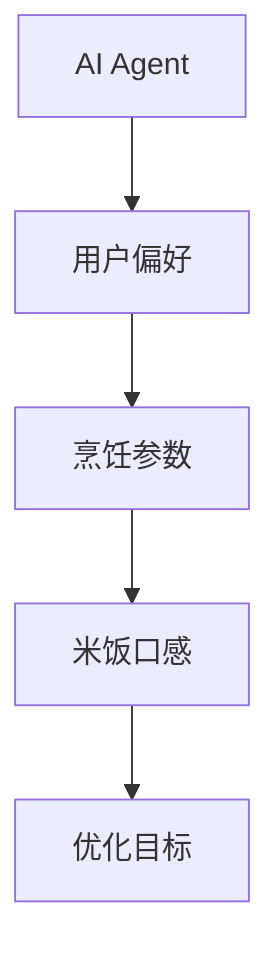
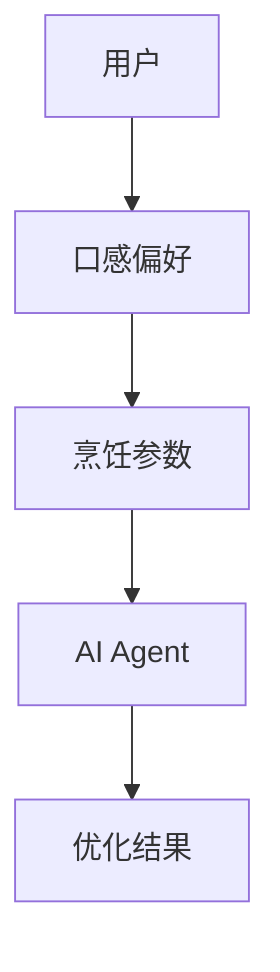
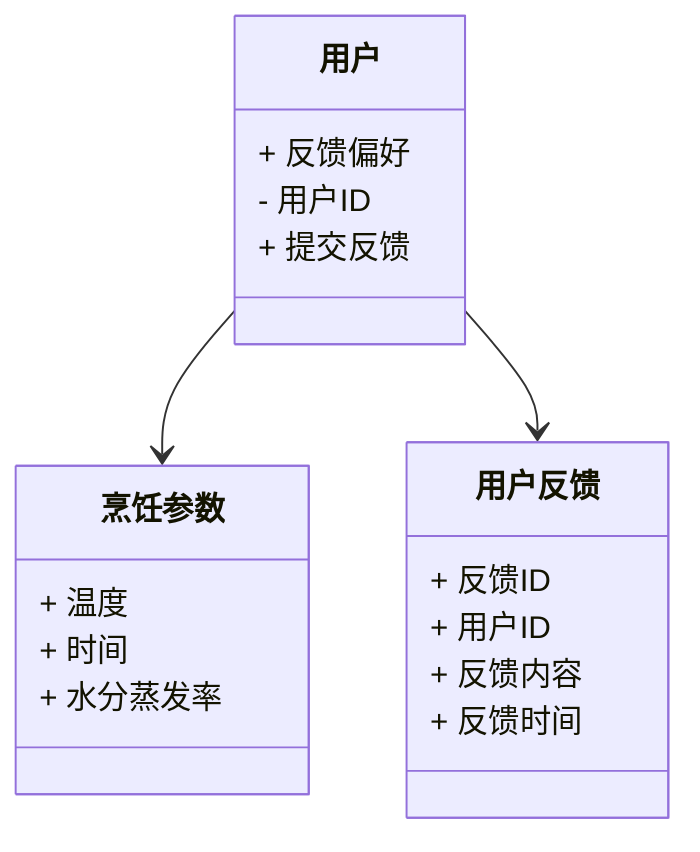
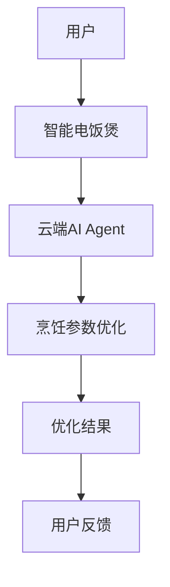
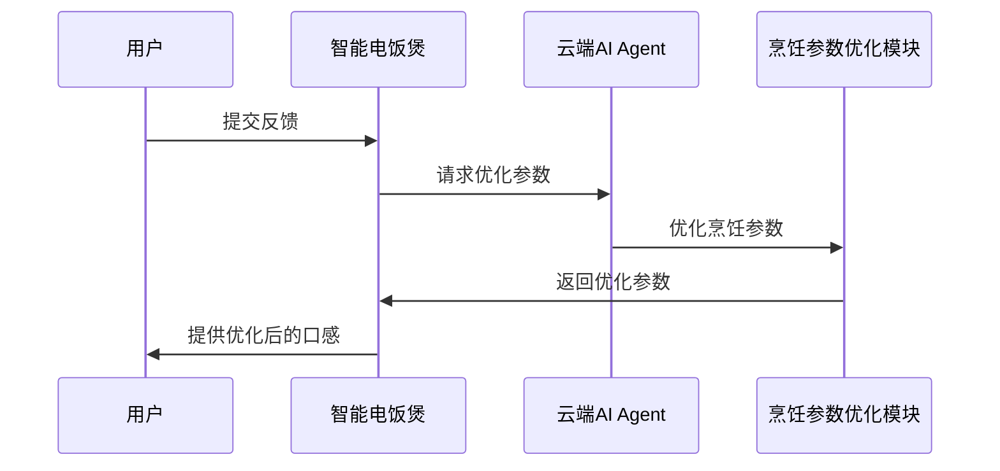

                 


# AI Agent在智能电饭煲中的米饭口感定制

> 关键词：智能电饭煲、AI Agent、米饭口感、定制、机器学习、优化算法

> 摘要：本文探讨了AI Agent在智能电饭煲中的应用，重点分析了如何通过AI技术实现米饭口感的个性化定制。从问题背景到算法实现，从系统架构到项目实战，系统性地阐述了AI Agent在智能家电中的创新应用，为智能家电的智能化发展提供了新的思路和解决方案。

---

# 第1章 背景介绍

## 1.1 问题背景

### 1.1.1 智能电饭煲的发展现状

智能电饭煲作为智能家居的重要组成部分，经历了从简单定时控制到智能学习的演进。当前市场上的智能电饭煲大多基于规则引擎实现功能，例如根据米种调整烹饪时间，但这些产品难以满足用户的个性化需求，口感优化仍停留在预设模式的层面。

### 1.1.2 米饭口感定制的需求分析

米饭口感是用户最关注的指标之一，包括软硬度、香甜度、粘稠度等维度。不同用户对米饭口感的偏好存在显著差异，例如年轻人偏爱Q弹的口感，而老年人则喜欢软糯的口感。现有智能电饭煲无法根据用户的反馈实时调整烹饪参数，导致口感优化效果有限。

### 1.1.3 AI Agent在家电中的应用前景

AI Agent（智能体）是一种能够感知环境、自主决策、执行任务并适应变化的智能系统。随着计算能力的提升和大数据技术的发展，AI Agent在家电中的应用逐渐成为可能。通过AI Agent，智能电饭煲能够实时感知用户的偏好，动态调整烹饪参数，从而实现个性化的米饭口感定制。

## 1.2 问题描述

### 1.2.1 米饭口感的影响因素

米饭口感受多种因素影响，包括米的种类、水分含量、烹饪时间和温度等。这些因素相互作用，使得口感优化成为一个复杂的非线性问题。

### 1.2.2 用户对米饭口感的个性化需求

用户对米饭口感的偏好因人而异，例如：
- 部分用户喜欢米饭有嚼劲（Q弹）。
- 部分用户偏好米饭软糯。
- 部分用户注重米饭的香气。

这些差异化的偏好使得传统的预设模式无法满足所有用户的需求。

### 1.2.3 当前智能电饭煲的局限性

当前智能电饭煲主要依赖预设的烹饪曲线，缺乏灵活性和自适应能力。用户反馈无法实时影响烹饪过程，口感优化效果有限。

## 1.3 问题解决

### 1.3.1 AI Agent的核心作用

AI Agent能够实时感知用户的偏好，动态调整烹饪参数，从而实现个性化的米饭口感定制。

### 1.3.2 数据驱动的口感优化方法

通过收集和分析用户的反馈数据，AI Agent能够不断优化烹饪参数，逐步逼近用户的理想口感。

### 1.3.3 多目标优化的实现路径

米饭口感的优化涉及多个目标函数，例如软硬度、香甜度等。通过多目标优化算法，AI Agent能够在这些目标之间找到平衡点，满足用户的综合需求。

## 1.4 边界与外延

### 1.4.1 问题的边界条件

- 烹饪环境：室温、海拔、气压等环境因素可能影响烹饪效果，但在本文中假设烹饪环境稳定。
- 用户反馈：仅考虑用户的口感反馈，不涉及其他反馈（如健康指标）。
- 烹饪设备：假设电饭煲的硬件配置满足AI Agent的运行需求。

### 1.4.2 相关领域的外延分析

- 传感器技术：用于实时监测烹饪过程中的温度、湿度等参数。
- 云计算：用于存储和处理用户的反馈数据。
- 物联网：实现设备与云端的实时通信。

### 1.4.3 技术实现的可行性评估

- 硬件可行性：当前智能电饭煲的硬件配置能够支持AI Agent的基本功能。
- 软件可行性：AI算法在云端运行，通过物联网协议与设备通信。
- 用户体验：需要设计友好的用户界面，便于用户反馈口感偏好。

## 1.5 概念结构与核心要素组成

### 1.5.1 核心概念的层次结构

- **顶层概念**：AI Agent在智能电饭煲中的应用。
- **中层概念**：米饭口感的多维评价体系。
- **底层概念**：烹饪参数的动态调整。

### 1.5.2 核心要素的特征分析

- **用户偏好**：个性化需求是核心驱动因素。
- **烹饪参数**：包括温度、湿度、时间等关键变量。
- **反馈机制**：用户反馈是优化的基础。

### 1.5.3 概念之间的关系图解



---

# 第2章 核心概念与联系

## 2.1 AI Agent的核心原理

### 2.1.1 AI Agent的定义与特征

AI Agent是一种能够感知环境、自主决策、执行任务并适应变化的智能系统。其核心特征包括：
- **自主性**：无需外部干预，能够自主运行。
- **反应性**：能够实时感知环境并做出反应。
- **学习能力**：能够通过反馈不断优化自身的决策模型。

### 2.1.2 AI Agent的感知、决策与执行机制

AI Agent通过传感器获取环境信息（如温度、湿度），结合用户反馈，构建数学模型，预测最佳烹饪参数，并通过执行机构（如加热元件）调整烹饪过程。

### 2.1.3 AI Agent的自适应能力

AI Agent能够通过机器学习算法不断优化自身的决策模型，逐步逼近用户的理想口感。

## 2.2 米饭口感定制的数学模型

### 2.2.1 米饭口感的多维评价体系

米饭口感可以从多个维度进行评价，包括：
- **软硬度**：由淀粉含量和烹饪时间决定。
- **香甜度**：与米的种类和烹饪温度有关。
- **粘稠度**：受水分蒸发和烹饪时间的影响。

### 2.2.2 口感评价的数学表达式

设口感评分为$S$，其数学表达式为：
$$
S = f(T, t, w)
$$
其中，$T$为温度，$t$为时间，$w$为水分蒸发率。

### 2.2.3 口感优化的目标函数

目标函数为最大化口感评分：
$$
\max S = f(T, t, w)
$$

## 2.3 核心概念属性特征对比

### 2.3.1 AI Agent与传统控制算法的对比

| 特性               | AI Agent                     | 传统控制算法                 |
|--------------------|----------------------------|-----------------------------|
| 决策方式           | 基于机器学习模型             | 基于预设规则                 |
| 自适应能力         | 强，能够根据反馈优化         | 弱，仅能执行预设逻辑         |
| 用户交互           | 支持实时反馈调整             | 无法实时调整                 |

### 2.3.2 数据驱动与规则驱动的对比

| 特性               | 数据驱动                   | 规则驱动                     |
|--------------------|---------------------------|-----------------------------|
| 决策依据           | 历史数据和机器学习模型       | 预设规则                     |
| 适应性             | 强，能够适应变化             | 弱，难以适应变化             |
| 精度               | 高，能够实现个性化定制       | 低，仅能实现固定模式           |

### 2.3.3 多目标优化与单目标优化的对比

| 特性               | 多目标优化                 | 单目标优化                   |
|--------------------|---------------------------|-----------------------------|
| 优化目标           | 多个目标（如软硬度、香甜度） | 单个目标                     |
| 优化效果           | 更符合用户的综合需求         | 可能偏离用户的综合需求         |
| 实现难度           | 较高，需要复杂的优化算法     | 较低，实现简单               |

## 2.4 ER实体关系图



---

# 第3章 算法原理讲解

## 3.1 算法原理概述

AI Agent通过机器学习算法构建口感预测模型，并通过强化学习算法优化烹饪参数。

### 3.1.1 机器学习算法

机器学习用于构建口感预测模型，通过训练数据预测用户的口感评分。

### 3.1.2 强化学习算法

强化学习用于优化烹饪参数，通过与用户的互动不断调整烹饪策略，逐步逼近用户的理想口感。

---

## 3.2 算法实现步骤

### 3.2.1 数据采集

采集用户的口感反馈数据，包括：
- 米的种类
- 烹饪时间
- 温度
- 用户评分

### 3.2.2 数据预处理

对数据进行清洗和归一化处理，确保数据适合模型训练。

### 3.2.3 模型训练

使用机器学习算法训练口感预测模型，例如：
- 线性回归
- 支持向量机
- 神经网络

### 3.2.4 模型优化

通过强化学习算法优化烹饪参数，例如：
- Q-Learning
- Deep Q-Network

---

## 3.3 算法的数学模型和公式

### 3.3.1 机器学习模型的数学表达

假设口感评分为$S$，烹饪参数为$T$（温度）、$t$（时间）、$w$（水分蒸发率），机器学习模型可以表示为：
$$
S = f(T, t, w)
$$

### 3.3.2 强化学习算法的数学表达

强化学习通过状态、动作和奖励的三元组进行学习：
$$
R = r(s, a)
$$
其中，$s$为状态，$a$为动作，$R$为奖励。

---

## 3.4 算法实现的具体步骤

1. 数据采集：通过智能电饭煲采集用户的口感反馈数据。
2. 数据预处理：清洗和归一化数据。
3. 模型训练：使用机器学习算法训练口感预测模型。
4. 模型优化：通过强化学习算法优化烹饪参数。
5. 系统部署：将优化后的烹饪参数发送给智能电饭煲，实时调整烹饪过程。

---

## 3.5 代码实现与分析

### 3.5.1 环境安装

```bash
pip install numpy scikit-learn tensorflow
```

### 3.5.2 核心代码

```python
import numpy as np
from sklearn.model_selection import train_test_split
from tensorflow.keras.models import Sequential
from tensorflow.keras.layers import Dense

# 数据预处理
X = np.array([...])  # 烹饪参数
y = np.array([...])  # 用户评分

# 划分训练集和测试集
X_train, X_test, y_train, y_test = train_test_split(X, y, test_size=0.2)

# 构建神经网络模型
model = Sequential()
model.add(Dense(64, activation='relu', input_dim=X.shape[1]))
model.add(Dense(1, activation='sigmoid'))

model.compile(optimizer='adam', loss='binary_crossentropy', metrics=['accuracy'])

# 训练模型
model.fit(X_train, y_train, epochs=100, batch_size=32)

# 评估模型
model.evaluate(X_test, y_test)
```

---

## 3.6 总结与展望

通过机器学习和强化学习算法，AI Agent能够实时感知用户的偏好，动态调整烹饪参数，逐步逼近用户的理想口感。未来，随着AI技术的不断发展，智能电饭煲的口感优化将更加精准和个性化。

---

# 第4章 系统分析与架构设计方案

## 4.1 问题场景介绍

AI Agent需要与智能电饭煲、云端服务器和用户终端进行交互，实时感知用户的偏好，动态调整烹饪参数。

---

## 4.2 项目介绍

本项目旨在通过AI Agent实现智能电饭煲的米饭口感个性化定制，为用户提供更优质的烹饪体验。

---

## 4.3 系统功能设计

### 4.3.1 领域模型



---

## 4.4 系统架构设计

### 4.4.1 系统架构



---

## 4.5 系统接口设计

### 4.5.1 系统接口

- **用户接口**：提供用户反馈入口，例如手机APP或语音指令。
- **设备接口**：智能电饭煲通过物联网协议与云端通信。
- **云端接口**：AI Agent通过API接收用户的反馈数据，优化烹饪参数，并将结果返回给设备。

---

## 4.6 系统交互设计



---

## 4.7 项目实战

### 4.7.1 环境安装

```bash
pip install numpy scikit-learn tensorflow flask
```

---

## 4.7.2 核心代码实现

```python
from flask import Flask
import requests

app = Flask(__name__)

@app.route('/optimize_params', methods=['POST'])
def optimize_params():
    # 获取用户反馈
    feedback = request.json['feedback']
    # 调用AI Agent优化烹饪参数
    response = requests.post('http://ai_agent/api/optimze', json=feedback)
    return response.json()

if __name__ == '__main__':
    app.run()
```

---

## 4.8 总结与展望

通过AI Agent和物联网技术的结合，智能电饭煲的米饭口感优化将更加智能化和个性化，为用户带来更优质的烹饪体验。

---

# 第5章 最佳实践与总结

## 5.1 最佳实践 tips

- **数据质量**：确保用户反馈数据的完整性和准确性。
- **模型优化**：定期更新机器学习模型，保持预测精度。
- **用户体验**：设计友好的用户界面，提升用户的使用体验。

## 5.2 小结

本文详细探讨了AI Agent在智能电饭煲中的应用，从问题背景到算法实现，从系统架构到项目实战，系统性地阐述了AI Agent在智能家电中的创新应用。

## 5.3 注意事项

- **隐私保护**：用户反馈数据需加密存储，确保用户隐私安全。
- **系统稳定性**：确保云端AI Agent的高可用性，避免服务中断。
- **用户体验**：优化反馈机制，提升用户参与度。

## 5.4 拓展阅读

- 《深度学习实战》
- 《强化学习：理论与应用》
- 《智能家电的创新设计》

---

# 结语

通过本文的探讨，我们看到了AI Agent在智能电饭煲中的巨大潜力。随着技术的不断进步，AI Agent将为智能家电的发展注入新的活力，为用户带来更智能、更个性化的使用体验。

