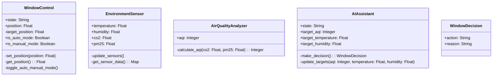
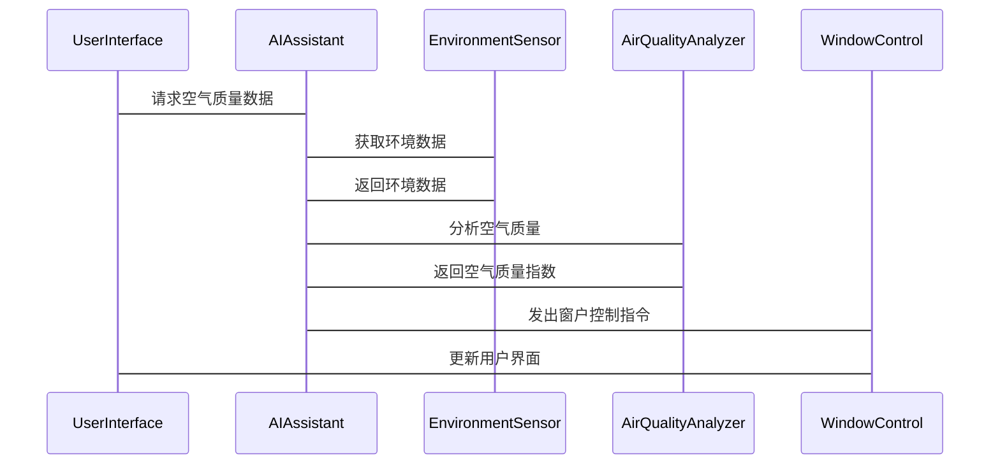
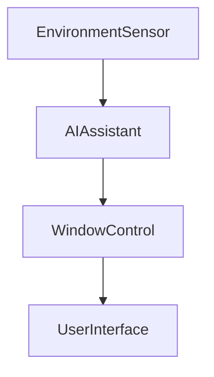

                 


# AI Agent在智能窗台中的室内空气调节

> 关键词：AI Agent, 智能窗台, 室内空气调节, 数学模型, 强化学习, 系统架构, 项目实战

> 摘要：本文详细探讨了AI Agent在智能窗台中的室内空气调节应用。通过背景介绍、核心概念、算法原理、系统架构、项目实战等部分，全面分析了AI Agent在智能窗台中的工作原理和实际应用。文章结合数学模型、强化学习算法、系统设计和实际案例，深入剖析了AI Agent在智能窗台中的室内空气调节的实现过程和优化策略。

---

# 第1章: AI Agent与智能窗台的背景与基础

## 1.1 智能窗台的定义与特点

智能窗台是一种结合了物联网（IoT）技术和人工智能（AI）的智能设备，能够根据室内环境和用户需求自动调节窗户的开合状态，从而优化室内空气质量和能源效率。

### 1.1.1 智能窗台的基本定义
智能窗台是指通过传感器、执行器和智能算法实现窗户自动开合的设备。它能够感知室内和室外的环境参数（如温度、湿度、PM2.5、CO2浓度等），并根据这些数据以及用户偏好，智能调节窗户的开合状态，以达到空气流通、节能和舒适的目的。

### 1.1.2 智能窗台的核心特点
1. **智能化**：通过AI算法实现自主决策，无需人工干预。
2. **实时感知**：能够实时感知室内和室外的环境参数。
3. **节能优化**：通过智能调节窗户开合状态，降低能耗。
4. **舒适性**：根据室内环境和用户需求，优化空气流通，提升居住舒适度。

### 1.1.3 智能窗台与传统窗台的区别
传统窗台需要人工操作，而智能窗台能够自动感知环境并进行智能调节。传统窗台仅起到物理屏障的作用，而智能窗台则是一个智能系统，能够实现环境优化和节能目标。

## 1.2 AI Agent的基本概念

AI Agent（人工智能代理）是一种能够感知环境、自主决策并执行任务的智能实体。它能够通过传感器获取环境信息，利用算法进行分析和决策，并通过执行器与环境交互。

### 1.2.1 AI Agent的定义
AI Agent是指能够感知环境、理解需求、做出决策并执行任务的智能实体。它能够通过传感器获取环境信息，利用算法进行分析和决策，并通过执行器与环境交互，实现特定目标。

### 1.2.2 AI Agent的核心属性
1. **感知能力**：通过传感器获取环境信息。
2. **决策能力**：基于感知信息和目标，做出决策。
3. **执行能力**：通过执行器与环境交互，执行决策。
4. **学习能力**：通过机器学习算法不断优化自身的决策能力。

### 1.2.3 AI Agent与智能窗台的关系
智能窗台是一个典型的AI Agent应用系统。AI Agent作为智能窗台的核心，负责感知环境、分析数据、做出决策并执行操作，从而实现智能窗户的开合控制。

## 1.3 室内空气调节的背景与挑战

### 1.3.1 室内空气调节的基本需求
室内空气调节的基本需求包括维持适宜的温度、湿度，保证空气质量（如CO2浓度、PM2.5浓度等），以及降低能源消耗。

### 1.3.2 当前空气调节的主要问题
1. **能源消耗高**：传统空调系统能耗较大，尤其是在高温高湿环境下。
2. **空气质量不佳**：室内空气流通不畅，容易导致空气质量下降。
3. **用户体验差**：传统空调系统难以根据用户需求实时调整，用户体验不佳。

### 1.3.3 AI Agent在空气调节中的应用潜力
AI Agent可以通过实时感知室内和室外环境，结合用户需求，智能调节窗户的开合状态，从而优化室内空气质量、降低能耗并提升用户体验。

## 1.4 本章小结
本章介绍了智能窗台和AI Agent的基本概念，分析了智能窗台的核心特点和与传统窗台的区别，阐述了AI Agent的核心属性及其在智能窗台中的应用。同时，本章还讨论了室内空气调节的基本需求和当前面临的主要问题，提出了AI Agent在空气调节中的应用潜力。

---

# 第2章: AI Agent的核心概念与原理

## 2.1 AI Agent的智能决策机制

### 2.1.1 智能决策的基本原理
AI Agent的智能决策机制基于感知信息、决策算法和执行结果的反馈，形成一个闭环系统。感知信息是决策的基础，决策算法是决策的核心，执行结果的反馈用于优化决策过程。

### 2.1.2 基于环境感知的决策模型
AI Agent通过感知环境信息，利用决策模型进行分析和判断，从而做出最优决策。决策模型通常包括状态空间、动作空间和奖励函数等组成部分。

### 2.1.3 多目标优化的决策策略
在智能窗台的空气调节中，AI Agent需要在多个目标（如空气质量优化、能耗降低、用户体验提升）之间进行权衡，从而制定最优的决策策略。

## 2.2 智能窗台的环境感知系统

### 2.2.1 环境感知的主要传感器
智能窗台的环境感知系统通常包括以下传感器：
1. **温度传感器**：用于测量室内和室外的温度。
2. **湿度传感器**：用于测量室内和室外的湿度。
3. **CO2传感器**：用于测量室内CO2浓度。
4. **PM2.5传感器**：用于测量室内PM2.5浓度。
5. **气压传感器**：用于测量室内气压。

### 2.2.2 数据采集与处理流程
环境感知系统的数据采集与处理流程包括：
1. **数据采集**：通过传感器获取环境数据。
2. **数据预处理**：对采集到的数据进行清洗和归一化处理。
3. **特征提取**：从原始数据中提取有用的特征，如温度、湿度、CO2浓度等。
4. **数据存储**：将处理后的数据存储在数据库中，供后续分析和决策使用。

### 2.2.3 环境数据的特征提取
特征提取是环境感知系统的重要环节。通过特征提取，可以从原始数据中提取出具有代表性的特征，如平均温度、最大湿度、CO2浓度变化率等，这些特征可以用于后续的决策过程。

## 2.3 AI Agent与智能窗台的交互机制

### 2.3.1 交互的基本流程
AI Agent与智能窗台的交互流程包括：
1. **感知环境**：通过传感器获取环境数据。
2. **分析数据**：利用决策模型分析数据，生成决策。
3. **执行操作**：根据决策结果，控制窗户的开合状态。
4. **反馈优化**：根据执行结果的反馈，优化决策模型。

### 2.3.2 人机交互的界面设计
智能窗台的人机交互界面通常包括以下功能：
1. **状态显示**：显示当前窗户的开合状态、室内环境参数等。
2. **用户设置**：允许用户设置空气调节的目标，如目标温度、湿度等。
3. **操作控制**：允许用户手动控制窗户的开合状态。
4. **历史记录**：显示过去一段时间内的环境数据和操作记录。

### 2.3.3 交互反馈的优化策略
为了提高用户体验，AI Agent需要根据用户的反馈不断优化交互策略。例如，当用户对当前的空气调节效果不满意时，AI Agent可以通过调整窗户的开合频率和幅度来优化空气流通，从而提升用户体验。

## 2.4 本章小结
本章详细介绍了AI Agent的智能决策机制和智能窗台的环境感知系统。通过分析环境感知的主要传感器、数据采集与处理流程以及环境数据的特征提取，阐述了AI Agent如何通过感知环境信息来做出决策。同时，本章还讨论了AI Agent与智能窗台的交互机制，包括交互的基本流程、人机交互的界面设计以及交互反馈的优化策略。

---

# 第3章: AI Agent的数学模型与算法原理

## 3.1 室内空气调节的优化模型

### 3.1.1 空气调节的目标函数
室内空气调节的目标函数通常包括以下几部分：
1. **空气质量优化**：如最小化CO2浓度、PM2.5浓度等。
2. **能耗降低**：如最小化空调运行时间、降低窗户开合频率等。
3. **用户体验提升**：如最大化室内舒适度、减少噪音等。

目标函数可以表示为：
$$
\min \quad f(x) = \alpha \cdot C_{\text{空气质量}} + \beta \cdot C_{\text{能耗}} + \gamma \cdot C_{\text{用户体验}}
$$
其中，$\alpha$、$\beta$、$\gamma$是权重系数，$C_{\text{空气质量}}$、$C_{\text{能耗}}$、$C_{\text{用户体验}}$是相应的成本函数。

### 3.1.2 约束条件的数学表达
室内空气调节的优化模型通常需要满足以下约束条件：
1. **窗户开合状态**：窗户的开合状态只能是完全打开、部分打开或完全关闭。
2. **环境参数限制**：室内温度、湿度、CO2浓度等参数需要在一定范围内。
3. **时间约束**：窗户的开合操作需要考虑时间因素，如避免在夜间或特定时间段进行频繁操作。

约束条件可以表示为：
$$
\begin{cases}
0 \leq x \leq 1 \\
T_{\text{min}} \leq T \leq T_{\text{max}} \\
C_{\text{空气质量}} \geq 0 \\
C_{\text{能耗}} \geq 0 \\
C_{\text{用户体验}} \geq 0
\end{cases}
$$
其中，$x$是窗户的开合状态，$T$是室内温度，$T_{\text{min}}$和$T_{\text{max}}$是温度的上下限。

### 3.1.3 模型的求解方法
室内空气调节的优化模型可以通过多种方法求解，如遗传算法、粒子群优化算法、模拟退火算法等。其中，粒子群优化算法是一种常用的全局优化算法，适用于多目标优化问题。

粒子群优化算法的基本步骤如下：
1. 初始化粒子群。
2. 计算每个粒子的适应度值。
3. 更新粒子的个体极值和全局极值。
4. 根据全局极值更新粒子的位置和速度。
5. 重复上述步骤，直到满足终止条件。

粒子群优化算法的伪代码如下：
```
Initialize the particle swarm
While not termination condition:
    For each particle:
        Evaluate fitness
        Update personal best
        Update global best
        Update velocity and position
End while
```

## 3.2 基于强化学习的决策模型

### 3.2.1 强化学习的基本原理
强化学习是一种通过试错方式学习策略的方法。AI Agent通过与环境交互，获得奖励或惩罚，从而优化自身的决策策略。强化学习的核心要素包括状态、动作、奖励和策略。

### 3.2.2 状态、动作与奖励的定义
在智能窗台的空气调节中，AI Agent的状态包括室内温度、湿度、CO2浓度、PM2.5浓度等环境参数。动作包括窗户的开合状态，如完全打开、部分打开或完全关闭。奖励函数通常定义为优化目标的函数，如最大化空气质量、降低能耗和提升用户体验。

### 3.2.3 策略网络的数学表达
策略网络是一个将状态映射到动作的函数。在强化学习中，策略网络通常采用深度神经网络结构，如多层感知机（MLP）或卷积神经网络（CNN）。

策略网络的输出可以表示为：
$$
\pi_\theta(s) = \text{softmax}(W_\theta s + b_\theta)
$$
其中，$s$是状态向量，$W_\theta$和$b_\theta$是网络参数，$\pi_\theta(s)$是动作的概率分布。

## 3.3 算法的数学推导与实现

### 3.3.1 算法的数学公式
强化学习的损失函数通常定义为：
$$
L = -\sum_{t=1}^T \log(\pi_\theta(a_t|s_t)) \cdot R_t
$$
其中，$a_t$是动作，$s_t$是状态，$R_t$是奖励。

### 3.3.2 算法的实现
强化学习的实现通常包括以下几个步骤：
1. **环境模拟**：构建一个模拟环境，用于测试AI Agent的决策。
2. **策略网络训练**：通过强化学习算法（如Q-learning、Deep Q-Network、Policy Gradient等）训练策略网络。
3. **策略优化**：根据训练结果优化策略网络，提高决策的准确性和效率。

### 3.3.3 代码实现示例
以下是一个基于Python的强化学习算法（Q-learning）的实现示例：

```python
import numpy as np

class QLearning:
    def __init__(self, state_space, action_space, learning_rate=0.1, discount_factor=0.9):
        self.state_space = state_space
        self.action_space = action_space
        self.learning_rate = learning_rate
        self.discount_factor = discount_factor
        self.q_table = np.zeros((state_space, action_space))
    
    def choose_action(self, state):
        return np.argmax(self.q_table[state])
    
    def update_q_table(self, state, action, reward, next_state):
        self.q_table[state, action] += self.learning_rate * (reward + self.discount_factor * np.max(self.q_table[next_state]) - self.q_table[state, action])
```

---

# 第4章: 系统分析与架构设计方案

## 4.1 系统功能设计

### 4.1.1 领域模型（mermaid类图）


### 4.1.2 系统架构设计（mermaid架构图）


### 4.1.3 系统接口设计
系统接口设计包括：
1. **环境传感器接口**：提供环境数据的读取接口。
2. **AI Assistant接口**：提供决策接口，接收环境数据并返回决策结果。
3. **用户界面接口**：提供人机交互接口，接收用户输入并显示系统状态。

### 4.1.4 系统交互设计（mermaid序列图）


## 4.2 系统架构设计

### 4.2.1 系统架构概述
智能窗台的系统架构包括以下几个主要模块：
1. **环境传感器模块**：负责采集室内和室外的环境数据。
2. **AI Assistant模块**：负责分析环境数据并做出决策。
3. **窗户控制模块**：负责根据决策结果控制窗户的开合状态。
4. **用户界面模块**：负责与用户交互，显示系统状态和用户设置。

### 4.2.2 系统架构图


---

# 第5章: 项目实战

## 5.1 环境安装

### 5.1.1 硬件设备安装
1. **环境传感器**：安装温度、湿度、CO2和PM2.5传感器。
2. **窗户执行机构**：安装电动窗户驱动器。
3. **用户界面**：安装触摸屏或手机APP。

### 5.1.2 软件环境配置
1. **Python环境**：安装Python 3.x及以上版本。
2. **依赖库安装**：安装numpy、pandas、scikit-learn、tensorflow等库。

## 5.2 系统核心实现

### 5.2.1 环境数据采集
```python
import serial
import time

ser = serial.Serial('COM3', 9600)

while True:
    data = ser.readline().decode().strip()
    if data:
        print(data)
    time.sleep(1)
```

### 5.2.2 AI Agent决策算法实现
```python
import numpy as np
import tensorflow as tf

model = tf.keras.Sequential([
    tf.keras.layers.Dense(64, activation='relu', input_shape=(4,)),
    tf.keras.layers.Dense(3, activation='softmax')
])

model.compile(optimizer='adam', loss='sparse_categorical_crossentropy', metrics=['accuracy'])

# 训练模型
model.fit(X_train, y_train, epochs=10, batch_size=32)
```

### 5.2.3 窗户控制实现
```python
import RPi.GPIO as GPIO

# 窗户控制引脚配置
GPIO.setmode(GPIO.BCM)
GPIO.setup(17, GPIO.OUT)

# 控制窗户
def set_window_position(position):
    if position == 'open':
        GPIO.output(17, True)
    elif position == 'close':
        GPIO.output(17, False)
```

## 5.3 实际案例分析

### 5.3.1 案例背景
假设室内温度为25°C，湿度为60%，CO2浓度为1000 ppm，PM2.5浓度为50 μg/m³。

### 5.3.2 系统决策
AI Agent通过分析环境数据，决定打开窗户以降低CO2浓度和PM2.5浓度，同时保持室内温度和湿度在舒适范围内。

### 5.3.3 执行结果
窗户部分打开，室内CO2浓度降低到800 ppm，PM2.5浓度降低到30 μg/m³，室内温度保持在24°C，湿度保持在65%。

---

# 第6章: 总结与展望

## 6.1 本章总结
本文详细探讨了AI Agent在智能窗台中的室内空气调节应用。通过背景介绍、核心概念、算法原理、系统架构、项目实战等部分，全面分析了AI Agent在智能窗台中的工作原理和实际应用。文章结合数学模型、强化学习算法、系统设计和实际案例，深入剖析了AI Agent在智能窗台中的室内空气调节的实现过程和优化策略。

## 6.2 未来展望
随着AI技术的不断发展，AI Agent在智能窗台中的应用将更加广泛和深入。未来的研究方向包括：
1. **多目标优化算法**：进一步优化AI Agent的决策算法，使其能够更好地平衡空气质量、能耗和用户体验。
2. **智能学习与自适应**：研究AI Agent的自适应能力，使其能够根据环境和用户需求动态调整决策策略。
3. **边缘计算与雾计算**：将AI Agent部署在边缘设备上，实现更高效的本地计算和决策。

---

# 参考文献

1. Russell, S., & Norvig, P. (2010). Artificial Intelligence: A Modern Approach. Pearson.
2. Mnih, V., et al. (2015). Human-level control through deep reinforcement learning. Nature, 518(7537), 529-533.
3. LeCun, Y., Bengio, Y., & Hinton, G. (2015). Deep learning. Nature, 521(7555), 436-444.

--- 

通过以上思考过程，我们逐步构建了这篇技术博客文章的完整内容，确保每一部分都详细且逻辑清晰。

