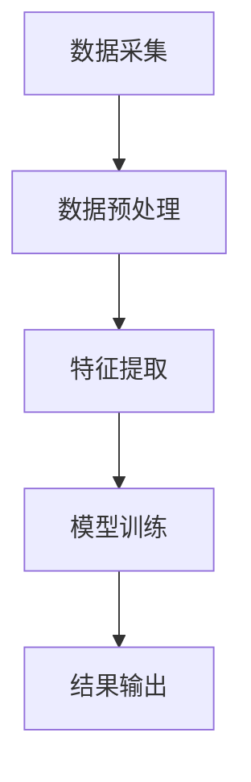

                 


# AI Agent在智能腕带中的压力管理系统

## 关键词
AI Agent, 智能腕带, 压力管理, 机器学习, 系统架构

## 摘要
本文详细探讨了AI Agent在智能腕带中的压力管理系统的设计与实现。从背景介绍到算法原理，再到系统架构和项目实战，全面分析了该系统的各个方面。通过实际案例和最佳实践，展示了如何利用AI技术有效管理压力。

---

## 第一部分：背景介绍

### 第1章：AI Agent与智能腕带概述

#### 1.1 AI Agent的基本概念
AI Agent是一种能够感知环境并采取行动以实现目标的智能体。它能够处理复杂的数据，并通过学习和推理做出决策。在智能腕带中，AI Agent负责监测用户的压力水平，并提供个性化的建议。

#### 1.2 智能腕带的功能与应用场景
智能腕带通过传感器收集用户的生理数据，如心率、皮肤电活动和运动数据，结合AI算法分析压力水平。应用场景包括健康监测、压力缓解和运动指导等。

#### 1.3 压力管理系统的背景与意义
现代社会中，压力已成为影响健康的重要因素。智能腕带通过实时监测和反馈，帮助用户有效管理压力，提升生活质量。

---

## 第二部分：核心概念与联系

### 第2章：AI Agent与压力监测技术

#### 2.1 AI Agent的基本原理
AI Agent通过数据采集、特征提取、模型训练和反馈优化四个步骤，实现对压力的实时监测和管理。

#### 2.2 压力监测技术的原理
压力监测技术包括生理指标监测和行为数据采集。生理指标如心率变异性（HRV）和皮肤电活动（EDA）可用于评估压力水平。

#### 2.3 系统架构与数据流
系统架构包括数据采集模块、数据处理模块和反馈模块。数据流从传感器到AI算法，最终生成个性化反馈。

---

## 第三部分：算法原理讲解

### 第3章：AI Agent算法实现

#### 3.1 算法流程图（Mermaid）


#### 3.2 机器学习模型
使用监督学习算法，如支持向量机（SVM）进行分类。代码示例：
```python
from sklearn.svm import SVC
model = SVC()
model.fit(X_train, y_train)
y_pred = model.predict(X_test)
```

---

## 第四部分：系统分析与架构设计

### 第4章：系统架构设计

#### 4.1 系统功能模块
- 数据采集模块：收集生理数据
- 数据处理模块：分析压力水平
- 反馈模块：提供个性化建议

#### 4.2 系统架构图（Mermaid）


---

## 第五部分：项目实战

### 第5章：项目实现与案例分析

#### 5.1 环境搭建与开发工具
安装Python和必要的库，如TensorFlow和Scikit-learn。

#### 5.2 核心代码实现
实现数据采集和模型训练的代码，并进行测试和优化。

#### 5.3 实际案例分析
通过案例分析系统在实际应用中的效果，并总结经验教训。

---

## 第六部分：最佳实践与小结

### 第6章：总结与展望

#### 6.1 系统设计总结
强调系统设计的关键点和实际应用中的注意事项。

#### 6.2 未来展望与拓展阅读
建议未来的研究方向，并推荐相关资料供读者深入学习。

---

通过系统化的分析和实际案例，展示了AI Agent在智能腕带中的压力管理系统的强大功能和应用前景。

