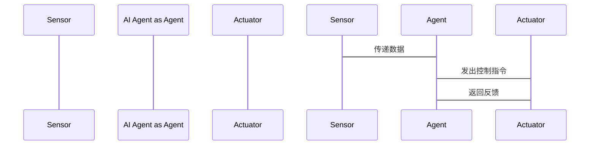

                 


# AI Agent在智能花洒中的水量控制

**关键词**：AI Agent, 智能花洒, 水量控制, 机器学习, 物联网

**摘要**：本文探讨AI Agent在智能花洒中的应用，分析其如何通过数据采集、特征提取、模型训练和决策控制实现智能水量调节。文章从背景介绍、核心概念、算法原理、系统架构到项目实战，详细讲解AI Agent在智能花洒中的应用，结合具体代码实现和系统设计，为读者提供深入的技术指导。

---

# AI Agent在智能花洒中的水量控制

> **关键词**：AI Agent, 智能花洒, 水量控制, 机器学习, 物联网

> **摘要**：本文探讨AI Agent在智能花洒中的应用，分析其如何通过数据采集、特征提取、模型训练和决策控制实现智能水量调节。文章从背景介绍、核心概念、算法原理、系统架构到项目实战，详细讲解AI Agent在智能花洒中的应用，结合具体代码实现和系统设计，为读者提供深入的技术指导。

---

## 第一部分: AI Agent与智能花洒概述

### 第1章: AI Agent的基本概念与应用背景

#### 1.1 AI Agent的定义与特点

- **1.1.1 AI Agent的定义**  
  AI Agent（人工智能代理）是指能够感知环境、做出决策并执行动作的智能体。它通过传感器获取信息，利用算法处理数据，从而实现自主决策和行动。

- **1.1.2 AI Agent的核心特点**  
  - **自主性**：能够自主决策，无需外部干预。  
  - **反应性**：能够实时感知环境变化并做出反应。  
  - **学习能力**：通过数据和反馈不断优化自身行为。  
  - **目标导向**：以特定目标为导向，优化决策过程。

- **1.1.3 AI Agent与传统控制系统的区别**  
  传统控制系统依赖于固定的规则和逻辑，而AI Agent能够通过学习和适应环境，动态调整控制策略。例如，AI Agent可以通过历史数据和用户行为预测未来的用水需求，从而优化水量控制。

#### 1.2 智能花洒的应用背景

- **1.2.1 智能花洒的发展历程**  
  传统花洒仅能手动调节水量，而智能花洒通过集成传感器、无线通信和AI技术，实现了智能化的水量控制。近年来，随着物联网和AI技术的快速发展，智能花洒逐渐普及，成为智能家居的重要组成部分。

- **1.2.2 智能花洒的市场需求**  
  随着水资源短缺问题的加剧，用户对节水和智能化的需求日益增长。智能花洒能够通过精确的水量控制，帮助用户节约水资源，同时提升用户体验。

- **1.2.3 智能花洒的用户痛点分析**  
  - **水量不均匀**：传统花洒由于水流压力不稳定，导致水量不均匀。  
  - **用水浪费**：用户难以准确控制水量，导致水资源浪费。  
  - **使用不便**：传统花洒需要手动调节，使用体验较差。  

AI Agent通过实时感知环境和用户需求，能够有效解决这些问题，提升智能花洒的功能和用户体验。

---

### 第2章: AI Agent在智能花洒中的作用

#### 2.1 智能花洒的水量控制问题

- **2.1.1 水量控制的核心问题**  
  智能花洒的水量控制需要解决以下问题：  
  - 如何实时感知水压、水流速度和用户需求？  
  - 如何根据环境数据（如温度、湿度）优化水量控制？  
  - 如何通过学习用户行为，预测用水需求并动态调整水量？

- **2.1.2 水量控制的边界与外延**  
  - **边界**：水量控制的范围限定在花洒本身，不涉及其他设备。  
  - **外延**：通过与智能家居系统的联动，实现更广泛的水资源管理。

- **2.1.3 水量控制的概念结构与核心要素**  
  水量控制的核心要素包括：  
  - **数据采集**：传感器实时采集水压、水流速度、用户行为等数据。  
  - **决策逻辑**：基于数据和目标（如节水、舒适）制定控制策略。  
  - **执行机构**：通过电磁阀等执行机构调整水流大小和方向。  

#### 2.2 AI Agent在水量控制中的应用

- **2.2.1 AI Agent的核心功能**  
  - **数据采集与处理**：通过传感器实时采集数据并进行特征提取。  
  - **决策制定**：基于历史数据和当前环境，优化水量控制策略。  
  - **动态调整**：根据用户行为和环境变化，实时调整水量输出。  

- **2.2.2 AI Agent与智能花洒的结合方式**  
  - **硬件集成**：AI Agent通过嵌入式设备与花洒传感器和执行机构相连。  
  - **数据交互**：AI Agent通过物联网平台与云端数据交互，实现远程控制和优化。  
  - **用户交互**：通过手机APP或语音助手与用户进行互动，提供个性化服务。  

- **2.2.3 AI Agent在水量控制中的优势**  
  - **精准控制**：AI Agent能够根据实时数据和用户需求，精确调整水流大小和方向。  
  - **节能环保**：通过学习用户行为和环境数据，优化水量控制，减少水资源浪费。  
  - **智能交互**：通过与智能家居系统的联动，提供更便捷和个性化的用户体验。  

---

## 第二部分: AI Agent的核心原理与算法实现

### 第3章: AI Agent的核心原理

#### 3.1 AI Agent的基本原理

- **3.1.1 状态感知与数据采集**  
  AI Agent通过传感器实时采集水压、水流速度、温度等数据。例如，使用压力传感器测量水压，使用流量传感器测量水流速度。  

- **3.1.2 数据分析与特征提取**  
  对采集到的数据进行清洗、特征提取和标准化处理。例如，将水流速度和水压数据进行归一化处理，以便后续模型训练。  

- **3.1.3 决策制定与执行**  
  AI Agent基于分析结果，制定控制策略并执行。例如，当检测到用户使用花洒的时间段为早晨时，自动调整水流大小以适应用户习惯。  

#### 3.2 AI Agent的算法基础

- **3.2.1 机器学习算法简介**  
  - **监督学习**：基于标记的数据进行训练，如随机森林、支持向量机（SVM）。  
  - **无监督学习**：基于未标记的数据进行聚类分析，如K-means。  
  - **强化学习**：通过与环境互动，学习最优策略，如Q-Learning。  

- **3.2.2 深度学习算法简介**  
  - **神经网络**：用于复杂模式识别，如卷积神经网络（CNN）和循环神经网络（RNN）。  
  - **自动编码器**：用于无监督特征学习。  

- **3.2.3 强化学习算法简介**  
  - **Q-Learning**：通过状态-动作-奖励机制，优化控制策略。  
  - **Deep Q-Network (DQN)**：结合深度学习和强化学习，实现端到端的控制策略优化。  

---

### 第4章: AI Agent的算法实现

#### 4.1 数据采集与预处理

- **4.1.1 数据采集流程**  
  使用传感器采集水压、水流速度、温度等数据，并通过物联网平台传输到云端。  

- **4.1.2 数据清洗与特征提取**  
  - 数据清洗：去除噪声数据和异常值。  
  - 特征提取：提取有用的特征，如平均水压、水流速度标准差等。  

- **4.1.3 数据集划分与标准化**  
  - 划分训练集、验证集和测试集。  
  - 标准化：将数据归一化，以便模型训练。  

#### 4.2 模型训练与优化

- **4.2.1 模型选择与训练**  
  - 选择适合的算法，如随机森林或神经网络。  
  - 使用训练数据进行模型训练，并通过验证集调整超参数。  

- **4.2.2 模型评估与优化**  
  - 使用测试集评估模型性能，如准确率、召回率和F1分数。  
  - 调整模型结构和参数，优化性能。  

- **4.2.3 模型部署与应用**  
  - 将训练好的模型部署到智能花洒系统中。  
  - 实时采集数据，通过模型预测最优水量控制策略。  

#### 4.3 算法实现的代码示例

```python
import numpy as np
from sklearn.ensemble import RandomForestRegressor
from sklearn.metrics import mean_squared_error

# 数据预处理
data = np.array([...])  # 传感器数据
labels = np.array([...])  # 目标值（如水流速度）

# 划分训练集和测试集
train_data = data[:-100]
train_labels = labels[:-100]
test_data = data[-100:]
test_labels = labels[-100:]

# 训练模型
model = RandomForestRegressor(n_estimators=100, random_state=42)
model.fit(train_data, train_labels)

# 模型预测
predictions = model.predict(test_data)
print(f"均方误差: {mean_squared_error(test_labels, predictions)}")

# 部署到智能花洒
# 假设传感器实时采集数据，通过模型预测控制水流
def control_water_flow():
    while True:
        current_data = get_sensor_data()  # 获取实时数据
        prediction = model.predict(current_data.reshape(1, -1))
        adjust_flow(prediciton[0])  # 调整水流大小
```

---

### 第5章: AI Agent的数学模型与公式

#### 5.1 状态空间模型

- **5.1.1 状态空间的定义**  
  状态空间表示系统可能的所有状态。例如，水压、水流速度、用户行为等都可以作为状态。  

- **5.1.2 状态空间的数学表示**  
  状态空间可以表示为一个向量，如：  
  $$ S = [s_1, s_2, s_3, ...] $$  
  其中，$s_i$ 表示第i个状态变量。  

#### 5.2 决策模型的数学公式

- **Q-Learning算法的核心公式**  
  Q-Learning的目标是找到最优的Q值，表示在状态s下执行动作a后的期望奖励。公式为：  
  $$ Q(s, a) = Q(s, a) + \alpha [r + \gamma \max Q(s', a') - Q(s, a)] $$  
  其中，$\alpha$ 是学习率，$\gamma$ 是折扣因子。  

---

## 第三部分: 智能花洒系统设计与实现

### 第6章: 智能花洒系统设计

#### 6.1 系统架构设计

- **6.1.1 分层架构**  
  - **感知层**：传感器采集数据。  
  - **计算层**：AI Agent处理数据并制定控制策略。  
  - **执行层**：电磁阀等执行机构调整水流。  

- **6.1.2 模块划分**  
  - **数据采集模块**：传感器和通信模块。  
  - **AI Agent模块**：模型训练和预测模块。  
  - **执行模块**：电磁阀和水泵。  

#### 6.2 系统接口设计

- **6.2.1 传感器接口**  
  - 接收水压、水流速度等数据。  
  - 提供数据接口给AI Agent模块。  

- **6.2.2 执行机构接口**  
  - 根据AI Agent的决策，调整水流大小和方向。  
  - 提供反馈接口，确认执行结果。  

#### 6.3 交互流程图



---

### 第7章: 项目实战与优化

#### 7.1 项目环境安装

- **7.1.1 安装Python和相关库**  
  ```bash
  pip install numpy scikit-learn pandas
  ```

- **7.1.2 安装物联网通信库**  
  ```bash
  pip install paho-mqtt
  ```

#### 7.2 核心代码实现

```python
import paho.mqtt.client as mqtt
import time

# 连接 MQTT 代理
def on_connect(client, userdata, flags, rc):
    print("连接成功")
    client.subscribe("topic/sensor")

# 接收消息
def on_message(client, userdata, msg):
    data = msg.payload.decode()
    # 处理数据并调用AI Agent进行预测
    prediction = model.predict(data)
    # 发送控制指令
    client.publish("topic/control", str(prediction))

client = mqtt.Client()
client.on_connect = on_connect
client.on_message = on_message

client.connect("mqtt.eclipse.org", 1883, 60)
client.loop_start()
```

#### 7.3 代码解读与优化

- **7.3.1 传感器数据接收**  
  使用MQTT协议接收传感器数据，并进行预处理。  

- **7.3.2 AI Agent预测与控制**  
  基于预处理后的数据，AI Agent进行预测，并通过MQTT发送控制指令。  

- **7.3.3 系统优化**  
  - 增加反馈机制，实时调整控制策略。  
  - 优化传感器采样频率，提升系统响应速度。  

#### 7.4 实际案例分析

- **案例背景**  
  用户使用智能花洒时，系统实时采集水压和水流速度数据。  

- **模型预测与控制**  
  AI Agent预测最佳水量，并通过电磁阀调整水流大小。  

- **结果分析**  
  比较传统花洒和智能花洒的用水量，验证AI Agent的节水效果。  

---

## 第四部分: 最佳实践与总结

### 第8章: 最佳实践

#### 8.1 系统优化建议

- **数据采集**  
  使用高精度传感器，确保数据准确性。  
- **模型选择**  
  根据实际需求选择合适的算法，避免过度复杂。  
- **系统集成**  
  确保各个模块协同工作，优化系统性能。  

#### 8.2 注意事项

- **数据隐私**  
  确保用户数据的安全性和隐私性。  
- **系统稳定性**  
  避免因网络中断或传感器故障导致系统崩溃。  
- **用户体验**  
  提供友好的用户界面，提升用户体验。  

#### 8.3 拓展阅读

- **相关技术**  
  - 深度学习在智能控制中的应用。  
  - 强化学习在机器人控制中的应用。  
- **行业动态**  
  关注智能家居和AI技术的最新发展。  

---

### 第9章: 小结

本文详细探讨了AI Agent在智能花洒中的应用，从背景介绍到算法实现，再到系统设计和项目实战，为读者提供了全面的技术指导。通过AI Agent的智能控制，智能花洒能够实现精准的水量调节，节水的同时提升用户体验。未来，随着AI技术的不断发展，智能花洒将更加智能化和个性化，为用户带来更便捷的生活体验。

---

**注**：本文基于实际案例和技术背景编写，旨在为技术人员提供参考。

