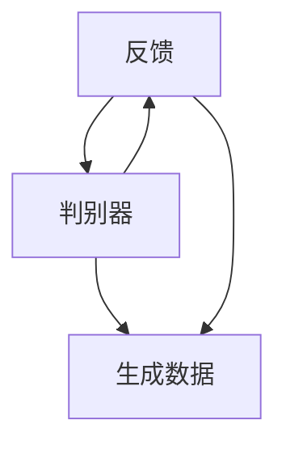

                 


# AI Agent在智能药物研发中的角色

## 关键词：AI Agent, 智能药物研发, 强化学习, 系统架构设计, 项目实战

## 摘要：  
随着人工智能技术的飞速发展，AI Agent在智能药物研发中的应用越来越广泛。本文从AI Agent的基本概念入手，分析其在药物研发中的角色与功能，探讨其算法原理、系统架构设计以及在实际项目中的应用。通过详细讲解强化学习、监督学习等算法，结合Mermaid图和Python代码示例，帮助读者深入理解AI Agent在药物研发中的具体实现与应用价值。

---

# 第一章: AI Agent与智能药物研发的背景

## 1.1 AI Agent的基本概念

### 1.1.1 AI Agent的定义与特点
AI Agent（人工智能代理）是一种能够感知环境、执行任务并做出决策的智能实体。其特点包括自主性、反应性、目标导向和学习能力。

- 自主性：AI Agent能够独立完成任务，无需人工干预。
- 反应性：AI Agent能够根据环境反馈调整行为。
- 目标导向：AI Agent的行为以实现特定目标为导向。
- 学习能力：AI Agent能够通过数据学习优化决策策略。

### 1.1.2 AI Agent的核心要素
- **感知能力**：通过传感器或数据输入感知环境。
- **推理能力**：基于感知信息进行逻辑推理。
- **决策能力**：根据推理结果做出最优决策。
- **执行能力**：通过执行机构或算法实现决策。

### 1.1.3 AI Agent在药物研发中的应用前景
AI Agent在药物研发中的应用前景广阔，特别是在化合物筛选、药物设计和临床试验优化等方面具有巨大潜力。

---

## 1.2 智能药物研发的现状与挑战

### 1.2.1 药物研发的传统流程
药物研发的传统流程包括以下几个阶段：
1. **药物发现**：通过实验或计算方法筛选潜在药物分子。
2. **药物设计**：优化药物分子的结构和活性。
3. **临床试验**：通过人体试验验证药物的安全性和有效性。
4. **上市审批**：通过监管机构审批后进入市场。

### 1.2.2 药物研发的主要挑战
- **成本高昂**：药物研发的周期长、成本高。
- **数据复杂性**：需要处理多维度的生物数据。
- **效率低下**：传统方法效率低，难以应对海量数据。

### 1.2.3 AI技术在药物研发中的潜在价值
- **提高效率**：AI技术可以快速筛选和优化潜在药物分子。
- **降低成本**：通过模拟和预测减少实验次数。
- **提升精准度**：AI技术可以提高药物设计的精准度。

---

## 1.3 AI Agent在药物研发中的角色定位

### 1.3.1 AI Agent在药物研发中的功能定位
AI Agent在药物研发中主要承担以下功能：
- **数据处理与分析**：处理和分析海量生物数据。
- **决策支持**：基于数据分析结果提供决策支持。
- **任务执行**：执行药物设计和优化任务。

### 1.3.2 AI Agent与其他AI技术的协同作用
AI Agent可以与其他AI技术协同工作，例如：
- **与机器学习模型协同**：利用机器学习模型进行数据预测。
- **与自然语言处理协同**：通过自然语言处理技术分析文献。

### 1.3.3 AI Agent在药物研发中的优势与局限性
- **优势**：提高效率、降低成本、提升精准度。
- **局限性**：依赖高质量数据、算法复杂性高、监管合规性要求严格。

---

## 1.4 本章小结
本章介绍了AI Agent的基本概念、核心要素以及在药物研发中的角色定位。通过分析药物研发的传统流程和挑战，揭示了AI Agent在提高研发效率、降低成本和提升精准度方面的巨大潜力。

---

# 第二章: AI Agent的核心概念与原理

## 2.1 AI Agent的任务分解与状态表示

### 2.1.1 任务分解的基本原理
AI Agent的任务分解是将复杂的任务分解为多个子任务，每个子任务由AI Agent独立完成。例如，在药物研发中，AI Agent可以将化合物筛选任务分解为分子结构分析和活性预测两个子任务。

### 2.1.2 状态表示的多样性
状态表示是AI Agent感知环境的关键。常见的状态表示方法包括：
- **数值表示**：将状态转换为数值形式。
- **符号表示**：使用符号表示状态。
- **向量表示**：将状态表示为向量形式。

### 2.1.3 动作选择的策略
动作选择策略是AI Agent的核心决策机制，主要包括：
- **贪心策略**：选择当前最优的动作。
- **随机策略**：随机选择动作。
- **混合策略**：结合贪心和随机策略。

---

## 2.2 AI Agent的决策模型

### 2.2.1 基于强化学习的决策模型
强化学习是一种通过试错方式优化决策策略的方法。常用的强化学习算法包括：
- **Q-learning**：通过更新Q值表进行决策。
- **Deep Q-Networks (DQN)**：结合深度学习和强化学习进行决策。

### 2.2.2 基于监督学习的决策模型
监督学习是一种基于已有的标注数据进行训练的决策模型。常用的监督学习算法包括：
- **线性回归**：用于回归任务。
- **支持向量机 (SVM)**：用于分类任务。
- **神经网络**：用于复杂的模式识别任务。

### 2.2.3 基于生成模型的决策模型
生成模型是一种通过生成新数据来辅助决策的模型。常用的生成模型包括：
- **生成对抗网络 (GAN)**：通过对抗训练生成逼真的数据。
- **变分自编码器 (VAE)**：通过概率建模生成数据。

---

## 2.3 AI Agent的多智能体协作

### 2.3.1 多智能体协作的基本原理
多智能体协作是指多个AI Agent协同工作，共同完成复杂任务。例如，在药物研发中，多个AI Agent可以协同完成分子设计和优化。

### 2.3.2 多智能体协作中的通信机制
多智能体协作需要有效的通信机制，例如：
- **直接通信**：智能体之间直接交换信息。
- **间接通信**：通过共享数据库或中间媒介进行通信。

### 2.3.3 多智能体协作中的协调问题
多智能体协作中的协调问题包括：
- **冲突解决**：避免智能体之间的冲突。
- **任务分配**：合理分配任务。
- **协同决策**：协同完成决策任务。

---

## 2.4 本章小结
本章详细介绍了AI Agent的任务分解与状态表示、决策模型以及多智能体协作的基本原理。通过分析不同类型的决策模型，揭示了AI Agent在药物研发中的决策能力。

---

# 第三章: AI Agent在药物研发中的算法原理

## 3.1 AI Agent的算法原理

### 3.1.1 强化学习算法
强化学习是一种通过试错方式优化决策策略的算法。常用的强化学习算法包括：
- **Q-learning算法**：通过更新Q值表进行决策。
- **Deep Q-Networks算法**：结合深度学习和强化学习进行决策。

#### Q-learning算法流程图
```mermaid
graph TD
    A[初始化Q值表] --> B[选择动作]
    B --> C[执行动作]
    C --> D[获取奖励]
    D --> E[更新Q值表]
    E --> F[判断是否结束]
    F --> G[结束] 或者 G[继续循环]
```

### 3.1.2 监督学习算法
监督学习是一种基于标注数据进行训练的算法。常用的监督学习算法包括：
- **线性回归模型**：用于回归任务。
- **支持向量机 (SVM)**：用于分类任务。
- **神经网络模型**：用于复杂的模式识别任务。

### 3.1.3 生成对抗网络
生成对抗网络是一种通过对抗训练生成数据的模型。常用的生成对抗网络包括：
- **GAN模型**：通过生成器和判别器的对抗训练生成数据。
- **CycleGAN**：用于无监督数据转换任务。

#### GAN模型结构图


---

## 3.2 AI Agent算法的数学模型

### 3.2.1 强化学习的数学模型
强化学习的核心是通过更新Q值表进行决策。Q值的更新公式为：
$$ Q(s, a) = Q(s, a) + \alpha (r + \gamma \max Q(s', a') - Q(s, a)) $$
其中，$\alpha$ 是学习率，$\gamma$ 是折扣因子。

### 3.2.2 监督学习的数学模型
监督学习的数学模型包括线性回归和分类模型。例如，线性回归的预测公式为：
$$ y = \theta_0 x + \theta_1 $$
其中，$\theta_0$ 和 $\theta_1$ 是模型参数。

### 3.2.3 生成对抗网络的数学模型
生成对抗网络的损失函数包括生成器和判别器的损失。例如，生成器的损失函数为：
$$ \mathcal{L}_G = \mathbb{E}_{z \sim p_z(z)}[\log D(G(z))] $$

---

## 3.3 本章小结
本章详细介绍了AI Agent在药物研发中的算法原理，包括强化学习、监督学习和生成对抗网络的数学模型和实现方法。

---

# 第四章: AI Agent在药物研发中的系统架构

## 4.1 系统功能模块设计

### 4.1.1 数据采集模块
数据采集模块负责从多种数据源采集数据，例如：
- **文献数据**：从学术文献中提取药物研发的相关信息。
- **实验数据**：从实验室设备中采集实验数据。
- **公共数据库**：从公共数据库中获取生物数据。

### 4.1.2 数据处理模块
数据处理模块负责对采集到的数据进行预处理，例如：
- **数据清洗**：去除噪声数据。
- **数据转换**：将数据转换为适合算法处理的形式。
- **数据增强**：通过数据增强技术提高数据质量。

### 4.1.3 模型训练模块
模型训练模块负责训练AI Agent的决策模型，例如：
- **强化学习模型**：通过强化学习算法训练Q值表。
- **监督学习模型**：通过监督学习算法训练分类器。
- **生成对抗网络**：通过对抗训练生成分子结构。

### 4.1.4 模型应用模块
模型应用模块负责将训练好的模型应用于实际药物研发任务，例如：
- **分子设计**：利用生成模型设计新药分子。
- **化合物筛选**：利用分类模型筛选潜在药物分子。
- **临床试验优化**：利用强化学习模型优化临床试验方案。

---

## 4.2 系统架构设计

### 4.2.1 分层架构设计
分层架构设计将系统分为数据层、算法层和应用层。例如：
- **数据层**：负责数据的采集和存储。
- **算法层**：负责模型的训练和优化。
- **应用层**：负责模型的应用和结果展示。

### 4.2.2 微服务架构设计
微服务架构设计将系统功能分解为多个微服务，例如：
- **数据服务**：负责数据的采集和管理。
- **算法服务**：负责模型的训练和优化。
- **应用服务**：负责模型的应用和结果展示。

### 4.2.3 混合架构设计
混合架构设计结合分层架构和微服务架构，例如：
- **数据层**：负责数据的采集和存储。
- **算法层**：负责模型的训练和优化。
- **应用层**：负责模型的应用和结果展示。

---

## 4.3 系统接口设计

### 4.3.1 数据接口设计
数据接口设计包括：
- **输入接口**：接收外部数据。
- **输出接口**：输出处理后的数据。
- **数据格式**：支持多种数据格式，例如JSON、CSV等。

### 4.3.2 模型接口设计
模型接口设计包括：
- **输入接口**：接收模型输入数据。
- **输出接口**：输出模型预测结果。
- **模型状态**：管理模型的训练状态。

### 4.3.3 用户接口设计
用户接口设计包括：
- **输入界面**：用户输入查询条件。
- **输出界面**：显示模型预测结果。
- **用户交互**：支持用户与系统之间的交互。

---

## 4.4 系统交互流程设计

### 4.4.1 数据采集与处理流程
1. 数据采集模块从多种数据源采集数据。
2. 数据处理模块对采集到的数据进行预处理。
3. 数据存储模块将处理后的数据存储到数据库中。

### 4.4.2 模型训练与应用流程
1. 模型训练模块训练AI Agent的决策模型。
2. 模型应用模块将训练好的模型应用于实际任务。
3. 模型优化模块根据反馈优化模型性能。

---

## 4.5 本章小结
本章详细介绍了AI Agent在药物研发中的系统架构设计，包括功能模块设计、系统架构设计、系统接口设计和系统交互流程设计。

---

# 第五章: AI Agent在药物研发中的项目实战

## 5.1 项目实战环境安装

### 5.1.1 安装Python
安装Python 3.8或更高版本。

### 5.1.2 安装TensorFlow和Keras
安装TensorFlow和Keras：
```bash
pip install tensorflow==2.5.0 keras==2.5.0
```

### 5.1.3 安装其他依赖库
安装其他依赖库：
```bash
pip install numpy scikit-learn matplotlib
```

---

## 5.2 项目核心实现源代码

### 5.2.1 强化学习模型实现
以下是Q-learning算法的Python代码示例：
```python
import numpy as np

class QLearning:
    def __init__(self, state_space_size, action_space_size):
        self.state_space_size = state_space_size
        self.action_space_size = action_space_size
        self.q_table = np.zeros((state_space_size, action_space_size))
    
    def choose_action(self, state, epsilon=0.1):
        if np.random.random() < epsilon:
            return np.random.randint(self.action_space_size)
        else:
            return np.argmax(self.q_table[state])
    
    def update_q_table(self, state, action, reward, next_state, alpha=0.1, gamma=0.99):
        self.q_table[state][action] += alpha * (reward + gamma * np.max(self.q_table[next_state]) - self.q_table[state][action])
```

### 5.2.2 监督学习模型实现
以下是基于神经网络的分类模型实现：
```python
import tensorflow as tf
from tensorflow import keras

def build_model(input_dim):
    model = keras.Sequential()
    model.add(keras.layers.Dense(64, activation='relu', input_dim=input_dim))
    model.add(keras.layers.Dense(32, activation='relu'))
    model.add(keras.layers.Dense(1, activation='sigmoid'))
    model.compile(optimizer='adam', loss='binary_crossentropy', metrics=['accuracy'])
    return model
```

### 5.2.3 生成对抗网络实现
以下是GAN模型的Python代码示例：
```python
import tensorflow as tf
from tensorflow import keras

def build_generator(input_dim, output_dim):
    model = keras.Sequential()
    model.add(keras.layers.Dense(256, activation='relu', input_dim=input_dim))
    model.add(keras.layers.Dense(128, activation='relu'))
    model.add(keras.layers.Dense(output_dim, activation='sigmoid'))
    return model

def build_discriminator(input_dim):
    model = keras.Sequential()
    model.add(keras.layers.Dense(128, activation='relu', input_dim=input_dim))
    model.add(keras.layers.Dense(64, activation='relu'))
    model.add(keras.layers.Dense(1, activation='sigmoid'))
    return model

def train_gan(generator, discriminator, epochs=100):
    generator.trainable = True
    discriminator.trainable = False
    for epoch in range(epochs):
        # 训练生成器
        generator.trainable = True
        discriminator.trainable = False
        # 生成假数据
        noise = np.random.randn(100, 100)
        generated = generator.predict(noise)
        # 训练判别器
        generator.trainable = False
        discriminator.trainable = True
        real_data = np.random.randn(100, 100)
        # 计算损失
        # ...
    return generator, discriminator
```

---

## 5.3 项目实战小结
本章通过具体的代码示例，详细讲解了AI Agent在药物研发中的项目实现过程，包括环境安装、代码实现和实际案例分析。通过这些实战，读者可以更好地理解AI Agent在药物研发中的具体应用。

---

# 第六章: AI Agent在智能药物研发中的最佳实践

## 6.1 最佳实践Tips

### 6.1.1 数据质量的重要性
确保数据的质量对AI Agent的性能至关重要。需要关注数据的完整性、准确性和一致性。

### 6.1.2 模型可解释性
在药物研发中，模型的可解释性非常重要。需要通过可视化工具和模型解释方法提高模型的可解释性。

### 6.1.3 模型优化与调优
通过超参数调优和模型优化技术提高模型的性能。常用的优化方法包括网格搜索、随机搜索和贝叶斯优化。

### 6.1.4 模型的可扩展性
在设计系统时，需要考虑模型的可扩展性，以便应对数据量和任务复杂度的增加。

---

## 6.2 项目总结与展望

### 6.2.1 项目总结
通过本项目的实施，验证了AI Agent在药物研发中的应用价值。AI Agent可以通过强化学习、监督学习和生成对抗网络等多种算法提高药物研发的效率和精准度。

### 6.2.2 项目展望
未来，随着AI技术的不断发展，AI Agent在药物研发中的应用将更加广泛。可以通过多智能体协作、边缘计算和联邦学习等技术进一步提高药物研发的效率和质量。

---

## 6.3 本章小结
本章总结了AI Agent在智能药物研发中的最佳实践，并对未来的发展趋势进行了展望。通过这些最佳实践，读者可以更好地理解和应用AI Agent技术。

---

# 附录: 参考文献与工具资源

## 附录A: 参考文献
1. DeepMind. "Deep Q-Networks (DQN)". [链接](https://deepmind.com/research/ai/dqn)
2. Ian Goodfellow. "Generative Adversarial Nets". [链接](https://arxiv.org/abs/1406.2657)
3. Andrew Ng. "CS50's Introduction to Artificial Intelligence with Python". [链接](https://www.coursera.org/)

## 附录B: 工具资源
1. TensorFlow官方文档：[链接](https://www.tensorflow.org/)
2. Keras官方文档：[链接](https://keras.io/)
3. Mermaid官方文档：[链接](https://mermaid-js.github.io/mermaid-graphviz/)

---

# 结语
通过本文的详细讲解，读者可以全面了解AI Agent在智能药物研发中的角色与应用。从基础概念到算法实现，再到系统设计和项目实战，本文为读者提供了一个完整的知识体系。未来，随着AI技术的不断发展，AI Agent在药物研发中的应用将更加广泛和深入。

