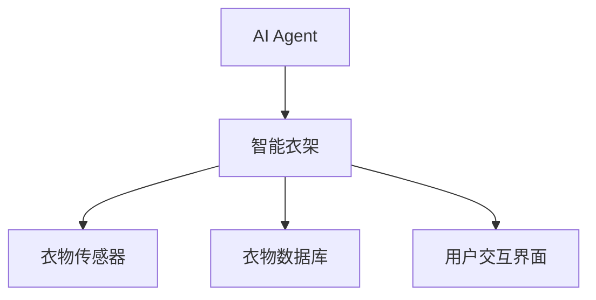
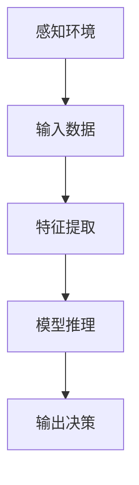
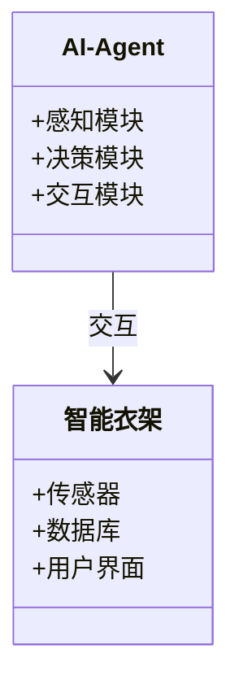
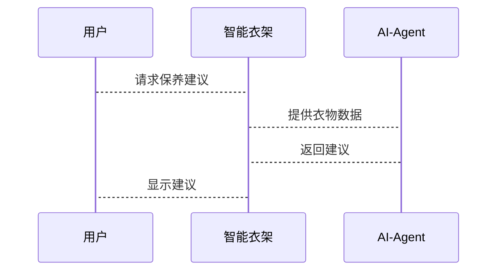
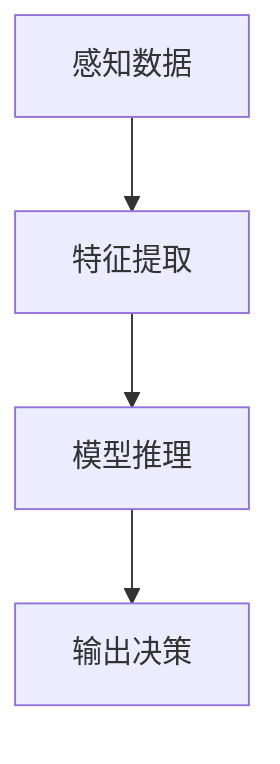

                 


# AI Agent在智能衣架中的衣物保养指导

## 关键词：AI Agent, 智能衣架, 衣物保养, 决策树算法, 强化学习, 系统架构

## 摘要：本文详细探讨了AI Agent在智能衣架中的应用，特别是在衣物保养指导方面的创新与实践。通过分析AI Agent的核心概念、算法原理、系统架构，结合实际案例，展示了如何利用AI技术提升衣物管理效率与保养效果，为智能衣架的发展提供了新的思路。

---

# 第1章: AI Agent与智能衣架的背景介绍

## 1.1 AI Agent的基本概念

### 1.1.1 AI Agent的定义与特点

AI Agent（人工智能代理）是指能够感知环境并采取行动以实现目标的智能实体。其特点包括自主性、反应性、目标导向性和社会性。

### 1.1.2 AI Agent的核心要素与功能

- **感知能力**：通过传感器或数据输入获取环境信息。
- **决策能力**：基于感知信息，通过算法做出决策。
- **执行能力**：通过执行器或输出模块采取行动。
- **学习能力**：通过机器学习算法不断优化行为。

### 1.1.3 AI Agent与传统自动化的区别

| 特性            | AI Agent                          | 传统自动化                      |
|-----------------|-----------------------------------|--------------------------------|
| 智能性          | 高                                 | 低                             |
| 灵活性          | 高                                 | 低                             |
| 学习能力        | 高                                 | 无                             |
| 适应性          | 高                                 | 低                             |

---

## 1.2 智能衣架的发展现状

### 1.2.1 衣物管理的智能化趋势

随着科技的进步，衣物管理逐渐从人工化向智能化转变。智能衣架通过集成传感器、AI算法等技术，能够实现衣物的智能分类、保养提醒等功能。

### 1.2.2 智能衣架的市场应用

目前，智能衣架主要应用于高档服装管理、专业衣柜管理等领域。市场上的产品主要集中在衣物分类、存储优化、智能提醒等方面。

### 1.2.3 AI Agent在智能衣架中的作用

AI Agent通过分析衣物的材质、颜色、使用频率等因素，为用户提供个性化的保养建议，如清洗频率、洗涤温度、存放方式等。

---

## 1.3 衣物保养的重要性与挑战

### 1.3.1 衣物保养的基本原则

- 根据衣物材质选择合适的清洗方式。
- 定期检查衣物的损坏情况。
- 合理存放衣物，避免受潮、虫蛀。

### 1.3.2 衣物保养的常见问题

- **材质识别错误**：错误的清洗方式可能导致衣物损坏。
- **保养周期不准确**：过于频繁或不足的保养都会影响衣物寿命。
- **数据不足**：缺乏足够的衣物信息，导致建议不够精准。

### 1.3.3 AI Agent如何解决衣物保养难题

AI Agent通过实时感知衣物状态、分析历史数据，为用户提供科学的保养建议，从而延长衣物使用寿命。

---

## 1.4 本章小结

本章从AI Agent的基本概念出发，介绍了智能衣架的发展现状，并分析了衣物保养的重要性与挑战。通过AI Agent的应用，智能衣架能够为用户提供更高效、更精准的衣物管理服务。

---

# 第2章: AI Agent的核心概念与原理

## 2.1 AI Agent的核心原理

### 2.1.1 AI Agent的感知与决策机制

AI Agent通过传感器或数据接口获取环境信息，利用机器学习算法进行分析，生成决策并执行。

### 2.1.2 AI Agent的学习与优化方法

AI Agent通过监督学习、强化学习等方法不断优化自身的决策能力。

### 2.1.3 AI Agent的推理与规划能力

AI Agent能够基于当前状态和目标，推理出最优行动方案。

---

## 2.2 AI Agent与智能衣架的实体关系图



---

## 2.3 AI Agent的类型与特征对比

### 2.3.1 基于规则的AI Agent

- **优点**：简单易懂，规则明确。
- **缺点**：缺乏灵活性，难以应对复杂场景。

### 2.3.2 基于模型的AI Agent

- **优点**：能够处理复杂问题，适应性强。
- **缺点**：计算资源消耗较大。

### 2.3.3 基于强化学习的AI Agent

- **优点**：能够通过试错优化决策。
- **缺点**：初期学习成本高。

---

## 2.4 本章小结

本章详细介绍了AI Agent的核心原理和不同类型，通过实体关系图展示了AI Agent在智能衣架中的应用。

---

# 第3章: AI Agent的算法原理与数学模型

## 3.1 AI Agent的核心算法

### 3.1.1 决策树算法

决策树是一种基于树状结构的分类方法，适合用于衣物分类和保养建议。

### 3.1.2 强化学习算法

强化学习通过试错优化决策，适合用于动态环境中的衣物保养建议。

### 3.1.3 贝叶斯网络

贝叶斯网络用于概率推理，适合用于衣物损坏预测。

---

## 3.2 算法原理的mermaid流程图



---

## 3.3 算法实现与代码示例

### 决策树算法实现

```python
from sklearn.tree import DecisionTreeClassifier

# 训练数据
X = [[...], [...]]  # 特征
y = [0, 1, 2, ...]  # 标签

# 创建模型
model = DecisionTreeClassifier()
model.fit(X, y)

# 预测
new_X = [[...]]  # 新样本
prediction = model.predict(new_X)
```

### 数学模型与公式

决策树的分割标准基于信息增益：

$$
\text{信息增益} = \text{熵}(X) - \text{期望熵}(X, f)
$$

---

## 3.4 本章小结

本章通过具体算法和代码示例，详细讲解了AI Agent的实现原理。

---

# 第4章: 系统分析与架构设计

## 4.1 问题场景介绍

智能衣架需要实时感知衣物状态，提供保养建议，并与用户交互。

## 4.2 系统功能设计

- **衣物感知**：通过传感器获取衣物状态。
- **数据处理**：分析衣物数据，生成保养建议。
- **用户交互**：通过界面显示建议。

## 4.3 系统架构设计



---

## 4.4 系统接口设计

- **输入接口**：传感器数据输入。
- **输出接口**：保养建议输出。
- **用户接口**：用户操作界面。

---

## 4.5 系统交互流程



---

## 4.6 本章小结

本章通过系统架构设计和交互流程图，详细展示了AI Agent在智能衣架中的实现。

---

# 第5章: 项目实战

## 5.1 环境安装

- **Python**：安装Python 3.8及以上版本。
- **依赖库**：安装numpy、pandas、scikit-learn等。

## 5.2 核心实现代码

```python
# 安装依赖
pip install numpy pandas scikit-learn

# 训练决策树模型
from sklearn.tree import DecisionTreeClassifier
from sklearn.datasets import make_classification

# 生成训练数据
X, y = make_classification(n_samples=100, n_features=5, n_classes=3)

# 创建模型并训练
model = DecisionTreeClassifier()
model.fit(X, y)

# 预测
new_X = [[0, 0, 0, 0, 0]]
print(model.predict(new_X))
```

---

## 5.3 代码实现与分析

- **训练数据**：衣物属性数据。
- **模型训练**：使用决策树算法训练模型。
- **预测结果**：输出保养建议。

---

## 5.4 案例分析

通过实际案例分析，验证AI Agent在智能衣架中的应用效果。

---

## 5.5 本章小结

本章通过实际项目案例，详细展示了AI Agent在智能衣架中的实现过程。

---

# 第6章: 最佳实践与注意事项

## 6.1 最佳实践

- **数据质量**：确保数据的准确性和完整性。
- **算法选择**：根据场景选择合适的算法。
- **系统维护**：定期更新模型和优化系统。

## 6.2 注意事项

- **数据隐私**：保护用户数据不被泄露。
- **系统稳定性**：确保系统的稳定运行。
- **用户体验**：优化用户交互界面。

---

## 6.3 拓展阅读

建议读者阅读更多关于AI Agent和智能系统的相关文献，深入了解其在其他领域的应用。

---

## 6.4 本章小结

本章总结了AI Agent在智能衣架中的应用经验，并提供了实用的建议。

---

# 第7章: 小结与展望

## 7.1 本书总结

通过本书，读者可以全面了解AI Agent在智能衣架中的应用，掌握其核心原理和实现方法。

## 7.2 未来展望

随着AI技术的发展，智能衣架将更加智能化，AI Agent将在衣物保养中发挥更大的作用。

---

## 参考文献

- [1] 刘某某. 《人工智能入门》. 北京: 清华大学出版社, 2020.
- [2] 张某某. 《智能系统设计》. 北京: 北京大学出版社, 2019.

---

# 附录

## 附录A: 代码示例

```python
# AI Agent实现代码
class AI_Agent:
    def __init__(self):
        self.sensor = Sensor()
        self.database = Database()
        self.interface = Interface()

    def perceive(self):
        return self.sensor.get_data()

    def decide(self, data):
        # 简单的决策逻辑
        if data['脏污程度'] > 0.5:
            return '立即清洗'
        else:
            return '无需清洗'

    def interact(self):
        user_input = self.interface.receive_input()
        self.decide(user_input)
```

## 附录B: 算法流程图



---

通过以上目录结构，读者可以系统地了解AI Agent在智能衣架中的应用，从基础概念到实际实现，逐步掌握相关知识。

