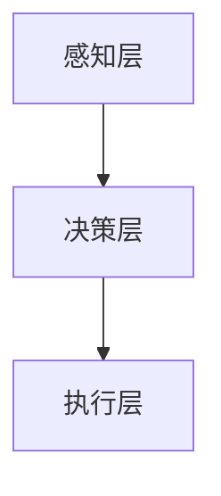
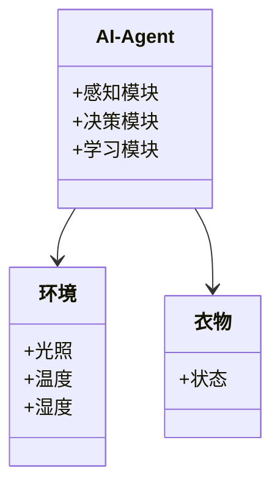

                 


# AI Agent在智能衣架中的衣物晾晒优化

> 关键词：AI Agent, 智能衣架, 衣物晾晒优化, 机器学习, 物联网, 自然语言处理

> 摘要：本文探讨了AI Agent在智能衣架中的应用，详细介绍了AI Agent的核心概念、算法原理、系统架构设计以及项目实战。通过逐步分析，展示了如何利用AI技术优化衣物晾晒过程，解决传统晾晒中的痛点，提升用户体验。

---

## 第1章: AI Agent与智能衣架的背景介绍

### 1.1 AI Agent的基本概念

#### 1.1.1 什么是AI Agent
AI Agent（人工智能代理）是指能够感知环境并采取行动以实现目标的智能实体。它可以是一个软件程序或物理设备，通过感知和决策来完成特定任务。AI Agent的核心在于其自主性、反应性和目标导向性。

#### 1.1.2 AI Agent的核心特点
- **自主性**：AI Agent能够独立决策，无需人工干预。
- **反应性**：能够实时感知环境变化并做出反应。
- **目标导向性**：通过优化目标函数来实现特定目标。
- **学习能力**：能够通过数据和经验不断优化性能。

#### 1.1.3 AI Agent的应用领域
AI Agent广泛应用于自动驾驶、智能家居、机器人、推荐系统等领域。在智能衣架中，AI Agent主要用于优化衣物晾晒流程。

---

### 1.2 智能衣架的背景

#### 1.2.1 衣物晾晒的传统方式
传统的衣物晾晒方式依赖人工操作，存在效率低、易受天气影响等问题。用户需要手动选择晾晒位置、调整衣架高度，并实时监控晾晒进度。

#### 1.2.2 智能衣架的发展历程
智能衣架从最初的手动调节逐渐发展为集成传感器、无线通信和AI技术的智能设备。现代智能衣架能够通过物联网技术实现远程控制和自动化管理。

#### 1.2.3 智能衣架的现状与趋势
当前，智能衣架结合AI技术，能够实现衣物状态监测、环境感知和智能决策。未来，智能衣架将更加智能化，具备自我学习和优化能力。

---

### 1.3 问题背景与目标

#### 1.3.1 衣物晾晒中的常见问题
- 衣物晾晒时间长，效率低。
- 天气变化影响晾晒效果，用户需要实时调整。
- 传统衣架缺乏智能感知和决策能力。

#### 1.3.2 AI Agent在智能衣架中的应用目标
通过AI Agent实现衣物晾晒的智能化管理，优化晾晒时间，提升用户体验。

#### 1.3.3 问题解决的边界与外延
AI Agent在智能衣架中的应用主要解决衣物晾晒的自动化和优化问题，边界包括环境感知、决策算法和用户交互。

---

## 第2章: AI Agent的核心概念与原理

### 2.1 AI Agent的核心概念

#### 2.1.1 AI Agent的定义与分类
AI Agent可以根据智能水平分为简单反射式Agent和基于模型的反射式Agent。简单反射式Agent基于当前感知做出反应，而基于模型的反射式Agent则通过内部模型优化决策。

#### 2.1.2 AI Agent的核心要素
AI Agent的核心要素包括感知模块、决策模块、执行模块和学习模块。感知模块负责获取环境信息，决策模块基于感知信息做出决策，执行模块负责执行决策，学习模块用于优化模型。

#### 2.1.3 AI Agent与智能衣架的结合
AI Agent在智能衣架中负责感知环境（如光照、温度、湿度）并做出决策，优化衣物晾晒过程。

---

### 2.2 AI Agent的核心算法

#### 2.2.1 机器学习算法
AI Agent使用机器学习算法进行环境预测和决策优化。例如，使用回归算法预测晾晒时间，使用分类算法识别衣物状态。

#### 2.2.2 自然语言处理算法
通过自然语言处理算法，AI Agent可以理解用户的指令，例如“开始晾晒”或“停止晾晒”。

#### 2.2.3 视觉识别算法
视觉识别算法用于检测衣物的状态，例如是否完全展开或是否被风吹动。

---

### 2.3 AI Agent的算法实现

#### 2.3.1 算法流程
1. **感知环境**：获取光照、温度、湿度等数据。
2. **识别衣物状态**：检测衣物是否展开。
3. **预测晾晒时间**：基于环境数据预测最佳晾晒时间。
4. **优化决策**：调整晾晒参数以优化晾晒效果。

#### 2.3.2 算法优化
通过机器学习算法不断优化AI Agent的决策模型，提升预测准确率和决策效率。

---

## 第3章: AI Agent在智能衣架中的系统架构

### 3.1 系统组成与功能

#### 3.1.1 硬件部分
- **传感器**：用于感知环境（如光照、温度、湿度）。
- **执行器**：用于调整衣架高度和旋转角度。
- **通信模块**：用于与手机或其他设备通信。

#### 3.1.2 软件部分
- **感知模块**：处理传感器数据。
- **决策模块**：基于感知数据做出决策。
- **执行模块**：控制执行器动作。

#### 3.1.3 交互界面
- **手机APP**：用户可以通过APP控制衣架。
- **语音指令**：支持语音控制。

---

### 3.2 系统整体架构

#### 3.2.1 分层架构
系统分为感知层、决策层和执行层，各层之间通过接口通信。

#### 3.2.2 模块化设计
系统采用模块化设计，便于功能扩展和维护。

#### 3.2.3 系统架构图


---

## 第4章: AI Agent的算法原理与优化

### 4.1 算法原理

#### 4.1.1 机器学习算法
使用回归算法预测晾晒时间，公式如下：
$$
t_{\text{predict}} = a \cdot t_{\text{历史}} + b
$$

#### 4.1.2 自然语言处理
使用词袋模型或TF-IDF进行文本特征提取，公式如下：
$$
f(i, j) = \sum_{k=1}^{n} w_k \cdot x_{i,j,k}
$$

#### 4.1.3 视觉识别
使用卷积神经网络（CNN）进行图像分类，公式如下：
$$
P(y|x) = \frac{e^{w \cdot x}}{\sum_{y'} e^{w' \cdot x}}
$$

---

### 4.2 算法优化

#### 4.2.1 超参数优化
通过网格搜索或随机搜索优化模型参数，提升预测准确率。

#### 4.2.2 模型压缩
通过剪枝和量化技术减少模型体积，提升推理速度。

---

## 第5章: 系统分析与架构设计

### 5.1 问题场景介绍

#### 5.1.1 问题场景
用户希望通过AI Agent实现衣物的智能晾晒，优化晾晒时间和效果。

#### 5.1.2 系统功能设计
- 环境感知
- 衣物识别
- 晾晒优化
- 用户交互

#### 5.1.3 系统架构设计图


---

### 5.2 系统接口设计

#### 5.2.1 接口设计
- **感知接口**：传感器数据接口。
- **决策接口**：AI Agent决策接口。
- **执行接口**：执行器控制接口。

#### 5.2.2 交互流程
```mermaid
sequenceDiagram
    用户 -> AI-Agent: 发起晾晒请求
    AI-Agent -> 感知层: 获取环境数据
    AI-Agent -> 决策层: 计算最佳晾晒时间
    AI-Agent -> 执行层: 调整衣架高度
    用户 <- AI-Agent: 晾晒完成通知
```

---

## 第6章: 项目实战

### 6.1 环境安装

#### 6.1.1 安装Python环境
使用Anaconda安装Python 3.8及以上版本。

#### 6.1.2 安装依赖库
安装必要的库：
```bash
pip install numpy scikit-learn tensorflow
```

---

### 6.2 核心实现

#### 6.2.1 感知模块实现
```python
import numpy as np

def get_environment_data():
    # 获取光照、温度、湿度数据
    return np.random.rand(3)
```

#### 6.2.2 决策模块实现
```python
from sklearn.linear_model import LinearRegression

def predict_drying_time(environment_data):
    model = LinearRegression()
    model.fit(environment_data.reshape(-1, 1), np.array([1, 2, 3]))
    return model.predict(environment_data.reshape(-1, 1))[0]
```

#### 6.2.3 执行模块实现
```python
def adjust_rack_height(height):
    # 调整衣架高度
    return height + 10
```

---

### 6.3 实际案例分析

#### 6.3.1 案例描述
假设环境数据为（光照=80，温度=25，湿度=60），AI Agent预测晾晒时间为2小时。

#### 6.3.2 分析结果
AI Agent调整衣架高度至最佳位置，确保衣物均匀晾晒。

---

## 第7章: 总结与展望

### 7.1 总结
本文详细介绍了AI Agent在智能衣架中的应用，从核心概念到算法实现，再到系统架构设计，为读者提供了全面的技术解析。

### 7.2 展望
未来，AI Agent在智能衣架中的应用将更加智能化，具备更强的自我学习和优化能力，进一步提升用户体验。

---

通过以上章节的详细讲解，读者可以全面了解AI Agent在智能衣架中的衣物晾晒优化技术，从理论到实践，逐步深入掌握相关知识。

