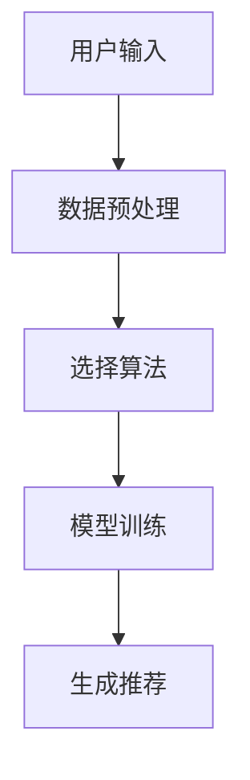
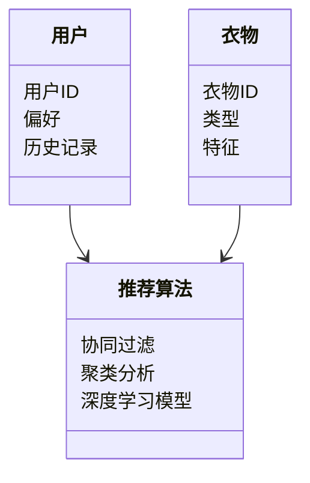
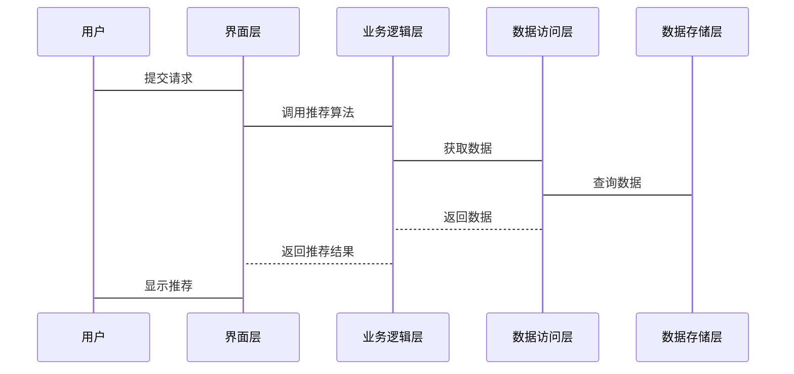

                 


# AI Agent在智能衣柜中的衣物搭配建议

---

## 关键词：
AI Agent, 智能衣柜, 衣物搭配, 人工智能, 推荐算法, 系统架构, 项目实战

---

## 摘要：
本文探讨了AI Agent在智能衣柜中的应用，重点分析了衣物搭配的核心算法、系统架构设计以及实际项目实现。通过协同过滤、聚类分析和深度学习算法，AI Agent能够根据用户的偏好和衣物特性提供个性化推荐，提升用户体验。文章详细讲解了算法原理、系统设计和代码实现，为读者提供了从理论到实践的全面指导。

---

# 第一部分: AI Agent在智能衣柜中的背景与概念

## 第1章: 问题背景与描述

### 1.1 问题背景
在现代社会，用户在面对衣柜时常常面临搭配困难，尤其是在处理大量衣物时，难以快速找到合适的组合。传统衣柜管理方式效率低下，用户需要花费大量时间挑选衣物，且无法有效利用季节性变化和时尚趋势。

### 1.2 问题描述
AI Agent在智能衣柜中的应用旨在解决以下问题：
- 用户无法高效找到合适的衣物搭配。
- 衣物搭配缺乏个性化，无法满足用户的多样化需求。
- 缺乏对衣物特性的智能分析，如颜色、材质和场合。

### 1.3 问题解决思路
AI Agent通过分析用户的偏好和衣物数据，提供智能化的搭配建议。其核心功能包括：
- 数据收集与处理：收集用户的喜好和衣物信息。
- 智能推荐：基于算法生成搭配建议。
- 用户反馈：根据用户反馈优化推荐结果。

### 1.4 问题的边界与外延
AI Agent的功能边界包括基本搭配建议、时尚趋势推荐和季节性搭配。其外延则包括扩展到更多场景，如职场着装和特殊场合搭配。

---

## 第2章: AI Agent的核心概念与原理

### 2.1 AI Agent的基本原理
AI Agent通过数据驱动的方法，利用机器学习算法进行模式识别和预测。其工作原理包括数据预处理、模型训练和结果输出。

### 2.2 AI Agent在衣物搭配中的应用
- 用户需求分析：通过问卷和历史记录收集用户偏好。
- 数据收集与处理：整理衣物数据，提取特征。
- 智能推荐算法：使用协同过滤、聚类分析和深度学习模型生成推荐。

### 2.3 AI Agent的核心算法
- 协同过滤算法：基于用户相似性推荐。
- 聚类分析：根据衣物特征分组。
- 深度学习模型：利用神经网络预测搭配。

### 2.4 AI Agent的实现流程
- 数据预处理：清洗和归一化。
- 模型训练：选择合适的算法并进行参数调优。
- 结果输出：生成推荐列表并展示。

---

# 第二部分: 衣物搭配算法原理

## 第3章: 衣物搭配算法原理

### 3.1 协同过滤算法
- 基于用户的协同过滤：分析用户行为相似性。
- 基于物品的协同过滤：分析衣物相似性。
- 混合协同过滤：结合用户和物品特征。

### 3.2 聚类分析算法
- K-means聚类：划分衣物类别。
- 层次聚类：逐步合并衣物相似性。
- DBSCAN聚类：识别密度较高的区域。

### 3.3 基于深度学习的推荐算法
- 基于神经网络的推荐：利用卷积神经网络提取特征。
- 基于Transformer的推荐：处理序列数据。
- 图神经网络推荐：分析衣物之间的关系。

### 3.4 算法流程图


---

## 第4章: 系统架构设计

### 4.1 问题场景介绍
智能衣柜系统需要处理用户请求、分析数据并生成推荐。

### 4.2 领域模型


### 4.3 系统架构图


### 4.4 接口设计
- 用户接口：接收输入并展示结果。
- 数据接口：与数据库交互。

### 4.5 交互流程图


---

## 第5章: 项目实战

### 5.1 环境安装
- Python 3.8+
- 安装必要的库：numpy, pandas, scikit-learn, tensorflow。

### 5.2 核心代码实现
```python
from sklearn.metrics.pairwise import cosine_similarity

def collaborative_filtering(user_data):
    user_similarity = cosine_similarity(user_data)
    return user_similarity
```

### 5.3 代码解读与分析
- 使用协同过滤算法计算用户相似性矩阵。
- 根据相似性推荐衣物。

### 5.4 实际案例分析
- 用户A偏好休闲风格，系统推荐搭配牛仔裤和T恤。

### 5.5 项目小结
项目展示了AI Agent在智能衣柜中的实际应用，实现了从数据处理到推荐生成的完整流程。

---

## 第6章: 最佳实践与小结

### 6.1 最佳实践
- 定期更新衣物数据和用户偏好。
- 结合用户反馈优化推荐算法。

### 6.2 小结
AI Agent通过智能化的推荐算法，显著提升了衣物搭配的效率和个性化体验。

### 6.3 注意事项
- 数据隐私保护：确保用户数据安全。
- 算法可解释性：便于用户理解推荐结果。

### 6.4 拓展阅读
建议深入学习推荐系统和深度学习模型，探索更多AI技术在时尚领域的应用。

---

## 总结
本文详细探讨了AI Agent在智能衣柜中的应用，从背景分析到系统设计，再到项目实战，为读者提供了全面的指导。通过理论与实践的结合，展示了如何利用AI技术提升衣物搭配的效率和个性化体验。

