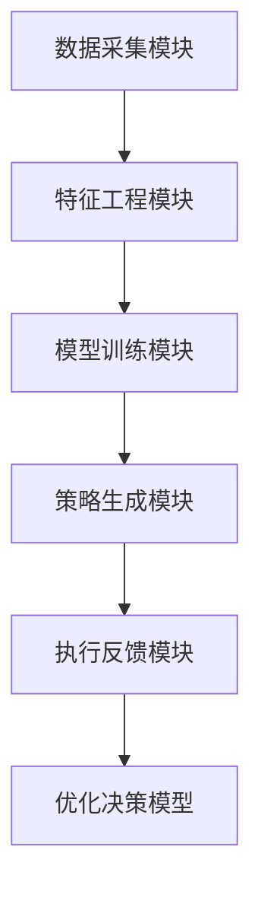

                 


# AI Agent在智能金融市场分析中的应用

## 关键词：AI Agent、智能金融、市场分析、算法交易、机器学习、深度学习、强化学习

## 摘要：  
AI Agent（人工智能代理）在智能金融市场分析中的应用，结合了先进的人工智能技术与复杂的金融市场数据，通过高效的数据处理、智能决策和自动化交易，为投资者和金融机构提供了全新的工具和方法。本文从AI Agent的核心原理出发，分析其在金融市场中的应用价值，探讨其在数据处理、算法交易、风险管理等领域的实际应用，并结合具体案例，展示AI Agent在智能金融市场分析中的优势与挑战。通过对AI Agent在金融市场的应用进行全面解析，本文旨在为读者提供一个全面的理解和实践指南。

---

## 第1章: AI Agent与智能金融市场的背景介绍

### 1.1 AI Agent的基本概念与特点

#### 1.1.1 AI Agent的定义  
AI Agent（人工智能代理）是指能够感知环境、自主决策并执行任务的智能系统。它通过接收输入数据（如金融市场数据），利用算法进行分析和推理，输出决策结果（如买入或卖出股票）。

#### 1.1.2 AI Agent的特点  
1. **自主性**：能够在没有人工干预的情况下自主运行。  
2. **反应性**：能够实时感知市场变化并做出响应。  
3. **学习能力**：通过机器学习算法不断优化自身的决策模型。  
4. **可扩展性**：能够处理大规模数据并适应复杂的金融市场环境。  

#### 1.1.3 AI Agent的核心功能  
1. **数据处理**：从金融市场中提取、清洗和转换数据。  
2. **决策制定**：基于数据和模型生成投资策略。  
3. **执行操作**：根据决策结果执行交易操作。  

### 1.2 金融市场的复杂性与挑战

#### 1.2.1 金融市场的数据特征  
1. **高维性**：金融市场数据通常包含数千个变量（如股票价格、成交量、市场指数等）。  
2. **时序性**：数据具有时间依赖性，价格变化往往受到历史数据的影响。  
3. **不确定性**：市场价格受多种不可预测的因素影响，如政策变化、突发事件等。  

#### 1.2.2 金融市场的核心问题  
1. **价格预测**：准确预测股票或其他金融资产的价格走势。  
2. **风险管理**：识别和量化市场风险，制定有效的风险管理策略。  
3. **投资组合优化**：通过算法优化投资组合，实现收益与风险的最佳平衡。  

#### 1.2.3 传统金融分析的局限性  
1. **人工分析的低效性**：依赖人工分析会导致效率低下，难以应对海量数据。  
2. **主观性**：人为判断容易受到情绪影响，导致决策失误。  
3. **实时性不足**：传统方法难以实现高频交易和实时决策。  

---

## 第2章: AI Agent的核心原理与算法

### 2.1 AI Agent的核心原理

#### 2.1.1 数据处理与特征提取  
AI Agent在金融市场分析中，首先需要对数据进行清洗和特征提取。例如，可以从股票价格数据中提取以下特征：  
- 移动平均线（MA）：用于衡量价格趋势。  
- 相对强弱指数（RSI）：用于判断市场超买或超卖状态。  
- 布林带（Bollinger Bands）：用于衡量价格波动范围。  

#### 2.1.2 智能决策模型  
AI Agent的核心在于决策模型的设计。常用的决策模型包括：  
1. **机器学习模型**：如线性回归、支持向量机（SVM）、随机森林等。  
2. **深度学习模型**：如卷积神经网络（CNN）、长短时记忆网络（LSTM）等。  
3. **强化学习模型**：通过试错机制优化决策策略。  

#### 2.1.3 决策执行与反馈  
AI Agent在做出决策后，需要通过交易系统执行操作，并根据市场反馈不断优化自身的决策模型。

---

### 2.2 常见算法及其在金融市场中的应用

#### 2.2.1 机器学习算法  
1. **线性回归**  
   线性回归是一种简单而强大的预测模型，适用于线性关系的数据。其数学表达式为：  
   $$ y = \beta_0 + \beta_1x + \epsilon $$  
   其中，$y$ 是目标变量，$x$ 是自变量，$\beta_0$ 和 $\beta_1$ 是回归系数，$\epsilon$ 是误差项。  

2. **支持向量机（SVM）**  
   SVM适用于分类和回归问题，尤其在处理小样本数据时表现优异。其核心思想是通过寻找最优超平面，将数据分为不同类别。  

#### 2.2.2 深度学习算法  
1. **LSTM（长短时记忆网络）**  
   LSTM用于处理时间序列数据，特别适合股票价格预测。其核心在于引入记忆单元，能够捕捉长期依赖关系。  

2. **卷积神经网络（CNN）**  
   CNN常用于图像识别和时间序列分析，可以通过卷积操作提取数据中的特征。  

#### 2.2.3 强化学习算法  
1. **Q-Learning**  
   Q-Learning是一种基于值函数的强化学习算法，适用于离散动作空间的决策问题。其目标是通过不断试错，找到最优策略。  

---

## 第3章: AI Agent在金融市场中的实际应用

### 3.1 算法交易与自动化决策

#### 3.1.1 算法交易的定义与优势  
算法交易是指通过算法自动执行交易决策。其优势包括：  
1. **高效性**：能够在毫秒级别完成交易决策。  
2. **准确性**：通过模型优化提高交易决策的准确性。  
3. **可扩展性**：能够同时处理多个市场和资产的交易。  

#### 3.1.2 AI Agent在算法交易中的应用  
AI Agent可以用于以下场景：  
1. **高频交易**：通过算法快速捕捉市场机会。  
2. **套利交易**：利用价格差异进行无风险或低风险套利。  
3. **趋势跟踪**：基于技术指标进行趋势预测。  

---

### 3.2 风险管理与投资组合优化

#### 3.2.1 风险管理的定义与重要性  
风险管理是指通过识别、评估和控制风险，降低投资损失的过程。  

#### 3.2.2 AI Agent在风险管理中的应用  
AI Agent可以通过以下方式优化风险管理：  
1. **风险量化**：利用统计模型量化投资组合的波动性风险。  
2. **情景分析**：通过模拟不同市场环境下的投资组合表现，评估其风险承受能力。  
3. **实时监控**：实时监控市场波动，及时发现潜在风险。  

---

### 3.3 投资组合优化与收益最大化

#### 3.3.1 投资组合优化的定义与目标  
投资组合优化是指通过科学配置资产，实现收益与风险的最佳平衡。  

#### 3.3.2 AI Agent在投资组合优化中的应用  
AI Agent可以通过以下方式优化投资组合：  
1. **资产配置**：根据市场预测结果，动态调整资产配置比例。  
2. **风险分散**：通过多样化投资降低组合风险。  
3. **动态再平衡**：根据市场变化，定期调整投资组合。  

---

## 第4章: AI Agent系统的架构设计

### 4.1 系统架构概述

#### 4.1.1 系统功能模块  
AI Agent系统通常包含以下功能模块：  
1. **数据采集模块**：从金融市场获取实时数据。  
2. **特征工程模块**：对数据进行清洗和特征提取。  
3. **模型训练模块**：利用机器学习或深度学习算法训练模型。  
4. **策略生成模块**：基于模型预测结果生成交易策略。  
5. **执行反馈模块**：根据市场反馈优化决策模型。  

#### 4.1.2 系统架构图  


---

## 第5章: AI Agent在金融市场分析中的实际案例

### 5.1 案例背景与目标

#### 5.1.1 案例背景  
本文以股票价格预测为例，展示AI Agent在金融市场分析中的实际应用。  

#### 5.1.2 案例目标  
通过构建一个基于LSTM的股票价格预测模型，实现对某只股票的短期价格预测。

---

### 5.2 系统实现

#### 5.2.1 环境配置  
需要安装以下工具和库：  
1. Python 3.8+  
2. NumPy、Pandas、Matplotlib  
3. TensorFlow或Keras  

#### 5.2.2 数据预处理  
从Yahoo Finance获取股票历史数据，包括开盘价、收盘价、最高价、最低价和成交量。  

#### 5.2.3 模型训练  
使用LSTM模型进行训练，代码如下：  

```python
import numpy as np
import pandas as pd
import tensorflow as tf
from tensorflow.keras.layers import LSTM, Dense, Dropout
from tensorflow.keras.models import Sequential

# 加载数据
data = pd.read_csv('stock_prices.csv')
features = data[['open', 'high', 'low', 'close', 'volume']]
labels = data['close']

# 数据分割
train_features = features[:-100]
train_labels = labels[:-100]
test_features = features[-100:]
test_labels = labels[-100:]

# 模型构建
model = Sequential()
model.add(LSTM(64, input_shape=(None, 5)))
model.add(Dropout(0.2))
model.add(Dense(1))
model.compile(optimizer='adam', loss='mean_squared_error')

# 模型训练
model.fit(train_features, train_labels, epochs=10, batch_size=32)
```

#### 5.2.4 模型预测与结果分析  
使用训练好的模型对测试数据进行预测，并比较预测结果与实际价格的差异。  

---

## 第6章: AI Agent系统的优化与展望

### 6.1 系统优化策略

#### 6.1.1 模型优化  
1. **超参数调整**：通过网格搜索或随机搜索优化模型参数。  
2. **模型融合**：结合多种模型的结果，提高预测精度。  

#### 6.1.2 系统性能优化  
1. **并行计算**：利用GPU加速模型训练和预测。  
2. **数据流优化**：通过数据预处理减少计算开销。  

---

## 第7章: 总结与展望

### 7.1 总结  
AI Agent在智能金融市场分析中的应用，为投资者和金融机构提供了强大的工具和方法。通过高效的数据处理、智能决策和自动化交易，AI Agent能够显著提高金融分析的效率和准确性。

### 7.2 展望  
随着人工智能技术的不断进步，AI Agent在金融市场中的应用将更加广泛。未来的研究方向包括：  
1. **强化学习的应用**：探索强化学习在复杂金融环境中的应用。  
2. **多模态数据融合**：结合文本、图像等多种数据源，提高预测精度。  
3. **可解释性研究**：增强AI Agent的可解释性，满足监管要求。  

---

## 参考文献  
（此处列出相关的书籍、论文和技术文档）  

---

通过以上内容，读者可以全面了解AI Agent在智能金融市场分析中的应用，从基础理论到实际案例，再到系统优化与未来展望，为从事相关研究和实践提供了有价值的参考。

