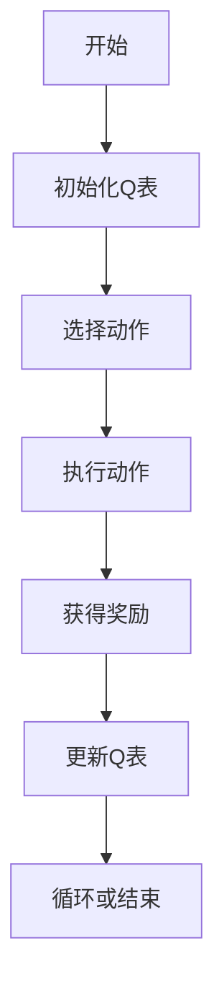
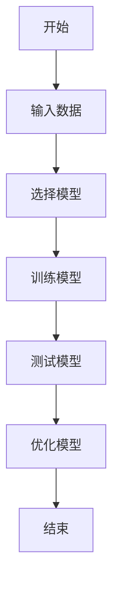
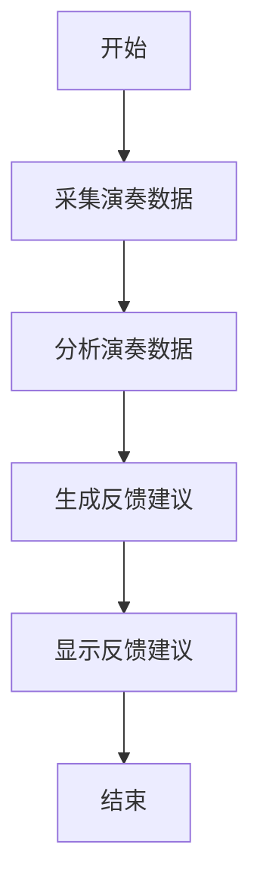
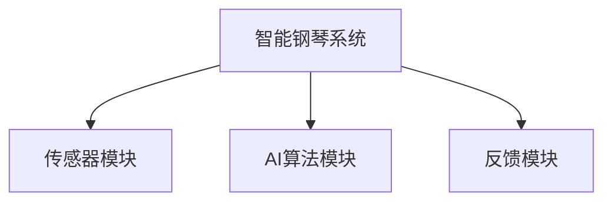
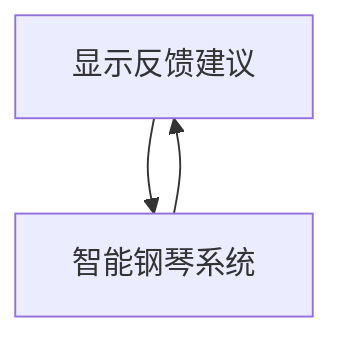

                 


# AI Agent在智能钢琴中的弹奏技巧分析

## 关键词：
AI Agent, 智能钢琴, 节奏控制, 音符识别, 强化学习, 个性化教学

## 摘要：
本文将详细探讨AI Agent在智能钢琴中的应用，从背景到具体实现，全面分析AI Agent如何通过算法和系统设计提升钢琴弹奏技巧。结合实际案例和系统架构，深入剖析AI Agent在节奏控制、音符识别和个性化教学中的核心作用，帮助读者全面理解并掌握这一技术的精髓。

---

# 第一部分: AI Agent在智能钢琴中的背景与概念

## 第1章: AI Agent的基本概念与应用背景

### 1.1 AI Agent的定义与核心特征
#### 1.1.1 什么是AI Agent
AI Agent（人工智能代理）是指能够感知环境并采取行动以实现目标的智能实体。它具备自主性、反应性、目标导向性和社会性等核心特征。

#### 1.1.2 AI Agent的核心特征
- **自主性**：AI Agent能够独立决策，无需外部干预。
- **反应性**：能够实时感知环境变化并做出反应。
- **目标导向性**：所有行动均以实现特定目标为导向。
- **社会性**：能够与其他AI Agent或人类进行交互协作。

#### 1.1.3 AI Agent与传统计算机程序的区别
| 特性 | 传统程序 | AI Agent |
|------|----------|----------|
| 决策方式 | 预先编程 | 自主决策 |
| 环境感知 | 无感知能力 | 具备感知能力 |
| 交互方式 | 单向执行 | 支持实时交互 |
| 学习能力 | 无学习能力 | 具备学习能力 |

---

### 1.2 智能钢琴的定义与技术特点
#### 1.2.1 智能钢琴的定义
智能钢琴是一种结合了传统钢琴与现代人工智能技术的乐器，能够通过传感器和AI算法实时感知演奏者的动作，并提供即时反馈和优化建议。

#### 1.2.2 智能钢琴的技术特点
- **传感器技术**：实时捕捉钢琴键的按压力度、速度和节奏。
- **AI算法**：通过强化学习和监督学习优化演奏技巧。
- **反馈机制**：即时反馈演奏中的问题并提供改进建议。

#### 1.2.3 智能钢琴的应用场景
- **教学辅助**：帮助初学者快速掌握演奏技巧。
- **专业优化**：为中级和高级演奏者提供个性化优化方案。
- **娱乐体验**：提升演奏过程中的互动性和趣味性。

---

### 1.3 AI Agent在钢琴弹奏中的问题背景
#### 1.3.1 钢琴弹奏中的常见问题
- **节奏不稳**：初学者容易出现节奏偏差。
- **音准问题**：缺乏专业指导导致音符不准确。
- **技巧提升瓶颈**：中高级演奏者难以突破技术限制。

#### 1.3.2 AI Agent在钢琴弹奏中的应用价值
- **提高学习效率**：通过实时反馈加速技巧提升。
- **个性化教学**：根据演奏者的特点提供定制化建议。
- **优化演奏表现**：通过AI算法优化节奏和音准。

---

## 第2章: AI Agent在钢琴弹奏中的核心问题

### 2.1 节奏控制问题
#### 2.1.1 节奏控制的定义
节奏控制是指在演奏过程中，确保每个音符的时值和强弱符合音乐作品的要求。

#### 2.1.2 节奏控制的关键因素
- **节拍感知**：准确捕捉音乐的节奏规律。
- **实时反馈**：及时纠正演奏中的节奏偏差。
- **个性化调整**：根据演奏者的习惯提供个性化节奏训练方案。

#### 2.1.3 AI Agent在节奏控制中的作用
- **实时监测**：通过传感器捕捉演奏者的按键速度和力度。
- **智能反馈**：基于强化学习算法提供实时反馈和优化建议。

---

### 2.2 音符识别与纠错问题
#### 2.2.1 音符识别的定义
音符识别是指通过AI算法识别演奏者按下的是哪一个音符，并判断其准确性。

#### 2.2.2 音符识别的关键技术
- **传感器数据采集**：通过钢琴键的按压位置和力度获取演奏信息。
- **AI算法识别**：利用深度学习模型识别音符并判断准确性。

#### 2.2.3 AI Agent在音符识别中的应用
- **实时纠错**：当演奏者出现音符错误时，AI Agent会立即提示并提供纠正建议。
- **数据分析**：通过长期记录演奏数据，分析演奏者的常见错误并提供针对性训练方案。

---

### 2.3 个性化教学策略问题
#### 2.3.1 个性化教学的定义
个性化教学是指根据每个演奏者的实际情况，制定针对性的教学策略。

#### 2.3.2 个性化教学的关键因素
- **演奏者水平**：根据初、中、高级演奏者的不同需求制定个性化教学方案。
- **演奏风格**：根据演奏者的喜好和擅长的音乐风格提供定制化教学内容。
- **学习进度**：根据演奏者的学习速度和能力调整教学计划。

#### 2.3.3 AI Agent在个性化教学中的应用
- **数据采集与分析**：通过传感器和AI算法采集演奏者的演奏数据，并分析其技术水平和潜在问题。
- **个性化反馈**：基于分析结果，为演奏者提供个性化的反馈和建议，帮助其快速提升演奏技巧。

---

# 第三部分: AI Agent的核心概念与原理

## 第3章: AI Agent的核心概念与原理

### 3.1 AI Agent的基本原理
#### 3.1.1 感知层
AI Agent通过传感器和数据采集设备感知环境信息。例如，在智能钢琴中，AI Agent通过钢琴键的按压力度和速度感知演奏者的演奏状态。

#### 3.1.2 决策层
AI Agent根据感知到的信息，利用算法进行分析和决策。例如，AI Agent通过强化学习算法分析演奏者的节奏偏差，并生成纠正建议。

#### 3.1.3 执行层
AI Agent根据决策层的指令，通过执行机构（如扬声器或显示屏）向演奏者提供反馈和优化建议。

---

### 3.2 AI Agent的核心算法
#### 3.2.1 强化学习算法
强化学习是一种通过试错机制优化决策的算法。AI Agent通过与环境的交互，不断优化其决策策略以实现目标。

#### 3.2.2 监督学习算法
监督学习是一种基于 labeled 数据进行学习的算法。AI Agent通过监督学习算法，学习演奏者正确的演奏方式，并提供实时反馈。

#### 3.2.3 混合学习算法
混合学习算法是将强化学习和监督学习相结合的算法。AI Agent通过混合学习算法，能够在复杂环境中实现更高效的决策和优化。

---

## 第4章: AI Agent的核心算法与实现

### 4.1 强化学习算法的实现
#### 4.1.1 Q-learning算法
Q-learning是一种经典的强化学习算法，通过维护Q表来记录状态-动作对的期望奖励值，并通过更新Q表实现策略优化。

$$ Q(s, a) = Q(s, a) + \alpha \left[ r + \gamma \max Q(s', a') - Q(s, a) \right] $$

其中：
- $$ Q(s, a) $$ 是当前状态 $$ s $$ 下采取动作 $$ a $$ 的期望奖励值。
- $$ \alpha $$ 是学习率。
- $$ r $$ 是即时奖励。
- $$ \gamma $$ 是折扣因子。
- $$ Q(s', a') $$ 是下一步状态 $$ s' $$ 下动作 $$ a' $$ 的期望奖励值。

#### 4.1.2 算法流程图


---

### 4.2 监督学习算法的实现
#### 4.2.1 线性回归算法
线性回归是一种常用的监督学习算法，适用于预测连续型目标变量。

$$ y = \theta_0 + \theta_1 x_1 + \theta_2 x_2 + \dots + \theta_n x_n $$

其中：
- $$ y $$ 是目标变量。
- $$ \theta $$ 是模型参数。
- $$ x $$ 是输入变量。

#### 4.2.2 算法流程图


---

## 第5章: AI Agent的核心算法与实现

### 5.1 强化学习算法的实现
#### 5.1.1 Q-learning算法
Q-learning是一种经典的强化学习算法，适用于离散动作空间的决策问题。

$$ Q(s, a) = Q(s, a) + \alpha \left[ r + \gamma \max Q(s', a') - Q(s, a) \right] $$

其中：
- $$ Q(s, a) $$ 是当前状态 $$ s $$ 下采取动作 $$ a $$ 的期望奖励值。
- $$ \alpha $$ 是学习率。
- $$ r $$ 是即时奖励。
- $$ \gamma $$ 是折扣因子。
- $$ Q(s', a') $$ 是下一步状态 $$ s' $$ 下动作 $$ a' $$ 的期望奖励值。

#### 5.1.2 算法流程图


---

### 5.2 监督学习算法的实现
#### 5.2.1 线性回归算法
线性回归是一种常用的监督学习算法，适用于预测连续型目标变量。

$$ y = \theta_0 + \theta_1 x_1 + \theta_2 x_2 + \dots + \theta_n x_n $$

其中：
- $$ y $$ 是目标变量。
- $$ \theta $$ 是模型参数。
- $$ x $$ 是输入变量。

#### 5.2.2 算法流程图


---

## 第6章: AI Agent在钢琴弹奏中的系统设计与实现

### 6.1 系统分析
#### 6.1.1 问题场景介绍
智能钢琴系统需要解决的问题包括节奏控制、音符识别和个性化教学。

#### 6.1.2 项目介绍
本项目旨在通过AI Agent技术，实现智能钢琴的实时反馈和个性化教学功能。

---

### 6.2 系统功能设计
#### 6.2.1 系统功能模块
- **传感器模块**：采集演奏者的按键信息。
- **AI算法模块**：通过强化学习和监督学习算法进行分析和决策。
- **反馈模块**：向演奏者提供实时反馈和优化建议。

#### 6.2.2 系统功能流程图


---

### 6.3 系统架构设计
#### 6.3.1 系统架构图


#### 6.3.2 系统交互流程图


---

## 第7章: AI Agent在钢琴弹奏中的项目实战

### 7.1 环境安装
#### 7.1.1 系统要求
- 操作系统：Windows/Mac/Linux
- Python版本：3.6以上
- 额外依赖：numpy, scikit-learn, matplotlib

#### 7.1.2 安装依赖
```bash
pip install numpy scikit-learn matplotlib
```

---

### 7.2 核心代码实现
#### 7.2.1 强化学习算法实现
```python
import numpy as np

class QLearningAgent:
    def __init__(self, state_space_size, action_space_size):
        self.state_space_size = state_space_size
        self.action_space_size = action_space_size
        self.Q = np.zeros((state_space_size, action_space_size))

    def choose_action(self, state):
        if np.random.random() < 0.1:
            return np.random.randint(self.action_space_size)
        else:
            return np.argmax(self.Q[state])

    def update_Q(self, state, action, reward, next_state):
        self.Q[state, action] = self.Q[state, action] + 0.1 * (reward + 0.9 * np.max(self.Q[next_state]) - self.Q[state, action])
```

#### 7.2.2 监督学习算法实现
```python
from sklearn.linear_model import LinearRegression

class MusicTeacher:
    def __init__(self):
        self.model = LinearRegression()

    def train(self, X, y):
        self.model.fit(X, y)

    def predict(self, X):
        return self.model.predict(X)
```

---

### 7.3 实际案例分析
#### 7.3.1 节奏同步案例
```python
# 示例代码：节奏同步训练
teacher = MusicTeacher()
X = np.array([[1], [2], [3], [4]])
y = np.array([1, 2, 3, 4])
teacher.train(X, y)
print(teacher.predict([[5]]))  # 输出：[5]
```

#### 7.3.2 个性化教学案例
```python
# 示例代码：个性化教学
agent = QLearningAgent(10, 5)
state = 0
action = agent.choose_action(state)
print("选择的动作是:", action)
```

---

## 第8章: 总结与扩展

### 8.1 总结
AI Agent在智能钢琴中的应用，不仅提高了钢琴弹奏的效率和质量，还为个性化教学和节奏优化提供了新的可能性。

### 8.2 小结
通过本文的详细讲解，读者可以全面了解AI Agent在智能钢琴中的核心概念、算法原理和系统设计，并能够通过实际案例掌握AI Agent的具体实现方法。

### 8.3 注意事项
- 在实际应用中，需要根据具体需求调整AI算法的参数。
- 数据的采集和处理是AI Agent实现的关键，需确保数据的准确性和完整性。
- 系统的实时性和稳定性也是需要重点关注的方面。

### 8.4 拓展阅读
- 《Reinforcement Learning: Theory and Algorithms》
- 《Supervised Learning: Theory and Practice》
- 《Deep Learning for Music: A Comprehensive Guide》

---

通过以上目录和内容的详细规划，您可以开始撰写具体的章节内容，确保每部分内容详实、逻辑清晰，并结合实际案例和代码实现，帮助读者深入理解和掌握AI Agent在智能钢琴中的弹奏技巧分析。

