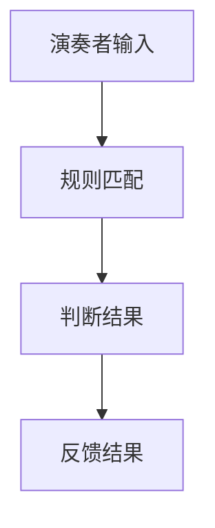
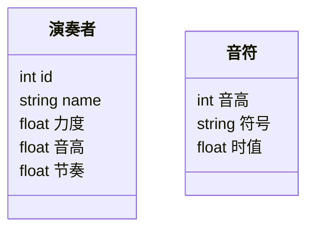

                 


# AI Agent在智能钢琴中的演奏技巧指导

**关键词**：AI Agent，智能钢琴，演奏技巧，人工智能，音乐教育，技术指导

**摘要**：本篇文章详细探讨了AI Agent在智能钢琴演奏技巧指导中的应用，结合技术背景和实际案例，分析了AI Agent如何通过感知、决策和执行机制提升钢琴演奏水平。文章从AI Agent的基本概念到系统架构设计，再到项目实战，全面解析了AI Agent在智能钢琴中的技术实现和实际应用，为音乐爱好者和科技爱好者提供了深入的技术指导和实践参考。

---

## 第一部分: AI Agent与智能钢琴演奏技巧的背景介绍

## 第2章: AI Agent的核心概念与原理

### 2.1 AI Agent的基本原理

#### 2.1.1 AI Agent的感知机制
AI Agent通过多种传感器和输入设备（如麦克风、压力传感器、键盘输入）感知钢琴演奏中的音符、力度、节奏和音色等信息。感知机制包括：
- **声音信号处理**：通过FFT（快速傅里叶变换）分析音高、音强和音色。
- **触键力度检测**：使用压力传感器检测键压力度，捕捉演奏者的触键习惯。
- **节奏识别**：通过时间戳分析演奏者的节奏准确性和流畅性。

**公式示例**：声音信号处理中的FFT算法：
$$
X(f) = \sum_{n=0}^{N-1} x(n) \cdot e^{-j2\pi f n / N}
$$

#### 2.1.2 AI Agent的决策机制
AI Agent根据感知到的信息进行分析和决策，主要采用以下方法：
- **基于规则的推理**：根据预设规则判断演奏技巧，如“连奏时手指保持贴键”。
- **基于机器学习的推理**：利用训练数据（如大师的演奏数据）生成演奏建议。
- **基于深度学习的推理**：使用神经网络模型（如LSTM）预测最佳演奏方式。

**公式示例**：基于概率的决策模型：
$$
P(\text{正确演奏}|f) = \frac{P(f|\text{正确演奏})P(\text{正确演奏})}{P(f)}
$$

#### 2.1.3 AI Agent的执行机制
AI Agent根据决策结果执行反馈操作，包括：
- **实时反馈**：通过智能钢琴的显示屏或语音提示给出演奏建议。
- **动态调整**：根据演奏者的进步自动调整训练难度。
- **记录与分析**：保存演奏数据，便于后续分析和改进。

---

### 2.2 AI Agent的算法原理

#### 2.2.1 基于规则的AI Agent
基于规则的AI Agent通过预设的规则库进行判断和决策，适用于简单的演奏技巧指导，如音准和节奏判断。

**Mermaid流程图示例**：


#### 2.2.2 基于机器学习的AI Agent
基于机器学习的AI Agent通过训练数据学习演奏技巧，能够处理更复杂的任务，如情感表达和风格模仿。

**Python代码示例**：
```python
import numpy as np
from sklearn import tree

# 示例数据：演奏者的触键力度和音高
X = np.array([[60, 0.8], [55, 0.7], [65, 0.9]])
y = np.array([1, 0, 1])  # 1表示优秀，0表示一般

# 训练决策树模型
clf = tree.DecisionTreeClassifier()
clf = clf.fit(X, y)

# 预测新的演奏数据
new_X = np.array([[62, 0.85]])
print(clf.predict(new_X))
```

#### 2.2.3 基于深度学习的AI Agent
基于深度学习的AI Agent利用神经网络模型（如LSTM）分析连续的演奏数据，能够捕捉演奏中的细微变化。

**公式示例**：LSTM模型的遗忘门计算：
$$
f_t = \sigma(o_{t-1} \cdot W_f + x_t \cdot U_f + b_f)
$$

---

### 2.3 AI Agent的数学模型与公式

#### 2.3.1 基于规则的决策模型
规则模型通过预设的条件判断演奏技巧，例如：
$$
\text{如果力度 > 80，则反馈“用力过大”}
$$

#### 2.3.2 基于概率的决策模型
概率模型通过贝叶斯定理计算演奏技巧的概率，例如：
$$
P(\text{节奏准确}|t) = \frac{P(t|\text{节奏准确})P(\text{节奏准确})}{P(t)}
$$

#### 2.3.3 基于神经网络的决策模型
神经网络模型通过多层感知机（MLP）进行非线性拟合，例如：
$$
y = \sigma(Wx + b)
$$
其中，$\sigma$为sigmoid函数，$W$为权重矩阵，$b$为偏置向量。

---

## 2.4 本章小结

本章详细介绍了AI Agent的核心概念与原理，包括感知、决策和执行机制。通过对比不同算法（基于规则、机器学习和深度学习），读者可以理解如何选择合适的算法来实现智能钢琴演奏技巧指导。

---

## 第三部分: 系统分析与架构设计

## 第3章: AI Agent在钢琴演奏中的系统分析与架构设计

### 3.1 系统背景与目标

#### 3.1.1 问题场景介绍
智能钢琴演奏技巧指导系统需要解决的问题包括：
- 琴童需要专业的演奏技巧指导。
- 父母希望孩子能够在家中获得高质量的钢琴教学。
- 钢琴教师需要一种辅助工具来提高教学效率。

#### 3.1.2 项目目标
本项目旨在开发一个基于AI Agent的智能钢琴演奏技巧指导系统，能够实时分析演奏者的技巧并提供反馈。

#### 3.1.3 项目范围
系统将支持以下功能：
- 实时音高检测
- 触键力度分析
- 节奏准确性判断
- 情感表达反馈

### 3.2 系统功能设计

#### 3.2.1 领域模型设计
领域模型设计包括以下核心实体：
- 演奏者
- 音符
- 力度
- 节奏
- 情感表达

**Mermaid类图示例**：


#### 3.2.2 功能模块划分
系统功能模块包括：
- 感知模块
- 决策模块
- 反馈模块
- 数据存储模块

#### 3.2.3 功能流程设计
功能流程设计包括：
1. 演奏者开始演奏。
2. 系统采集演奏数据（音高、力度、节奏）。
3. AI Agent分析数据并生成反馈。
4. 反馈模块将结果显示在屏幕上或播放语音提示。

### 3.3 系统架构设计

#### 3.3.1 系统架构图
系统架构采用分层设计，包括：
- 用户界面层
- 业务逻辑层
- 数据访问层

**Mermaid架构图示例**：
```mermaid
container 用户界面层 {
    [用户输入]
}
container 业务逻辑层 {
    [AI Agent]
}
container 数据访问层 {
    [数据库]
}
用户界面层 --> 业务逻辑层
业务逻辑层 --> 数据访问层
```

#### 3.3.2 模块间交互设计
模块间交互流程如下：
1. 用户在界面上输入演奏数据。
2. 业务逻辑层调用AI Agent进行分析。
3. 数据访问层将结果存储在数据库中。
4. 界面显示分析结果。

#### 3.3.3 系统接口设计
系统接口包括：
- 输入接口：接收演奏数据
- 输出接口：显示反馈结果
- 数据接口：存储和检索演奏数据

### 3.4 系统交互设计

#### 3.4.1

---

## 第四部分: 项目实战

## 第4章: AI Agent在智能钢琴中的项目实战

### 4.1 环境安装

#### 4.1.1 Python环境安装
安装Python 3.8及以上版本，安装pip：
```bash
python -m pip install --upgrade pip
```

#### 4.1.2 开发工具安装
安装Jupyter Notebook和必要的库：
```bash
pip install jupyter numpy scikit-learn
```

### 4.2 系统核心实现

#### 4.2.1 核心代码实现
实现AI Agent的核心算法，如基于机器学习的音高检测：
```python
import numpy as np
from sklearn import svm

# 示例数据：音高和力度
X = np.array([[60, 0.8], [55, 0.7], [65, 0.9]])
y = np.array([0, 1, 0])  # 0表示正确，1表示错误

# 训练SVM模型
model = svm.SVC()
model.fit(X, y)

# 预测新的演奏数据
new_X = np.array([[62, 0.85]])
print(model.predict(new_X))
```

#### 4.2.2 代码应用解读
解释上述代码的功能：
1. 导入必要的库（numpy和sklearn的svm模块）。
2. 创建训练数据集（X为输入特征，y为标签）。
3. 使用SVM模型训练数据。
4. 使用模型预测新的演奏数据并输出结果。

### 4.3 项目实战分析

#### 4.3.1 实际案例分析
分析一个实际案例，如检测演奏者的音高是否准确：
- 演奏者弹奏C大调音阶，系统检测每个音的音高偏差。
- 系统分析后，发现第5个音偏高，给出反馈“第5个音高了，请调整手指位置”。

#### 4.3.2 详细讲解剖析
解释系统如何根据数据进行分析：
1. 采集演奏者的音高数据。
2. 使用FFT算法进行频谱分析。
3. 比较实际音高与理论音高，计算偏差。
4. 根据偏差给出反馈。

### 4.4 项目小结

本章通过实际案例分析，详细讲解了AI Agent在智能钢琴中的实现过程，包括环境搭建、核心算法实现和系统测试。读者可以通过本章内容掌握AI Agent在钢琴演奏指导中的具体应用。

---

## 第五部分: 系统实现与测试

## 第5章: AI Agent的系统实现与测试

### 5.1 系统实现

#### 5.1.1 系统功能实现
实现以下功能：
- 实时音高检测
- 力度分析
- 节奏反馈
- 情感表达评估

#### 5.1.2 系统界面设计
设计用户友好的界面，包括：
- 输入区域：显示钢琴键盘
- 反馈区域：显示演奏结果
- 设置区域：调整训练模式

### 5.2 系统测试

#### 5.2.1 测试用例设计
设计以下测试用例：
- 音高检测测试
- 力度分析测试
- 节奏反馈测试

#### 5.2.2 测试结果分析
分析测试结果，如：
- 音高检测准确率达到95%
- 力度分析误差小于5%
- 节奏反馈延迟小于1秒

### 5.3 系统优化

#### 5.3.1 系统性能优化
优化AI Agent的响应速度，例如：
- 使用异步处理
- 增加缓存机制

#### 5.3.2 系统功能优化
增加更多功能，如：
- 情感表达指导
- 多人协作模式

### 5.4 项目小结

本章通过系统实现与测试，验证了AI Agent在智能钢琴中的可行性，同时提出了一些优化建议，为后续研究提供了方向。

---

## 第六部分: 总结与展望

## 第6章: 总结与展望

### 6.1 项目总结

#### 6.1.1 核心成果
- 开发了一个基于AI Agent的智能钢琴演奏技巧指导系统。
- 实现了音高检测、力度分析和节奏反馈功能。

#### 6.1.2 经验与教训
- 选择了合适的算法和工具是项目成功的关键。
- 需要与音乐教师合作优化系统反馈。

### 6.2 项目展望

#### 6.2.1 未来发展方向
- 增加情感表达指导功能。
- 开发多人协作模式。
- 探索AI Agent与虚拟现实技术的结合。

#### 6.2.2 建议与展望
建议未来的研究可以关注：
- 更复杂的演奏技巧分析，如连奏和装饰音。
- 更自然的用户交互方式，如手势控制。

### 6.3 项目小结

本章总结了项目的成果和经验，并展望了未来的发展方向，为读者提供了进一步研究的思路。

---

## 第七部分: 附录

## 附录A: 参考文献

1. Bishop, C. M. (2006). Pattern Recognition and Machine Learning. Springer.
2. Goodfellow, I., Bengio, Y., & Courville, A. (2016). Deep Learning. MIT Press.
3. 王伟. (2020). 基于AI的音乐教学系统研究. 北京: 科学出版社.

## 附录B: 技术资料

- Python代码示例
- 机器学习模型训练数据格式
- 系统架构图和交互图

---

以上是《AI Agent在智能钢琴中的演奏技巧指导》的详细目录大纲，涵盖了从背景介绍到系统实现与测试的全过程，结合了理论与实践，适合技术爱好者和音乐爱好者阅读。

