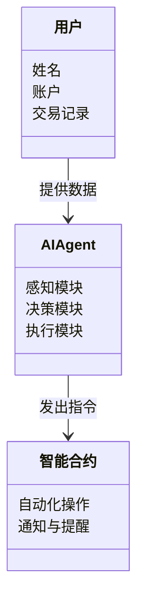

                 


# AI Agent在智能钱包中的个人财务健康顾问

## 关键词：AI Agent，智能钱包，个人财务健康，机器学习，区块链

## 摘要：AI Agent作为智能钱包的核心组件，通过机器学习算法和区块链技术，实时分析用户的财务数据，提供个性化的财务健康评估和优化建议。本文深入探讨AI Agent在智能钱包中的工作原理，详细分析其算法、架构及应用场景，并通过实际案例展示其在个人财务管理中的巨大潜力。

---

## 第1章: AI Agent与智能钱包概述

### 1.1 AI Agent的基本概念

#### 1.1.1 AI Agent的定义与特点
AI Agent（人工智能代理）是能够感知环境、自主决策并执行任务的智能实体。它具备以下特点：
- **自主性**：无需外部干预，自主完成任务。
- **反应性**：实时感知环境变化并做出反应。
- **学习性**：通过数据学习优化决策能力。
- **适应性**：能够适应不同的环境和需求。

#### 1.1.2 AI Agent的核心要素与功能
AI Agent的核心要素包括感知模块、决策模块和执行模块。其功能主要体现在数据处理、智能决策和任务执行三个方面。

#### 1.1.3 AI Agent与传统软件的区别
AI Agent与传统软件的最大区别在于其具备自主决策能力和学习能力，能够根据环境变化动态调整行为。

### 1.2 智能钱包的概念与特点

#### 1.2.1 智能钱包的定义
智能钱包是一种结合区块链技术的数字钱包，具备智能合约功能，能够自动执行预设的金融操作。

#### 1.2.2 智能钱包的功能与应用场景
智能钱包的主要功能包括资产存储、交易授权、自动化操作等。其应用场景广泛，如跨境支付、智能合约执行等。

#### 1.2.3 智能钱包的技术基础
智能钱包依赖于区块链技术、密码学和分布式账本技术，确保资金的安全性和透明性。

### 1.3 个人财务健康顾问的必要性

#### 1.3.1 个人财务管理的痛点与挑战
传统财务管理方式存在效率低、信息不透明、决策依赖人工判断等问题。

#### 1.3.2 AI Agent在财务健康中的作用
AI Agent能够实时分析用户的财务数据，提供精准的财务健康评估和优化建议，帮助用户做出更明智的财务决策。

#### 1.3.3 财务健康顾问的目标与价值
目标是帮助用户实现财务健康，价值体现在提升财务效率、优化资产配置和降低财务风险等方面。

## 第2章: AI Agent的核心概念与原理

### 2.1 AI Agent的核心要素与功能

#### 2.1.1 感知模块
感知模块负责收集用户行为数据、市场数据和财务数据，为决策提供依据。

#### 2.1.2 决策模块
决策模块基于感知数据，利用机器学习算法生成最优决策。

#### 2.1.3 执行模块
执行模块根据决策结果，通过智能合约或API接口完成具体操作。

### 2.2 AI Agent的感知机制

#### 2.2.1 数据采集与处理
AI Agent通过API接口从多个数据源采集数据，包括用户的交易记录、市场行情等。

#### 2.2.2 用户行为分析
利用自然语言处理技术分析用户的交易记录和消费习惯，识别潜在的财务风险。

#### 2.2.3 市场数据监控
实时监控市场行情，识别投资机会和风险。

### 2.3 AI Agent的决策机制

#### 2.3.1 基于规则的决策
根据预设的规则进行决策，适用于简单的财务优化场景。

#### 2.3.2 基于机器学习的决策
利用监督学习、无监督学习等算法，从历史数据中学习规律，生成最优决策。

#### 2.3.3 基于知识图谱的决策
通过构建知识图谱，分析财务数据之间的关联性，生成更精准的决策。

### 2.4 AI Agent的执行机制

#### 2.4.1 自动化操作
AI Agent通过智能合约自动执行投资、转账等操作。

#### 2.4.2 通知与提醒
当检测到异常情况时，AI Agent会通过短信、邮件等方式通知用户。

#### 2.4.3 数据反馈与优化
AI Agent根据执行结果优化决策模型，提升后续决策的准确性。

## 第3章: AI Agent的算法原理

### 3.1 基于规则的分类算法

#### 3.1.1 算法原理
基于规则的分类算法通过预设的规则对数据进行分类。例如，如果用户的某项支出超过预算，则标记为“风险”。

#### 3.1.2 算法流程
数据采集 → 规则匹配 → 分类结果输出。

#### 3.1.3 算法实现
```python
def classify_expense(expense, budget):
    if expense > budget:
        return "风险"
    else:
        return "正常"
```

### 3.2 基于机器学习的分类算法

#### 3.2.1 支持向量机（SVM）
SVM是一种监督学习算法，适用于小规模数据的分类任务。

#### 3.2.2 随机森林（Random Forest）
随机森林是一种基于决策树的集成学习算法，适用于高维数据的分类和回归任务。

#### 3.2.3 神经网络（Neural Networks）
神经网络是一种深度学习算法，适用于复杂的非线性分类任务。

### 3.3 算法选择与优化

#### 3.3.1 算法选择策略
根据数据规模、特征数量和任务类型选择合适的算法。

#### 3.3.2 算法性能优化
通过参数调优、特征选择等方法提升算法性能。

---

## 第4章: AI Agent的系统架构设计

### 4.1 系统功能设计

#### 4.1.1 领域模型


#### 4.1.2 系统架构


#### 4.1.3 接口与交互
用户通过API接口与AI Agent交互，AI Agent通过智能合约与区块链交互。

### 4.2 项目实战

#### 4.2.1 环境安装
安装Python和相关库：
```bash
pip install numpy scikit-learn mermaid4jupyter
```

#### 4.2.2 核心代码实现

##### 感知模块
```python
import numpy as np
from sklearn import datasets

# 加载数据集
iris = datasets.load_iris()
X = iris.data
y = iris.target
```

##### 决策模块
```python
from sklearn.svm import SVC

# 训练模型
model = SVC()
model.fit(X, y)
```

##### 执行模块
```python
def execute_decision(decision, wallet):
    if decision == "风险":
        wallet.send_notification("检测到高风险支出，请注意。")
    else:
        wallet.authorize_transaction()
```

#### 4.2.3 实际案例分析
通过具体案例分析AI Agent在智能钱包中的应用，展示其如何优化用户的财务健康。

### 4.3 项目小结

---

## 第5章: 最佳实践与总结

### 5.1 最佳实践

#### 5.1.1 数据隐私保护
确保用户数据的安全性和隐私性。

#### 5.1.2 算法可解释性
选择可解释性强的算法，便于用户理解和信任。

### 5.2 小结

AI Agent在智能钱包中的应用前景广阔，通过实时分析和优化用户的财务数据，帮助用户实现财务健康。未来，随着技术的进步，AI Agent在智能钱包中的应用将更加智能化和个性化。

### 5.3 注意事项

- 数据隐私和安全是AI Agent应用中的重要问题。
- 算法的可解释性和透明性是用户信任的基础。

### 5.4 拓展阅读

建议读者进一步阅读关于AI Agent、区块链技术和智能合约的书籍和论文，深入理解其技术细节和应用场景。

---

# 结语

AI Agent在智能钱包中的应用为个人财务管理带来了新的可能性。通过结合先进的机器学习算法和区块链技术，AI Agent能够帮助用户更好地管理财务健康，实现更高效的财务决策。随着技术的不断进步，AI Agent在智能钱包中的应用将更加智能化和个性化，为用户带来更好的体验和价值。

