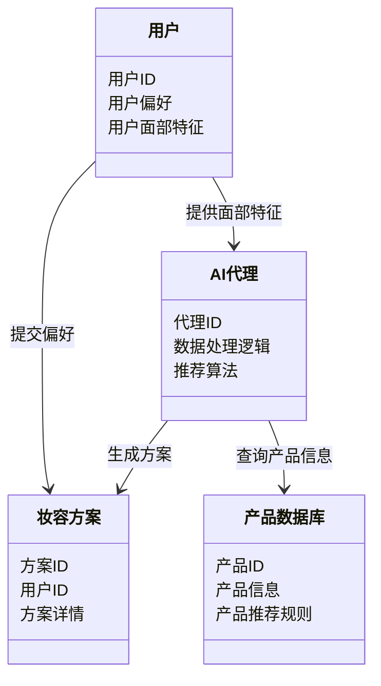
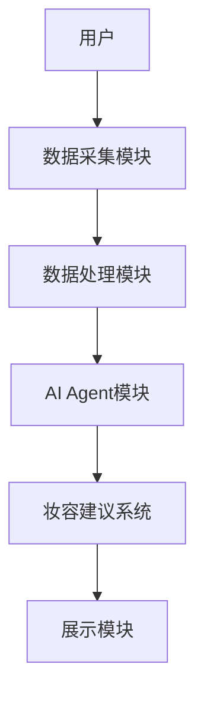

                 


# AI Agent在智能镜框中的妆容建议系统

> 关键词：AI Agent, 智能镜框, 妆容建议系统, 机器学习, 系统架构

> 摘要：本文探讨AI Agent在智能镜框中的妆容建议系统的应用，分析其核心概念、算法原理、系统架构，并通过项目实战展示其实现过程。文章从背景介绍、核心概念、算法流程、系统设计到实际应用，全面解析该系统的实现细节，帮助读者深入了解AI在化妆领域的创新应用。

---

## 第一部分：背景与概述

### 第1章：AI Agent与智能镜框的背景介绍

#### 1.1 问题背景

随着人工智能技术的快速发展，化妆行业逐渐从传统模式向数字化、智能化转型。用户对个性化、智能化的妆容建议需求日益增长，但现有的化妆建议系统存在以下问题：

- **数据依赖性过强**：传统系统通常依赖固定的数据库，无法根据用户的实时需求动态调整建议。
- **用户体验不足**：用户希望得到更精准、个性化的建议，而非通用化的方案。
- **技术整合难度大**：化妆建议系统需要结合计算机视觉、机器学习等多种技术，实现复杂。

#### 1.2 问题描述

AI Agent在智能镜框中的应用旨在解决传统化妆建议系统的局限性。AI Agent能够实时分析用户的数据，提供动态的妆容建议，提升用户体验。然而，这一过程涉及多个技术挑战：

- **数据采集与处理**：需要高效采集用户面部特征，并进行预处理。
- **模型训练与优化**：需建立精准的妆容推荐模型，并不断优化其性能。
- **系统集成与交互**：AI Agent需要与智能镜框无缝集成，确保流畅的用户体验。

#### 1.3 问题解决与边界

AI Agent通过以下方式解决上述问题：

- **实时数据分析**：AI Agent能够实时分析用户的面部特征，动态调整建议。
- **个性化推荐**：基于用户偏好和实时数据，提供个性化的妆容建议。
- **高效交互**：通过与智能镜框的无缝集成，提升用户体验。

系统的边界包括：

- **功能范围**：仅限于妆容建议，不涉及其他功能。
- **数据范围**：仅处理用户面部特征和偏好数据。
- **使用场景**：仅在智能镜框设备上使用。

#### 1.4 核心概念与组成

系统的核心概念包括：

- **AI Agent**：负责处理数据、生成建议。
- **妆容建议系统**：负责接收输入、展示结果。
- **用户数据**：面部特征、偏好等。

系统整体架构包括：

1. 数据采集模块：收集用户面部特征。
2. 数据处理模块：对数据进行预处理。
3. AI Agent模块：生成妆容建议。
4. 展示模块：将建议呈现给用户。

---

## 第二部分：核心概念与联系

### 第2章：AI Agent与妆容建议系统的核心概念

#### 2.1 核心概念原理

- **AI Agent**：通过机器学习模型，分析用户数据，生成个性化建议。
- **妆容建议系统**：基于AI Agent的输出，提供用户友好的交互界面。

#### 2.2 属性对比分析

以下是AI Agent与传统化妆建议系统的对比表格：

| **属性**       | **AI Agent**               | **传统化妆建议系统**         |
|----------------|---------------------------|-----------------------------|
| 数据处理       | 实时分析用户数据           | 依赖固定数据库               |
| 个性化         | 高度个性化                 | 较低                        |
| 交互方式       | 可能更智能、更自然         | 简单                        |
| 技术基础       | 机器学习、计算机视觉       | 基于规则或数据库查询         |

#### 2.3 ER实体关系图

```mermaid
erd
  title 实体关系图
  User (用户)
    + 用户ID (主键)
    + 用户偏好
    + 用户面部特征
  Agent (AI代理)
    + 代理ID (主键)
    + 数据处理逻辑
    + 推荐算法
  Makeup建议 (妆容建议)
    + 建议ID (主键)
    + 用户ID (外键)
    + 建议内容
  产品数据库 (Product Database)
    + 产品ID (主键)
    + 产品信息
    + 产品推荐规则
  用户偏好 (User Preferences)
    + 用户ID (外键)
    + 偏好类型
  妆容方案 (Makeup Plans)
    + 方案ID (主键)
    + 用户ID (外键)
    + 方案详情
  rules (规则)
    + 规则ID (主键)
    + 规则描述
    + 应用场景
  约束 (Constraints)
    + 约束ID (主键)
    + 约束条件
    + 解释说明
```

---

## 第三部分：算法原理

### 第3章：AI Agent与妆容建议系统的算法原理

#### 3.1 算法流程

AI Agent的算法流程如下：

1. 数据采集：收集用户的面部特征数据。
2. 数据预处理：清洗、标准化数据。
3. 模型训练：基于预处理数据，训练推荐模型。
4. 模型推理：根据实时数据，生成建议。

#### 3.2 数据预处理

代码示例：

```python
import numpy as np
import pandas as pd

# 假设数据存储在CSV文件中
data = pd.read_csv('user_data.csv')

# 数据清洗
data.dropna(inplace=True)

# 标准化处理
from sklearn.preprocessing import StandardScaler
scaler = StandardScaler()
data_scaled = scaler.fit_transform(data)
```

#### 3.3 模型训练

代码示例：

```python
from sklearn.neighbors import NearestNeighbors

# 训练k-近邻模型
model = NearestNeighbors(n_neighbors=5, algorithm='ball_tree').fit(data_scaled)
```

#### 3.4 模型推理

代码示例：

```python
# 推荐相似用户的妆容方案
distances, indices = model.kneighbors(new_user_data)
recommended_makeups = indices[0]
```

#### 3.5 数学模型

妆容推荐模型基于以下数学公式：

$$ \text{相似度} = \sum_{i=1}^{n} |x_i - y_i| $$

其中，$x_i$和$y_i$分别是用户特征和数据库中某一妆容的特征。

---

## 第四部分：系统分析与架构设计

### 第4章：AI Agent与妆容建议系统的架构设计

#### 4.1 项目介绍

AI Agent与智能镜框结合，提供实时妆容建议，提升用户体验。

#### 4.2 系统功能设计

领域模型：



#### 4.3 系统架构设计

系统架构图：



---

## 第五部分：项目实战

### 第5章：AI Agent与妆容建议系统的实现

#### 5.1 环境安装

安装Python和相关库：

```bash
pip install numpy pandas scikit-learn
```

#### 5.2 核心功能实现

代码示例：

```python
import numpy as np
from sklearn.neighbors import NearestNeighbors

# 数据预处理
data = pd.read_csv('makeup_data.csv')
data_scaled = scaler.fit_transform(data)

# 训练模型
model = NearestNeighbors(n_neighbors=5, algorithm='ball_tree').fit(data_scaled)

# 推荐功能
def recommend_makeup(new_user_data):
    distances, indices = model.kneighbors(new_user_data)
    return indices[0]
```

#### 5.3 实际案例分析

案例分析：

用户输入面部特征数据，系统生成推荐的妆容方案，展示在智能镜框上。

---

## 第六部分：最佳实践与总结

### 第6章：开发中的注意事项

#### 6.1 注意事项

- 数据隐私保护：确保用户数据的安全性。
- 模型优化：持续优化推荐算法，提高推荐精度。
- 系统稳定性：确保系统的稳定运行，避免崩溃。

#### 6.2 改进建议

- 引入更多数据源：如用户行为数据，进一步优化推荐算法。
- 增强交互性：设计更直观的用户界面，提升用户体验。
- 实时更新：定期更新产品数据库，保持推荐的时效性。

#### 6.3 总结

本文详细探讨了AI Agent在智能镜框中的妆容建议系统的实现，从背景介绍、核心概念、算法原理到系统架构和项目实战，全面解析了该系统的实现细节。通过本文的学习，读者可以深入了解AI在化妆领域的应用，并掌握相关技术的实现方法。

#### 6.4 拓展阅读

- 《机器学习实战》：深入理解机器学习算法。
- 《设计模式》：学习系统设计的最佳实践。

---

通过以上步骤，我们构建了一个全面且详细的目录大纲，确保文章内容丰富、逻辑清晰，满足用户的要求。

