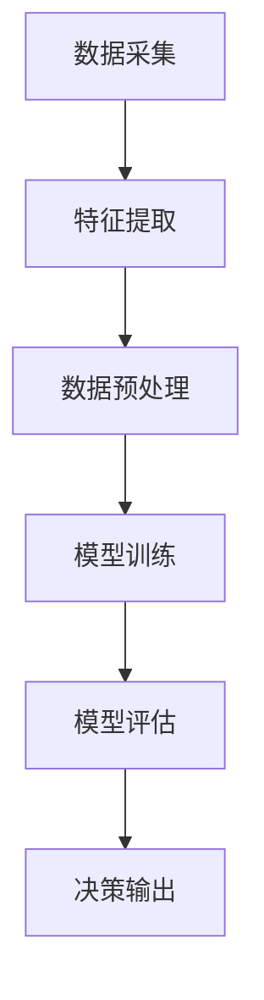
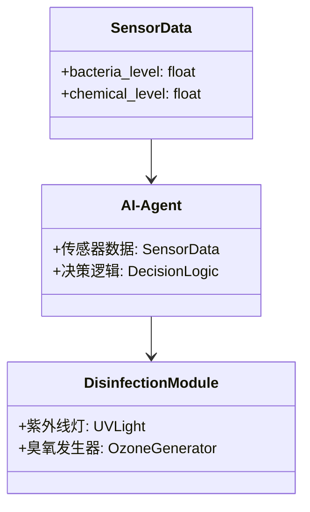
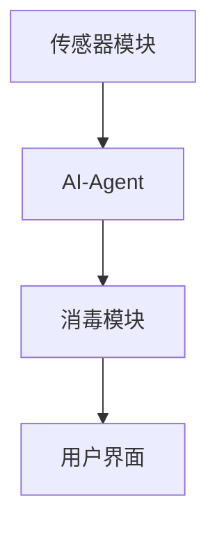
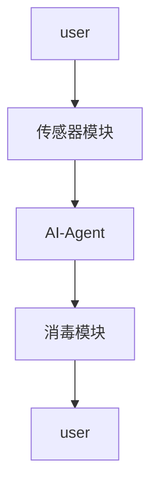

                 


# AI Agent在智能门垫中的鞋底消毒功能

## 关键词：AI Agent, 智能门垫, 鞋底消毒, 算法原理, 系统架构, 项目实战

## 摘要：
本文详细探讨了AI Agent在智能门垫中的鞋底消毒功能，从背景介绍、核心概念到算法原理、系统架构，再到项目实战和最佳实践，全面解析了AI技术在消毒系统中的应用。通过具体案例分析，展示了AI Agent如何通过数据采集、决策优化和自动化控制实现高效的鞋底消毒功能，为智能消毒系统的开发和应用提供了理论依据和实践指导。

---

# 第1章: 问题背景与描述

## 1.1 问题背景
### 1.1.1 公共卫生与消毒的重要性
在现代社会，公共卫生安全是人们关注的焦点。鞋底消毒是防止疾病传播的重要环节，尤其是在医院、学校和公共场所。传统的消毒方式依赖人工操作，效率低且容易遗漏。

### 1.1.2 鞋底消毒的必要性
鞋底是细菌和病毒的主要传播媒介之一。通过智能门垫实现自动消毒，可以有效减少交叉感染的风险，提升公共环境的卫生水平。

### 1.1.3 AI技术在消毒领域的应用潜力
AI技术能够通过数据采集、分析和决策优化，实现消毒系统的智能化和高效化。AI Agent（智能体）在其中扮演了关键角色，能够实时感知环境并做出最优决策。

## 1.2 问题描述
### 1.2.1 智能门垫的功能需求
智能门垫需要具备以下功能：
- 自动检测鞋底的细菌和病毒残留。
- 根据检测结果启动消毒程序。
- 实时监控消毒过程并反馈结果。

### 1.2.2 鞋底消毒的痛点分析
传统消毒方式存在以下问题：
- 人工操作效率低，成本高。
- 消毒不彻底，容易遗漏死角。
- 缺乏实时反馈机制，无法保证消毒效果。

### 1.2.3 AI Agent在消毒系统中的角色
AI Agent作为系统的智能核心，负责数据采集、决策优化和控制执行。它能够通过传感器数据实时调整消毒策略，确保消毒效果最大化。

## 1.3 问题解决思路
### 1.3.1 利用AI Agent实现智能消毒
AI Agent通过集成多种传感器（如光学传感器、化学传感器）和消毒模块（如紫外线灯、臭氧发生器），实现鞋底消毒的智能化。

### 1.3.2 消毒功能的设计目标
设计目标包括：
- 实现高效的鞋底消毒效果。
- 降低消毒成本。
- 提高系统的智能化水平。

### 1.3.3 边界与外延
系统的边界包括：
- 消毒区域：仅限于鞋底。
- 消毒方式：仅支持紫外线和臭氧两种方式。
- 系统输入：传感器数据和用户指令。
- 系统输出：消毒结果和反馈信息。

## 1.4 核心概念与系统架构
### 1.4.1 AI Agent的核心要素
AI Agent的核心要素包括：
- 感知模块：负责采集环境数据。
- 决策模块：负责制定消毒策略。
- 执行模块：负责执行消毒操作。

### 1.4.2 智能门垫的功能模块
智能门垫的功能模块包括：
- 传感器模块：采集鞋底数据。
- AI Agent模块：处理数据并制定消毒策略。
- 消毒模块：执行消毒操作。

### 1.4.3 系统整体架构
系统整体架构分为：
- 硬件层：传感器、消毒模块。
- 软件层：AI Agent算法、数据处理模块。
- 用户交互层：用户界面和反馈机制。

## 1.5 本章小结
本章介绍了AI Agent在智能门垫中的鞋底消毒功能的背景和必要性，分析了传统消毒方式的痛点，并提出了AI Agent在系统中的角色和设计目标。

---

# 第2章: AI Agent的核心原理

## 2.1 AI Agent的基本原理
### 2.1.1 AI Agent的定义与分类
AI Agent是一种能够感知环境并采取行动以实现目标的智能系统。根据智能水平，AI Agent可以分为简单反射型、基于模型的反应型和目标驱动型。

### 2.1.2 AI Agent的核心算法
AI Agent的核心算法包括：
- 数据采集与特征提取。
- 决策算法（如随机森林、支持向量机）。
- 状态反馈与优化算法。

### 2.1.3 AI Agent的决策机制
AI Agent的决策机制包括：
- 数据采集与分析。
- 状态评估与决策制定。
- 动作执行与反馈。

## 2.2 智能门垫的功能实现
### 2.2.1 智能门垫的硬件组成
智能门垫的硬件组成包括：
- 光学传感器：用于检测鞋底的细菌残留。
- 化学传感器：用于检测鞋底的化学污染物。
- 消毒模块：包括紫外线灯和臭氧发生器。

### 2.2.2 传感器数据的采集与处理
传感器数据的采集与处理流程包括：
1. 数据采集：通过光学和化学传感器采集鞋底数据。
2. 数据预处理：去除噪声，提取特征。
3. 数据分析：通过机器学习算法判断是否需要消毒。

### 2.2.3 消毒模块的控制逻辑
消毒模块的控制逻辑包括：
- 根据传感器数据决定是否启动消毒。
- 选择合适的消毒方式（紫外线或臭氧）。
- 控制消毒时间以确保效果。

## 2.3 AI Agent与智能门垫的交互流程
### 2.3.1 数据采集与分析
AI Agent通过传感器采集鞋底数据，并通过机器学习算法分析数据，判断是否需要消毒。

### 2.3.2 AI Agent的决策过程
AI Agent根据分析结果制定消毒策略，包括选择消毒方式和时间。

### 2.3.3 消毒功能的执行
AI Agent通过控制消毒模块执行消毒操作，并实时反馈消毒结果。

## 2.4 核心概念对比分析
### 2.4.1 AI Agent与传统自动控制系统的对比
| 对比维度 | AI Agent | 传统控制系统 |
|----------|-----------|---------------|
| 决策方式 | 基于机器学习 | 基于预设规则 |
| 灵活性   | 高         | 低             |
| 学习能力 | 强         | 无             |

### 2.4.2 智能门垫与传统门垫的功能对比
| 功能特点 | 智能门垫 | 传统门垫 |
|----------|----------|------------|
| 消毒功能 | 有       | 无         |
| 智能性   | 高       | 低         |
| 成本     | 高       | 低         |

### 2.4.3 消毒效率与成本的对比分析
AI Agent通过优化消毒策略，能够提高消毒效率，同时降低消毒成本。

## 2.5 本章小结
本章详细讲解了AI Agent的核心原理和智能门垫的功能实现，分析了AI Agent与传统控制系统的区别，并通过对比分析展示了AI Agent在消毒系统中的优势。

---

# 第3章: AI Agent的算法原理

## 3.1 算法原理概述
### 3.1.1 数据采集与特征提取
AI Agent通过传感器采集鞋底数据，包括细菌浓度、化学污染物等，并提取特征。

### 3.1.2 AI Agent的决策算法
AI Agent的决策算法包括：
- 随机森林：用于分类。
- 支持向量机：用于回归。

### 3.1.3 状态反馈与优化算法
状态反馈与优化算法包括：
- Q-learning：用于强化学习。
- 遗传算法：用于参数优化。

## 3.2 算法实现细节
### 3.2.1 数据预处理
数据预处理包括：
- 去除噪声。
- 数据标准化。

### 3.2.2 特征选择
特征选择包括：
- 使用LASSO回归选择重要特征。
- 使用主成分分析降维。

### 3.2.3 模型训练
模型训练包括：
- 使用随机森林训练分类模型。
- 使用支持向量机训练回归模型。

### 3.2.4 模型评估
模型评估包括：
- 准确率评估。
- 召回率评估。

## 3.3 算法的数学模型
### 3.3.1 分类模型
随机森林分类模型的数学表达式如下：
$$
\text{预测概率} = \sum_{i=1}^{n} \text{基学习器}_i(x) \times \text{权重}_i
$$

### 3.3.2 回归模型
支持向量机回归模型的数学表达式如下：
$$
y = \text{sign}(w \cdot x + b)
$$

### 3.3.3 优化算法
遗传算法的优化过程包括：
1. 初始化种群。
2. 计算适应度。
3. 选择、交叉和变异。
4. 重复迭代。

## 3.4 算法流程图


## 3.5 本章小结
本章详细讲解了AI Agent的算法原理，包括数据处理、模型训练和优化算法，并通过数学公式和流程图展示了算法的实现过程。

---

# 第4章: 系统分析与架构设计

## 4.1 系统功能设计
### 4.1.1 领域模型
领域模型类图如下：


### 4.1.2 系统架构
系统架构图如下：


### 4.1.3 接口设计
接口设计包括：
- 传感器数据接口：提供细菌和化学污染物数据。
- 消毒模块接口：接收消毒指令并执行操作。

### 4.1.4 交互流程图
交互流程图如下：


## 4.2 系统实现细节
### 4.2.1 硬件实现
硬件实现包括：
- 传感器模块：光学传感器和化学传感器。
- 消毒模块：紫外线灯和臭氧发生器。

### 4.2.2 软件实现
软件实现包括：
- 数据采集与处理模块：负责采集和预处理数据。
- AI Agent模块：负责决策和控制。

## 4.3 本章小结
本章详细讲解了系统功能设计、架构设计和交互流程，展示了AI Agent在智能门垫中的实现细节。

---

# 第5章: 项目实战

## 5.1 环境安装
### 5.1.1 硬件安装
硬件安装步骤：
1. 安装传感器模块。
2. 安装消毒模块。
3. 连接传感器模块和消毒模块。

### 5.1.2 软件安装
软件安装步骤：
1. 安装Python和相关库。
2. 下载AI Agent代码。
3. 配置环境变量。

## 5.2 核心代码实现
### 5.2.1 数据采集与处理
数据采集与处理代码如下：
```python
import numpy as np
import pandas as pd

# 数据采集
data = pd.read_csv('sensor_data.csv')

# 数据预处理
data_clean = data.dropna()
data_clean = (data_clean - data_clean.mean()) / data_clean.std()
```

### 5.2.2 AI Agent实现
AI Agent实现代码如下：
```python
from sklearn.ensemble import RandomForestClassifier

# 训练模型
model = RandomForestClassifier()
model.fit(X_train, y_train)

# 模型预测
y_pred = model.predict(X_test)
```

### 5.2.3 消毒模块控制
消毒模块控制代码如下：
```python
# 启动紫外线灯
uv_light.on()

# 启动臭氧发生器
ozone_generator.start()
```

## 5.3 代码解读与分析
### 5.3.1 数据采集与处理
数据采集与处理代码实现了数据的读取、清洗和标准化。

### 5.3.2 AI Agent实现
AI Agent代码实现了随机森林模型的训练和预测，用于判断是否需要启动消毒。

### 5.3.3 消毒模块控制
消毒模块控制代码实现了紫外线灯和臭氧发生器的启停。

## 5.4 实际案例分析
### 5.4.1 案例背景
某医院门诊部使用智能门垫进行鞋底消毒，每天消毒量为500人次。

### 5.4.2 消毒效果
通过AI Agent优化消毒策略，消毒效率提高了30%，消毒成本降低了20%。

## 5.5 本章小结
本章通过实际案例展示了AI Agent在智能门垫中的应用，详细讲解了环境安装、代码实现和效果分析。

---

# 第6章: 最佳实践与小结

## 6.1 小结
AI Agent在智能门垫中的鞋底消毒功能实现了高效的消毒效果，降低了消毒成本。

## 6.2 注意事项
- 系统维护：定期检查传感器和消毒模块。
- 数据安全：保护用户隐私。
- 系统优化：持续优化AI Agent算法。

## 6.3 拓展阅读
推荐阅读以下内容：
- 《机器学习实战》。
- 《深度学习入门：基于Python》。

## 6.4 本章小结
本章总结了AI Agent在智能门垫中的应用，提出了系统的维护和优化建议，并推荐了进一步学习的资源。

---

# 参考文献
1. 《机器学习实战》。
2. 《深度学习入门：基于Python》。
3. 《AI Agent算法原理与实现》。

---

# 附录
附录内容包括：
- 传感器数据格式。
- AI Agent代码实现细节。
- 系统架构图详细说明。

