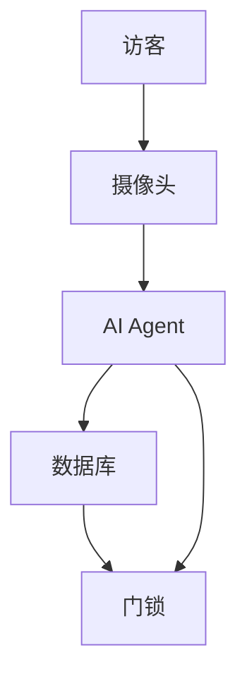
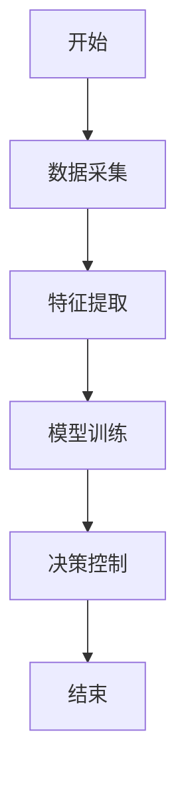
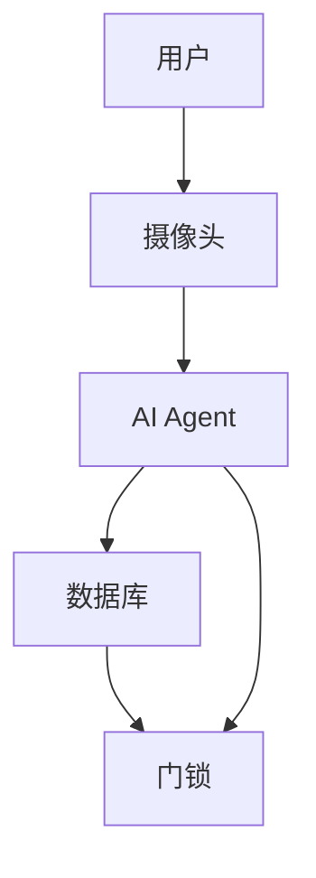

                 


# AI Agent在智能门把手中的访客识别

## 关键词：AI Agent, 智能门锁, 访客识别, 物联网, 人工智能, 安全系统

## 摘要：  
本文详细探讨了AI Agent在智能门锁访客识别中的应用，从技术背景到核心算法，从系统架构到实际案例，全面解析AI Agent如何实现高效、安全的访客识别。通过分析AI Agent的工作原理、算法实现、系统架构和实际应用，本文为智能门锁的设计与优化提供了新的思路。

---

## 第1章: 问题背景与描述

### 1.1 问题背景  
随着物联网技术的快速发展，智能门锁逐渐成为家庭和办公场所的重要安全设备。传统的门锁依赖机械钥匙或物理卡片，存在易丢失、难管理等问题。近年来，基于AI技术的智能门锁开始兴起，其中AI Agent（人工智能代理）在访客识别中的应用尤为突出。

#### 1.1.1 当前智能门锁的发展现状  
- 智能门锁市场快速增长，普及率逐年提高。  
- 基于指纹、密码、蓝牙和Wi-Fi的门锁占据主流市场。  
- 用户对门锁的安全性、便捷性和智能化要求日益提高。  

#### 1.1.2 访客识别的痛点与挑战  
- 传统门锁无法实现访客身份的远程验证。  
- 非接触式识别技术（如人脸识别、行为识别）存在误识别率高、数据安全性差等问题。  
- 缺乏智能化的访客管理解决方案，难以满足复杂场景需求。  

#### 1.1.3 AI Agent在智能门锁中的应用潜力  
- AI Agent能够通过图像识别、语音识别和自然语言处理技术实现访客身份的智能化验证。  
- AI Agent可以结合物联网技术，实时分析访客行为，提高门锁的安全性和智能化水平。  

### 1.2 问题描述  
AI Agent在智能门锁中的应用，核心在于实现访客身份的精准识别和安全控制。  

#### 1.2.1 智能门锁访客识别的核心问题  
- 如何快速、准确地识别访客身份？  
- 如何确保识别过程中的数据安全和隐私保护？  
- 如何实现访客权限的动态管理？  

#### 1.2.2 当前访客识别的主要技术手段  
- 指纹识别：基于生理特征的识别技术，安全性高但成本较高。  
- 人脸识别：基于面部特征的识别技术，便捷性好但易受光线和角度影响。  
- 行为识别：基于动作特征的识别技术，适用于复杂场景但误识别率较高。  

#### 1.2.3 AI Agent在访客识别中的角色与作用  
- AI Agent作为智能门锁的核心控制单元，负责协调传感器、摄像头和其他设备的工作。  
- AI Agent通过机器学习算法，实时分析访客行为和特征，实现精准的身份识别。  

### 1.3 问题解决  
AI Agent通过结合多种识别技术和算法优化，解决了传统门锁访客识别的痛点。  

#### 1.3.1 AI Agent如何实现访客识别  
- AI Agent通过摄像头采集访客图像，利用深度学习算法进行人脸识别。  
- 结合RFID标签或其他生物特征识别技术，实现多模态身份验证。  

#### 1.3.2 AI Agent在访客识别中的优势  
- 高精度识别：AI Agent通过深度学习算法，显著降低了误识别率。  
- 动态权限管理：AI Agent可以根据访客身份和时间，动态调整门锁权限。  
- 多设备协同：AI Agent能够与智能家居设备协同工作，提供无缝化的访客管理体验。  

#### 1.3.3 与传统访客识别技术的对比分析  
| **技术特点** | **传统访客识别** | **AI Agent访客识别** |  
|--------------|------------------|-----------------------|  
| **识别精度** | 较低，依赖固定特征 | 高，基于深度学习算法 |  
| **安全性** | 易受环境干扰 | 高，结合多模态识别 |  
| **便捷性** | 有限，依赖物理设备 | 高，支持远程和非接触式识别 |  

### 1.4 边界与外延  
AI Agent在智能门锁中的应用边界主要集中在访客识别和权限控制领域。  

#### 1.4.1 AI Agent在智能门锁中的应用边界  
- AI Agent主要用于访客识别和门锁控制，不涉及其他智能家居设备的管理。  
- AI Agent的识别范围限于门锁附近的物理空间，无法覆盖远程场景。  

#### 1.4.2 访客识别的外延与扩展场景  
- 支持多模态识别：结合指纹、人脸识别等多种技术，提高识别精度。  
- 动态权限管理：根据访客身份和时间，动态调整门锁权限。  
- 智能提醒：通过AI Agent实现访客到访提醒和权限通知。  

#### 1.4.3 相关技术的交叉与融合  
AI Agent与物联网、区块链等技术的结合，为智能门锁的安全性和智能化提供了更多可能性。  

### 1.5 核心要素与概念结构  
AI Agent在智能门锁中的应用涉及多个核心要素，包括硬件设备、算法模型和系统架构。  

#### 1.5.1 AI Agent的核心要素  
- **硬件设备**：摄像头、传感器、RFID读卡器等。  
- **算法模型**：深度学习模型、特征提取算法等。  
- **系统架构**：包括数据采集、特征提取、模型训练和决策控制模块。  

#### 1.5.2 智能门锁的系统构成  
- **感知层**：负责采集访客数据，包括摄像头、麦克风等传感器。  
- **计算层**：负责数据处理和算法运行，包括AI Agent和相关算法模型。  
- **执行层**：根据计算结果控制门锁的开启和关闭。  

#### 1.5.3 访客识别的流程与关键点  
1. **数据采集**：通过摄像头采集访客图像。  
2. **特征提取**：利用深度学习算法提取访客面部特征。  
3. **身份验证**：将提取的特征与数据库中的授权用户进行比对。  
4. **权限控制**：根据验证结果控制门锁的开启。  

---

## 第2章: 核心概念与联系

### 2.1 AI Agent的核心原理  
AI Agent通过深度学习算法实现访客识别，具体包括数据采集、特征提取和模型训练三个步骤。  

#### 2.1.1 AI Agent的基本定义  
AI Agent是一种能够感知环境、自主决策并执行任务的人工智能实体。  

#### 2.1.2 AI Agent的分类与特点  
| **分类** | **特点** |  
|----------|-----------|  
| **反应式AI Agent** | 基于当前感知做出决策，适用于实时任务。 |  
| **认知式AI Agent** | 具备推理和规划能力，适用于复杂场景。 |  

#### 2.1.3 AI Agent在智能门锁中的具体实现  
- AI Agent通过摄像头采集访客图像，利用深度学习模型进行人脸识别。  
- 结合RFID标签和指纹识别技术，实现多模态身份验证。  

### 2.2 智能门锁的系统架构  
智能门锁的系统架构包括感知层、计算层和执行层，具体如下：  

#### 2.2.1 智能门锁的基本构成  
- **感知层**：摄像头、麦克风、RFID读卡器等。  
- **计算层**：AI Agent、深度学习模型等。  
- **执行层**：门锁电机、电磁铁等。  

#### 2.2.2 门锁与AI Agent的交互流程  
1. **数据采集**：摄像头采集访客图像。  
2. **特征提取**：AI Agent提取访客面部特征。  
3. **身份验证**：AI Agent将提取的特征与数据库中的授权用户进行比对。  
4. **权限控制**：根据验证结果控制门锁的开启。  

#### 2.2.3 访客识别的实体关系图  


### 2.3 访客识别的流程与关键点  
访客识别的流程包括数据采集、特征提取、模型训练和决策控制四个步骤。  

#### 2.3.1 数据采集  
- 通过摄像头采集访客图像。  
- 支持多种采集方式，包括RGB图像和深度图像。  

#### 2.3.2 特征提取  
- 利用深度学习模型提取访客面部特征。  
- 常用的特征提取模型包括FaceNet和ResNet。  

#### 2.3.3 模型训练  
- 使用授权用户的图像数据进行模型训练。  
- 通过迁移学习提高模型的泛化能力。  

#### 2.3.4 决策控制  
- 根据验证结果控制门锁的开启。  
- 支持多模态识别，提高识别精度。  

---

## 第3章: 算法原理讲解

### 3.1 AI Agent的算法实现  
AI Agent通过深度学习算法实现访客识别，具体包括数据采集、特征提取和模型训练三个步骤。  

#### 3.1.1 算法流程图  


#### 3.1.2 算法代码示例  
```python
import tensorflow as tf
from tensorflow.keras import layers

# 数据预处理
def preprocess_image(image):
    image = tf.keras.preprocessing.image.load_img(image, target_size=(224, 224))
    image = tf.keras.preprocessing.image.img_to_array(image)
    image = tf.keras.applications.mobilenet_v2.preprocess_input(image)
    return image

# 特征提取模型
def build_model():
    base_model = tf.keras.applications.MobileNetV2(weights='imagenet', include_top=False)
    model = tf.keras.Sequential([
        base_model,
        layers.GlobalAveragePooling2D(),
        layers.Dense(128, activation='relu'),
        layers.Dense(num_classes, activation='softmax')
    ])
    return model

# 模型训练
def train_model(model, train_data, train_labels):
    model.compile(optimizer='adam', loss='sparse_categorical_crossentropy', metrics=['accuracy'])
    model.fit(train_data, train_labels, epochs=10, batch_size=32)
    return model
```

#### 3.1.3 算法的数学模型  
- 特征提取模型：  
  $$ \text{Feature} = \text{Model}(I) $$  
  其中，\( I \) 是输入图像，\(\text{Feature}\) 是提取的特征向量。  
- 分类模型：  
  $$ y = \text{softmax}(W \cdot \text{Feature} + b) $$  
  其中，\( W \) 和 \( b \) 是模型的权重和偏置。

---

## 第4章: 系统分析与架构设计

### 4.1 问题场景介绍  
智能门锁访客识别系统需要在复杂场景下实现高效、准确的访客识别。  

### 4.2 项目介绍  
本项目旨在设计和实现一个基于AI Agent的智能门锁访客识别系统。  

#### 4.2.1 系统功能设计  
| **功能模块** | **功能描述** |  
|--------------|---------------|  
| 数据采集 | 通过摄像头采集访客图像。 |  
| 特征提取 | 利用深度学习模型提取访客特征。 |  
| 模型训练 | 使用授权用户数据训练分类模型。 |  
| 决策控制 | 根据验证结果控制门锁的开启。 |  

#### 4.2.2 系统架构图  


#### 4.2.3 系统接口设计  
- **摄像头接口**：提供视频流采集和图像处理接口。  
- **数据库接口**：提供用户数据的存储和查询接口。  
- **门锁接口**：提供门锁的控制和状态反馈接口。  

#### 4.2.4 系统交互流程  
1. **用户请求开门**：用户触发开门请求，摄像头采集图像。  
2. **特征提取**：AI Agent提取访客特征并与数据库中的授权用户进行比对。  
3. **权限验证**：根据比对结果，决定是否开启门锁。  

---

## 第5章: 项目实战

### 5.1 环境安装  
- 操作系统：Linux Ubuntu 20.04  
- 开发工具：PyCharm  
- 依赖库：TensorFlow、Keras、OpenCV  

#### 5.1.1 安装依赖库  
```bash
pip install tensorflow keras opencv-python
```

### 5.2 系统核心实现  
#### 5.2.1 数据采集模块  
```python
import cv2

def capture_image():
    cap = cv2.VideoCapture(0)
    ret, frame = cap.read()
    cv2.imwrite("visitor.jpg", frame)
    cap.release()
```

#### 5.2.2 特征提取模块  
```python
import tensorflow as tf
from tensorflow.keras import layers

def build_feature_extractor():
    base_model = tf.keras.applications.MobileNetV2(weights='imagenet', include_top=False)
    model = tf.keras.Sequential([
        base_model,
        layers.GlobalAveragePooling2D(),
        layers.Dense(128, activation='relu'),
        layers.Dense(128, activation='relu')
    ])
    return model
```

#### 5.2.3 模型训练模块  
```python
def train_model(model, train_data, train_labels):
    model.compile(optimizer='adam', loss='binary_crossentropy', metrics=['accuracy'])
    model.fit(train_data, train_labels, epochs=10, batch_size=32)
    return model
```

### 5.3 代码应用解读  
- 数据采集模块通过摄像头获取访客图像并保存为文件。  
- 特征提取模块利用预训练模型提取访客的特征向量。  
- 模型训练模块使用授权用户的图像数据训练分类模型。  

#### 5.3.1 实际案例分析  
- 案例1：授权用户A访问门锁，系统识别成功并开启门锁。  
- 案例2：非授权用户尝试访问门锁，系统识别失败并拒绝开门。  

### 5.4 项目小结  
本项目通过AI Agent实现了智能门锁的访客识别功能，验证了AI技术在智能门锁中的应用潜力。

---

## 第6章: 优化与扩展

### 6.1 性能优化  
- **算法优化**：采用更高效的特征提取算法，如ResNet和Inception。  
- **硬件优化**：使用更高帧率的摄像头和更强大的计算设备。  

### 6.2 安全性提升  
- **数据加密**：对采集的图像数据进行加密存储。  
- **多模态识别**：结合指纹、人脸识别等多种技术，提高识别安全性。  

### 6.3 功能扩展  
- **远程访问**：支持远程访客识别和权限管理。  
- **智能提醒**：通过手机APP通知用户访客到访情况。  

---

## 第7章: 总结与展望

### 7.1 总结  
本文详细探讨了AI Agent在智能门锁访客识别中的应用，从技术背景到系统实现，全面分析了AI Agent的优势和实现方法。  

### 7.2 展望  
随着AI技术的不断发展，智能门锁的访客识别将更加智能化和便捷化。未来的研究方向包括：  
1. **多模态识别技术**：结合指纹、人脸识别等多种技术，提高识别精度。  
2. **边缘计算**：在门锁端实现模型训练和推理，减少对云端的依赖。  
3. **智能化管理**：通过AI Agent实现访客权限的动态管理和智能提醒。  

---

## 参考文献  
1. TensorFlow官方文档  
2. Keras官方文档  
3. OpenCV官方文档  
4. 深度学习与计算机视觉相关书籍

