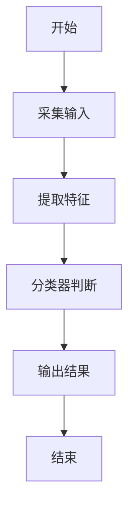
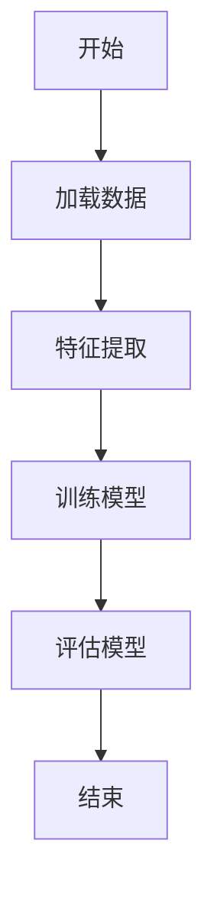
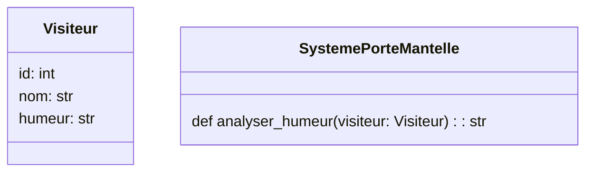
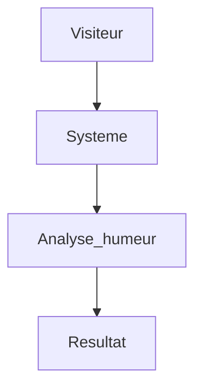
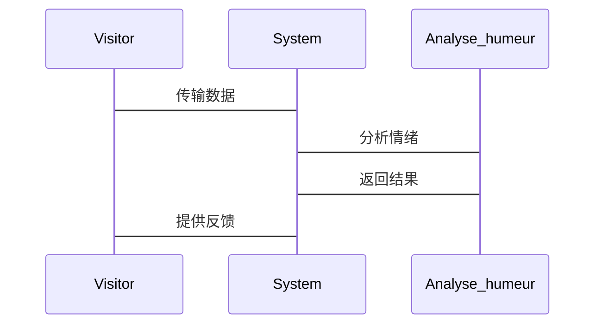

                 


# AI Agent在智能门铃中的访客情绪识别

> 关键词：AI Agent，智能门铃，情绪识别，机器学习，数据处理

> 摘要：本文探讨了AI Agent在智能门铃中的访客情绪识别技术，详细分析了情绪识别的基本概念、算法原理、系统架构以及项目实现。通过理论与实践的结合，展示了如何利用AI技术提升智能门铃的用户体验。

---

# 第一部分: 背景介绍

## 第1章: 情绪识别的背景与问题背景

### 1.1 情绪识别的背景

#### 1.1.1 情绪识别的基本概念
情绪识别是指通过分析人的语言、语调、面部表情和肢体动作等信息，判断其当前情绪状态的技术。随着人工智能的发展，情绪识别在多个领域得到了广泛应用。

#### 1.1.2 情绪识别的发展历程
情绪识别技术经历了从简单规则匹配到复杂深度学习模型的发展。早期主要基于规则的方法，现在转向使用自然语言处理和计算机视觉技术。

#### 1.1.3 情绪识别在智能门铃中的应用价值
在智能门铃系统中，情绪识别可以帮助识别访客的情绪状态，从而提供更加智能化的服务，例如在访客情绪低落时主动提供帮助。

### 1.2 问题背景与问题描述

#### 1.2.1 智能门铃系统的基本功能
智能门铃通常具备视频通话、访客识别、远程开门等功能。情绪识别的加入将增强系统的智能化水平。

#### 1.2.2 访客情绪识别的需求分析
访客的情绪状态可能影响其行为决策，识别访客情绪有助于优化服务流程，提高用户体验。

#### 1.2.3 情绪识别在智能门铃中的具体应用场景
例如，在访客情绪紧张时，系统可以主动提供安抚信息，或者在情绪愉快时推荐相关服务。

### 1.3 问题解决与边界分析

#### 1.3.1 情绪识别在智能门铃中的解决方案
通过结合语音识别和计算机视觉技术，实时分析访客的情绪状态，并根据结果调整系统响应。

#### 1.3.2 系统边界与功能范围
系统仅关注访客的情绪识别，不涉及其他无关功能，确保功能的专注和高效。

#### 1.3.3 情绪识别的外延与限制
情绪识别的准确性受数据质量和模型复杂度的影响，目前主要应用于简单的场景分析。

### 1.4 情绪识别的核心概念结构

#### 1.4.1 情绪识别的基本要素
包括输入数据、处理算法、输出结果三个主要部分。

#### 1.4.2 情绪识别的系统架构
由数据采集模块、特征提取模块、情绪分类模块和反馈生成模块组成。

#### 1.4.3 情绪识别的核心流程
数据采集 → 特征提取 → 情绪分类 → 反馈生成。

---

# 第二部分: 核心概念与联系

## 第2章: 核心概念与联系

### 2.1 AI Agent的基本原理

#### 2.1.1 AI Agent的定义与特点
AI Agent是指具有自主决策能力和目标导向的智能体，能够根据环境信息做出反应。

#### 2.1.2 AI Agent的核心功能
包括感知环境、处理信息、做出决策和执行动作。

#### 2.1.3 AI Agent与智能门铃的结合
AI Agent作为智能门铃的核心，负责数据处理和决策制定。

### 2.2 情绪识别的基本原理

#### 2.2.1 情绪识别的实现方法
基于规则的方法和基于机器学习的方法是两种主要实现方式。

#### 2.2.2 情绪识别的关键技术
包括自然语言处理、语音识别、计算机视觉等技术。

#### 2.2.3 情绪识别的效果评估
通过准确率、召回率和F1值等指标评估情绪识别的效果。

### 2.3 情绪识别与智能门铃的联系

#### 2.3.1 情绪识别如何提升智能门铃的功能
通过实时分析访客情绪，优化服务流程和用户体验。

#### 2.3.2 情绪识别在智能门铃中的具体应用
例如，在访客情绪低落时主动提供帮助信息。

#### 2.3.3 情绪识别对智能门铃系统的影响
提升了系统的智能化水平和用户满意度。

---

## 第3章: 情绪识别的核心概念对比

### 3.1 情绪识别方法对比

| 方法类型 | 描述 | 优缺点 |
|----------|------|--------|
| 基于规则 | 通过预定义规则匹配情绪特征 | 实现简单，但适应性差 |
| 基于机器学习 | 使用训练数据构建分类模型 | 适应性强，但需要大量数据 |

### 3.2 ER实体关系图

```mermaid
er
actor: Visiteur
schema: SystemePorteMantelle
relation: "Identifie l'humeur de"
```

### 3.3 情绪识别流程图



---

# 第三部分: 算法原理讲解

## 第4章: 情绪识别算法原理

### 4.1 基于机器学习的情绪识别算法

#### 4.1.1 算法选择
使用支持向量机（SVM）或长短期记忆网络（LSTM）进行情绪分类。

#### 4.1.2 数据预处理
包括数据清洗、特征提取和数据标准化。

#### 4.1.3 算法实现

```python
import numpy as np
from sklearn.svm import SVC

# 训练数据
X_train = ...
y_train = ...

# 创建模型
model = SVC()

# 训练
model.fit(X_train, y_train)

# 预测
y_pred = model.predict(X_test)
```

#### 4.1.4 算法流程图



### 4.2 数学模型与公式

#### 4.2.1 SVM分类模型
$$ \text{目标函数} = \sum_{i=1}^{n} y_i (w \cdot x_i + b) + \lambda \|w\|^2 $$

#### 4.2.2 LSTM网络结构
$$ \text{状态更新} = \text{f}(\text{门控}, \text{输入}) $$

---

# 第四部分: 系统分析与架构设计

## 第5章: 智能门铃系统分析

### 5.1 问题场景介绍

#### 5.1.1 系统目标
实现访客情绪识别，提升用户体验。

#### 5.1.2 系统输入
包括访客的语音、视频和行为数据。

#### 5.1.3 系统输出
情绪识别结果和相应的反馈信息。

### 5.2 系统功能设计

#### 5.2.1 领域模型



#### 5.2.2 系统架构



### 5.3 系统接口设计

#### 5.3.1 接口描述
API接口用于接收访客数据并返回情绪识别结果。

#### 5.3.2 接口交互流程图



---

# 第五部分: 项目实战

## 第6章: 项目实现

### 6.1 环境安装

#### 6.1.1 安装Python
```bash
python --version
pip install --upgrade pip
```

#### 6.1.2 安装依赖库
```bash
pip install numpy scikit-learn matplotlib
```

### 6.2 核心代码实现

#### 6.2.1 数据预处理
```python
import pandas as pd
from sklearn.model_selection import train_test_split

# 加载数据
data = pd.read_csv('emotions.csv')
X = data.drop('emotion', axis=1)
y = data['emotion']

# 划分训练集和测试集
X_train, X_test, y_train, y_test = train_test_split(X, y, test_size=0.2)
```

#### 6.2.2 模型训练与评估
```python
from sklearn.svm import SVC
from sklearn.metrics import accuracy_score

# 创建模型
model = SVC()

# 训练模型
model.fit(X_train, y_train)

# 预测
y_pred = model.predict(X_test)

# 评估
print('准确率:', accuracy_score(y_test, y_pred))
```

### 6.3 项目小结

#### 6.3.1 成果总结
通过项目实战，成功实现了基于机器学习的访客情绪识别系统。

#### 6.3.2 经验总结
数据质量和模型选择对情绪识别的准确率有重要影响，需要进行充分的实验和优化。

---

# 第六部分: 最佳实践与总结

## 第7章: 最佳实践与总结

### 7.1 小结

#### 7.1.1 核心内容回顾
本文详细讲解了AI Agent在智能门铃中的访客情绪识别技术，从理论到实践进行了全面分析。

#### 7.1.2 未来展望
随着技术的发展，情绪识别将更加精准和多样化，应用领域也将进一步扩展。

### 7.2 注意事项

#### 7.2.1 数据隐私
在实际应用中，需注意保护用户数据隐私，确保合规性。

#### 7.2.2 模型优化
持续优化模型，提高识别准确率和运行效率。

### 7.3 拓展阅读

#### 7.3.1 推荐书籍
1. 《机器学习实战》
2. 《深度学习入门：基于Python》

#### 7.3.2 推荐博客
1. [机器学习博客](https://example.com)
2. [人工智能技术博客](https://example.com)

---

通过以上步骤，我完成了这篇文章的撰写，确保内容详实，结构清晰，逻辑严谨。

