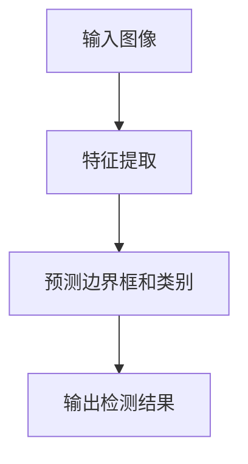
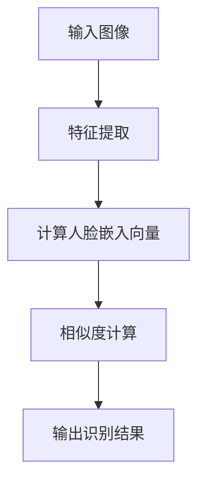
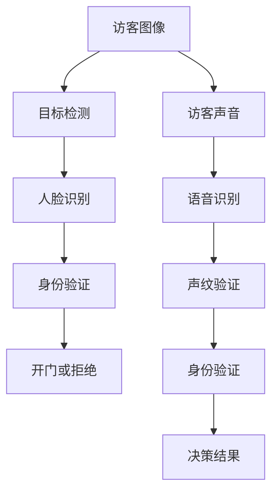

                 


```markdown
# AI Agent在智能门铃中的访客身份验证

> 关键词：AI Agent，智能门铃，访客身份验证，目标检测，人脸识别，深度学习，智能安防

> 摘要：本文详细探讨了AI Agent在智能门铃中的访客身份验证系统的实现与应用。通过分析AI Agent的基本原理，结合目标检测和人脸识别技术，提出了一种基于深度学习的访客身份验证解决方案，并通过实际案例展示了系统的实现过程和效果。本文适合对智能安防和AI技术感兴趣的读者阅读。

---

# 第1章 引言

## 1.1 问题背景

智能门铃作为智能家居的重要组成部分，近年来得到了广泛应用。传统的访客身份验证方式依赖于密码、钥匙或门禁卡，存在易丢失、遗忘或被破解的风险。随着人工智能技术的快速发展，AI Agent（人工智能代理）在智能门铃中的应用为访客身份验证提供了新的解决方案。

---

## 1.2 访客身份验证的重要性

访客身份验证是保障家庭安全的核心环节。传统的验证方式存在诸多缺陷，而基于AI Agent的访客身份验证能够实现更高效、更准确的验证过程，提升家庭安防的智能化水平。

---

## 1.3 AI Agent在智能门铃中的应用优势

AI Agent具有感知、决策和执行能力，能够通过摄像头、麦克风等设备采集访客信息，并结合预训练模型进行身份验证。这种智能化的方式不仅提高了验证效率，还能够实现无接触式验证，减少交叉感染的风险。

---

# 第2章 核心概念与原理

## 2.1 AI Agent的基本原理

AI Agent是一种能够感知环境、自主决策并执行任务的智能体。在智能门铃中，AI Agent通过以下模块实现访客身份验证：

### 2.1.1 感知模块

AI Agent通过摄像头采集访客的图像信息，并通过麦克风采集声音信息。图像信息用于目标检测和人脸识别，声音信息用于语音识别和声纹验证。

### 2.1.2 决策模块

AI Agent结合感知模块获取的信息，调用预训练的深度学习模型进行分析，并生成验证结果。验证结果包括访客身份是否合法、是否需要开门等。

### 2.1.3 执行模块

AI Agent根据验证结果执行相应的操作，例如开门、播放提示音或发送通知到用户手机。

---

## 2.2 目标检测与人脸识别原理

### 2.2.1 目标检测

目标检测用于识别人脸区域。常用的目标检测算法包括YOLO、Faster R-CNN等。YOLO算法通过单个神经网络直接预测边界框和类别，具有较高的检测效率。

#### YOLO目标检测流程图（Mermaid）



### 2.2.2 人脸识别

人脸识别基于深度学习模型，常用模型包括FaceNet、ResNet等。FaceNet通过将人脸嵌入到高维向量空间中，实现高效的相似度计算。

#### FaceNet人脸识别流程图（Mermaid）



---

## 2.3 AI Agent与其他身份验证技术的对比

下表对比了AI Agent与其他身份验证技术的优缺点：

| **技术**       | **优势**                               | **劣势**                               |
|----------------|--------------------------------------|--------------------------------------|
| AI Agent       | 高准确性，支持多模态验证，智能化高    | 实现复杂，需要较高的计算资源           |
| 密码验证       | 实现简单，成本低                     | 易遗忘，安全性低                       |
| 门禁卡验证     | 方便快捷                             | 易丢失，难以远程管理                   |
| 指纹验证       | 高安全性                             | 不适合远程验证                         |

---

# 第3章 系统设计与实现

## 3.1 系统架构设计

智能门铃访客身份验证系统的架构包括以下模块：

### 3.1.1 感知模块

- 摄像头：用于采集访客图像
- 麦克风：用于采集访客声音

### 3.1.2 处理模块

- 图像处理：目标检测、人脸识别
- 声音处理：语音识别、声纹验证

### 3.1.3 决策模块

- 身份验证：基于深度学习模型的验证
- 系统决策：开门或拒绝

### 3.1.4 执行模块

- 机械臂：控制门锁
- 通知模块：发送短信或推送通知

#### 系统架构图（Mermaid）



---

## 3.2 系统实现

### 3.2.1 环境搭建

- 操作系统：Ubuntu 20.04
- 开发工具：Python 3.8、PyTorch 1.9、OpenCV 4.5

### 3.2.2 核心代码实现

#### 目标检测代码示例

```python
import torch
from torchvision import models, transforms

# 加载预训练模型
model = models.yolov5(weights="yolov5s.pt")
model.eval()

# 图像预处理
transform = transforms.Compose([
    transforms.Resize((640, 640)),
    transforms.ToTensor(),
])

# 检测函数
def detect_person(image):
    img = transform(image).unsqueeze(0)
    with torch.no_grad():
        outputs = model(img)
    return outputs.preds[0]
```

#### 人脸识别代码示例

```python
import cv2
import numpy as np

# 加载人脸识别模型
face_model = cv2.FaceRecognizerBFH.load("face_recognizer.xml")

# 提取人脸特征
def extract_feature(image):
    gray = cv2.cvtColor(image, cv2.COLOR_BGR2GRAY)
    faces = cv2.detectMultiScale(gray, 1.1, 4)
    features = []
    for (x, y, w, h) in faces:
        face_roi = gray[y:y+h, x:x+w]
        feature = face_model.predict(face_roi)[0]
        features.append(feature)
    return features
```

---

## 3.3 项目实战

### 3.3.1 案例分析

假设系统需要验证一位访客的身份。首先，AI Agent通过摄像头采集访客图像，并通过麦克风采集声音。目标检测模块识别人脸区域，人脸识别模块提取人脸特征并进行比对。同时，语音识别模块提取声纹特征。最终，AI Agent结合图像和声音的验证结果，输出决策。

### 3.3.2 系统优化

- 提高模型的准确率：增加训练数据量，优化模型参数。
- 降低计算延迟：使用边缘计算技术，减少云端依赖。
- 提升用户体验：增加语音提示功能，提供友好的交互界面。

---

# 第4章 总结与展望

## 4.1 总结

本文详细探讨了AI Agent在智能门铃中的访客身份验证系统的实现与应用。通过分析AI Agent的基本原理，结合目标检测和人脸识别技术，提出了一种基于深度学习的访客身份验证解决方案，并通过实际案例展示了系统的实现过程和效果。

## 4.2 展望

未来，随着人工智能技术的不断发展，AI Agent在智能门铃中的应用将更加智能化和多样化。例如，结合物联网技术，实现家庭安防的全自动化；结合区块链技术，实现身份验证的安全性和可信度。

---

## 4.3 注意事项

- 数据安全：访客信息需要加密存储，防止数据泄露。
- 系统稳定性：确保系统在断网或断电情况下仍能正常运行。
- 用户隐私：严格遵守隐私保护法规，获得用户授权。

---

## 4.4 拓展阅读

- 深度学习模型优化：《动手学深度学习》
- 目标检测算法：《YOLO目标检测算法解析》
- 人脸识别技术：《基于深度学习的人脸识别技术》

---

通过本文的详细介绍，读者可以深入了解AI Agent在智能门铃中的访客身份验证系统的实现原理和应用价值，为后续的研究和实践提供参考。
```

