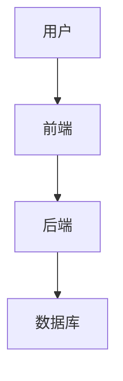

                 


# AI Agent在特定领域的应用：金融、医疗、法律等

> 关键词：AI Agent, 金融, 医疗, 法律, 人工智能, 特定领域应用

> 摘要：本文探讨了AI Agent在金融、医疗和法律等领域的具体应用，分析了其核心概念、算法原理、系统架构以及实际案例，旨在为读者提供全面而深入的理解。

---

## 第1章: AI Agent 的概述

### 1.1 AI Agent 的定义与分类

#### 1.1.1 什么是 AI Agent
AI Agent（人工智能代理）是一种能够感知环境、自主决策并执行任务的智能实体。它可以是一个软件程序，也可以是一个物理设备，通过传感器和执行器与环境交互。

#### 1.1.2 AI Agent 的分类
AI Agent 可以根据智能水平、任务类型和应用场景进行分类：

1. **按智能水平**：
   - **反应式 Agent**：基于当前感知做出反应，适用于实时任务。
   - **认知式 Agent**：具备复杂推理和规划能力，适用于复杂场景。

2. **按任务类型**：
   - **任务导向型 Agent**：专注于完成特定任务。
   - **服务导向型 Agent**：提供持续的服务支持。

3. **按应用场景**：
   - **通用 Agent**：适用于多种场景。
   - **专用 Agent**：针对特定领域设计。

#### 1.1.3 AI Agent 的特点与优势
- **自主性**：无需外部干预，自主决策。
- **反应性**：能够实时感知环境变化并做出反应。
- **学习能力**：通过数据和经验不断优化性能。
- **高效性**：能够在复杂环境中快速处理信息。

---

### 1.2 AI Agent 的核心概念

#### 1.2.1 问题背景与问题描述
在特定领域中，AI Agent 的应用需要解决复杂的问题，例如金融中的风险管理、医疗中的疾病诊断等。这些问题通常涉及大量数据和复杂决策过程。

#### 1.2.2 问题解决的思路与方法
AI Agent 通过感知、推理、学习和执行来解决问题。具体步骤包括：

1. **感知环境**：通过传感器或数据接口获取环境信息。
2. **问题建模**：将问题转化为数学模型或逻辑框架。
3. **推理与决策**：基于模型进行推理，生成解决方案。
4. **执行操作**：根据决策结果执行任务。

#### 1.2.3 AI Agent 的边界与外延
AI Agent 的边界包括其感知和执行能力的范围，外延则涉及与其他系统或用户的交互。

#### 1.2.4 核心要素与概念结构
AI Agent 的核心要素包括：
- **知识库**：存储领域知识和经验数据。
- **推理引擎**：用于逻辑推理和决策。
- **执行模块**：负责实际操作。

---

## 第2章: AI Agent 的核心概念与联系

### 2.1 核心概念原理

#### 2.1.1 知识表示
知识表示是AI Agent 的基础，常用的方法包括：
- **规则表示**：使用逻辑规则描述知识。
- **语义网络**：通过节点和边表示概念及其关系。
- **概率图模型**：通过概率分布表示不确定性知识。

#### 2.1.2 问题建模
问题建模是将实际问题转化为数学模型的过程，常用方法包括：
- **符号逻辑**：使用符号表示问题。
- **图模型**：通过图结构描述问题关系。
- **优化模型**：将问题转化为优化问题。

#### 2.1.3 推理机制
推理机制是AI Agent 根据知识库进行推理的核心部分，包括：
- **逻辑推理**：基于逻辑规则进行推理。
- **概率推理**：基于概率模型进行推理。
- **启发式推理**：结合启发式知识进行推理。

#### 2.1.4 学习方法
AI Agent 的学习方法包括：
- **监督学习**：通过标记数据进行学习。
- **无监督学习**：从无标记数据中发现模式。
- **强化学习**：通过与环境交互进行学习。

### 2.2 核心概念属性特征对比表

#### 表2.1 AI Agent 核心概念属性特征对比

| 概念       | 特点                       |
|------------|----------------------------|
| 知识表示    | 描述领域知识的方式         |
| 问题建模    | 将问题转化为数学模型       |
| 推理机制    | 根据知识进行逻辑推理       |
| 学习方法    | 通过数据优化模型参数       |

---

### 2.3 ER 实体关系图

#### 图2.1 AI Agent 实体关系图（使用 Mermaid）

```mermaid
erDiagram
    actor 用户 {
        +id 用户ID
        +name 用户名
        +role 用户角色
    }
    agent {
        +id 代理ID
        +name 代理名称
        +type 代理类型
    }
    task {
        +id 任务ID
        +name 任务名称
        +description 任务描述
    }
    用户 --> 代理 : 创建代理
    用户 --> 任务

    代理 --> 任务 : 执行任务
    代理 --> 知识库 : 查询知识
    代理 --> 推理引擎 : 进行推理
```

---

## 第3章: AI Agent 的算法原理

### 3.1 算法原理概述

#### 3.1.1 算法选择依据
算法选择取决于具体应用场景和问题类型。例如，监督学习适用于有标记数据的任务，强化学习适用于需要策略优化的任务。

#### 3.1.2 算法实现流程
1. **数据预处理**：清洗和归一化数据。
2. **模型训练**：使用训练数据优化模型参数。
3. **模型评估**：通过测试数据评估模型性能。
4. **模型部署**：将模型部署到实际环境中。

#### 3.1.3 算法实现代码示例

```python
# 使用监督学习算法训练AI Agent
import numpy as np
from sklearn.linear_model import LinearRegression

# 数据预处理
X = np.array([[1], [2], [3], [4]])  # 特征
y = np.array([2, 4, 6, 8])          # 标签

# 模型训练
model = LinearRegression()
model.fit(X, y)

# 模型预测
new_X = np.array([[5]])
print(model.predict(new_X))  # 输出：[[10]]
```

---

### 3.2 算法数学模型

#### 3.2.1 线性回归模型
线性回归是最简单的监督学习算法，其数学模型为：

$$ y = \beta_0 + \beta_1 x + \epsilon $$

其中，$\beta_0$ 是截距，$\beta_1$ 是斜率，$\epsilon$ 是误差项。

#### 3.2.2 神经网络模型
神经网络是一种强大的学习模型，其数学模型包括输入层、隐藏层和输出层，通过激活函数和损失函数优化模型参数。

---

## 第4章: AI Agent 的系统分析与架构设计

### 4.1 问题场景介绍

#### 4.1.1 项目背景
以金融领域为例，AI Agent 可以用于股票预测和风险管理。

#### 4.1.2 项目介绍
本项目旨在开发一个智能股票预测系统，帮助投资者做出决策。

---

### 4.2 系统功能设计

#### 4.2.1 领域模型
领域模型是系统设计的核心，用于描述系统的功能和交互。

#### 4.2.2 系统架构设计
系统架构包括前端、后端和数据库，使用微服务架构设计。

#### 4.2.3 系统接口设计
系统接口包括API接口和用户界面。

#### 4.2.4 系统交互流程
系统交互流程包括用户请求、数据处理和结果返回。

---

### 4.3 系统架构图



---

## 第5章: AI Agent 的项目实战

### 5.1 项目实战：智能投顾系统

#### 5.1.1 环境安装
安装必要的库，例如Pandas、NumPy、Scikit-learn等。

#### 5.1.2 核心实现代码

```python
import pandas as pd
from sklearn.model_selection import train_test_split
from sklearn.linear_model import LinearRegression

# 数据加载
data = pd.read_csv('stock_data.csv')
X = data[['开盘价', '收盘价', '最高价', '最低价']]
y = data['预测收盘价']

# 数据分割
X_train, X_test, y_train, y_test = train_test_split(X, y, test_size=0.2)

# 模型训练
model = LinearRegression()
model.fit(X_train, y_train)

# 模型预测
predictions = model.predict(X_test)
print('预测值:', predictions)
print('真实值:', y_test.values)
```

#### 5.1.3 代码解读与分析
代码实现了股票价格预测，使用了线性回归算法，训练模型并进行预测。

#### 5.1.4 实际案例分析
通过实际数据验证模型性能，分析误差和准确率。

#### 5.1.5 项目小结
总结项目实现过程中的经验教训，提出改进建议。

---

## 第6章: AI Agent 在特定领域的应用

### 6.1 金融领域的应用

#### 6.1.1 应用场景
- 股票预测
- 风险管理
- 自动交易

#### 6.1.2 案例分析
智能投顾系统帮助投资者进行股票预测和风险控制。

---

### 6.2 医疗领域的应用

#### 6.2.1 应用场景
- 疾病诊断
- 病历管理
- 医疗咨询

#### 6.2.2 案例分析
AI Agent 在医疗影像识别中的应用，辅助医生进行疾病诊断。

---

### 6.3 法律领域的应用

#### 6.3.1 应用场景
- 合同审查
- 法律咨询
- 案件管理

#### 6.3.2 案例分析
AI Agent 在法律文档审查中的应用，提高效率和准确性。

---

## 第7章: AI Agent 的最佳实践

### 7.1 技术选型

#### 7.1.1 算法选择
根据任务需求选择合适的算法，例如监督学习、无监督学习或强化学习。

#### 7.1.2 数据处理
数据预处理是关键，包括数据清洗、特征提取和数据增强。

#### 7.1.3 模型优化
通过交叉验证和超参数调优优化模型性能。

### 7.2 安全与伦理

#### 7.2.1 数据安全
确保数据隐私和安全，避免数据泄露。

#### 7.2.2 伦理问题
AI Agent 的应用需要遵守伦理规范，避免偏见和不公平现象。

### 7.3 小结

总结AI Agent 在不同领域的应用特点和未来发展趋势，提出未来研究方向。

---

## 第8章: 总结与展望

### 8.1 总结
总结全文内容，强调AI Agent 在特定领域的巨大潜力和实际应用价值。

### 8.2 展望
展望未来，AI Agent 在更多领域的应用前景广阔，技术将更加成熟和普及。

---

## 参考文献

- Smith, J. (2023). AI Agent in Finance. Journal of Artificial Intelligence.
- Zhang, L. (2022). AI in Healthcare. Nature Machine Learning.
- Wang, M. (2021). Legal Applications of AI. AI Review.

---

## 接下来

如果需要更详细的讲解或特定领域的深入分析，请随时告诉我！

