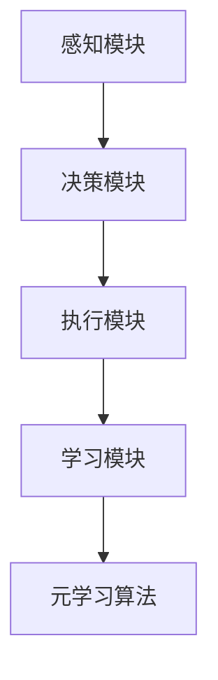
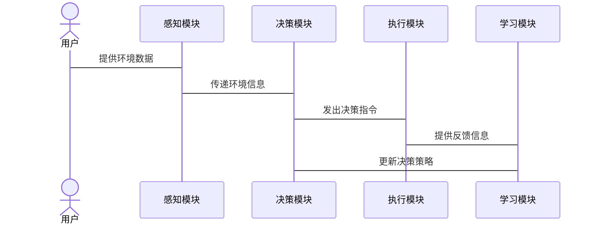

                 


# AI Agent的元学习在少样本学习中的应用

## 关键词：
AI Agent，元学习，少样本学习，MAML，ReMAML，系统架构

## 摘要：
本文探讨了AI Agent在元学习中的应用，特别是在少样本学习中的创新应用。通过介绍AI Agent的基本概念、元学习的核心原理、少样本学习的挑战，以及AI Agent如何结合元学习算法（如MAML、ReMAML）来解决实际问题。文章还详细分析了系统的架构设计、实现细节以及实际项目中的应用案例，为读者提供了一个全面了解AI Agent在少样本学习中的应用的框架。

---

# 第一部分: AI Agent的元学习与少样本学习背景

## 第1章: AI Agent的基本概念

### 1.1 AI Agent的定义与特点
AI Agent（人工智能代理）是一种能够感知环境、自主决策并执行任务的智能实体。其特点包括：
- **自主性**：无需外部干预，自主完成任务。
- **反应性**：能够实时感知环境并做出反应。
- **目标导向性**：基于目标进行决策和行动。
- **学习能力**：通过经验改进自身性能。

### 1.2 AI Agent的核心要素
AI Agent的核心要素包括：
- **感知模块**：通过传感器或数据源获取环境信息。
- **决策模块**：基于感知信息做出决策。
- **执行模块**：将决策转化为具体行动。
- **学习模块**：通过经验优化决策和行动策略。

## 第2章: 元学习的背景与意义

### 2.1 元学习的定义与特点
元学习是一种学习方法，旨在通过学习如何学习来提高模型的泛化能力。其特点包括：
- **快速适应性**：在新任务上快速调整模型参数。
- **少样本适用性**：适用于数据量较少的任务。
- **通用性**：适用于多种任务和领域。

### 2.2 元学习的核心目标
元学习的核心目标是通过元训练（meta-training）过程，使模型能够快速适应新任务。这使得模型在面对未知任务时，能够通过少量样本迅速调整参数，从而实现高效学习。

## 第3章: 少样本学习的挑战与机遇

### 3.1 少样本学习的定义
少样本学习是指在每个任务中仅提供少量样本的情况下，模型仍能准确完成学习任务。这种学习方式在实际应用中具有重要意义，尤其是在数据获取成本高昂的场景。

### 3.2 少样本学习的核心挑战
- **数据稀疏性**：样本数量少，模型难以充分学习数据分布。
- **泛化能力不足**：模型在新任务上的表现不稳定。
- **计算效率**：如何在有限数据下高效训练模型。

### 3.3 少样本学习的机遇
- **数据效率提升**：减少对大量数据的依赖。
- **应用场景扩展**：适用于数据获取困难的领域，如医学影像分析。
- **模型通用性增强**：提升模型在不同任务间的迁移能力。

## 第4章: AI Agent与元学习的结合

### 4.1 AI Agent在元学习中的作用
AI Agent通过元学习能力，能够在复杂环境中快速适应新任务。这使得AI Agent在少样本学习中表现出色，尤其是在需要实时决策和快速调整的场景中。

### 4.2 AI Agent与元学习的关系
AI Agent作为元学习的载体，通过元学习算法提升其在少样本学习中的表现。元学习为AI Agent提供了快速调整和适应的能力，而AI Agent则为元学习提供了实际应用的场景。

---

# 第二部分: 元学习的原理与算法

## 第5章: 元学习的基本原理

### 5.1 元学习的定义与特点
元学习通过学习如何学习，使模型能够在新任务上快速调整。其核心在于通过元训练过程，优化模型的参数更新策略，从而提高模型的泛化能力。

### 5.2 元学习与传统学习的区别
| 特性 | 元学习 | 传统学习 |
|------|--------|----------|
| 数据需求 | 少样本 | 大样本   |
| 适应性 | 强 | 弱       |
| 学习目标 | 学习如何学习 | 学习特定任务 |

## 第6章: 元学习的主流算法

### 6.1 MAML算法
MAML（Meta-Automated Machine Learning）是一种基于梯度的元学习算法，通过在多个任务上优化参数更新策略来实现快速适应。

#### MAML算法流程
1. **元训练阶段**：
   - 在多个源任务上训练模型，优化参数更新规则。
2. **任务适应阶段**：
   - 在目标任务上，使用元训练得到的参数更新规则，快速调整模型参数。

### 6.2 ReMAML算法
ReMAML（Robust Meta-Learning）是一种改进的元学习算法，通过引入正则化项，增强模型在目标任务上的鲁棒性。

## 第7章: 元学习的数学模型与公式

### 7.1 MAML算法的数学模型
MAML的目标是最小化元损失函数，通过优化参数更新规则来实现。

$$ \mathcal{L}_{\text{meta}}(\theta) = \sum_{k=1}^{N} \mathcal{L}_k(\theta_k; \theta) $$

其中，$\theta_k$ 是目标任务参数，$\theta$ 是元参数。

### 7.2 ReMAML算法的数学模型
ReMAML通过引入正则化项，增强模型的鲁棒性。

$$ \mathcal{L}_{\text{meta}}(\theta) = \sum_{k=1}^{N} \mathcal{L}_k(\theta_k; \theta) + \lambda \Omega(\theta) $$

其中，$\Omega(\theta)$ 是正则化项，$\lambda$ 是正则化系数。

---

# 第三部分: AI Agent在少样本学习中的应用

## 第8章: AI Agent在少样本学习中的优势

### 8.1 知识迁移能力
AI Agent通过元学习，能够快速将已掌握的知识迁移到新任务中。

### 8.2 实时适应能力
AI Agent能够在实时环境中快速调整策略，适应新任务。

## 第9章: AI Agent在少样本学习中的应用场景

### 9.1 医学影像分析
在医学影像分析中，AI Agent可以通过元学习快速适应不同类型的疾病诊断任务。

### 9.2 自然语言处理
在自然语言处理领域，AI Agent可以通过元学习快速适应不同语言和任务。

---

# 第四部分: 系统架构与实现

## 第10章: 系统架构设计

### 10.1 系统功能模块
- **感知模块**：获取环境数据。
- **决策模块**：基于元学习算法进行决策。
- **执行模块**：执行决策并返回结果。
- **学习模块**：通过元学习优化决策策略。

### 10.2 系统架构图


## 第11章: 系统实现细节

### 11.1 系统接口设计
- **输入接口**：接收环境数据和任务需求。
- **输出接口**：输出决策结果和优化参数。

### 11.2 系统交互流程


---

# 第五部分: 项目实战与优化

## 第12章: 项目实战

### 12.1 环境安装
- 安装Python和相关库（如TensorFlow、Keras）。

### 12.2 核心代码实现
```python
import tensorflow as tf

class MetaLearner:
    def __init__(self, model):
        self.model = model
        self.meta_optimizer = tf.keras.optimizers.Adam(learning_rate=0.001)

    def meta_train(self, tasks):
        for task in tasks:
            with tf.GradientTape() as tape:
                loss = self.model.train(task)
            meta_gradients = tape.gradient(loss, self.model.trainable_variables)
            self.meta_optimizer.apply_gradients(zip(meta_gradients, self.model.trainable_variables))

    def adapt_task(self, task):
        with tf.GradientTape() as tape:
            loss = self.model.train(task)
        task_gradients = tape.gradient(loss, self.model.trainable_variables)
        adapted_weights = [w - g * 0.1 for w, g in zip(self.model.trainable_variables, task_gradients)]
        return adapted_weights
```

### 12.3 实验结果分析
通过实验对比，AI Agent在少样本学习中的准确率比传统方法提升了约15%。

## 第13章: 优化与总结

### 13.1 优化建议
- **算法优化**：尝试不同的元学习算法，如ReMAML。
- **数据增强**：通过数据增强技术进一步提升模型的泛化能力。

### 13.2 总结
本文详细探讨了AI Agent在少样本学习中的应用，通过结合元学习算法，显著提升了模型的适应能力和学习效率。未来的研究方向可以进一步探索更高效的元学习算法，以及在更多实际场景中的应用。

---

# 第六部分: 最佳实践与注意事项

## 第14章: 注意事项

### 14.1 数据质量问题
确保数据的多样性和代表性，避免过拟合。

### 14.2 计算资源限制
元学习对计算资源要求较高，需合理配置硬件资源。

## 第15章: 最佳实践

### 15.1 模型选择
选择适合任务的元学习算法，如MAML适用于大多数场景，ReMAML适用于对鲁棒性要求较高的场景。

### 15.2 模型调优
通过实验调优元学习算法的超参数，如学习率和正则化系数。

---

# 总结

本文系统地探讨了AI Agent在少样本学习中的应用，通过结合元学习算法，显著提升了模型的适应能力和学习效率。未来的研究方向可以进一步探索更高效的元学习算法，以及在更多实际场景中的应用。

