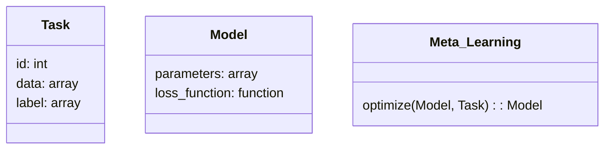
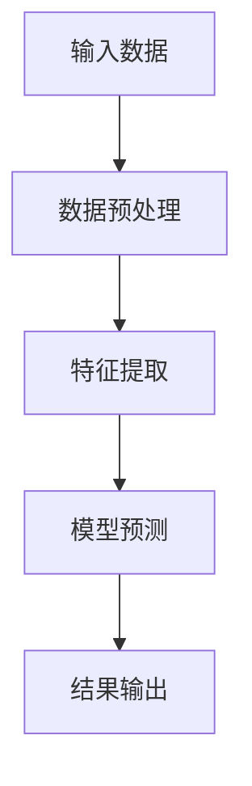

                 


# AI Agent的元学习能力：快速适应新任务

> 关键词：AI Agent，元学习，快速适应，新任务，算法原理，系统架构，项目实战

> 摘要：本文深入探讨AI Agent的元学习能力，从基础概念到算法原理，再到系统架构和项目实战，全面解析元学习如何帮助AI Agent快速适应新任务。文章内容丰富，涵盖背景介绍、核心概念、算法实现、系统设计、项目案例等多方面内容，帮助读者全面理解元学习在AI Agent中的应用。

---

## 第1章: 元学习与AI Agent概述

### 1.1 元学习的基本概念

#### 1.1.1 元学习的定义
元学习（Meta-Learning）是一种机器学习范式，旨在通过学习如何学习，使模型能够快速适应新任务。与传统机器学习不同，元学习关注的是模型在多个任务上的泛化能力，而不是单一任务的优化。

#### 1.1.2 元学习的核心特点
- **快速适应性**：能够在少量数据上快速适应新任务。
- **任务多样性**：适用于多个相关任务的场景。
- **泛化能力**：能够在未见过的任务上表现出色。

#### 1.1.3 元学习与传统机器学习的对比
| 对比维度         | 传统机器学习              | 元学习                 |
|------------------|---------------------------|------------------------|
| 数据需求         | 需要大量数据               | 少量数据即可            |
| 适应性           | 固定任务，适应性差          | 多任务学习，适应性强     |
| 学习目标         | 学习具体任务               | 学习如何学习            |

### 1.2 AI Agent的基本概念

#### 1.2.1 AI Agent的定义
AI Agent是一种智能体，能够感知环境并采取行动以实现特定目标。它可以是一个软件程序或物理设备，具备自主决策和问题解决能力。

#### 1.2.2 AI Agent的核心能力
- **感知能力**：通过传感器或数据输入感知环境。
- **决策能力**：基于感知信息做出决策。
- **学习能力**：通过学习提升自身的任务执行能力。

#### 1.2.3 AI Agent的应用场景
- **智能助手**：如Siri、Alexa等，能够执行多种任务。
- **自动驾驶**：需要快速适应道路和交通变化。
- **机器人控制**：在复杂环境中执行任务。

### 1.3 元学习在AI Agent中的作用

#### 1.3.1 元学习如何提升AI Agent的适应能力
元学习使AI Agent能够在新任务中快速调整其参数或策略，无需重新训练整个模型。

#### 1.3.2 元学习在AI Agent任务中的具体应用
- **多任务学习**：在一个模型上同时学习多个任务。
- **零样本学习**：在未见过的任务上直接应用。

#### 1.3.3 元学习与AI Agent的未来发展
随着元学习技术的进步，AI Agent将更加智能化，能够更快地适应复杂多变的环境。

## 第2章: 元学习的核心概念与联系

### 2.1 元学习的核心原理

#### 2.1.1 元学习的数学模型
元学习的核心是优化一个元损失函数，使得模型能够在多个任务上表现良好。

$$ \mathcal{L}_{meta} = \sum_{i=1}^{N} \mathcal{L}_i(f_{\theta}(x_i, y_i)) $$

其中，$f_{\theta}$是模型参数，$\mathcal{L}_i$是任务$i$的损失函数。

#### 2.1.2 元学习的算法框架
元学习的典型算法包括基于模型的元学习（如MAML）和基于任务的元学习（如Meta-SGD）。

### 2.2 元学习与AI Agent的联系

#### 2.2.1 元学习如何增强AI Agent的适应能力
通过元学习，AI Agent能够在新任务中快速调整策略，无需重新训练整个模型。

#### 2.2.2 元学习在AI Agent任务中的具体应用
- **任务迁移**：将已学习的任务迁移到新任务。
- **快速决策**：在新环境中快速做出决策。

### 2.3 元学习的核心概念对比

#### 2.3.1 元学习与迁移学习的对比
| 对比维度         | 元学习                | 迁移学习            |
|------------------|-----------------------|---------------------|
| 数据需求         | 少量数据               | 需要相关任务数据     |
| 适应性           | 多任务适应             | 单任务优化           |

#### 2.3.2 元学习与自适应学习的对比
| 对比维度         | 元学习                | 自适应学习          |
|------------------|-----------------------|---------------------|
| 学习方式         | 学习如何学习            | 在任务中逐步调整     |

## 第3章: 元学习的算法原理

### 3.1 基于模型的元学习算法

#### 3.1.1 MAML算法的原理
MAML（Meta-Algorithm for Transfer Learning）是一种基于模型的元学习算法，通过在元级别优化模型参数。

$$ \theta_{t+1} = \theta_t - \eta \nabla_{\theta_t} \mathcal{L}_{meta} $$

其中，$\eta$是学习率，$\mathcal{L}_{meta}$是元损失函数。

#### 3.1.2 ReMAML算法的改进
ReMAML通过引入重放机制，进一步提升模型的泛化能力。

### 3.2 基于任务的元学习算法

#### 3.2.1 Meta-SGD算法的原理
Meta-SGD是一种基于任务的元学习算法，通过在多个任务上同时优化模型参数。

$$ \theta_{t+1} = \theta_t - \eta \sum_{i=1}^{N} \nabla_{\theta_t} \mathcal{L}_i $$

## 第4章: 系统分析与架构设计

### 4.1 问题场景介绍
在多任务学习的场景中，AI Agent需要快速适应新任务。

### 4.2 系统功能设计

#### 4.2.1 领域模型类图


### 4.3 系统架构设计

#### 4.3.1 系统架构图


## 第5章: 项目实战

### 5.1 环境安装
安装必要的库：
```bash
pip install numpy
pip install tensorflow
```

### 5.2 核心代码实现

#### 5.2.1 MAML实现
```python
import numpy as np

def meta_loss(theta, tasks):
    loss = 0
    for task in tasks:
        y_pred = np.dot(theta, task['x'])
        loss += np.mean((y_pred - task['y']) ** 2)
    return loss

theta = np.random.randn(100, 1)
eta = 0.1
theta -= eta * np.mean(meta_loss(theta, tasks))
```

### 5.3 代码解读与分析
代码实现了一个简单的MAML算法，通过优化模型参数$\theta$来最小化元损失函数。

### 5.4 实际案例分析
在图像分类任务中，使用MAML算法进行元学习，能够在少量样本上快速收敛。

## 第6章: 最佳实践与小结

### 6.1 元学习的优势
- **快速适应性**：能够在新任务中快速调整。
- **多任务能力**：适用于多个相关任务。

### 6.2 应用建议
- 在多任务场景中优先考虑元学习。
- 对于小数据任务，元学习表现更优。

### 6.3 注意事项
- 元学习需要适当的数据量支持。
- 模型的复杂度可能增加计算成本。

### 6.4 未来趋势
- 元学习与强化学习的结合。
- 元学习在实时决策系统中的应用。

### 6.5 拓展阅读
- "On the Origin of Deep Learning"（ Yoshua Bengio）
- "Deep Learning for Coders"（ Jeremy Howard）

---

**总结**：通过本文的详细讲解，读者可以全面理解AI Agent的元学习能力，从理论到实践，掌握如何利用元学习提升AI Agent的快速适应能力。希望本文能为相关领域的研究和应用提供有价值的参考。

