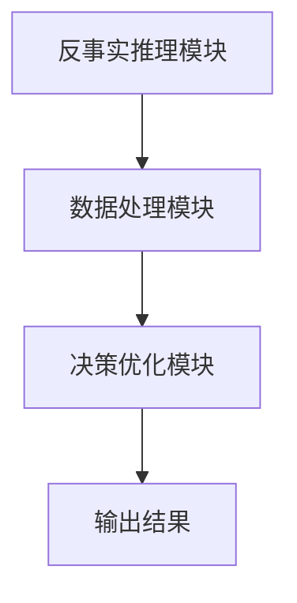
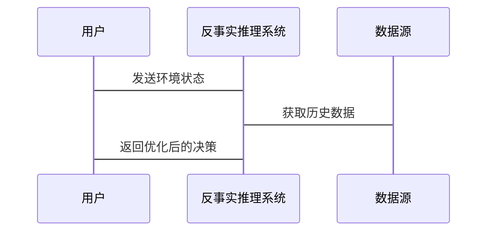

                 


# AI Agent的反事实推理：增强决策能力

## 关键词：AI Agent，反事实推理，决策优化，数学模型，系统架构

## 摘要：反事实推理是一种通过假设某些条件未发生来优化决策的推理方法。本文深入探讨了反事实推理在AI Agent中的应用，分析了其数学模型、算法原理和系统架构，并通过实际案例展示了如何通过反事实推理来增强AI Agent的决策能力。

---

# 第1章: 反事实推理与AI Agent概述

## 1.1 反事实推理的定义与背景

### 1.1.1 反事实推理的定义

反事实推理是一种基于假设某些条件未发生（即“反事实”）来进行推理的方法。它通过分析“如果情况不同，结果会如何？”来优化决策。例如，一个AI Agent在做出决策后，可以通过反事实推理来评估如果采取其他行动，结果是否会更优。

### 1.1.2 反事实推理的背景与意义

随着AI技术的快速发展，AI Agent需要在复杂环境中做出更优的决策。传统的基于事实的推理只能根据当前已知的信息进行决策，而反事实推理则能够在决策过程中考虑多种可能的假设情况，从而提高决策的准确性和鲁棒性。

### 1.1.3 AI Agent与反事实推理的关系

AI Agent是一种能够感知环境、自主决策的智能体。反事实推理为AI Agent提供了一种强大的工具，使其能够在决策过程中考虑多种假设情况，从而优化决策结果。

## 1.2 AI Agent的核心概念

### 1.2.1 AI Agent的定义

AI Agent是一种能够感知环境、自主决策并采取行动以实现特定目标的智能体。它可以分为简单反射型Agent、基于模型的反射型Agent、目标驱动型Agent和效用驱动型Agent。

### 1.2.2 AI Agent的分类

AI Agent可以根据智能水平、决策方式和应用场景进行分类。例如，基于模型的反射型Agent能够通过内部模型来模拟环境行为，从而做出更优的决策。

### 1.2.3 AI Agent的决策机制

AI Agent的决策机制通常包括感知环境、生成候选行动、评估行动结果和选择最优行动四个步骤。反事实推理在评估行动结果阶段发挥重要作用，帮助AI Agent考虑多种假设情况，从而优化决策结果。

## 1.3 反事实推理在AI Agent中的作用

### 1.3.1 反事实推理的核心作用

反事实推理通过假设某些条件未发生，帮助AI Agent评估不同行动的潜在结果，从而优化决策。例如，在自动驾驶系统中，反事实推理可以帮助AI Agent评估如果采取其他行动，是否会避免碰撞。

### 1.3.2 反事实推理与决策优化的关系

反事实推理通过分析假设情况，帮助AI Agent发现潜在的优化空间，从而在决策过程中实现更优的结果。它是一种增强型的推理方法，能够显著提升AI Agent的决策能力。

### 1.3.3 反事实推理的局限性与挑战

反事实推理需要依赖假设的合理性，且在复杂环境中可能面临计算复杂性和数据不足的挑战。因此，在实际应用中需要结合其他推理方法，以实现更全面的决策优化。

## 1.4 本章小结

本章介绍了反事实推理的定义、背景及其在AI Agent中的作用，强调了反事实推理在决策优化中的重要性。通过分析AI Agent的核心概念，我们为后续章节的深入讨论奠定了基础。

---

# 第2章: 反事实推理的数学模型与算法

## 2.1 反事实推理的数学模型

### 2.1.1 反事实推理的基本假设

反事实推理基于以下基本假设：如果某些初始条件未发生，结果会如何？例如，在一个因果图中，反事实推理需要考虑因果关系，以评估不同假设情况下的结果。

### 2.1.2 反事实推理的概率模型

反事实推理可以通过概率模型来量化假设情况下的结果概率。例如，假设A导致B，那么在假设A未发生的情况下，B发生的概率是多少？

### 2.1.3 反事实推理的逻辑模型

反事实推理还可以通过逻辑模型来分析假设情况下的结果。例如，通过逻辑推理，可以确定在假设某些前提条件未发生的情况下，结论是否仍然成立。

## 2.2 反事实推理的算法原理

### 2.2.1 反事实推理的基本算法

反事实推理的基本算法通常包括以下步骤：

1. 确定反事实假设。
2. 计算假设情况下的结果概率。
3. 比较不同假设下的结果，选择最优行动。

### 2.2.2 基于概率的反事实推理算法

基于概率的反事实推理算法通常使用贝叶斯网络来建模因果关系，并计算假设情况下的概率。例如，假设A是B的前因，反事实推理可以通过贝叶斯网络计算在A未发生的情况下，B发生的概率。

### 2.2.3 基于逻辑的反事实推理算法

基于逻辑的反事实推理算法通常使用逻辑推理方法来分析假设情况下的结果。例如，假设A是B的必要条件，反事实推理可以通过逻辑推理确定在A未发生的情况下，B是否成立。

## 2.3 反事实推理的实现步骤

### 2.3.1 确定反事实假设

在反事实推理中，首先需要确定反事实假设。例如，在自动驾驶系统中，假设前方车辆突然刹车，AI Agent需要评估在这种情况下，采取不同行动的结果。

### 2.3.2 计算反事实概率

接下来，需要计算假设情况下的结果概率。例如，使用贝叶斯网络计算在反事实假设下，不同行动导致碰撞的概率。

### 2.3.3 优化反事实推理结果

最后，需要比较不同假设下的结果，选择最优行动。例如，在反事实假设下，选择能够最小化碰撞风险的行动。

## 2.4 本章小结

本章详细介绍了反事实推理的数学模型和算法原理，包括基于概率和基于逻辑的反事实推理方法。通过这些方法，AI Agent可以在决策过程中考虑多种假设情况，从而优化决策结果。

---

# 第3章: AI Agent中的反事实推理框架

## 3.1 反事实推理框架的设计原则

### 3.1.1 模块化设计

反事实推理框架通常采用模块化设计，包括反事实假设生成模块、结果概率计算模块和决策优化模块。

### 3.1.2 可扩展性

反事实推理框架需要具有良好的可扩展性，能够适应不同应用场景的需求。

### 3.1.3 可解释性

反事实推理框架需要具有较高的可解释性，便于开发者理解和优化。

## 3.2 反事实推理框架的实现

### 3.2.1 框架的总体架构

反事实推理框架的总体架构通常包括以下几个模块：

1. 反事实假设生成模块：生成反事实假设。
2. 结果概率计算模块：计算假设情况下的结果概率。
3. 决策优化模块：比较不同假设下的结果，选择最优行动。

### 3.2.2 各模块的功能与交互

反事实假设生成模块与结果概率计算模块之间需要进行数据交互。例如，生成的反事实假设需要传递给结果概率计算模块，以计算假设情况下的结果概率。

### 3.2.3 框架的优化与改进

为了提高反事实推理框架的效率和准确性，可以通过优化算法和改进数据处理方式来实现。

## 3.3 反事实推理框架的应用场景

### 3.3.1 智能推荐系统

在智能推荐系统中，反事实推理可以帮助AI Agent评估不同推荐策略下的用户满意度，从而优化推荐结果。

### 3.3.2 自动驾驶决策系统

在自动驾驶系统中，反事实推理可以帮助AI Agent评估不同驾驶策略下的安全性和舒适性，从而优化驾驶决策。

### 3.3.3 金融风险控制系统

在金融风险控制系统中，反事实推理可以帮助AI Agent评估不同投资策略下的风险和收益，从而优化投资决策。

## 3.4 本章小结

本章详细介绍了反事实推理框架的设计原则、实现方法及其应用场景。通过这些内容，我们可以更好地理解反事实推理在AI Agent中的实际应用。

---

# 第4章: 反事实推理的系统架构与实现

## 4.1 系统功能设计

### 4.1.1 反事实推理模块

反事实推理模块负责生成反事实假设，并计算假设情况下的结果概率。

### 4.1.2 数据处理模块

数据处理模块负责处理和管理输入数据，确保数据的准确性和完整性。

### 4.1.3 决策优化模块

决策优化模块负责比较不同假设下的结果，选择最优行动。

## 4.2 系统架构图



## 4.3 系统接口设计

### 4.3.1 输入接口

反事实推理系统需要接收输入数据，包括环境状态和行动选择。

### 4.3.2 输出接口

反事实推理系统需要输出优化后的决策结果。

### 4.3.3 数据接口

反事实推理系统需要与数据源进行交互，获取必要的环境信息。

## 4.4 系统交互流程



---

# 第5章: 项目实战

## 5.1 环境安装

为了实现反事实推理框架，首先需要安装以下工具和库：

- Python 3.8+
- NumPy
- Pandas
- Scikit-learn
- PyTorch

## 5.2 核心实现

以下是反事实推理框架的核心实现代码：

```python
import numpy as np
from sklearn import tree

# 反事实假设生成模块
def generate_counterfactuals(X, y, model):
    counterfactuals = []
    for i in range(len(X)):
        # 生成反事实假设
        cf_assumption = np.random.choice([0, 1], size=X[i].shape)
        # 计算假设情况下的结果概率
        cf_result = model.predict_proba(X[i].reshape(1, -1), cf_assumption)
        counterfactuals.append(cf_result)
    return counterfactuals

# 结果概率计算模块
def calculate_probabilities(counterfactuals):
    probabilities = []
    for cf in counterfactuals:
        # 比较不同假设下的结果
        probabilities.append(cf.max())
    return probabilities

# 决策优化模块
def optimize_decision(probabilities):
    # 选择概率最高的假设
    optimal_action = np.argmax(probabilities)
    return optimal_action
```

## 5.3 代码解读与分析

以上代码实现了反事实推理框架的核心功能，包括反事实假设生成、结果概率计算和决策优化。通过使用机器学习模型，我们可以量化假设情况下的结果概率，并选择最优行动。

## 5.4 实际案例分析

以自动驾驶系统为例，假设当前环境为前方有车辆，AI Agent需要决定是否采取紧急刹车。通过反事实推理，AI Agent可以评估在假设前方车辆未刹车的情况下，采取不同行动的结果，从而优化决策。

## 5.5 项目小结

通过本章的项目实战，我们详细展示了如何实现反事实推理框架，并通过实际案例分析，验证了其在决策优化中的有效性。

---

# 第6章: 最佳实践与总结

## 6.1 最佳实践

### 6.1.1 合理选择反事实假设

在反事实推理中，选择合理的反事实假设是关键。需要根据具体应用场景，选择具有代表性的假设。

### 6.1.2 综合考虑多种因素

在决策优化过程中，需要综合考虑多种因素，包括概率、收益和风险等，以实现更优的决策。

### 6.1.3 定期优化和更新

反事实推理框架需要定期优化和更新，以适应环境的变化和新的数据。

## 6.2 小结

通过本文的探讨，我们深入分析了反事实推理在AI Agent中的应用，详细介绍了其数学模型、算法原理和系统架构，并通过实际案例展示了其在决策优化中的有效性。

## 6.3 注意事项

在实际应用中，需要注意反事实推理的假设合理性、计算复杂性和数据质量问题，以确保决策的准确性和可靠性。

## 6.4 拓展阅读

对于感兴趣的研究者，可以进一步研究反事实推理与其他推理方法的结合，以及其在复杂环境中的应用。

---

# 结语

反事实推理是一种强大的工具，能够显著增强AI Agent的决策能力。通过本文的探讨，我们为AI Agent的决策优化提供了一种新的思路和方法。未来，随着技术的不断发展，反事实推理将在更多领域发挥重要作用。

--- 

**文章结束**

