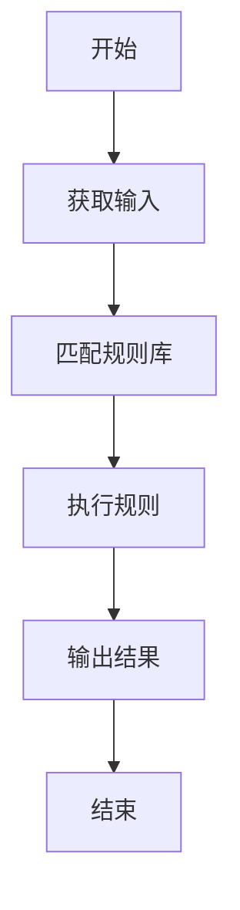
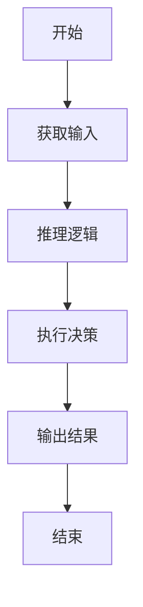
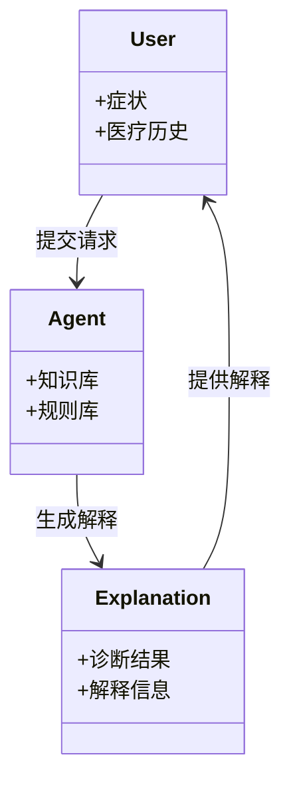

                 


# AI Agent的可解释性设计原则

## 关键词：AI Agent, 可解释性, 人工智能, 伦理, 技术信任

## 摘要：  
AI Agent的可解释性设计是当前人工智能领域的重要研究方向。随着AI Agent技术的广泛应用，其决策过程的透明性和可解释性变得至关重要。本文从AI Agent的基本概念出发，系统阐述了可解释性设计的核心原则，分析了可解释性模型的核心原理，探讨了可解释性AI Agent的算法实现，详细解读了可解释性设计的数学模型，并通过实际案例分析了系统设计与实现方案。本文最后总结了AI Agent可解释性设计的最佳实践，为读者提供了全面的理论指导和实践参考。

---

# 第一部分: AI Agent的可解释性设计背景与核心概念

## 第1章: AI Agent的概述与可解释性的重要性

### 1.1 AI Agent的基本概念
#### 1.1.1 AI Agent的定义与分类
AI Agent（人工智能代理）是指能够感知环境、自主决策并执行任务的智能实体。根据功能和应用场景的不同，AI Agent可以分为多种类型：
- **基于规则的AI Agent**：通过预定义的规则进行决策，适用于简单的任务。
- **基于逻辑的AI Agent**：通过逻辑推理进行决策，适用于复杂问题。
- **基于模型的AI Agent**：利用模型预测未来状态并进行决策，适用于动态环境。
- **基于强化学习的AI Agent**：通过与环境交互学习最优策略，适用于复杂任务。

#### 1.1.2 可解释性在AI Agent中的必要性
随着AI Agent技术的广泛应用，其决策过程的透明性和可解释性变得至关重要。可解释性可以帮助用户理解AI Agent的决策依据，增强技术信任，同时也有助于发现和修正潜在的错误。

#### 1.1.3 可解释性与AI Agent的伦理问题
AI Agent的可解释性不仅关乎技术本身，还涉及伦理问题。例如，当AI Agent的决策导致不良后果时，可解释性可以帮助明确责任归属，并为改进系统提供依据。

### 1.2 可解释性设计的核心背景
#### 1.2.1 当前AI Agent技术的发展现状
近年来，AI Agent技术在多个领域取得了显著进展，尤其是在自然语言处理、机器人控制和自动驾驶等领域。然而，随着技术的复杂化，其可解释性问题也日益突出。

#### 1.2.2 可解释性在AI Agent中的问题背景
AI Agent的决策过程往往涉及复杂的算法和大量数据，这使得其决策过程难以被人类理解。这种不可解释性不仅影响用户体验，还可能导致技术信任的缺失。

#### 1.2.3 可解释性设计的目标与意义
可解释性设计的目标是通过简化和透明化AI Agent的决策过程，使其能够被人类理解和验证。这不仅可以增强用户信任，还能帮助开发者发现和修复系统中的潜在问题。

---

## 第2章: 可解释性模型的核心原理

### 2.1 可解释性模型的分类
#### 2.1.1 基于规则的解释性模型
基于规则的解释性模型通过预定义的规则进行决策，并能够清晰地解释每个决策的依据。例如，医疗诊断系统可以根据预定义的医学规则生成诊断建议，并解释每个建议的依据。

#### 2.1.2 基于逻辑的解释性模型
基于逻辑的解释性模型通过逻辑推理进行决策，并能够提供逻辑推理的过程和结果。例如，法律推理系统可以根据法律条文进行推理，并解释每个推理步骤。

#### 2.1.3 基于模型的解释性模型
基于模型的解释性模型通过构建数学模型进行决策，并能够解释模型的输入、输出和中间过程。例如，经济预测模型可以通过解释模型的参数和假设来说明其预测结果。

### 2.2 解释性模型的属性特征对比
下表对比了不同解释性模型的属性特征：

| 模型类型 | 解释性 | 可定制性 | 透明性 | 稳定性 |
|----------|--------|----------|--------|--------|
| 基于规则的模型 | 高 | 高 | 高 | 中 |
| 基于逻辑的模型 | 中 | 中 | 中 | 高 |
| 基于模型的模型 | 低 | 低 | 低 | 高 |

### 2.3 可解释性模型的ER实体关系图
下图展示了可解释性模型的ER实体关系图：

```mermaid
er
actor: 用户
agent: AI代理
explanation: 解释信息
goal: 目标
action: 行动
knowledge: 知识库
rule: 规则
```

---

## 第3章: 可解释性AI Agent的算法实现

### 3.1 基于规则的AI Agent算法
#### 3.1.1 算法原理与流程
基于规则的AI Agent算法通过预定义的规则进行决策。其流程如下：
1. 获取输入。
2. 匹配规则库中的规则。
3. 执行匹配的规则。
4. 输出结果。

下图展示了基于规则的AI Agent算法的流程图：



#### 3.1.2 Python实现示例
以下是基于规则的AI Agent算法的Python实现示例：

```python
def rule_based_agent(input):
    for rule in rules:
        if rule.condition(input):
            return rule.action(input)
    return default_action(input)
```

---

### 3.2 基于逻辑的AI Agent算法
#### 3.2.1 算法原理与流程
基于逻辑的AI Agent算法通过逻辑推理进行决策。其流程如下：
1. 获取输入。
2. 推理逻辑。
3. 执行决策。
4. 输出结果。

下图展示了基于逻辑的AI Agent算法的流程图：



#### 3.2.2 Python实现示例
以下是基于逻辑的AI Agent算法的Python实现示例：

```python
def logic_based_agent(input):
    for logic in logics:
        if logic.preconditions(input):
            return logic.action(input)
    return default_action(input)
```

---

## 第4章: 可解释性设计的数学模型

### 4.1 基于规则的AI Agent数学模型
基于规则的AI Agent数学模型可以通过以下公式表示：

$$
\text{输出} = \sum_{i=1}^{n} \text{规则}_i \times \text{权重}_i
$$

其中，$\text{规则}_i$ 表示第i条规则，$\text{权重}_i$ 表示规则的重要性。

### 4.2 基于逻辑的AI Agent数学模型
基于逻辑的AI Agent数学模型可以通过以下公式表示：

$$
\text{输出} = \prod_{i=1}^{n} \text{逻辑}_i
$$

其中，$\text{逻辑}_i$ 表示第i条逻辑规则。

---

## 第5章: 系统分析与架构设计

### 5.1 问题场景介绍
以医疗诊断AI Agent为例，我们需要设计一个能够根据患者症状和医疗历史进行诊断的系统。

### 5.2 系统功能设计
下图展示了医疗诊断AI Agent的系统功能设计：



### 5.3 系统架构设计
下图展示了医疗诊断AI Agent的系统架构设计：


---

## 第6章: 项目实战

### 6.1 环境安装
需要安装以下工具：
- Python
- Mermaid
- LaTeX

### 6.2 系统核心实现源代码
以下是医疗诊断AI Agent的核心代码实现：

```python
class RuleBasedAgent:
    def __init__(self, rules):
        self.rules = rules

    def diagnose(self, symptoms):
        for rule in self.rules:
            if rule.check(symptoms):
                return rule.diagnose(symptoms)
        return "无法诊断"
```

### 6.3 代码应用解读与分析
上述代码定义了一个基于规则的医疗诊断AI Agent。通过预定义的规则，系统可以根据患者的症状进行诊断，并返回诊断结果。

---

## 第7章: 最佳实践与总结

### 7.1 最佳实践
- 在设计AI Agent时，应优先考虑可解释性。
- 使用简单的规则和逻辑模型，避免过于复杂的算法。
- 定期验证和更新规则库，确保系统的准确性和可解释性。

### 7.2 小结
本文系统地阐述了AI Agent的可解释性设计原则，分析了可解释性模型的核心原理，探讨了可解释性AI Agent的算法实现，并通过实际案例分析了系统设计与实现方案。最后，本文总结了AI Agent可解释性设计的最佳实践，为读者提供了全面的理论指导和实践参考。

### 7.3 注意事项
- 可解释性设计需要权衡模型的复杂性和性能。
- 在实际应用中，应根据具体需求选择合适的可解释性模型。

### 7.4 拓展阅读
- 《可解释的人工智能：模型、方法和工具》
- 《AI Agent的设计与实现》

