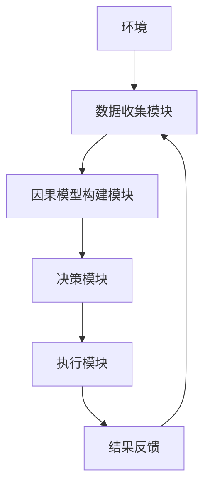

                 


# AI Agent的因果推理：增强决策能力

## 关键词：
- AI Agent
- 因果推理
- 决策能力
- 系统架构
- 项目实战

## 摘要：
本文深入探讨了AI Agent如何通过因果推理提升决策能力。首先介绍了因果推理的基本概念和其在决策中的重要性，接着详细讲解了因果发现和推断的算法及其在AI Agent中的应用。然后，通过系统架构设计和项目实战，展示了如何将因果推理整合到AI Agent中，实现更智能的决策。文章最后总结了最佳实践和未来的研究方向。

---

# 第1章：背景介绍

## 1.1 问题背景

### 1.1.1 AI Agent的定义与作用
AI Agent是一种智能实体，能够感知环境并采取行动以实现目标。它在自动驾驶、推荐系统和机器人等领域广泛应用。

### 1.1.2 决策能力在AI Agent中的重要性
决策能力是AI Agent的核心，决定了其在复杂环境中的表现。传统基于相关性的决策方法存在局限性，无法处理因果关系。

### 1.1.3 因果推理的引入及其必要性
因果推理帮助AI Agent理解因果关系，增强其在动态环境中的适应能力，是提升决策能力的关键。

## 1.2 问题描述

### 1.2.1 AI Agent决策中的挑战
动态环境和不确定性使得基于相关性的决策方法难以应对复杂问题，容易导致错误决策。

### 1.2.2 因果关系在决策中的关键作用
因果关系帮助AI Agent理解行动与结果之间的关系，能够预测和干预，从而做出更可靠的决策。

### 1.2.3 当前决策方法的局限性
传统方法仅关注相关性，忽视因果关系，导致在干预和反事实推理时表现不佳。

## 1.3 问题解决与边界

### 1.3.1 因果推理如何解决决策问题
因果推理帮助AI Agent理解因果关系，增强其在动态环境中的决策能力。

### 1.3.2 问题的边界与适用场景
因果推理适用于需要干预和反事实推理的场景，如医疗诊断和政策制定。

### 1.3.3 概念结构与核心要素
因果推理、因果图和潜在结果是核心要素，构建因果模型是解决问题的关键。

---

# 第2章：因果关系与因果图

## 2.1 因果关系的基本概念

### 2.1.1 因果关系的定义
因果关系是指一个事件是另一个事件的原因，因果图通过节点和边表示这些关系。

### 2.1.2 因果关系与相关性的区别
相关性表示变量之间的关联，而因果关系表示变量之间的因果联系。

## 2.2 因果图的构建

### 2.2.1 因果图的结构与表示
因果图由节点和边组成，节点代表变量，边表示因果关系。

### 2.2.2 贝叶斯网络与因果图的关系
贝叶斯网络可以表示因果图，但因果图更强调因果关系。

## 2.3 潜在结果与干预

### 2.3.1 潜在结果的定义
潜在结果是指在不同干预下的结果。

### 2.3.2 干预在因果推理中的作用
干预是通过改变某些变量的值，观察其对其他变量的影响，用于因果推断。

---

# 第3章：因果推理的核心原理

## 3.1 因果发现算法

### 3.1.1 基于约束的因果发现方法
PC算法通过条件独立性测试构建因果图。

### 3.1.2 基于评分的因果发现方法
BIC评分通过模型拟合度和复杂度评估因果图。

### 3.1.3 常见的因果发现算法对比
PC算法和Fast Causal Search算法对比。

## 3.2 因果推断的数学模型

### 3.2.1 因果效应的公式表示
因果效应公式：$$Y_{i}(do(X=x)) = \sum_{y} P(Y=y|X=x, \text{其他变量})$$

### 3.2.2 干预效果的计算公式
干预效果计算公式：$$P(Y=y|do(X=x)) = \sum_{x'} P(Y=y|X=x', \text{其他变量}) P(X=x' | do(X=x))$$

---

# 第4章：AI Agent的系统架构设计

## 4.1 系统组成与功能模块

### 4.1.1 数据收集模块
负责收集环境数据，包括观测数据和干预数据。

### 4.1.2 因果模型构建模块
使用因果发现算法构建因果图，识别因果关系。

### 4.1.3 决策模块
基于因果模型进行决策，计算潜在结果，选择最优行动。

### 4.1.4 执行模块
将决策结果转化为具体行动，与环境交互。

## 4.2 系统架构图



---

# 第5章：项目实战

## 5.1 环境配置与安装

### 5.1.1 安装依赖
安装Python、NumPy、Pandas和网络x算法库。

### 5.1.2 数据准备
收集相关数据，构建因果图。

## 5.2 核心代码实现

### 5.2.1 因果发现算法实现
```python
def pc_algorithm(data):
    # 实现PC算法，返回因果图
    pass
```

### 5.2.2 因果推断实现
```python
def do_calculus(data, causal_graph):
    # 实现因果推断，返回干预结果
    pass
```

## 5.3 案例分析与结果解读
通过实际案例，展示因果推理如何提升AI Agent的决策能力。

## 5.4 项目总结
总结项目成果，分析不足之处，并提出改进方向。

---

# 第6章：最佳实践与未来研究

## 6.1 最佳实践

### 6.1.1 数据质量的重要性
确保数据准确性和完整性，提高因果发现的准确性。

### 6.1.2 模型选择与优化
根据具体场景选择合适的因果发现算法，进行参数调优。

### 6.1.3 系统架构的可扩展性
设计灵活的系统架构，支持不同规模和复杂度的因果推理任务。

## 6.2 小结

本文系统地介绍了因果推理在AI Agent中的应用，通过理论分析和项目实战，展示了如何通过因果推理提升决策能力。

## 6.3 注意事项

在实际应用中，需注意数据质量和模型选择，避免忽略潜在的混杂变量。

## 6.4 拓展阅读

推荐相关书籍和论文，深入学习因果推理和AI Agent的知识。

---

通过以上结构，文章详细讲解了因果推理在AI Agent中的应用，从理论到实践，帮助读者全面理解并掌握相关技术。

