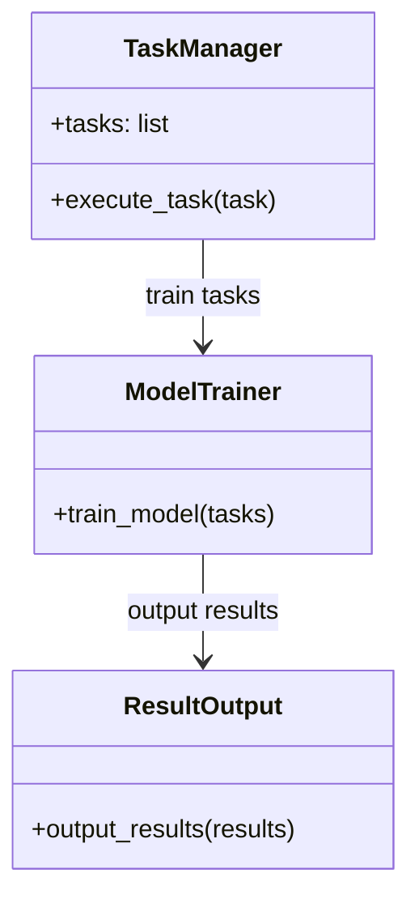
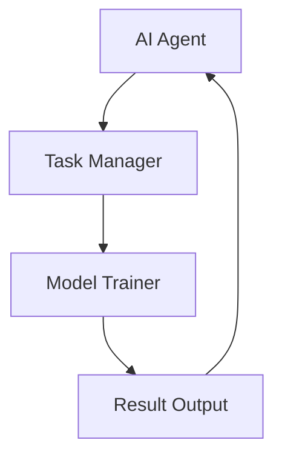
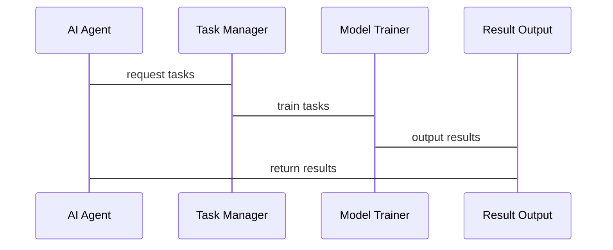

                 


# AI Agent的多任务学习能力：一专多能

## 关键词：AI Agent，多任务学习，一专多能，机器学习，人工智能

## 摘要：AI Agent的多任务学习能力是实现“一专多能”的关键。本文从AI Agent的基本概念出发，深入探讨多任务学习的原理、算法、系统架构和实际应用，通过具体案例分析，展示AI Agent如何通过多任务学习提升能力，涵盖数学公式、算法实现和系统设计等内容，帮助读者全面理解AI Agent的多任务学习能力。

---

# 第1章: AI Agent的基本概念与多任务学习的背景

## 1.1 AI Agent的基本概念

### 1.1.1 AI Agent的定义
AI Agent（人工智能代理）是指能够感知环境、自主决策并执行任务的智能实体。它通过传感器获取信息，利用算法进行分析和推理，并通过执行器与环境交互。

### 1.1.2 AI Agent的核心特征
- **自主性**：能够在没有外部干预的情况下独立运行。
- **反应性**：能够实时感知环境变化并做出反应。
- **目标导向**：具有明确的目标，并通过行动实现目标。
- **学习能力**：能够通过经验改进自身的性能。

### 1.1.3 AI Agent的应用场景
AI Agent广泛应用于自动驾驶、智能助手、机器人、推荐系统等领域。例如，智能助手（如Siri、Alexa）通过语音交互为用户提供服务，自动驾驶汽车通过多任务学习实现路径规划、障碍物识别等功能。

## 1.2 多任务学习的背景与意义

### 1.2.1 多任务学习的定义
多任务学习（Multi-Task Learning, MTL）是指同时学习多个任务，通过共享模型参数来提升各个任务的性能。与单一任务学习相比，MTL能够更好地利用数据和知识，减少数据需求，提高泛化能力。

### 1.2.2 多任务学习的必要性
在AI Agent中，单一任务学习难以应对复杂场景的需求。例如，一个自动驾驶汽车需要同时处理目标检测、路径规划、语义理解等多个任务，单一任务学习难以高效完成这些任务。

### 1.2.3 多任务学习的优势与挑战
- **优势**：
  - 提高模型的泛化能力。
  - 减少数据需求，降低训练成本。
  - 模型能够更好地捕捉任务之间的关联性。
- **挑战**：
  - 如何平衡各个任务的学习进度。
  - 如何设计有效的共享机制。
  - 如何处理任务之间的冲突。

## 1.3 多任务学习与AI Agent的结合

### 1.3.1 多任务学习在AI Agent中的作用
通过多任务学习，AI Agent能够同时掌握多种技能，如自然语言处理、图像识别、决策优化等，从而在复杂环境中表现出更强的适应能力。

### 1.3.2 多任务学习如何提升AI Agent的能力
多任务学习使AI Agent能够在单一模型中同时处理多个任务，减少模型切换带来的延迟和资源消耗，同时提高各个任务的性能。

### 1.3.3 多任务学习在AI Agent中的应用案例
例如，在智能客服系统中，AI Agent需要同时处理客户咨询、情绪分析、意图识别等多个任务，通过多任务学习可以实现这些任务的协同优化。

---

# 第2章: 多任务学习的核心概念与联系

## 2.1 多任务学习的原理

### 2.1.1 多任务学习的基本原理
多任务学习通过共享参数或模块，使模型能够在多个任务之间复用知识。例如，在图像分类任务中，不同任务可以共享卷积基，从而降低模型的复杂度。

### 2.1.2 多任务学习的数学模型
多任务学习的数学模型可以通过共享参数矩阵来表示。假设模型有两个任务，每个任务都有一个输出层，共享一个基矩阵：

$$
f_i(x) = W_i x + b_i \quad \text{其中} \quad W_1 = W_2
$$

### 2.1.3 多任务学习的优化目标
多任务学习的优化目标是在所有任务上最小化损失函数的总和：

$$
\min_{\theta} \sum_{i=1}^{n} L_i(\theta)
$$

其中，$\theta$是模型的参数，$L_i$是第i个任务的损失函数。

## 2.2 多任务学习中的任务关系

### 2.2.1 任务之间的关系类型
任务之间的关系可以分为互补、关联和无关三类。例如，图像分类任务中的“猫”和“狗”属于互补关系，而情感分析任务中的正面和负面属于关联关系。

### 2.2.2 任务之间的依赖性分析
通过分析任务之间的依赖性，可以优化模型的共享策略。例如，如果任务A依赖于任务B，可以通过任务B的参数影响任务A的性能。

### 2.2.3 任务之间的共享特征
任务之间的共享特征是多任务学习的关键。例如，在自然语言处理任务中，词向量的表示可以在多个任务中复用。

## 2.3 多任务学习中的模型共享机制

### 2.3.1 参数共享的实现方式
参数共享是多任务学习的核心机制之一。例如，在神经网络中，多个任务可以共享相同的嵌入层或卷积层。

### 2.3.2 模块共享的设计思路
模块共享是指将模型分解为多个模块，每个模块可以在不同的任务中复用。例如，图像分类任务和目标检测任务可以共享特征提取模块。

### 2.3.3 任务间的信息交互机制
通过门控机制或注意力机制，任务之间可以动态调整信息的共享程度。例如，使用门控机制控制不同任务的特征贡献。

## 2.4 多任务学习的评价指标

### 2.4.1 单任务性能评估
单任务性能评估通常使用准确率、召回率、F1值等指标。例如，图像分类任务的准确率可以衡量模型的性能。

### 2.4.2 跨任务性能评估
跨任务性能评估需要考虑模型在多个任务上的综合表现。例如，可以通过平均准确率或宏平均F1值来衡量模型的性能。

### 2.4.3 

---

# 第3章: 多任务学习算法的原理与实现

## 3.1 多任务学习算法的基本原理

### 3.1.1 基于共享参数的多任务学习
基于共享参数的多任务学习通过共享参数矩阵来优化多个任务。例如，使用共享的嵌入层来处理多个任务。

### 3.1.2 基于任务分解的多任务学习
任务分解方法将多任务学习问题分解为多个子任务，每个子任务负责一部分特征的提取和优化。

### 3.1.3 基于注意力机制的多任务学习
注意力机制通过动态调整任务之间的权重，实现任务之间的信息交互和共享。

## 3.2 多任务学习算法的实现步骤

### 3.2.1 数据预处理
数据预处理包括数据清洗、特征提取和数据增强。例如，将图像数据归一化处理，提取文本的词向量。

### 3.2.2 模型设计
模型设计包括选择共享参数的位置和任务模块的结构。例如，在神经网络中，共享的卷积层可以放置在模型的前端。

### 3.2.3 损失函数设计
损失函数设计需要考虑多个任务的损失。例如，使用加权平均的方法，给不同的任务分配不同的权重。

### 3.2.4 模型训练
模型训练使用梯度下降等优化算法，同时优化多个任务的损失。例如，使用Adam优化器进行训练。

## 3.3 多任务学习算法的数学模型

### 3.3.1 基于共享参数的数学模型
共享参数的数学模型可以通过共享权重矩阵来表示。例如：

$$
y_i = W x_i + b
$$

其中，$W$是共享的权重矩阵，$x_i$是第i个任务的输入，$y_i$是输出。

### 3.3.2 基于任务分解的数学模型
任务分解方法通过分解特征空间来实现任务之间的共享。例如：

$$
y_i = W_i x_i + b_i \quad \text{其中} \quad W_i = W \cdot U_i
$$

其中，$U_i$是任务i的分解矩阵，$W$是共享的基矩阵。

### 3.3.3 基于注意力机制的数学模型
注意力机制通过计算任务之间的相关性来动态调整权重。例如：

$$
\alpha_i = \text{softmax}(W_{at} [x_i, x_j])
$$

其中，$\alpha_i$是任务i的注意力权重，$W_{at}$是注意力权重矩阵。

## 3.4 多任务学习算法的实现代码

### 3.4.1 环境安装
安装必要的库，如TensorFlow和Keras：

```bash
pip install tensorflow==2.10.0 keras
```

### 3.4.2 核心代码实现
以下是基于Keras的多任务学习代码示例：

```python
import tensorflow as tf
from tensorflow import keras

# 定义模型
def build_model(input_shape):
    inputs = keras.Input(shape=input_shape)
    x = keras.layers.Dense(64, activation='relu')(inputs)
    # 共享层
    x = keras.layers.Dense(32, activation='relu')(x)
    output1 = keras.layers.Dense(10, activation='softmax')(x)
    output2 = keras.layers.Dense(5, activation='sigmoid')(x)
    model = keras.Model(inputs=inputs, outputs=[output1, output2])
    return model

# 编译模型
model = build_model((64,))
model.compile(optimizer='adam', loss='sparse_categorical_crossentropy', metrics='accuracy')

# 训练模型
# 假设X为输入数据，y1和y2为两个任务的标签
model.fit(X, (y1, y2), epochs=10, batch_size=32)
```

### 3.4.3 代码应用解读与分析
上述代码定义了一个多任务学习模型，模型包含一个共享的Dense层，分别输出两个任务的预测结果。通过共享层，模型能够在两个任务之间复用知识，从而提高性能。

---

# 第4章: AI Agent的系统分析与架构设计

## 4.1 问题场景介绍

### 4.1.1 问题背景
假设我们正在开发一个智能客服系统，AI Agent需要同时处理客户咨询、情绪分析、意图识别等多个任务。

### 4.1.2 系统目标
通过多任务学习，AI Agent能够同时完成多种任务，提高系统的智能化水平。

## 4.2 系统功能设计

### 4.2.1 领域模型设计
以下是领域模型的Mermaid类图：



### 4.2.2 系统架构设计
以下是系统架构的Mermaid图：



### 4.2.3 系统接口设计
系统接口包括任务管理接口、模型训练接口和结果输出接口。

## 4.3 系统交互设计

### 4.3.1 系统交互流程
以下是系统交互的Mermaid序列图：



---

# 第5章: 项目实战——AI Agent的多任务学习实现

## 5.1 环境安装

### 5.1.1 安装Python和必要的库
安装Python 3.8及以上版本，并安装TensorFlow和Keras：

```bash
pip install python==3.8.5
pip install tensorflow==2.10.0 keras
```

## 5.2 核心代码实现

### 5.2.1 数据预处理
以下是数据预处理的代码：

```python
import pandas as pd

# 加载数据
data = pd.read_csv('data.csv')

# 数据清洗
data = data.dropna()

# 特征提取
X = data[['feature1', 'feature2']]
y1 = data['label1']
y2 = data['label2']

# 数据增强
from sklearn.preprocessing import StandardScaler
scaler = StandardScaler()
X = scaler.fit_transform(X)
```

### 5.2.2 模型设计
以下是模型设计的代码：

```python
import tensorflow as tf
from tensorflow import keras

def build_model(input_shape):
    inputs = keras.Input(shape=input_shape)
    x = keras.layers.Dense(64, activation='relu')(inputs)
    x = keras.layers.Dense(32, activation='relu')(x)
    output1 = keras.layers.Dense(10, activation='softmax')(x)
    output2 = keras.layers.Dense(5, activation='sigmoid')(x)
    model = keras.Model(inputs=inputs, outputs=[output1, output2])
    return model

model = build_model((64,))
```

### 5.2.3 模型训练
以下是模型训练的代码：

```python
model.compile(optimizer='adam', loss='sparse_categorical_crossentropy', metrics='accuracy')
model.fit(X, (y1, y2), epochs=10, batch_size=32)
```

### 5.2.4 模型评估
以下是模型评估的代码：

```python
loss, (loss1, loss2) = model.evaluate(X, (y1, y2))
print(f"Task 1 Loss: {loss1}, Task 2 Loss: {loss2}")
```

## 5.3 项目小结

### 5.3.1 项目总结
通过多任务学习，AI Agent能够同时处理多个任务，提高系统的性能和效率。

### 5.3.2 经验与教训
在实际项目中，需要合理设计任务之间的共享机制，并通过实验验证模型的性能。

---

# 第6章: 总结与展望

## 6.1 总结

### 6.1.1 AI Agent的多任务学习能力
AI Agent的多任务学习能力是实现“一专多能”的关键。通过多任务学习，AI Agent能够同时处理多个任务，提高系统的智能化水平。

### 6.1.2 多任务学习的核心要点
多任务学习的核心是通过共享参数或模块，实现任务之间的知识复用，同时平衡各个任务的学习进度。

## 6.2 未来展望

### 6.2.1 多任务学习的发展方向
未来，多任务学习将更加注重任务之间的动态交互和自适应优化，同时探索更高效的共享机制。

### 6.2.2 AI Agent的未来发展趋势
AI Agent将朝着更智能、更自主的方向发展，能够处理更复杂、更多样化的任务。

## 6.3 最佳实践 tips

### 6.3.1 设计任务时的注意事项
- 确保任务之间的关联性，避免任务之间的冲突。
- 合理设计共享机制，避免过拟合。

### 6.3.2 模型优化的建议
- 使用数据增强技术，提高模型的泛化能力。
- 通过网格搜索或随机搜索，优化模型的超参数。

### 6.3.3 系统设计的注意事项
- 确保系统的可扩展性，方便新增任务。
- 合理设计系统的接口，方便模块之间的交互。

---

# 结语

通过本文的详细讲解，我们了解了AI Agent的多任务学习能力及其实现方法。多任务学习是提升AI Agent能力的关键，未来的研究将更加注重任务之间的动态交互和自适应优化。希望本文对读者理解AI Agent的多任务学习能力有所帮助。

--- 

# 拓展阅读

- [深度学习中的多任务学习综述](https://arxiv.org/abs/1803.04530)
- [多任务学习在自然语言处理中的应用](https://arxiv.org/abs/1901.01492)

