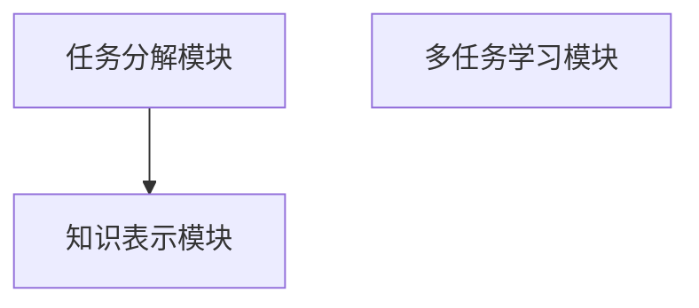
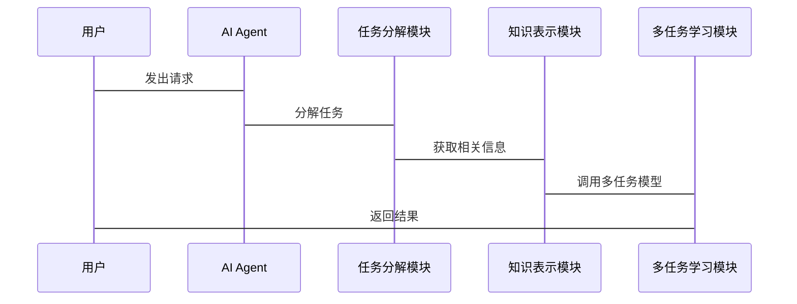

                 


# AI Agent的多任务学习：构建通用智能助手

> 关键词：AI Agent, 多任务学习, 通用智能助手, 知识表示, 任务分解, 多任务网络, 人工智能

> 摘要：本文将详细探讨AI Agent的多任务学习方法，从基础概念到算法实现，再到系统架构设计，最后通过项目实战展示如何构建一个通用智能助手。文章内容涵盖AI Agent的核心概念、多任务学习的原理、算法实现、系统设计以及实际应用案例，旨在为读者提供一个全面的视角，帮助理解如何通过多任务学习构建通用智能助手。

---

# 第1章: AI Agent与多任务学习概述

## 1.1 AI Agent的基本概念

### 1.1.1 AI Agent的定义
AI Agent（人工智能代理）是指能够感知环境、自主决策并执行任务的智能实体。它可以是一个软件程序、机器人或其他智能系统，通过与环境交互来实现特定目标。

### 1.1.2 AI Agent的核心特点
1. **自主性**：能够在没有外部干预的情况下自主决策。
2. **反应性**：能够实时感知环境并做出响应。
3. **目标导向**：所有行为都围绕实现特定目标展开。
4. **学习能力**：通过数据和经验不断优化自身性能。

### 1.1.3 AI Agent的分类与应用场景
1. **简单反射型Agent**：基于预定义规则执行任务，适用于简单场景。
2. **基于模型的反射型Agent**：通过内部模型进行决策，适用于复杂场景。
3. **目标驱动型Agent**：以目标为导向，通过规划和推理完成任务。
4. **实用驱动型Agent**：以效用最大化为目标，适用于多目标优化场景。

---

## 1.2 多任务学习的背景与意义

### 1.2.1 多任务学习的定义
多任务学习（Multi-Task Learning, MTL）是指在一个统一的框架中同时学习多个相关任务，通过共享知识和参数来提高学习效率和性能。

### 1.2.2 多任务学习与单任务学习的对比
| 对比维度         | 单任务学习                          | 多任务学习                          |
|------------------|------------------------------------|--------------------------------------|
| 学习目标         | 专注于单一任务                     | 同时优化多个相关任务               |
| 参数共享         | 无参数共享                         | 有参数共享，知识可以在任务间复用   |
| 训练效率         | 需要分别训练，效率较低             | 可以同时训练，效率较高             |
| 实际应用         | 适用于简单场景                     | 适用于复杂场景，如自然语言处理等   |

### 1.2.3 多任务学习在AI Agent中的重要性
在AI Agent中，多任务学习能够帮助代理同时掌握多种技能，如自然语言理解、图像识别和决策推理，从而实现更强大的通用智能能力。

---

## 1.3 通用智能助手的目标与挑战

### 1.3.1 通用智能助手的定义
通用智能助手是指能够理解和执行多种任务的智能系统，能够在不同场景下为用户提供多样化的服务。

### 1.3.2 多任务学习在构建通用智能助手中的作用
通过多任务学习，AI Agent可以同时掌握多种任务，如信息检索、对话生成和任务规划，从而实现更强大的通用智能能力。

### 1.3.3 当前技术的挑战与未来方向
1. **任务间干扰**：如何平衡不同任务之间的目标冲突。
2. **知识共享**：如何高效地共享知识以提高学习效率。
3. **可扩展性**：如何在增加新任务时保持系统的稳定性和性能。

---

# 第2章: AI Agent的核心概念与联系

## 2.1 AI Agent的核心概念

### 2.1.1 知识表示与推理
知识表示是将知识以计算机可以理解的形式存储，推理则是基于知识进行逻辑推理以得出结论。

### 2.1.2 任务分解与协调
任务分解是指将复杂任务分解为多个子任务，任务协调则是指如何在子任务之间进行协调以实现整体目标。

### 2.1.3 状态感知与决策
状态感知是指感知当前环境状态，决策则是基于状态信息做出最优选择。

---

## 2.2 多任务学习的核心原理

### 2.2.1 知识共享与权重分配
通过共享参数和权重分配，多任务学习可以在多个任务之间复用知识，从而提高学习效率。

### 2.2.2 任务间依赖关系的建模
任务间的依赖关系可以通过图结构或网络结构进行建模，以便更好地理解任务之间的关系。

### 2.2.3 跨任务迁移学习的机制
通过跨任务迁移学习，AI Agent可以将一个任务上学到的知识迁移到其他任务中，从而加快学习速度。

---

## 2.3 核心概念之间的关系

### 2.3.1 任务分解与知识表示的联系
任务分解可以为知识表示提供结构化的信息，而知识表示则为任务分解提供必要的背景知识。

### 2.3.2 状态感知与多任务决策的整合
状态感知为多任务决策提供实时信息，而多任务决策则基于状态感知做出最优选择。

### 2.3.3 跨任务学习的网络结构设计
跨任务学习的网络结构可以通过共享层或门控机制来实现任务间的知识共享。

---

# 第3章: 多任务学习的算法原理

## 3.1 多任务学习的核心算法

### 3.1.1 基于共享参数的多任务学习
通过共享部分网络参数，多个任务可以共享知识，从而提高学习效率。

### 3.1.2 基于门控机制的多任务学习
门控机制可以动态调整任务间知识共享的程度，从而更好地平衡任务间的冲突。

### 3.1.3 基于任务权重分配的多任务学习
通过为每个任务分配不同的权重，可以更好地平衡任务间的优先级。

---

## 3.2 算法原理的数学模型

### 3.2.1 损失函数的构建与优化
多任务学习的损失函数通常由多个任务的损失函数组合而成，可以通过优化算法（如Adam）进行优化。

### 3.2.2 参数共享机制的数学表达
共享参数可以通过矩阵或向量形式表示，多个任务可以共享部分参数以实现知识复用。

### 3.2.3 门控机制的网络结构
门控机制可以通过sigmoid函数控制参数的共享程度，从而实现任务间的动态调整。

---

## 3.3 算法实现的代码示例

### 3.3.1 Python实现的多任务学习框架
```python
import tensorflow as tf

class MultiTaskModel(tf.keras.Model):
    def __init__(self):
        super(MultiTaskModel, self).__init__()
        self.shared_layer = tf.keras.layers.Dense(64, activation='relu')
        self.task1_layer = tf.keras.layers.Dense(10, activation='softmax')
        self.task2_layer = tf.keras.layers.Dense(5, activation='sigmoid')

    def call(self, inputs):
        x = self.shared_layer(inputs)
        output1 = self.task1_layer(x)
        output2 = self.task2_layer(x)
        return output1, output2
```

### 3.3.2 基于TensorFlow的多任务网络构建
```python
model = MultiTaskModel()
optimizer = tf.keras.optimizers.Adam()
losses = [tf.keras.losses.SparseCategoricalCrossentropy(), tf.keras.losses.BinaryCrossentropy()]
model.compile(optimizer=optimizer, loss=losses)
```

### 3.3.3 算法的训练与评估代码
```python
import numpy as np

# 生成数据
x = np.random.randn(1000, 64)
y1 = np.random.randint(0, 10, 1000)
y2 = np.random.randint(0, 2, 1000)

# 训练模型
model.fit(x, (y1, y2), epochs=10, batch_size=32)

# 评估模型
test_x = np.random.randn(100, 64)
test_y1 = np.random.randint(0, 10, 100)
test_y2 = np.random.randint(0, 2, 100)

loss, loss1, loss2 = model.evaluate(test_x, (test_y1, test_y2))
print(f"总损失：{loss}, 任务1损失：{loss1}, 任务2损失：{loss2}")
```

---

## 3.4 算法原理的数学公式

### 3.4.1 损失函数的构建
$$
\text{Loss} = \alpha L_1 + (1-\alpha) L_2
$$
其中，$L_1$ 和 $L_2$ 是两个任务的损失函数，$\alpha$ 是任务1的权重。

### 3.4.2 参数共享机制
$$
\theta = \{\theta_1, \theta_2\}
$$
其中，$\theta_1$ 和 $\theta_2$ 是两个任务共享的参数。

### 3.4.3 门控机制
$$
g = \sigma(w_g x + b_g)
$$
其中，$g$ 是门控信号，$\sigma$ 是sigmoid函数。

---

# 第4章: AI Agent的系统架构设计

## 4.1 系统功能设计

### 4.1.1 任务分解模块
任务分解模块负责将复杂任务分解为多个子任务，并为每个子任务分配优先级。

### 4.1.2 知识表示模块
知识表示模块负责将知识以结构化形式存储，并支持推理和检索操作。

### 4.1.3 多任务学习模块
多任务学习模块负责在多个任务之间共享知识，并通过优化算法进行模型训练。

---

## 4.2 系统架构图



---

## 4.3 系统交互流程



---

## 4.4 系统接口设计

### 4.4.1 接口定义
1. `分解任务`：输入任务描述，输出子任务列表。
2. `知识检索`：输入查询条件，输出相关知识。
3. `多任务推理`：输入多个任务，输出推理结果。

### 4.4.2 接口实现
```python
class TaskDecomposition:
    def decompose_task(self, task_description):
        # 实现任务分解逻辑
        pass

class KnowledgeBase:
    def retrieve Knowledge(self, query):
        # 实现知识检索逻辑
        pass

class MultiTaskInference:
    def infer(self, tasks):
        # 实现多任务推理逻辑
        pass
```

---

# 第5章: 项目实战——构建通用智能助手

## 5.1 项目背景与目标

### 5.1.1 项目背景
本项目旨在通过多任务学习构建一个通用智能助手，使其能够同时处理多种任务，如信息检索、对话生成和任务规划。

### 5.1.2 项目目标
1. 实现多任务学习框架。
2. 构建通用智能助手原型。
3. 验证系统的性能和通用性。

---

## 5.2 项目环境与工具

### 5.2.1 环境安装
```bash
pip install tensorflow==2.5.0
pip install numpy==1.21.0
pip install matplotlib==3.5.0
```

---

## 5.3 系统核心实现

### 5.3.1 多任务学习模型实现
```python
import tensorflow as tf

class MultiTaskModel(tf.keras.Model):
    def __init__(self):
        super(MultiTaskModel, self).__init__()
        self.shared_layer = tf.keras.layers.Dense(64, activation='relu')
        self.task1_layer = tf.keras.layers.Dense(10, activation='softmax')
        self.task2_layer = tf.keras.layers.Dense(5, activation='sigmoid')

    def call(self, inputs):
        x = self.shared_layer(inputs)
        output1 = self.task1_layer(x)
        output2 = self.task2_layer(x)
        return output1, output2
```

### 5.3.2 任务分解模块实现
```python
class TaskDecomposition:
    def decompose_task(self, task_description):
        # 简单的任务分解逻辑
        tasks = task_description.split(',')
        return tasks
```

---

## 5.4 代码实现与解读

### 5.4.1 模型训练
```python
model = MultiTaskModel()
optimizer = tf.keras.optimizers.Adam()
losses = [tf.keras.losses.SparseCategoricalCrossentropy(), tf.keras.losses.BinaryCrossentropy()]
model.compile(optimizer=optimizer, loss=losses)
```

### 5.4.2 系统集成
```python
class GeneralIntelligentAssistant:
    def __init__(self):
        self.task_decomposition = TaskDecomposition()
        self.model = MultiTaskModel()

    def process_request(self, request):
        tasks = self.task_decomposition.decompose_task(request)
        # 调用多任务模型进行推理
        result = self.model.infer(tasks)
        return result
```

---

## 5.5 实际案例分析

### 5.5.1 案例描述
用户发出请求：“帮我安排明天的会议，并发送提醒。”

### 5.5.2 任务分解
任务分解模块将请求分解为“安排会议”和“发送提醒”两个子任务。

### 5.5.3 多任务推理
多任务学习模块同时处理“安排会议”和“发送提醒”两个任务，确保两个任务协调完成。

---

## 5.6 项目总结

### 5.6.1 项目成果
成功构建了一个通用智能助手原型，能够同时处理多种任务。

### 5.6.2 经验总结
1. 多任务学习可以显著提高系统的通用性。
2. 任务分解和知识共享是实现多任务学习的关键。

### 5.6.3 未来方向
进一步优化多任务学习算法，探索更高效的知识共享机制。

---

# 第6章: 最佳实践与注意事项

## 6.1 最佳实践

### 6.1.1 知识共享的策略
1. 选择合适的知识共享机制，如参数共享或门控机制。
2. 根据任务特点动态调整知识共享程度。

### 6.1.2 任务分解的技巧
1. 将复杂任务分解为多个子任务。
2. 为每个子任务分配优先级。

### 6.1.3 系统优化的建议
1. 使用高效的优化算法。
2. 定期评估系统性能并进行优化。

---

## 6.2 小结

通过多任务学习，我们可以构建更强大的通用智能助手，但实现过程中需要注意任务间干扰和知识共享的平衡。

---

## 6.3 注意事项

1. **任务间干扰**：避免任务间目标冲突。
2. **知识共享**：合理设计知识共享机制。
3. **系统扩展性**：确保系统能够扩展新的任务。

---

## 6.4 拓展阅读

1. **多任务学习的经典论文**：如《A Convolutional Neural Network for Multimodal Face Verification》。
2. **任务分解的相关研究**：如《Task Decomposition for Multi-Task Learning》。
3. **知识表示的经典书籍**：如《The Geometry of Knowledge Representation》。

---

# 结语

通过本文的详细讲解，我们了解了AI Agent的多任务学习方法，从理论到实践，从算法到系统设计，为构建通用智能助手提供了全面的指导。希望本文能为读者在多任务学习和AI Agent领域的研究和实践提供有价值的参考。

