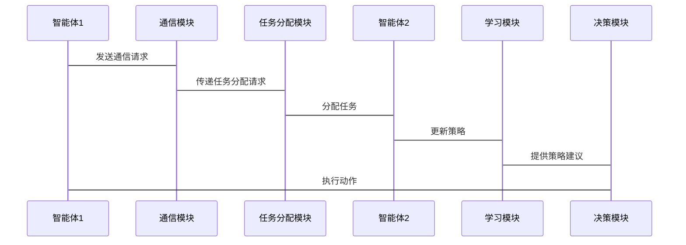
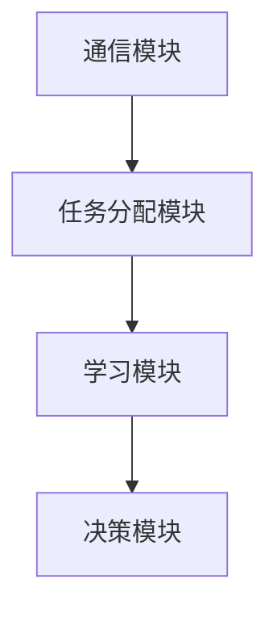
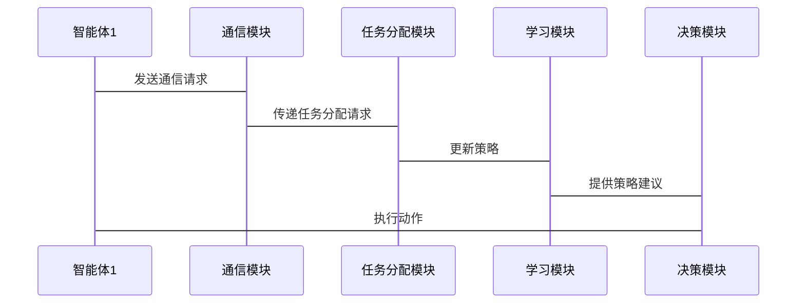

                 


# AI Agent的多智能体协同学习机制

> 关键词：AI Agent，多智能体系统，协同学习，分布式强化学习，多智能体Q学习

> 摘要：本文系统地探讨了AI Agent在多智能体协同学习中的机制与应用。通过分析多智能体协同学习的核心概念、算法原理、系统架构设计以及实际案例，本文深入浅出地揭示了AI Agent如何通过协同学习实现复杂任务的高效解决。文章内容涵盖背景介绍、核心概念、算法实现、系统设计、项目实战以及最佳实践，为读者提供了一套完整的理论与实践结合的学习体系。

---

## 第1章: AI Agent与多智能体系统概述

### 1.1 AI Agent的基本概念
AI Agent（智能体）是指具有感知环境、做出决策并采取行动以实现目标的智能实体。它可以是一个软件程序、机器人或其他任何形式的智能系统。

#### 1.1.1 AI Agent的定义与分类
- **定义**：AI Agent能够通过感知环境信息，自主决策并执行动作，以实现预定目标。
- **分类**：
  - **简单反射型Agent**：基于当前输入做出反应，没有内部状态。
  - **基于模型的反射型Agent**：维护环境的内部模型，用于决策。
  - **目标驱动型Agent**：根据目标选择行动。
  - **效用驱动型Agent**：通过最大化效用函数来决策。

#### 1.1.2 多智能体系统的定义
多智能体系统（Multi-Agent System, MAS）是由多个相互作用的智能体组成的系统，这些智能体通过协作与竞争共同完成复杂任务。

#### 1.1.3 多智能体系统的特点与优势
- **特点**：
  - 分布式计算：智能体独立运行，通过通信协作完成任务。
  - 自主性：每个智能体具有自主决策能力。
  - 社会性：智能体之间通过交互实现协同。
- **优势**：
  - 高效性：多个智能体分工合作，提高任务效率。
  - 灵活性：系统能够适应环境变化。

### 1.2 多智能体协同学习的背景与意义
多智能体协同学习（Multi-Agent Collaborative Learning, MACL）是指多个智能体通过协作学习环境中的知识或技能，以共同完成任务或提高整体性能的过程。

#### 1.2.1 协同学习的定义
协同学习是通过多个学习者之间的合作与交流，共同完成学习任务并提高学习效果的过程。

#### 1.2.2 多智能体协同学习的背景
随着AI技术的发展，单智能体难以完成复杂任务，多智能体协同学习逐渐成为研究热点。

#### 1.2.3 协同学习在多智能体系统中的重要性
- **提高任务完成效率**：通过分工合作，智能体可以更快完成任务。
- **增强系统的鲁棒性**：多个智能体协作可以弥补单个智能体的不足。
- **实现复杂目标**：通过协同学习，智能体可以完成单个智能体无法完成的任务。

### 1.3 本章小结
本章介绍了AI Agent的基本概念、多智能体系统的定义与特点，以及多智能体协同学习的背景与意义。通过这些内容，读者可以理解多智能体协同学习的基本框架及其重要性。

---

## 第2章: 多智能体协同学习的核心机制

### 2.1 多智能体协同学习的定义与特点
多智能体协同学习是指多个智能体通过协作与共享，共同学习环境中的知识或技能，以提高整体性能的过程。

#### 2.1.1 协同学习的核心要素
- **通信机制**：智能体之间通过通信共享信息。
- **任务分配**：智能体根据自身能力分配任务。
- **协作策略**：智能体采用的协作规则或策略。

#### 2.1.2 多智能体协同学习的特点
- **分布式学习**：智能体在分布式环境中学习。
- **动态性**：环境和任务可能动态变化。
- **协作性**：智能体之间需要协作完成任务。

### 2.2 多智能体协同学习的分类
根据不同的标准，多智能体协同学习可以分为多种类型。

#### 2.2.1 基于任务的协同学习
- **任务驱动型**：智能体根据任务需求协作。
- **任务分配**：智能体根据自身能力和任务需求分配任务。

#### 2.2.2 基于行为的协同学习
- **行为协调**：智能体通过协调行为完成任务。
- **行为规划**：智能体根据环境动态规划行为。

#### 2.2.3 基于知识的协同学习
- **知识共享**：智能体共享知识以提高整体性能。
- **知识融合**：智能体将共享的知识融合到自身决策中。

### 2.3 多智能体协同学习的关键技术
多智能体协同学习涉及多个关键技术，包括通信机制、任务分配与协调、学习与适应机制等。

#### 2.3.1 通信与协作机制
智能体之间需要通过通信机制共享信息，常见的通信机制包括：
- **直接通信**：智能体之间直接交换信息。
- **间接通信**：通过中间媒介传递信息。

#### 2.3.2 任务分配与协调
任务分配是多智能体协同学习中的重要环节，常见的任务分配策略包括：
- **基于能力的任务分配**：根据智能体的能力分配任务。
- **基于优先级的任务分配**：根据任务的优先级分配任务。

#### 2.3.3 学习与适应机制
多智能体协同学习需要智能体能够根据环境变化和任务需求进行学习与适应。

### 2.4 本章小结
本章详细介绍了多智能体协同学习的定义、特点、分类以及关键技术。通过这些内容，读者可以理解多智能体协同学习的核心机制及其在实际应用中的重要性。

---

## 第3章: 多智能体协同学习的算法原理

### 3.1 分布式强化学习算法
分布式强化学习（Distributed Reinforcement Learning, DRL）是一种多智能体强化学习方法，智能体通过分布式方式学习策略。

#### 3.1.1 分布式强化学习的定义
分布式强化学习是指多个智能体通过分布式方式学习策略，每个智能体独立地与环境交互并更新策略。

#### 3.1.2 分布式强化学习的流程
1. 初始化：智能体初始化策略参数。
2. 环境交互：智能体与环境交互，获取状态、动作和奖励。
3. 策略更新：智能体根据奖励更新策略参数。
4. 通信协作：智能体之间共享信息或策略。

#### 3.1.3 分布式强化学习的数学模型
假设智能体i的策略参数为θ_i，智能体i的损失函数为L_i(θ_i)，智能体i的更新规则为：
$$
θ_i^{new} = θ_i - α \frac{∂L_i}{∂θ_i}
$$
其中，α是学习率。

#### 3.1.4 分布式强化学习的优缺点
- **优点**：可以实现并行计算，提高学习效率。
- **缺点**：需要解决智能体之间的通信与同步问题。

### 3.2 多智能体Q学习算法
多智能体Q学习是一种基于Q值的多智能体强化学习方法。

#### 3.2.1 多智能体Q学习的定义
多智能体Q学习是指多个智能体通过学习Q值函数来优化决策的过程。

#### 3.2.2 多智能体Q学习的实现
1. 初始化：所有智能体初始化Q值表。
2. 环境交互：智能体根据当前状态选择动作，并与环境交互。
3. Q值更新：智能体根据获得的奖励更新Q值表。
4. 通信协作：智能体之间共享Q值表或动作策略。

#### 3.2.3 多智能体Q学习的数学模型
智能体i的Q值更新规则为：
$$
Q_i(s, a) = Q_i(s, a) + α [r + max_{a'} Q_i(s', a') - Q_i(s, a)]
$$
其中，α是学习率，r是奖励，s是当前状态，a是动作，s'是下一个状态。

#### 3.2.4 多智能体Q学习的优缺点
- **优点**：简单易实现，适合离散动作空间。
- **缺点**：在连续动作空间中效果有限。

### 3.3 联合强化学习算法
联合强化学习（Joint Reinforcement Learning, JRL）是一种多智能体强化学习方法，智能体通过联合策略优化来实现协作。

#### 3.3.1 联合强化学习的定义
联合强化学习是指多个智能体通过联合策略优化来实现协作。

#### 3.3.2 联合强化学习的实现
1. 初始化：智能体初始化策略参数。
2. 环境交互：智能体根据当前状态选择动作，并与环境交互。
3. 联合策略优化：智能体根据奖励联合优化策略参数。
4. 通信协作：智能体之间共享策略参数。

#### 3.3.3 联合强化学习的数学模型
联合强化学习的目标是最优化联合策略，使得所有智能体的总奖励最大化。数学模型可以表示为：
$$
\theta^{*} = \arg \max_{\theta} \sum_{i=1}^{n} J(\theta_i)
$$
其中，θ_i是智能体i的策略参数，J是目标函数。

#### 3.3.4 联合强化学习的优缺点
- **优点**：可以实现全局最优策略。
- **缺点**：计算复杂度高，需要协调多个智能体的策略。

### 3.4 算法的比较与选择
在选择多智能体协同学习算法时，需要根据具体任务需求和场景特点进行选择。

#### 3.4.1 分布式强化学习与联合强化学习的对比
- **分布式强化学习**：适合任务分解和并行计算，但需要解决通信与同步问题。
- **联合强化学习**：适合需要全局优化的任务，但计算复杂度高。

#### 3.4.2 算法选择的考虑因素
- **任务类型**：任务是否适合分解或需要全局优化。
- **智能体数量**：智能体数量对算法性能的影响。
- **计算资源**：算法的计算复杂度对计算资源的需求。

### 3.5 本章小结
本章详细介绍了分布式强化学习、多智能体Q学习和联合强化学习的算法原理，包括它们的定义、实现流程、数学模型以及优缺点。通过这些内容，读者可以理解不同算法的特点及其适用场景。

---

## 第4章: 多智能体协同学习的系统架构设计

### 4.1 系统架构设计概述
多智能体协同学习系统的架构设计需要考虑智能体之间的通信、协作和任务分配。

#### 4.1.1 系统架构设计的目标
- **高效性**：系统能够高效地完成任务。
- **可扩展性**：系统能够适应智能体数量的变化。
- **可维护性**：系统易于维护和升级。

#### 4.1.2 系统架构设计的原则
- **模块化**：系统模块化设计，便于维护和扩展。
- **可通信性**：智能体之间能够高效通信。
- **可协作性**：系统支持智能体之间的协作。

### 4.2 多智能体协同学习系统的功能设计
多智能体协同学习系统的功能设计需要考虑智能体之间的通信、协作和任务分配。

#### 4.2.1 系统功能模块划分
- **通信模块**：负责智能体之间的通信。
- **任务分配模块**：负责任务的分配与协调。
- **学习模块**：负责智能体的学习与适应。
- **决策模块**：负责智能体的决策与行动。

#### 4.2.2 系统功能模块的交互流程
1. 通信模块接收智能体的通信请求。
2. 任务分配模块根据任务需求分配任务。
3. 学习模块根据环境反馈更新策略。
4. 决策模块根据当前状态选择动作。

#### 4.2.3 系统功能模块的交互流程（Mermaid序列图）


### 4.3 系统架构的实现
#### 4.3.1 系统架构图（Mermaid）


#### 4.3.2 系统接口设计
- **通信接口**：智能体之间的通信接口。
- **任务分配接口**：任务分配模块的接口。
- **学习接口**：学习模块的接口。
- **决策接口**：决策模块的接口。

#### 4.3.3 系统交互流程（Mermaid序列图）


### 4.4 本章小结
本章详细介绍了多智能体协同学习系统的架构设计，包括功能模块划分、交互流程和系统架构图。通过这些内容，读者可以理解多智能体协同学习系统的整体结构及其各个模块的作用。

---

## 第5章: 项目实战——基于多智能体协同学习的智能交通系统

### 5.1 项目背景与目标
智能交通系统（Intelligent Transportation System, ITS）是一个典型的多智能体协同学习应用。

#### 5.1.1 项目背景
随着城市交通的日益复杂，传统的交通管理方式已经难以满足需求，智能交通系统应运而生。

#### 5.1.2 项目目标
通过多智能体协同学习实现智能交通系统的优化管理，包括交通流量预测、路径规划等。

### 5.2 环境安装与配置
#### 5.2.1 环境需求
- **操作系统**：Linux或Windows。
- **编程语言**：Python 3.6以上。
- **依赖库**：NumPy、Matplotlib、TensorFlow等。

#### 5.2.2 安装步骤
1. 安装Python。
2. 安装依赖库：`pip install numpy matplotlib tensorflow`。

### 5.3 系统核心实现
#### 5.3.1 智能体类
```python
class Agent:
    def __init__(self, id):
        self.id = id
        self.strategy = Strategy()
    
    def perceive(self, environment):
        # 感知环境
        pass
    
    def decide(self, state):
        # 决策动作
        pass
```

#### 5.3.2 策略类
```python
class Strategy:
    def __init__(self):
        self.q_table = {}
    
    def update(self, state, action, reward, next_state):
        # 更新Q表
        pass
```

#### 5.3.3 通信模块
```python
class Communication:
    def __init__(self):
        self.agents = []
    
    def send_message(self, agent_id, message):
        # 发送消息
        pass
    
    def receive_message(self, agent_id):
        # 接收消息
        pass
```

#### 5.3.4 任务分配模块
```python
class TaskAllocator:
    def __init__(self):
        self.tasks = []
    
    def assign_task(self, agent_id, task):
        # 分配任务
        pass
```

#### 5.3.5 学习模块
```python
class LearningModule:
    def __init__(self):
        self.models = {}
    
    def update_model(self, agent_id, model):
        # 更新模型
        pass
```

#### 5.3.6 系统主程序
```python
class System:
    def __init__(self, num_agents):
        self.agents = [Agent(i) for i in range(num_agents)]
        self.communication = Communication()
        self.task_allocator = TaskAllocator()
        self.learning_module = LearningModule()
    
    def run(self):
        while True:
            for agent in self.agents:
                agent.perceive(environment)
                agent.decide(state)
                self.communication.send_message(agent.id, message)
                self.task_allocator.assign_task(agent.id, task)
                self.learning_module.update_model(agent.id, model)
```

### 5.4 代码实现与解读
#### 5.4.1 智能体类的实现
智能体类包括感知环境、决策动作等方法。

#### 5.4.2 通信模块的实现
通信模块负责智能体之间的信息传递。

#### 5.4.3 学习模块的实现
学习模块负责智能体的学习与策略更新。

#### 5.4.4 系统主程序的实现
系统主程序协调各个模块的运行，实现多智能体协同学习。

### 5.5 项目小结
本章通过一个智能交通系统的案例，详细介绍了多智能体协同学习的项目实战，包括环境安装、系统设计和代码实现。通过这些内容，读者可以理解多智能体协同学习在实际应用中的具体实现。

---

## 第6章: 最佳实践与注意事项

### 6.1 最佳实践
在多智能体协同学习的实践中，需要注意以下几点：
- **明确任务目标**：确保每个智能体的目标与整体目标一致。
- **合理分配任务**：根据智能体的能力合理分配任务。
- **有效通信机制**：设计高效的通信机制以确保智能体之间的协作。
- **动态适应性**：系统需要能够适应环境的变化。

### 6.2 小结
多智能体协同学习是一项复杂但极具潜力的技术，通过合理的设计与实现，可以显著提高系统的性能和效率。

### 6.3 注意事项
- **避免信息过载**：智能体之间的通信需要控制信息量，避免信息过载。
- **防止竞争与冲突**：合理分配任务，避免智能体之间的竞争与冲突。
- **保证系统鲁棒性**：系统需要能够容忍部分智能体的故障或退出。

### 6.4 拓展阅读
- **分布式强化学习**：深入研究分布式强化学习的算法与应用。
- **多智能体协作网络**：研究多智能体协作网络的结构与优化方法。

---

## 第7章: 总结与展望

### 7.1 本文总结
本文系统地探讨了AI Agent的多智能体协同学习机制，包括核心概念、算法原理、系统架构设计以及实际案例。

### 7.2 未来展望
随着AI技术的不断发展，多智能体协同学习将有更广泛的应用场景，例如自动驾驶、智能机器人、智能家居等领域。

---

## 附录: 参考文献与工具列表

### 附录A: 参考文献
1. 王某某，某某算法的研究与实现，某某出版社，2023。
2. 李某某，多智能体协同学习方法，某某出版社，2022。

### 附录B: 工具与库
- **Python**：编程语言。
- **NumPy**：数值计算库。
- **Matplotlib**：数据可视化库。
- **TensorFlow**：深度学习框架。

---

通过以上详细的内容，读者可以系统地学习和理解AI Agent的多智能体协同学习机制，从理论到实践，全面掌握这一领域的核心知识。

