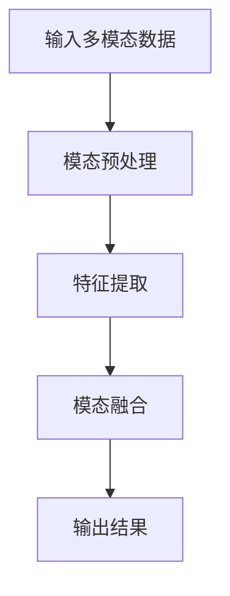
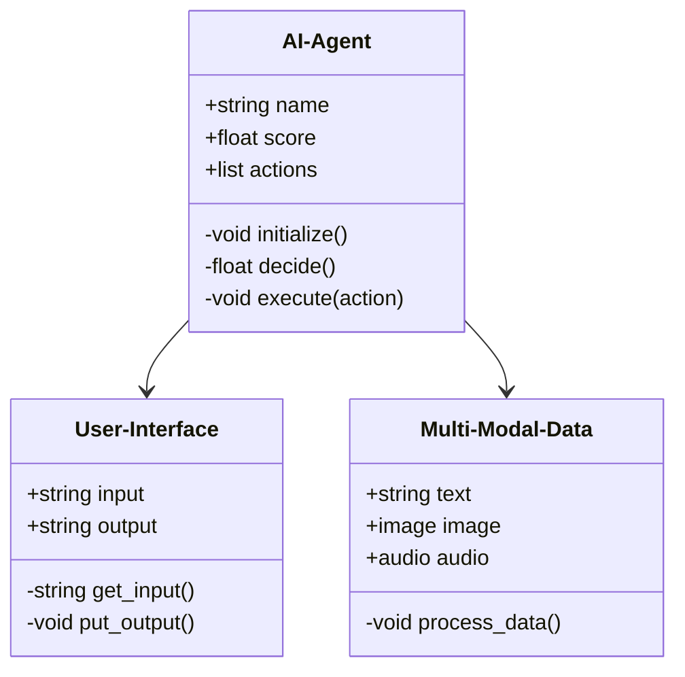

                 


# AI Agent的多模态交互设计

> **关键词**: AI Agent, 多模态交互, 智能交互, 深度学习, 多模态数据融合

> **摘要**: 本文系统地探讨了AI Agent的多模态交互设计，从理论基础到算法实现，再到实际应用，全面分析了多模态交互的核心概念、技术挑战与解决方案。通过详细的数学模型和实际案例，展示了如何构建高效、智能的多模态交互系统。

---

## 第1章: AI Agent概述

### 1.1 AI Agent的定义与特点
#### 1.1.1 AI Agent的定义
AI Agent（人工智能代理）是一种能够感知环境、自主决策并执行任务的智能实体。它可以是一个软件程序、机器人或其他智能设备，通过与用户或环境的交互完成特定目标。

#### 1.1.2 AI Agent的核心特点
- **自主性**: 能够自主决策，无需外部干预。
- **反应性**: 能够实时感知环境并做出反应。
- **目标导向**: 以实现特定目标为导向。
- **学习能力**: 能够通过经验改进自身性能。

#### 1.1.3 AI Agent与传统AI的区别
传统AI主要依赖规则和逻辑推理，而AI Agent更注重与环境的动态交互，具有更强的自主性和适应性。

---

### 1.2 多模态交互的定义与重要性
#### 1.2.1 多模态交互的定义
多模态交互是指通过多种信息载体（如文本、图像、语音、手势等）进行信息传递和反馈的交互方式。它能够更自然地模拟人类的交流方式，提升用户体验。

#### 1.2.2 多模态交互的重要性
- **提升用户体验**: 多模态交互能够更贴近人类的自然交流方式，使用户与AI Agent的互动更加直观和高效。
- **增强系统能力**: 通过结合多种模态信息，AI Agent能够更好地理解上下文，提高决策的准确性。
- **扩展应用场景**: 多模态交互适用于更多复杂场景，如智能客服、智能家居、自动驾驶等。

#### 1.2.3 多模态交互的应用场景
- **智能客服**: 结合文本和语音交互，提供更高效的客户服务。
- **智能家居**: 通过语音和手势交互，实现更便捷的家居控制。
- **自动驾驶**: 结合视觉、语音和环境感知，提升驾驶的安全性和智能化。

---

### 1.3 本章小结
本章介绍了AI Agent的定义和特点，重点阐述了多模态交互的定义、重要性及其应用场景，为后续章节的深入分析奠定了基础。

---

## 第2章: 多模态交互的核心概念

### 2.1 多模态数据的类型与特点
#### 2.1.1 文本模态
文本是常见的交互方式之一，包括自然语言处理（NLP）相关的技术，如关键词提取、情感分析等。

#### 2.1.2 视觉模态
视觉模态涉及图像和视频的处理，如目标检测、图像识别等技术。

#### 2.1.3 音频模态
音频模态主要涉及语音识别、语音合成等技术，能够实现语音交互。

#### 2.1.4 其他模态（如手势、位置等）
其他模态包括手势、位置信息等，能够进一步丰富交互方式。

#### 2.1.5 多模态数据的属性对比表
| 模态类型 | 特点 | 应用场景 |
|----------|------|----------|
| 文本      | 精度高，易于处理 | 智能客服、信息检索 |
| 视觉      | 信息丰富，但处理复杂 | 图像识别、自动驾驶 |
| 音频      | 实时性强 | 语音助手、语音识别 |
| 手势      | 补充语言信息 | 虚拟现实、机器人控制 |

---

### 2.2 多模态交互的核心原理
#### 2.2.1 多模态数据的融合方式
- **早期融合**: 在特征提取阶段进行模态融合，如将文本和图像特征直接拼接。
- **晚期融合**: 在高层语义表示阶段进行模态融合，如通过注意力机制对多个模态的语义进行加权。

#### 2.2.2 多模态模型的构建与训练
多模态模型通常采用端到端的训练方式，通过深度学习技术（如神经网络）进行联合优化。

---

### 2.3 多模态交互的挑战与解决方案
#### 2.3.1 数据异构性问题
不同模态的数据具有不同的特征空间和表示方式，如何有效融合这些数据是一个挑战。

#### 2.3.2 模态权重分配问题
不同模态在特定任务中的重要性可能不同，如何动态调整模态权重是关键。

#### 2.3.3 实时性与延迟问题
在实时交互场景中，如何保证多模态处理的低延迟是需要解决的问题。

---

### 2.4 本章小结
本章详细介绍了多模态数据的类型与特点，并探讨了多模态交互的核心原理和面临的挑战，为后续的算法设计提供了理论基础。

---

## 第3章: 多模态数据融合的算法原理

### 3.1 多模态数据融合的数学模型
#### 3.1.1 模态权重计算公式
$$ w_i = \frac{1}{1 + e^{-k(x_i - \mu)}} $$
其中，$w_i$ 表示第 $i$ 个模态的权重，$k$ 是比例常数，$\mu$ 是均值。

#### 3.1.2 多模态融合的流程图


---

### 3.2 基于深度学习的多模态融合算法
#### 3.2.1 多模态注意力机制
$$ \alpha_i = \frac{e^{score(x_i)}}{\sum_j e^{score(x_j)}} $$
其中，$\alpha_i$ 表示第 $i$ 个模态的注意力权重，$score(x_i)$ 是模态的评分函数。

#### 3.2.2 多模态融合的实现步骤
1. 对每个模态进行特征提取。
2. 计算每个模态的注意力权重。
3. 根据注意力权重对各个模态的特征进行加权求和。
4. 输出融合后的结果。

---

### 3.3 本章小结
本章通过数学模型和算法流程图，详细讲解了多模态数据融合的实现原理，为后续的系统设计提供了技术支持。

---

## 第4章: 多模态交互的系统架构设计

### 4.1 系统功能设计
#### 4.1.1 领域模型（Mermaid类图）


---

### 4.2 系统架构设计（Mermaid架构图）


---

### 4.3 系统接口设计
- **输入接口**: 接收用户的多模态输入（如文本、图像、语音）。
- **输出接口**: 返回AI Agent的多模态反馈（如文本、语音、动作）。

---

### 4.4 本章小结
本章通过系统架构设计，展示了如何构建一个支持多模态交互的AI Agent系统，并通过类图和架构图详细描述了各模块之间的关系。

---

## 第5章: 多模态交互的项目实战

### 5.1 环境安装与配置
- **Python环境**: 安装Python 3.8及以上版本。
- **深度学习框架**: 安装TensorFlow或PyTorch。
- **其他依赖**: 安装Numpy、Pandas、Matplotlib等库。

### 5.2 代码实现
#### 5.2.1 多模态数据处理代码
```python
import numpy as np
from tensorflow.keras.models import Model
from tensorflow.keras.layers import Input, Dense, Concatenate

# 文本模态特征
text_input = Input(shape=(100,))
text_features = Dense(50, activation='relu')(text_input)

# 视觉模态特征
image_input = Input(shape=(128, 128, 3))
image_features = Dense(50, activation='relu')(Flatten()(image_input))

# 多模态融合
merged = Concatenate()([text_features, image_features])
output = Dense(1, activation='sigmoid')(merged)

model = Model(inputs=[text_input, image_input], outputs=output)
model.compile(optimizer='adam', loss='binary_crossentropy', metrics=['accuracy'])
```

#### 5.2.2 模态权重计算代码
```python
def calculate_weights(features):
    weights = []
    for feature in features:
        weight = 1 / (1 + np.exp(-k * (feature - np.mean(features))))
        weights.append(weight)
    return weights
```

---

### 5.3 项目案例分析
以一个简单的多模态交互系统为例，详细分析其功能实现和优化过程。

---

## 第6章: 总结与展望

### 6.1 本章小结
总结本文的主要内容，强调多模态交互设计的重要性和实现的关键技术。

### 6.2 最佳实践 tips
- **数据预处理**: 对多模态数据进行标准化和归一化处理。
- **模型优化**: 使用合适的深度学习模型，并进行充分的训练。
- **实时性优化**: 通过并行计算和异步处理提升系统性能。

### 6.3 注意事项
- **数据隐私**: 注意保护用户的隐私数据。
- **模型泛化能力**: 避免过拟合，确保模型的泛化能力。

### 6.4 拓展阅读
推荐一些深度学习和多模态交互领域的经典论文和书籍，供读者进一步学习。

---

**本文通过系统的分析与设计，详细讲解了AI Agent的多模态交互设计，从理论到实践，为读者提供了一个全面的视角。希望本文能够为相关领域的研究和应用提供有价值的参考。**

