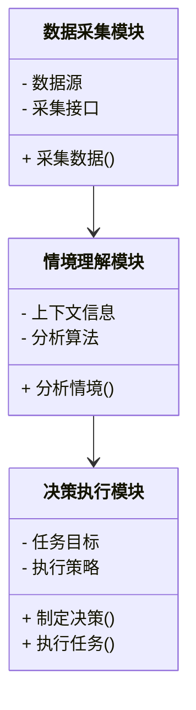
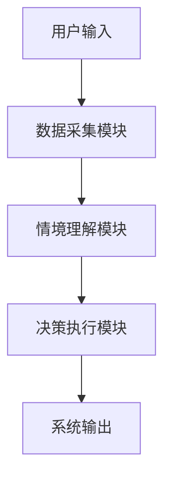
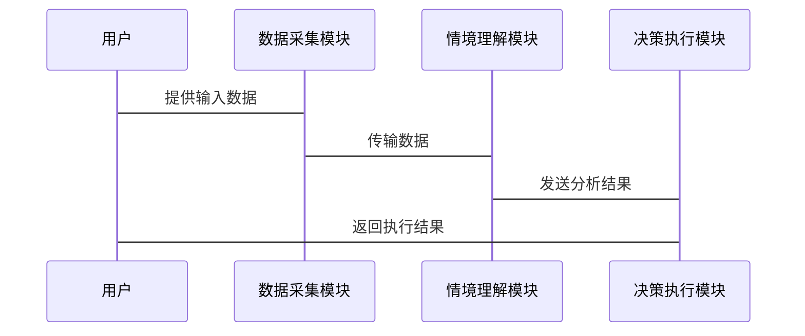

                 


# AI Agent的情境感知能力开发

> 关键词：AI Agent、情境感知、多模态数据、实时反馈、注意力机制、系统架构、项目实战

> 摘要：本文详细探讨了AI Agent的情境感知能力开发，从基本概念到核心算法，再到系统架构和项目实战，全面分析了情境感知能力在AI Agent中的重要性及其开发方法。通过多模态数据融合、实时反馈机制和注意力机制的应用，结合系统架构设计和实际案例分析，为读者提供了情境感知能力开发的全面指导。

---

## 第1章: AI Agent与情境感知概述

### 1.1 AI Agent的基本概念
#### 1.1.1 AI Agent的定义与分类
- **定义**：AI Agent是具有自主决策能力和智能行为的实体，能够感知环境并执行任务。
- **分类**：基于智能水平分为简单反射型、基于模型的反应型、目标驱动型和完全自主型。

#### 1.1.2 情境感知的定义与特点
- **定义**：情境感知是指AI Agent能够理解当前环境状态、任务目标和用户需求的能力。
- **特点**：实时性、动态性、多模态性和情境理解的准确性。

#### 1.1.3 情境感知在AI Agent中的重要性
- **重要性**：提升AI Agent的适应性、交互性和任务完成效率。

### 1.2 情境感知的背景与问题背景
#### 1.2.1 当前AI Agent面临的挑战
- **挑战**：环境复杂性、任务多样性、实时性要求高。

#### 1.2.2 情境感知的必要性
- **必要性**：帮助AI Agent更好地理解和适应动态环境。

#### 1.2.3 情境感知的边界与外延
- **边界**：限定在特定任务和环境范围内。
- **外延**：扩展到更广泛的应用场景。

### 1.3 情境感知的核心要素与组成
#### 1.3.1 核心要素
- **环境感知**：通过传感器或数据源获取环境信息。
- **任务目标**：明确AI Agent的目标和优先级。
- **用户需求**：理解用户的意图和偏好。

#### 1.3.2 组成结构
- **感知层**：数据采集与预处理。
- **理解层**：情境分析与推理。
- **决策层**：基于情境的决策制定。

---

## 第2章: 情境感知的核心概念与联系

### 2.1 情境感知的原理与机制
#### 2.1.1 情境感知的基本原理
- **数据融合**：整合多源数据，提升感知准确性。
- **上下文理解**：通过上下文分析环境和任务关系。

#### 2.1.2 情境感知的实现机制
- **数据驱动**：基于大量数据训练模型。
- **模型驱动**：利用先验知识构建知识图谱。

### 2.2 情境感知与多模态数据的关系
#### 2.2.1 多模态数据的定义与特点
- **定义**：来自不同模态（如文本、图像、语音）的数据。
- **特点**：互补性、冗余性和丰富性。

#### 2.2.2 情境感知与多模态数据的联系
- **联系**：多模态数据为情境感知提供全面信息。

#### 2.2.3 多模态数据在情境感知中的应用
- **应用**：图像识别、语音识别、自然语言处理的结合。

### 2.3 情境感知与实时反馈的关联
#### 2.3.1 实时反馈的定义与作用
- **定义**：系统对环境变化的即时响应。
- **作用**：提升系统的动态适应能力。

#### 2.3.2 情境感知与实时反馈的关系
- **关系**：实时反馈是情境感知的重要组成部分。

#### 2.3.3 实时反馈在情境感知中的应用
- **应用**：动态调整决策策略、优化任务执行效率。

---

## 第3章: 情境感知能力的算法原理

### 3.1 情境感知的核心算法
#### 3.1.1 注意力机制在情境感知中的应用
- **注意力机制**：通过权重分配关注关键信息。

#### 3.1.2 基于Transformer的序列建模
- **Transformer模型**：用于处理序列数据，提升情境理解能力。

#### 3.1.3 情境感知的上下文理解算法
- **上下文理解**：基于上下文信息进行情境推理。

### 3.2 情境感知算法的数学模型
#### 3.2.1 注意力机制的数学公式
$$
\text{Attention}(Q, K, V) = \text{softmax}\left(\frac{QK^T}{\sqrt{d_k}}\right)V
$$

#### 3.2.2 基于Transformer的序列建模公式
$$
\text{Output} = \text{LayerNorm}(F(\text{Input}))
$$

#### 3.2.3 上下文理解的数学模型
$$
C = \sum_{i=1}^{n} w_i x_i
$$

### 3.3 算法实现与代码示例
#### 3.3.1 注意力机制的Python实现
```python
import torch

def attention(q, k, v):
    # 计算相似度
    sim = torch.mm(q, k.T) / torch.sqrt(torch.mean(k.T**2))
    # 计算权重
    weights = torch.softmax(sim, dim=-1)
    # 加权求和
    output = torch.mm(weights, v)
    return output
```

---

## 第4章: 系统分析与架构设计

### 4.1 问题场景介绍
- **场景描述**：智能助手在复杂环境下的任务执行。

### 4.2 系统功能设计
#### 4.2.1 系统功能模块
- **数据采集模块**：采集多模态数据。
- **情境理解模块**：分析环境和任务。
- **决策执行模块**：制定并执行决策。

#### 4.2.2 功能模块的类图


### 4.3 系统架构设计
#### 4.3.1 系统架构图


### 4.4 系统接口设计
- **接口1**：数据采集模块的输入接口。
- **接口2**：情境理解模块的分析接口。
- **接口3**：决策执行模块的决策输出接口。

### 4.5 系统交互序列图


---

## 第5章: 项目实战

### 5.1 环境安装与配置
- **工具安装**：安装Python、TensorFlow、PyTorch等框架。
- **依赖管理**：使用pip安装所需库。

### 5.2 系统核心实现
#### 5.2.1 数据采集模块实现
```python
import numpy as np

def collect_data():
    # 采集多模态数据
    data = np.random.randn(100, 10)
    return data
```

#### 5.2.2 情境理解模块实现
```python
def analyze_context(data):
    # 上下文分析算法
    context = np.mean(data, axis=1)
    return context
```

#### 5.2.3 决策执行模块实现
```python
def execute_decision(context):
    # 决策逻辑
    action = np.argmax(context)
    return action
```

### 5.3 代码实现与解读
- **代码解读**：详细分析各模块的实现逻辑。

### 5.4 实际案例分析
- **案例1**：智能助手在会议安排中的应用。
- **案例2**：智能客服的用户意图识别。

### 5.5 项目小结
- **总结**：情境感知能力的开发需要多模态数据融合、实时反馈和先进算法的支持。

---

## 第6章: 最佳实践与小结

### 6.1 最佳实践 tips
- **数据多样性**：确保数据来源多样化。
- **模型优化**：定期更新模型参数，提升准确率。
- **实时性优化**：采用轻量化算法，提升运行效率。

### 6.2 小结
- **总结**：情境感知能力是AI Agent实现智能化的关键，通过多模态数据、先进算法和系统架构设计的结合，能够显著提升AI Agent的任务执行效率和用户体验。

### 6.3 注意事项
- **数据隐私**：注意保护用户数据隐私。
- **系统稳定性**：确保系统在复杂环境下的稳定性。

### 6.4 拓展阅读
- **推荐书籍**：《Deep Learning》、《Transformer解惑》。
- **推荐论文**：相关领域的最新研究论文。

---

通过以上目录结构，您可以逐步展开每个部分的内容，撰写一篇详细且有深度的技术博客文章。

