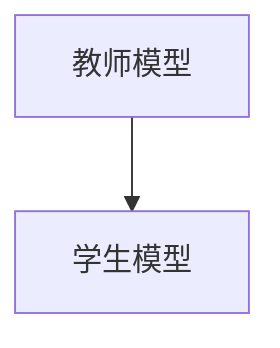
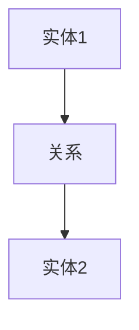
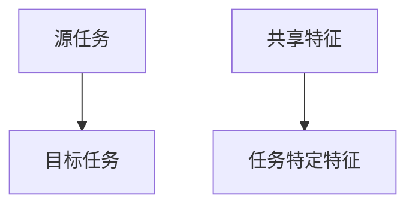
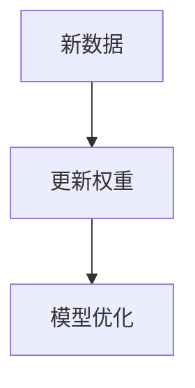
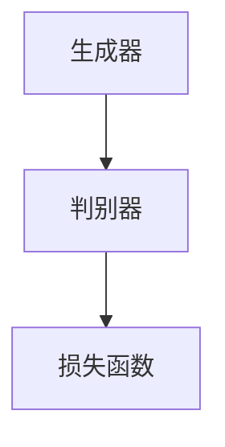
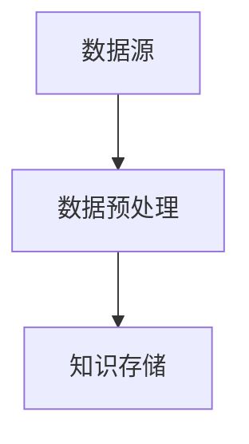
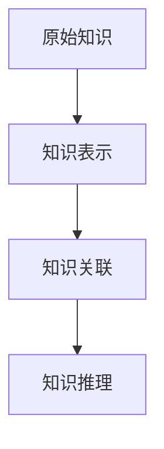
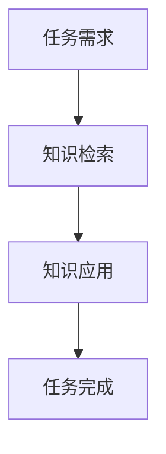
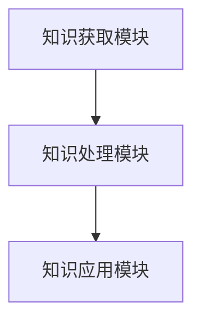
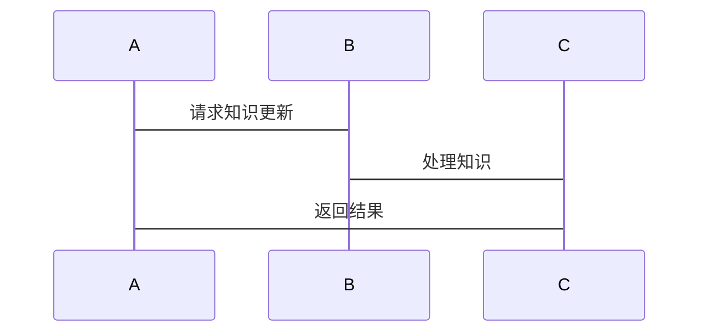

                 


# AI Agent的持续学习：保持知识更新

> 关键词：AI Agent，持续学习，知识更新，增量学习，对抗网络，知识蒸馏

> 摘要：本文深入探讨AI Agent的持续学习机制，从核心概念到算法原理，再到系统架构设计和项目实战，全面解析如何实现AI Agent的持续知识更新。通过详细的技术分析和实际案例，帮助读者理解并掌握AI Agent持续学习的关键技术。

---

## 第一部分: AI Agent的持续学习基础

### 第1章: AI Agent概述

#### 1.1 AI Agent的基本概念

##### 1.1.1 什么是AI Agent
AI Agent（人工智能代理）是一种能够感知环境、自主决策并执行任务的智能实体。它可以是一个软件程序、机器人或其他智能系统，通过与环境交互来实现特定目标。AI Agent的核心特征包括自主性、反应性、目标导向和情境适应性。

##### 1.1.2 AI Agent的分类
AI Agent可以根据智能水平、应用场景和功能特点进行分类：

- **按智能水平**：
  - **反应式AI Agent**：基于当前感知做出反应，不依赖长期记忆。
  - **认知式AI Agent**：具备复杂推理和规划能力，能够处理抽象任务。
- **按应用场景**：
  - **服务型AI Agent**：用于提供信息查询、任务执行等服务。
  - **决策型AI Agent**：用于复杂决策场景，如自动驾驶、金融投资。
- **按功能特点**：
  - **知识密集型**：依赖大量先验知识完成任务。
  - **数据密集型**：通过大量数据训练获得能力。

##### 1.1.3 AI Agent的应用场景
AI Agent广泛应用于各个领域，以下是一些典型场景：
- **智能助手**：如Siri、Alexa，提供语音交互和任务执行。
- **自动驾驶**：通过实时感知和决策实现车辆控制。
- **推荐系统**：基于用户行为和偏好推荐个性化内容。
- **机器人控制**：在工业和家庭场景中执行复杂任务。

#### 1.2 持续学习的定义与重要性

##### 1.2.1 持续学习的定义
持续学习是指AI Agent在动态环境中，能够不断吸收新知识、更新已有知识，并适应新任务的能力。与传统机器学习模型只能在固定训练数据上进行一次性训练不同，持续学习强调模型的可扩展性和适应性。

##### 1.2.2 持续学习的重要性
在动态变化的环境中，AI Agent需要不断更新知识以应对新任务和新挑战。持续学习的重要性体现在以下方面：
- **适应性**：能够应对环境变化和新任务需求。
- **可扩展性**：能够处理不断增加的数据和任务。
- **实时性**：能够快速响应新信息，保持高效性能。

##### 1.2.3 持续学习与传统机器学习的区别
| 特性 | 持续学习 | 传统机器学习 |
|------|----------|--------------|
| 数据来源 | 动态数据流 | 静态训练集 |
| 模型更新 | 在线更新 | 离线训练 |
| 适应性 | 高 | 低 |
| 计算资源 | 低 | 高 |
| 适用场景 | 动态环境 | 静态环境 |

---

### 第2章: 持续学习的核心概念

#### 2.1 持续学习的基本原理

##### 2.1.1 知识表示
知识表示是持续学习的基础，常见的表示方法包括：
- **符号表示**：通过逻辑符号和规则表示知识。
- **向量表示**：通过低维向量表示语义信息。
- **图结构表示**：通过图结构表示实体之间的关系。

##### 2.1.2 知识更新机制
知识更新机制决定了AI Agent如何处理新信息。常见的更新机制包括：
- **增量更新**：逐步更新模型，避免重新训练整个模型。
- **选择性遗忘**：有选择地遗忘不相关或过时的知识。
- **知识蒸馏**：通过教师模型指导学生模型更新知识。

##### 2.1.3 知识检索与应用
知识检索与应用是持续学习的关键步骤，包括：
- **知识检索**：根据任务需求快速检索相关知识。
- **知识应用**：将检索到的知识应用于具体任务中。

#### 2.2 持续学习的关键技术

##### 2.2.1 知识蒸馏
知识蒸馏是一种通过教师模型指导学生模型学习的技术。教师模型通常是一个复杂的预训练模型，学生模型是一个简化的模型。通过蒸馏过程，学生模型能够继承教师模型的知识。

**知识蒸馏流程图**：


**数学公式**：
知识蒸馏的目标函数通常包括教师模型的软标签和学生模型的预测结果：
$$ L = \alpha L_{\text{cls}} + (1-\alpha) L_{\text{distil}} $$
其中，$L_{\text{cls}}$是分类损失，$L_{\text{distil}}$是蒸馏损失，$\alpha$是平衡系数。

##### 2.2.2 知识图谱
知识图谱是一种结构化的知识表示形式，通过实体和关系构建语义网络。知识图谱在持续学习中的作用是帮助AI Agent理解和组织新知识。

**知识图谱示意图**：


##### 2.2.3 迁移学习
迁移学习是一种通过将已学习的知识迁移到新任务的技术。在持续学习中，迁移学习可以帮助AI Agent快速适应新任务。

**迁移学习流程图**：


---

### 第3章: 持续学习的算法原理

#### 3.1 增量学习算法

##### 3.1.1 线性增量学习
线性增量学习是一种简单有效的增量学习方法，适用于线性可分的问题。

**线性增量学习流程图**：


**数学公式**：
线性增量学习的权重更新公式为：
$$ w_{new} = w_{old} + \eta (y - \hat{y})x $$
其中，$\eta$是学习率，$y$是真实标签，$\hat{y}$是预测标签，$x$是输入样本。

##### 3.1.2 非线性增量学习
非线性增量学习通过引入非线性激活函数，能够处理更复杂的任务。

**非线性增量学习流程图**：


**数学公式**：
非线性增量学习的更新公式为：
$$ w_{new} = w_{old} + \eta (y - \hat{y})f(x) $$
其中，$f(x)$是非线性激活函数。

#### 3.2 对抗网络在持续学习中的应用

##### 3.2.1 对抗训练的基本原理
对抗训练通过两个对抗网络（生成器和判别器）的博弈过程，提升模型的泛化能力。

**对抗网络结构图**：


**数学公式**：
生成器和判别器的目标函数分别为：
$$ G_{loss} = -\mathbb{E}_{z}[\log D(G(z))] $$
$$ D_{loss} = -\mathbb{E}_{x}[ \log D(x)] - \mathbb{E}_{z}[ \log (1 - D(G(z)))] $$

##### 3.2.2 对抗网络在持续学习中的作用
对抗网络可以帮助AI Agent在持续学习中保持模型的稳定性和多样性。

---

### 第4章: 持续学习的系统架构设计

#### 4.1 系统功能设计

##### 4.1.1 知识获取模块
知识获取模块负责从外部数据源获取新知识，包括文本、图像、语音等多种形式。

**知识获取流程图**：


##### 4.1.2 知识处理模块
知识处理模块负责对获取的知识进行理解和组织，包括知识表示、关联和推理。

**知识处理流程图**：


##### 4.1.3 知识应用模块
知识应用模块将处理后的知识应用于具体任务，包括分类、预测、决策等。

**知识应用流程图**：


#### 4.2 系统架构图

##### 4.2.1 系统架构设计


##### 4.2.2 接口设计
- **API接口定义**：
  - `get_knowledge()`：获取新知识。
  - `update_model()`：更新模型。
  - `apply_knowledge()`：应用知识。

- **接口调用流程**：
  ```mermaid
  sequenceDiagram
  A->B: 调用get_knowledge
  B->C: 获取新知识
  C->B: 调用update_model
  B->A: 更新完成
  ```

##### 4.2.3 交互流程


---

### 第5章: 持续学习的项目实战

#### 5.1 环境安装

##### 5.1.1 安装Python
```bash
python --version
```

##### 5.1.2 安装相关库
```bash
pip install tensorflow keras numpy matplotlib
```

#### 5.2 核心代码实现

##### 5.2.1 知识蒸馏代码
```python
import tensorflow as tf
from tensorflow import keras

# 定义教师模型
def teacher_model(input_shape):
    model = keras.Sequential()
    model.add(keras.layers.Dense(128, activation='relu', input_shape=input_shape))
    model.add(keras.layers.Dense(10, activation='softmax'))
    return model

# 定义学生模型
def student_model(input_shape):
    model = keras.Sequential()
    model.add(keras.layers.Dense(64, activation='relu', input_shape=input_shape))
    model.add(keras.layers.Dense(10, activation='softmax'))
    return model

# 知识蒸馏训练
teacher = teacher_model((input_dim,))
student = student_model((input_dim,))

# 定义蒸馏损失
def distillation_loss(y_true, y_pred, alpha=0.1):
    t preds = teacher.predict(x)
    loss = keras.losses.sparse_categorical_crossentropy(y_true, y_pred)
    distill_loss = keras.losses.kullback_leibler_divergence(keras.activations.softmax(t_preds), keras.activations.softmax(y_pred))
    return alpha * distill_loss + (1 - alpha) * loss

# 编译模型
teacher.compile(optimizer='adam', loss='sparse_categorical_crossentropy', metrics=['accuracy'])
student.compile(optimizer='adam', loss=lambda y_true, y_pred: distillation_loss(y_true, y_pred), metrics=['accuracy'])

# 训练模型
teacher.fit(x_train, y_train, epochs=10, batch_size=32)
student.fit(x_train, y_train, epochs=10, batch_size=32)
```

##### 5.2.2 知识图谱构建
```python
from kglib import kgconstruction

# 定义知识图谱构建函数
def build_knowledge_graph(data):
    graph = {}
    for item in data:
        for relation in item['relations']:
            graph[relation['subject']] = graph.get(relation['subject'], [])
            graph[relation['subject']].append((relation['predicate'], relation['object']))
    return graph

# 示例数据
data = [
    {'relations': [('A', 'related_to', 'B'), ('A', 'related_to', 'C')]}
]

# 构建知识图谱
knowledge_graph = build_knowledge_graph(data)
```

##### 5.2.3 迁移学习实现
```python
from sklearn import svm

# 定义迁移学习器
class MultipartitionSVM:
    def __init__(self):
        self.models = {}

    def fit(self, X, y):
        for label in set(y):
            self.models[label] = svm.SVC()
            X_subset = X[y == label]
            y_subset = y[y == label]
            self.models[label].fit(X_subset, y_subset)

    def predict(self, X):
        predictions = []
        for x in X:
            label = min(self.models.keys())
            model = self.models[label]
            predictions.append(model.predict([x])[0])
        return predictions

# 示例数据
X = [[1, 0], [0, 1], [2, 3], [3, 2]]
y = [0, 0, 1, 1]

# 迁移学习器训练
learner = MultipartitionSVM()
learner.fit(X, y)

# 进行预测
X_test = [[2, 1], [1, 2]]
print(learner.predict(X_test))
```

#### 5.3 实际案例分析

##### 5.3.1 案例分析
假设我们有一个AI Agent需要在医疗领域进行持续学习，实时更新疾病诊断知识。我们可以使用知识蒸馏技术，通过教师模型指导学生模型更新诊断知识。

##### 5.3.2 代码实现解读
- **教师模型**：用于生成高质量的软标签。
- **学生模型**：通过蒸馏过程学习教师模型的知识。
- **蒸馏损失**：衡量学生模型预测与教师模型预测的差异。

##### 5.3.3 知识更新效果评估
通过准确率、召回率和F1分数评估知识更新的效果。

---

### 第6章: 最佳实践与小结

#### 6.1 小结
持续学习是AI Agent适应动态环境的关键技术。通过知识蒸馏、迁移学习和知识图谱等技术，AI Agent能够不断更新知识，提升性能。

#### 6.2 注意事项
- **数据质量**：持续学习依赖高质量的新数据。
- **模型选择**：选择适合持续学习的模型架构。
- **计算效率**：优化模型更新的计算效率。

#### 6.3 拓展阅读
- 《Neural Networks and Deep Learning》
- 《Hands-On Machine Learning with Scikit-Learn, Keras, and TensorFlow》
- 《Deep Learning》

---

通过以上内容，我们详细介绍了AI Agent的持续学习机制，从基础概念到算法实现，再到系统设计和项目实战，帮助读者全面理解并掌握AI Agent的持续学习技术。希望本文能为相关领域的研究和应用提供有价值的参考。

