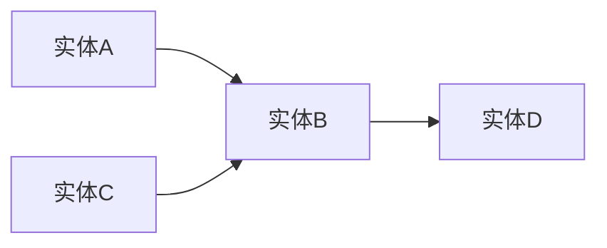
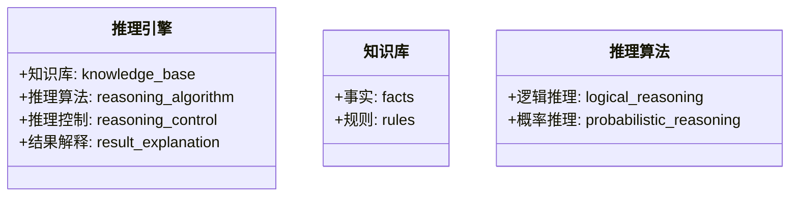
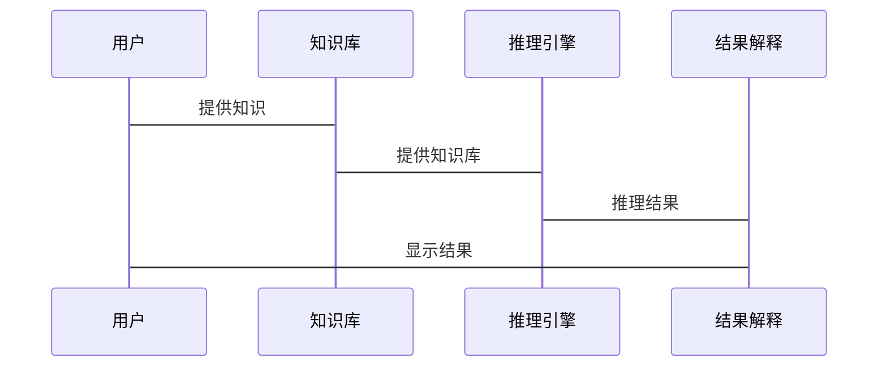

                 

<think>
好的，我将按照您的要求，分步骤地逐步构建《AI Agent的推理引擎：设计与优化》的技术博客文章。

# 《AI Agent的推理引擎：设计与优化》

## 关键词：AI Agent、推理引擎、算法原理、系统设计、优化

## 摘要： 
本文详细探讨AI Agent的推理引擎的设计与优化，从基础概念到核心算法，从系统架构到实战应用，全面解析推理引擎的关键技术与实现细节，帮助读者深入理解并掌握AI Agent推理引擎的设计方法。

## 第1章: AI Agent与推理引擎概述

### 1.1 AI Agent的基本概念
#### 1.1.1 AI Agent的定义与特点
AI Agent（人工智能代理）是指能够感知环境、自主决策并采取行动的智能实体。它具有自主性、反应性、目标导向性、社交能力和社会性五大特点。

#### 1.1.2 推理引擎在AI Agent中的作用
推理引擎是AI Agent的核心组件之一，负责根据环境信息和目标，推导出合理的行动方案。它是连接感知与行动的桥梁。

#### 1.1.3 AI Agent的应用场景与挑战
AI Agent广泛应用于自动驾驶、智能助手、机器人控制、智能推荐等领域。其主要挑战包括复杂环境下的实时推理、多目标冲突的协调、不确定信息的处理等。

### 1.2 推理引擎的核心概念
#### 1.2.1 推理引擎的定义与分类
推理引擎是AI Agent中负责逻辑推理、知识处理和决策支持的核心模块。根据推理方式的不同，可以分为逻辑推理引擎、概率推理引擎和混合推理引擎。

#### 1.2.2 推理引擎的关键组成部分
推理引擎通常包括知识库、推理算法、推理控制机制和推理结果解释模块四个部分。

#### 1.2.3 推理引擎与AI Agent的关系
推理引擎是AI Agent的智能核心，负责将感知到的信息转化为具体的行动指令，实现从“感知”到“行动”的闭环。

### 1.3 推理引擎的发展与现状
#### 1.3.1 推理引擎的技术演进
从简单的逻辑推理到复杂的概率推理，推理引擎经历了从规则驱动到数据驱动的演变。

#### 1.3.2 当前主流的推理引擎技术
目前主流的推理引擎技术包括基于知识图谱的推理、基于概率图模型的推理和基于深度学习的推理。

#### 1.3.3 推理引擎的未来趋势
未来，推理引擎将更加注重人机协作、实时性、可解释性和安全性，向着更智能化、更实用化的方向发展。

## 第2章: 推理引擎的数学基础与逻辑框架

### 2.1 推理引擎的数学基础
#### 2.1.1 命题逻辑与谓词逻辑
命题逻辑是推理的基本形式，而谓词逻辑则扩展了命题逻辑，使其能够处理更复杂的知识表示。

#### 2.1.2 概率论与贝叶斯网络
概率论为处理不确定性提供了理论基础，贝叶斯网络则是一种有效的概率推理模型。

#### 2.1.3 图论与知识图谱
图论为知识表示和推理提供了结构化的框架，知识图谱则是大规模知识表示的重要形式。

### 2.2 推理引擎的逻辑框架
#### 2.2.1 增强推理与消解推理
增强推理是在原有知识基础上添加新的信息，消解推理则是通过逻辑规则消除不确定性。

#### 2.2.2 归纳推理与演绎推理
归纳推理是从具体实例中总结一般规律，而演绎推理则是从一般规律推出具体结论。

#### 2.2.3 不确定性推理与模糊推理
不确定性推理用于处理不完整或不精确的信息，模糊推理则通过模糊逻辑进行推理。

### 2.3 推理引擎的逻辑关系图
#### 2.3.1 ER实体关系图


#### 2.3.2 知识图谱的构建与表示
使用Mermaid图表示知识图谱的构建过程：


## 第3章: 推理引擎的算法原理与实现

### 3.1 推理引擎的算法原理
#### 3.1.1 逻辑推理算法
逻辑推理算法包括命题逻辑推理和谓词逻辑推理，基于知识库中的逻辑规则进行推理。

#### 3.1.2 概率推理算法
概率推理算法利用贝叶斯网络等概率模型，根据概率分布进行推理。

#### 3.1.3 图结构推理算法
图结构推理算法基于知识图谱或语义网络，通过图遍历等方式进行推理。

### 3.2 推理引擎的算法实现
#### 3.2.1 基于逻辑推理的算法实现
```python
def logical_reasoning(knowledge_base):
    # 假设knowledge_base是知识库
    # 返回推理结果
    return result
```

#### 3.2.2 基于概率推理的算法实现
```python
def bayesian_reasoning(bayesian_network):
    # 假设bayesian_network是贝叶斯网络
    # 返回概率推理结果
    return result
```

#### 3.2.3 基于图结构推理的算法实现
```python
def graph_reasoning(graph):
    # 假设graph是知识图谱
    # 返回图推理结果
    return result
```

### 3.3 推理引擎的数学模型与公式
#### 3.3.1 逻辑推理的数学模型
命题逻辑的数学模型可以表示为：
$$ \text{命题} = \{P_1, P_2, ..., P_n\} $$
其中，$P_i$ 表示一个命题。

#### 3.3.2 概率推理的数学公式
贝叶斯定理的公式为：
$$ P(A|B) = \frac{P(B|A) \cdot P(A)}{P(B)} $$

## 第4章: 推理引擎的系统架构与设计

### 4.1 系统架构设计
使用Mermaid图表示系统架构：


### 4.2 系统功能设计
使用Mermaid类图表示系统功能：


### 4.3 系统接口设计
系统接口设计包括知识库接口、推理引擎接口和结果解释接口。

### 4.4 系统交互设计
使用Mermaid序列图表示系统交互：


## 第5章: 推理引擎的项目实战

### 5.1 环境安装与配置
安装必要的依赖包，如Python的推理库和知识图谱库。

### 5.2 系统核心实现源代码
```python
class ReasoningEngine:
    def __init__(self, knowledge_base):
        self.knowledge_base = knowledge_base

    def infer(self, query):
        # 具体推理实现
        return result
```

### 5.3 实际案例分析
以自动驾驶中的路径规划为例，详细分析推理引擎的应用过程。

## 第6章: 推理引擎的优化与进阶

### 6.1 性能优化
优化推理引擎的效率，减少计算复杂度，提高推理速度。

### 6.2 可扩展性优化
增强推理引擎的可扩展性，支持更大规模的知识库和更复杂的推理任务。

### 6.3 可解释性优化
提高推理引擎的可解释性，使推理过程更加透明和可理解。

### 6.4 前沿技术探索
探索结合深度学习、强化学习等新技术，提升推理引擎的智能水平。

## 第7章: 总结与展望

### 7.1 本章总结
总结全文，回顾推理引擎的核心内容和技术要点。

### 7.2 未来展望
展望推理引擎的发展方向和潜在的研究热点。

## 参考文献
列出本文参考的相关文献和资料。

---

以上是《AI Agent的推理引擎：设计与优化》的技术博客文章的完整目录和内容框架。每章内容都会详细展开，确保逻辑清晰、结构紧凑，满足技术博客的专业性和深度要求。

