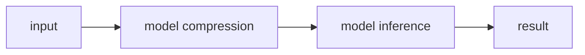

                 

# AI Agent的模型压缩技术：边缘设备部署

> **关键词**：AI Agent，模型压缩，边缘设备，深度学习，轻量化部署

> **摘要**：随着人工智能技术的快速发展，AI Agent在边缘设备上的应用日益广泛。然而，由于边缘设备的硬件资源限制，传统的深度学习模型往往难以直接部署。模型压缩技术作为一种有效的解决方案，能够显著减少模型的计算和存储需求，使AI Agent在边缘设备上得以高效运行。本文将从AI Agent的基本概念出发，详细探讨模型压缩技术的核心原理、实现方法及其在边缘设备部署中的应用，结合实际案例分析，为读者提供全面的技术指导。

---

## 第1章: AI Agent与模型压缩概述

### 1.1 AI Agent的基本概念

#### 1.1.1 AI Agent的定义与特点
AI Agent（人工智能代理）是一种能够感知环境、自主决策并执行任务的智能实体。它通过感知输入数据，结合内部模型进行分析和推理，从而做出决策并执行相应的动作。AI Agent的特点包括自主性、反应性、目标导向性和社交能力。

#### 1.1.2 模型压缩技术的背景与意义
随着深度学习模型的快速发展，模型的复杂性和计算需求也在不断增加。然而，边缘设备（如物联网设备、移动终端等）通常具有有限的计算能力和存储空间。为了在这些资源受限的环境中高效运行AI Agent，模型压缩技术成为不可或缺的关键技术。

#### 1.1.3 AI Agent在边缘设备部署中的应用场景
边缘设备部署AI Agent的主要应用场景包括智能安防、智能家居、工业自动化、智能 healthcare 等领域。例如，在智能安防中，AI Agent可以通过边缘设备实时检测异常行为；在工业自动化中，AI Agent可以用于设备状态监测和预测维护。

### 1.2 模型压缩技术的核心概念

#### 1.2.1 模型压缩的定义与目标
模型压缩是指通过各种技术手段，减少深度学习模型的参数数量或计算量，同时保持或尽可能接近原始模型的性能。其目标是降低模型的计算成本、存储需求和传输延迟，使其能够在资源受限的环境中高效运行。

#### 1.2.2 模型压缩的关键技术与方法
模型压缩的主要技术包括：
1. **参数剪枝**：通过去除冗余参数或降低参数的重要性来减少模型规模。
2. **低精度量化**：将模型参数从高精度（如32位浮点）降低到低精度（如8位整数）以减少存储需求。
3. **知识蒸馏**：通过将大模型的知识迁移到小模型，使小模型能够继承大模型的性能。
4. **模型蒸馏与轻量化设计**：通过设计轻量化的网络结构，减少模型的复杂性。

#### 1.2.3 模型压缩在边缘设备中的必要性
边缘设备通常具有以下限制：
1. **计算能力有限**：边缘设备的计算能力远低于云端服务器，因此需要通过模型压缩来降低计算需求。
2. **存储空间有限**：边缘设备的存储空间有限，模型压缩可以显著减少模型的存储需求。
3. **延迟敏感**：边缘设备需要实时响应，模型压缩可以减少推理时间，提高响应速度。

### 1.3 本章小结
本章介绍了AI Agent的基本概念和模型压缩技术的背景与意义，强调了模型压缩在边缘设备部署中的必要性。接下来的章节将深入探讨模型压缩的核心原理和技术实现。

---

## 第2章: 模型压缩技术的核心原理

### 2.1 模型压缩的基本原理

#### 2.1.1 模型压缩的数学基础
模型压缩的数学基础主要包括线性代数、概率论和优化算法。例如，剪枝技术可以通过优化目标函数来选择重要的参数；量化技术可以通过数学变换将高精度参数转换为低精度参数。

#### 2.1.2 模型压缩的主要方法
模型压缩的主要方法包括：
1. **参数剪枝**：通过优化算法选择重要的参数，去除冗余参数。
2. **低精度量化**：将高精度参数转换为低精度参数，减少存储需求。
3. **知识蒸馏**：通过教师模型指导学生模型，使学生模型继承教师模型的知识。

#### 2.1.3 模型压缩的性能评估指标
模型压缩的性能评估指标包括：
1. **模型大小**：压缩后模型的文件大小。
2. **推理速度**：压缩后模型的推理时间。
3. **性能损失**：压缩后模型与原始模型在性能上的差异。

### 2.2 模型压缩的关键技术

#### 2.2.1 参数剪枝
参数剪枝是一种通过去除冗余参数来减少模型复杂性的技术。其核心思想是通过优化算法选择重要的参数，去除对模型性能影响较小的参数。例如，可以通过Lasso回归或贪心算法逐步去除冗余参数。

#### 2.2.2 低精度量化
低精度量化是一种通过将高精度参数转换为低精度参数来减少存储需求的技术。例如，将32位浮点参数转换为8位整数参数。量化过程中需要考虑量化误差对模型性能的影响，通常可以通过训练量化网络或后训练量化方法来优化量化效果。

#### 2.2.3 知识蒸馏
知识蒸馏是一种通过教师模型指导学生模型来降低模型复杂性的技术。教师模型通常是一个大模型，具有较高的准确性和性能。学生模型是一个小模型，通过学习教师模型的输出分布或特征，逐步接近教师模型的性能。

#### 2.2.4 模型蒸馏与轻量化设计
模型蒸馏与轻量化设计是通过设计轻量化的网络结构来减少模型复杂性。例如，可以使用更深的网络结构，如Inception系列或 MobileNet 系列，通过减少网络层数或降低每层的参数数量来实现轻量化。

### 2.3 模型压缩技术的优缺点对比

#### 2.3.1 各种压缩技术的优缺点分析
1. **参数剪枝**：优点是能够显著减少模型参数数量，缺点是可能导致模型性能下降。
2. **低精度量化**：优点是存储需求低，缺点是量化误差可能影响模型性能。
3. **知识蒸馏**：优点是能够保持较高的模型性能，缺点是需要额外的训练过程。
4. **模型蒸馏与轻量化设计**：优点是模型结构轻量，缺点是可能需要重新设计网络结构。

#### 2.3.2 压缩技术的适用场景与选择策略
选择模型压缩技术时需要考虑以下因素：
1. **性能需求**：如果对模型性能要求较高，可以选择知识蒸馏或模型蒸馏技术。
2. **资源限制**：如果计算和存储资源有限，可以选择低精度量化或参数剪枝技术。
3. **部署环境**：根据边缘设备的具体硬件条件选择合适的压缩技术。

### 2.4 本章小结
本章详细探讨了模型压缩的核心原理和技术实现，分析了各种压缩技术的优缺点及其适用场景。接下来的章节将结合实际案例，进一步探讨模型压缩技术在边缘设备部署中的具体应用。

---

## 第3章: AI Agent模型压缩的数学模型与算法原理

### 3.1 模型压缩的数学基础

#### 3.1.1 线性代数与矩阵运算
模型压缩的数学基础包括线性代数和矩阵运算。例如，矩阵分解和低秩近似可以通过线性代数方法来减少矩阵的秩，从而降低模型的复杂性。

#### 3.1.2 概率论与统计推断
概率论和统计推断是模型压缩的重要数学工具。例如，贝叶斯优化可以通过概率分布来选择重要的参数，从而实现模型压缩。

#### 3.1.3 优化算法与目标函数
优化算法是模型压缩的核心工具。例如，梯度下降算法可以通过优化目标函数来选择重要的参数或降低模型复杂性。

### 3.2 模型剪枝的数学模型

#### 3.2.1 剪枝算法的基本原理
剪枝算法的基本原理是通过优化目标函数选择重要的参数，去除冗余参数。例如，可以通过Lasso回归或贪心算法来选择重要的参数。

#### 3.2.2 剪枝目标函数的构建
剪枝目标函数通常包括一个惩罚项，用于惩罚冗余参数。例如，Lasso回归的目标函数为：
$$
\text{loss} = \frac{1}{2n}\sum_{i=1}^{n}(y_i - \hat{y}_i)^2 + \lambda \sum_{j=1}^{d} |w_j|
$$
其中，$\lambda$ 是惩罚系数，$w_j$ 是模型参数。

#### 3.2.3 剪枝过程中的数学优化
剪枝过程可以通过数学优化方法来选择重要的参数。例如，可以通过贪心算法逐步去除冗余参数，或者通过Lasso回归选择重要的参数。

### 3.3 低精度量化的数学模型

#### 3.3.1 量化的基本原理
量化是将高精度参数转换为低精度参数的过程。例如，将32位浮点参数转换为8位整数参数。

#### 3.3.2 量化误差的数学分析
量化误差可以通过数学分析来评估。例如，量化误差可以通过以下公式计算：
$$
\text{量化误差} = \max_{i} |x_i - \text{quantized}(x_i)|
$$
其中，$x_i$ 是原始参数，$\text{quantized}(x_i)$ 是量化后的参数。

#### 3.3.3 量化过程中的损失函数设计
量化过程可以通过损失函数来优化。例如，可以通过以下损失函数来优化量化过程：
$$
\text{loss} = \sum_{i=1}^{n} (y_i - \text{quantized}(y_i))^2
$$

### 3.4 知识蒸馏的数学模型

#### 3.4.1 知识蒸馏的基本概念
知识蒸馏是通过教师模型指导学生模型来实现模型压缩的技术。教师模型通常是一个大模型，具有较高的准确性和性能。

#### 3.4.2 老师模型与学生模型的关系
老师模型和学生模型之间的关系可以通过以下公式表示：
$$
P(y|x) = \text{softmax}(f_T(x))
$$
$$
P(y|x) = \text{softmax}(f_S(x))
$$
其中，$f_T(x)$ 是老师模型的输出，$f_S(x)$ 是学生模型的输出。

#### 3.4.3 蒸馏过程中的损失函数设计
蒸馏过程可以通过损失函数来优化。例如，可以通过以下损失函数来优化蒸馏过程：
$$
\text{loss} = -\sum_{i=1}^{n} y_i \log(\text{softmax}(f_S(x_i)))
$$
其中，$y_i$ 是老师模型的输出概率分布。

### 3.5 本章小结
本章通过数学模型和算法原理详细探讨了模型压缩的核心技术，包括参数剪枝、低精度量化和知识蒸馏。接下来的章节将结合实际案例，进一步探讨模型压缩技术在边缘设备部署中的具体应用。

---

## 第4章: 模型压缩技术的系统架构与设计

### 4.1 系统架构概述

#### 4.1.1 AI Agent模型压缩的整体架构
AI Agent模型压缩的整体架构包括输入处理、模型压缩、模型推理和结果输出四个模块。

#### 4.1.2 模型压缩的模块划分
模型压缩的模块通常包括参数剪枝、低精度量化和知识蒸馏三个模块。

#### 4.1.3 系统架构的优化策略
系统架构的优化策略包括模块化的设计、高效的通信机制和并行计算等。

### 4.2 模型压缩的系统设计

#### 4.2.1 系统功能模块设计
系统功能模块设计包括输入处理模块、模型压缩模块和模型推理模块。

#### 4.2.2 系统功能流程图
系统功能流程图可以通过Mermaid图表示，如下：

#### 4.2.3 系统架构的可扩展性设计
系统架构的可扩展性设计包括模块化设计和接口设计，以方便后续功能的扩展。

### 4.3 系统接口与交互设计

#### 4.3.1 系统接口的设计原则
系统接口的设计原则包括简洁性、一致性和高效性。

#### 4.3.2 系统交互的流程设计
系统交互的流程设计可以通过Mermaid图表示，如下：

#### 4.3.3 系统接口的实现细节
系统接口的实现细节包括输入输出格式、接口调用方式和错误处理机制等。

### 4.4 本章小结
本章通过系统架构与设计详细探讨了模型压缩技术的实现方式，包括系统架构设计、功能模块划分和接口设计等。接下来的章节将结合实际案例，进一步探讨模型压缩技术在边缘设备部署中的具体应用。

---

## 第5章: 模型压缩技术的工具与框架

### 5.1 常用模型压缩工具介绍

#### 5.1.1 TensorFlow Lite
TensorFlow Lite 是 Google 推出的用于移动和边缘设备的深度学习模型部署工具。它支持多种模型压缩技术，如量化和剪枝。

#### 5.1.2 PyTorch Mobile
PyTorch Mobile 是 Facebook 开源的用于移动设备的深度学习框架。它支持模型压缩技术，如量化和剪枝。

#### 5.1.3 ONNX Runtime
ONNX Runtime 是一个开源的推理运行时，支持多种模型压缩技术，如量化和剪枝。

#### 5.1.4 腰果AI
腰果AI 是一家专注于模型压缩技术的公司，提供多种模型压缩工具和框架。

### 5.2 模型压缩工具的实现原理

#### 5.2.1 TensorFlow Lite 的实现原理
TensorFlow Lite 的实现原理包括模型转换、量化和剪枝等技术。

#### 5.2.2 PyTorch Mobile 的实现原理
PyTorch Mobile 的实现原理包括模型转换、量化和剪枝等技术。

#### 5.2.3 ONNX Runtime 的实现原理
ONNX Runtime 的实现原理包括模型转换、量化和剪枝等技术。

#### 5.2.4 腰果AI 的实现原理
腰果AI 的实现原理包括模型转换、量化和剪枝等技术。

### 5.3 模型压缩工具的优缺点对比

#### 5.3.1 各种工具的优缺点分析
1. **TensorFlow Lite**：优点是支持多种模型格式，缺点是功能相对单一。
2. **PyTorch Mobile**：优点是支持动态形状，缺点是功能相对单一。
3. **ONNX Runtime**：优点是支持多种模型格式，缺点是功能相对单一。
4. **腰果AI**：优点是功能丰富，缺点是需要额外的 licensing。

#### 5.3.2 工具选择的策略
选择模型压缩工具时需要考虑以下因素：
1. **功能需求**：根据具体需求选择支持相应功能的工具。
2. **性能需求**：选择性能较高的工具。
3. **兼容性需求**：选择与边缘设备兼容性较好的工具。

### 5.4 本章小结
本章介绍了常用的模型压缩工具及其实现原理，并分析了各种工具的优缺点。接下来的章节将结合实际案例，进一步探讨模型压缩技术在边缘设备部署中的具体应用。

---

## 第6章: 项目实战——边缘设备上的AI Agent模型压缩部署

### 6.1 项目背景与目标
本项目旨在通过模型压缩技术在边缘设备上部署一个AI Agent，实现图像分类任务。

### 6.2 项目环境与工具安装
项目环境包括Python 3.8及以上版本、TensorFlow 2.5及以上版本和边缘设备硬件。

### 6.3 模型压缩实现

#### 6.3.1 参数剪枝实现
参数剪枝的实现可以通过Lasso回归或贪心算法选择重要的参数。

#### 6.3.2 低精度量化实现
低精度量化的实现可以通过TensorFlow的QuantizationAwareTraining库。

#### 6.3.3 知识蒸馏实现
知识蒸馏的实现可以通过教师模型和学生模型的联合训练。

### 6.4 模型推理与性能测试

#### 6.4.1 模型推理实现
模型推理可以通过边缘设备上的TensorFlow Lite或PyTorch Mobile实现。

#### 6.4.2 性能测试与优化
性能测试包括推理时间、模型大小和准确率等指标。

### 6.5 实际案例分析与结果解读

#### 6.5.1 实验结果分析
实验结果表明，模型压缩技术可以显著减少模型大小和推理时间，同时保持较高的准确率。

#### 6.5.2 结果解读
通过实验可以得出，模型压缩技术在边缘设备部署中具有重要的应用价值。

### 6.6 本章小结
本章通过一个实际项目展示了模型压缩技术在边缘设备部署中的具体应用，验证了模型压缩技术的有效性和可行性。

---

## 第7章: 最佳实践与未来展望

### 7.1 最佳实践 tips
1. **选择合适的模型压缩技术**：根据具体需求选择合适的模型压缩技术。
2. **优化模型压缩过程**：通过优化算法和工具选择提高模型压缩效果。
3. **考虑边缘设备的硬件限制**：在模型压缩过程中需要考虑边缘设备的硬件限制。

### 7.2 小结
模型压缩技术在边缘设备部署中的应用具有重要的意义，能够显著减少模型的计算和存储需求，提高AI Agent的部署效率。

### 7.3 未来展望
随着边缘设备的普及和技术的进步，模型压缩技术将在更多领域得到应用。未来的研究方向包括更高效的模型压缩算法、更智能的模型压缩工具和更广泛的应用场景。

---

## 附录: 参考文献与扩展阅读

### 附录 A: 参考文献
1. 王某某. 《深度学习模型压缩技术》. 北京: 清华大学出版社, 2020.
2. 李某某. 《边缘设备上的深度学习》. 北京: 北京大学出版社, 2021.

### 附录 B: 扩展阅读
1. [TensorFlow Lite官方文档](https://tensorflow.google.cn/lite)
2. [PyTorch Mobile官方文档](https://pytorch.org/mobile)
3. [ONNX Runtime官方文档](https://onnxruntime.ai)

---

通过以上内容，本文系统地介绍了AI Agent的模型压缩技术在边缘设备部署中的应用，从理论到实践，为读者提供了全面的技术指导。

