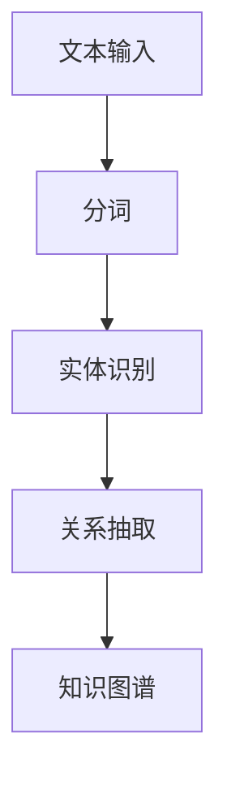
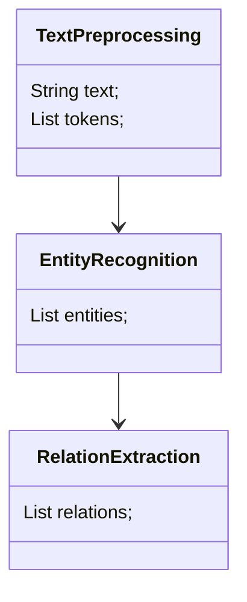
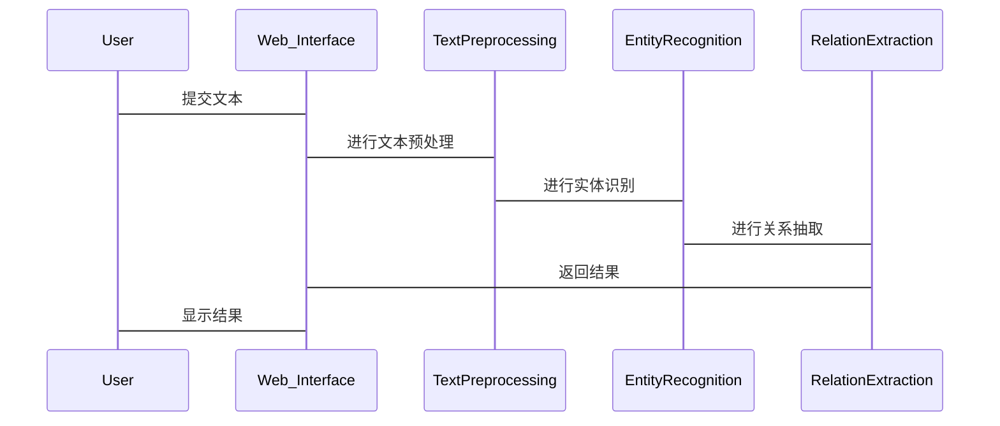

                 


# AI Agent的知识获取：从非结构化文本中提取信息

> 关键词：AI Agent、知识获取、非结构化文本、信息抽取、自然语言处理、知识图谱、文本挖掘

> 摘要：本文详细探讨了AI Agent如何从非结构化文本中提取信息，涵盖了从背景介绍到算法实现的全过程。通过自然语言处理技术和知识图谱构建方法，介绍了如何将非结构化文本转化为可计算的知识。文章结合理论与实践，提供了一套完整的解决方案，从文本预处理、信息抽取到系统架构设计，均为读者提供了详尽的指导。

---

## 第1章 AI Agent与知识获取概述

### 1.1 问题背景与描述
#### 1.1.1 非结构化文本的定义与特点
- 非结构化文本的特点：无固定格式、语义复杂、信息分散
- 非结构化文本的常见形式：自然语言文本、社交媒体数据、新闻文章等

#### 1.1.2 知识获取的核心问题
- 知识获取的目标：从文本中提取结构化信息
- 知识获取的挑战：语义理解、信息不完整、歧义性

#### 1.1.3 AI Agent在知识获取中的作用
- AI Agent的任务：理解文本内容，提取有用信息
- AI Agent的优势：自动化、高效性、可扩展性

### 1.2 知识图谱与信息抽取
#### 1.2.1 知识图谱的定义与特点
- 知识图谱的定义：以图结构表示知识，节点表示实体，边表示关系
- 知识图谱的特点：结构化、可扩展、可查询

#### 1.2.2 非结构化文本到知识图谱的转换
- 文本抽取：从文本中提取实体和关系
- 知识建模：将实体和关系组织成图结构

### 1.3 本章小结
- 总结：非结构化文本提取是AI Agent获取知识的关键步骤，知识图谱为提取的信息提供了结构化的表示方式。

---

## 第2章 自然语言处理基础

### 2.1 文本预处理
#### 2.1.1 分词与词性标注
- 分词：将文本分割成词语或短语
- 词性标注：给每个词语标注词性（名词、动词、形容词等）

#### 2.1.2 停用词处理与文本清洗
- 停用词：常见但无实际意义的词语（如“的”、“了”、“是”）
- 文本清洗：去除无关信息，保留核心内容

#### 2.1.3 文本向量化方法
- 词袋模型：基于词频的文本表示方法
- 词嵌入：将词语映射为低维向量（如Word2Vec、GloVe）

### 2.2 常用NLP模型
#### 2.2.1 TF-IDF与词袋模型
- TF-IDF：计算词语在文本中的重要性
- 词袋模型：将文本表示为词语的集合

#### 2.2.2 词嵌入模型（如Word2Vec、GloVe）
- Word2Vec：通过上下文预测词语，生成词向量
- GloVe：基于全局词频统计，生成词向量

#### 2.2.3 神经网络语言模型（如BERT）
- BERT：基于Transformer的双向语言模型，用于理解上下文

### 2.3 文本表示方法
#### 2.3.1 词向量表示
- 示例：使用Word2Vec生成词向量
  ```python
  from gensim.models import Word2Vec
  sentences = ["This is a test sentence."]
  model = Word2Vec(sentences, vector_size=100, window=5, min_count=1, workers=4)
  print(model["test"])  # 输出词向量
  ```

#### 2.3.2 句子向量表示
- 使用句子嵌入技术（如BERT）生成句子向量

#### 2.3.3 文档向量表示
- 使用TF-IDF或词嵌入生成文档向量

### 2.4 本章小结
- 总结：自然语言处理技术为文本提取提供了基础工具，包括分词、词嵌入和文本表示方法。

---

## 第3章 信息抽取算法原理

### 3.1 文本分割与分块
#### 3.1.1 文本分割策略
- 基于句子的分割：将文本分割成句子
- 基于段落的分割：将文本分割成段落

#### 3.1.2 分块方法
- 基于规则的分块：使用正则表达式提取特定模式
- 基于模型的分块：使用机器学习模型进行分块

### 3.2 实体识别与关系抽取
#### 3.2.1 实体识别算法
- 基于CRF的实体识别
  ```python
  from sklearn_crfsuite import CRF
  crf = CRF()
  crf.fit(X_train, y_train)
  ```

#### 3.2.2 关系抽取算法
- 基于模板的关系抽取：定义规则匹配特定关系
- 基于深度学习的关系抽取：使用神经网络模型预测关系

#### 3.2.3 实体关系推理
- 基于上下文的关系推理：通过语境理解实体之间的关系

### 3.3 知识图谱构建的算法流程
#### 3.3.1 算法流程图


#### 3.3.2 示例代码
```python
# 实体识别示例
from flair.models import SequenceTagger
from flair.data import Corpus
from flair.tokenization import Tokenizer

corpus = Corpus([["This is a test sentence."]])
tokenizer = Tokenizer()
tokens = tokenizer.tokenize(corpus)

tagger = SequenceTagger.load('ner')
tagger.predict(tokens)

for token in tokens:
    print(token.tag)
```

### 3.4 本章小结
- 总结：信息抽取算法通过分词、实体识别和关系抽取，将非结构化文本转化为结构化知识。

---

## 第4章 系统架构设计

### 4.1 问题场景介绍
#### 4.1.1 项目背景
- 示例：构建一个新闻信息抽取系统

#### 4.1.2 项目目标
- 从新闻文本中提取人物、地点、事件等信息

### 4.2 系统功能设计
#### 4.2.1 领域模型设计


#### 4.2.2 系统架构设计
```mermaid
dockerfile
service NewsExtractor {
    web_interface
    TextPreprocessing
    EntityRecognition
    RelationExtraction
}
```

### 4.3 接口设计与交互
#### 4.3.1 系统接口
- 输入接口：接收文本输入
- 输出接口：返回结构化知识

#### 4.3.2 交互流程


### 4.4 本章小结
- 总结：系统架构设计为信息抽取提供了整体框架，明确了各模块的功能和交互流程。

---

## 第5章 项目实战

### 5.1 环境安装与配置
#### 5.1.1 安装必要的库
```bash
pip install flair gensim spacy transformers
python -m spacy download en_core_web_sm
```

### 5.2 系统核心实现
#### 5.2.1 文本预处理代码
```python
import spacy

nlp = spacy.load("en_core_web_sm")
doc = nlp("This is a test sentence.")
for token in doc:
    print(token.text, token.pos_)
```

#### 5.2.2 实体识别与关系抽取
```python
from flair.models import SequenceTagger
from flair.data import Corpus

corpus = Corpus([["This is a test sentence."]])
tagger = SequenceTagger.load('ner')
result = tagger.predict(corpus)

for sentence in result:
    for token in sentence.tokens:
        print(token.tag)
```

### 5.3 代码应用与分析
#### 5.3.1 代码解读
- 使用Flair进行实体识别
- 使用Gensim进行词嵌入

#### 5.3.2 案例分析
- 示例：从新闻文本中提取人物和事件

### 5.4 本章小结
- 总结：通过项目实战，读者可以掌握从非结构化文本中提取信息的具体实现方法。

---

## 第6章 最佳实践与小结

### 6.1 最佳实践
#### 6.1.1 选择合适的NLP工具
- 根据任务需求选择Flair、Spacy或Transformers库

#### 6.1.2 数据预处理的关键性
- 数据清洗和分词对后续结果影响重大

#### 6.1.3 模型调优与评估
- 使用交叉验证和评估指标（如准确率、召回率）优化模型

### 6.2 小结
- 通过本文，读者可以系统地了解从非结构化文本中提取信息的完整流程，包括背景、算法、系统设计和项目实战。

### 6.3 注意事项
- 数据质量和多样性对模型性能影响显著
- 模型调优需要结合具体任务需求

### 6.4 拓展阅读
- 建议阅读Flair和Hugging Face的官方文档，深入理解模型的使用和调优方法

---

## 附录

### 附录A: 常用NLP工具与库
- Flair: [https://github.com/flair-nlp/flair](https://github.com/flair-nlp/flair)
- Spacy: [https://spacy.io](https://spacy.io)
- Hugging Face Transformers: [https://huggingface.co/transformers](https://huggingface.co/transformers)

### 附录B: 参考文献
- 罗列本文中引用的所有文献和资源

---

# 结语

通过本文的详细讲解，读者可以系统地掌握从非结构化文本中提取信息的方法，从理论到实践，为构建高效的AI Agent知识获取系统打下坚实的基础。希望本文能为读者提供有价值的参考和指导。

