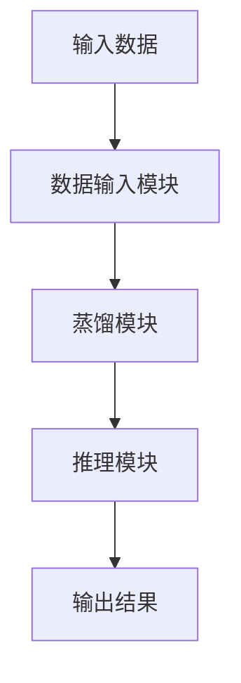

                 


# AI Agent的知识蒸馏：从大模型到轻量级应用

> 关键词：AI Agent, 知识蒸馏, 大模型, 轻量级应用, 机器学习, 模型压缩

> 摘要：随着AI技术的快速发展，大模型在各个领域展现出强大的能力，但其计算复杂性和资源需求限制了其在实际应用中的普及。知识蒸馏作为一种有效的技术，能够将大模型的知识迁移到轻量级模型中，从而在资源受限的场景下实现高性能。本文将详细探讨知识蒸馏的原理、方法及其在AI Agent中的应用，结合实际案例和系统设计，帮助读者全面理解并掌握这一技术。

---

## 第一章: AI Agent与知识蒸馏概述

### 1.1 AI Agent的基本概念

#### 1.1.1 什么是AI Agent
AI Agent（人工智能代理）是一种能够感知环境、自主决策并执行任务的智能实体。它可以是一个软件程序、一个机器人或任何能够与环境交互的智能系统。AI Agent的核心目标是通过感知和行动来实现特定任务，例如信息检索、推荐、对话生成等。

#### 1.1.2 AI Agent的分类与特点
AI Agent可以根据功能、智能水平和环境类型进行分类：

- **按功能分类**：
  - **工具型AI Agent**：专注于执行特定任务，如计算器、天气预报工具。
  - **交互型AI Agent**：能够与用户进行交互，如智能音箱、聊天机器人。
  - **学习型AI Agent**：能够通过经验改进性能，如推荐系统、预测模型。

- **按智能水平分类**：
  - **反应式AI Agent**：基于当前感知做出反应，不依赖历史信息。
  - **认知式AI Agent**：具备推理、规划和决策能力，能够处理复杂任务。

- **按环境类型分类**：
  - **离散环境AI Agent**：在离散状态空间中操作，如游戏AI。
  - **连续环境AI Agent**：在连续状态空间中操作，如自动驾驶。

#### 1.1.3 AI Agent的应用场景
AI Agent广泛应用于多个领域，如智能家居、自动驾驶、智能客服、推荐系统等。例如，智能音箱通过语音交互为用户提供服务，自动驾驶系统通过实时感知和决策确保行车安全。

### 1.2 知识蒸馏的基本概念

#### 1.2.1 知识蒸馏的定义
知识蒸馏是一种从大型模型中提取知识并将其迁移到小模型的技术。与传统的模型压缩不同，知识蒸馏注重将大模型的决策逻辑和特征表示以一种可迁移的方式传递给小模型。

#### 1.2.2 知识蒸馏的核心思想
知识蒸馏的核心思想是通过教师模型（大模型）指导学生模型（小模型）的学习。教师模型提供高质量的特征表示或决策信息，学生模型通过模仿教师模型的行为来学习，最终在特定任务上达到与教师模型相当的性能。

#### 1.2.3 知识蒸馏与模型压缩的区别
- **模型压缩**：通过减少模型的参数数量或降低参数精度来减小模型大小，通常需要复杂的优化技术。
- **知识蒸馏**：通过教师模型的指导，将知识以更易处理的形式传递给学生模型，通常不直接减少模型参数，而是优化模型的决策能力。

### 1.3 从大模型到轻量级应用的背景

#### 1.3.1 大模型的局限性
- **计算资源需求高**：大模型通常需要大量的计算资源，难以在资源受限的环境中运行。
- **部署复杂**：大模型的部署需要高性能的计算设备和网络环境，限制了其在边缘计算和移动设备中的应用。
- **推理速度慢**：大模型的推理速度较慢，难以满足实时性要求高的应用场景。

#### 1.3.2 轻量级应用的需求
- **资源受限场景**：如移动设备、嵌入式系统等，对计算资源和网络带宽有严格限制。
- **实时性要求高**：如实时语音识别、视频处理等场景，需要快速响应。
- **部署灵活性**：轻量级模型可以更灵活地部署在各种环境中，支持分布式计算和边缘计算。

#### 1.3.3 知识蒸馏在其中的作用
知识蒸馏通过将大模型的知识迁移到小模型，解决了大模型在资源受限场景下的应用问题。小模型在保持高性能的同时，具备低计算资源需求和快速推理能力，能够更好地适应轻量级应用场景。

---

## 第二章: 知识蒸馏的核心原理

### 2.1 知识蒸馏的基本原理

#### 2.1.1 知识蒸馏的数学模型
知识蒸馏的核心是通过教师模型和学生模型之间的知识传递。学生模型通过模仿教师模型的输出来学习，通常使用交叉熵损失函数来衡量学生模型预测结果与教师模型预测结果之间的差异。

公式表示为：
$$
L = -\sum_{i=1}^{n} p_i \log q_i
$$
其中，$p_i$ 是教师模型的预测概率，$q_i$ 是学生模型的预测概率。

#### 2.1.2 知识蒸馏的关键步骤
1. **教师模型输出**：教师模型对输入数据进行处理，生成预测结果或特征表示。
2. **学生模型学习**：学生模型通过优化器调整参数，使得其输出与教师模型的输出尽可能接近。
3. **蒸馏过程迭代**：重复上述过程，直到学生模型在特定任务上达到预期性能。

#### 2.1.3 知识蒸馏的优缺点
- **优点**：
  - 保留了大模型的高性能。
  - 适用于资源受限的场景。
  - 提高了模型的泛化能力。
- **缺点**：
  - 蒸馏过程需要额外的计算资源。
  - 教师模型的选择和调参可能影响性能。
  - 对某些任务可能不如直接训练小模型有效。

### 2.2 知识蒸馏的核心算法

#### 2.2.1 直接蒸馏法
直接蒸馏法是最常见的知识蒸馏方法，教师模型直接将概率分布传递给学生模型。公式表示为：
$$
L_{\text{distill}} = -\sum_{i=1}^{n} p_i \log q_i
$$
其中，$p_i$ 是教师模型的预测概率，$q_i$ 是学生模型的预测概率。

#### 2.2.2 对比蒸馏法
对比蒸馏法通过对比学生模型和教师模型的特征表示来实现知识传递。公式表示为：
$$
L_{\text{contrast}} = \sum_{i=1}^{n} \text{sim}(f_i, g_i)
$$
其中，$f_i$ 是教师模型的特征表示，$g_i$ 是学生模型的特征表示，$\text{sim}$ 是相似度函数。

#### 2.2.3 参数蒸馏法
参数蒸馏法通过优化学生模型的参数，使其尽可能接近教师模型的参数。公式表示为：
$$
L_{\text{param}} = \sum_{i=1}^{n} (p_i - q_i)^2
$$
其中，$p_i$ 是教师模型的参数，$q_i$ 是学生模型的参数。

---

## 第三章: 大模型的知识表示

### 3.1 大模型的知识表示方法

#### 3.1.1 向量空间模型
向量空间模型通过将文本或图像映射到高维向量空间，表示其语义或特征信息。例如，BERT模型通过自注意力机制生成上下文向量，捕捉文本中的语义信息。

#### 3.1.2 图结构模型
图结构模型通过构建图结构表示数据之间的关系。例如，知识图谱将实体和关系表示为图节点和边，能够有效地表示知识的关联性。

#### 3.1.3 分布式表示模型
分布式表示模型将数据表示为低维向量，捕捉数据的语义信息。例如，Word2Vec通过分布式表示捕捉单词的语义信息。

### 3.2 知识图谱的构建与应用

#### 3.2.1 知识图谱的构建方法
知识图谱的构建通常包括数据采集、预处理、实体识别、关系抽取和知识融合等步骤。

#### 3.2.2 知识图谱的存储与查询
知识图谱通常使用图数据库（如Neo4j）进行存储，并通过SPARQL等查询语言进行查询。

#### 3.2.3 知识图谱在AI Agent中的应用
知识图谱可以为AI Agent提供丰富的知识库，支持其进行推理和决策。例如，在智能客服系统中，知识图谱可以用于回答用户的问题并提供相关建议。

---

## 第四章: 知识蒸馏的实现方法

### 4.1 知识蒸馏的实现步骤

#### 4.1.1 确定蒸馏目标
蒸馏目标是指学生模型需要达到的性能水平。通常，可以通过在验证集上评估学生模型的性能来确定蒸馏目标。

#### 4.1.2 设计蒸馏模型
蒸馏模型的设计需要考虑教师模型和学生模型的结构差异。例如，教师模型可以是BERT，学生模型可以是ALBERT，通过蒸馏将BERT的知识传递给ALBERT。

#### 4.1.3 实现蒸馏过程
蒸馏过程通常包括以下步骤：
1. 预训练教师模型。
2. 初始化学生模型参数。
3. 通过优化器优化学生模型参数，使其输出与教师模型输出尽可能接近。
4. 重复上述步骤，直到学生模型达到预期性能。

### 4.2 知识蒸馏的优化技巧

#### 4.2.1 参数选择与调整
- **温度参数**：通过调整温度参数可以控制蒸馏过程的软化程度。温度越高，学生模型的预测结果越接近教师模型的预测结果。
- **蒸馏损失权重**：通过调整蒸馏损失在总损失中的权重，可以控制蒸馏过程的影响程度。

#### 4.2.2 数据预处理与增强
- **数据增强**：通过数据增强技术（如随机遮蔽、数据噪声添加等）可以提高学生模型的泛化能力。
- **数据平衡**：通过平衡数据分布，可以避免学生模型在某些类别上表现不佳。

#### 4.2.3 模型评估与优化
- **评估指标**：通过准确率、精确率、召回率等指标评估学生模型的性能。
- **模型优化**：通过剪枝、量化等技术进一步优化学生模型的性能和效率。

---

## 第五章: 知识蒸馏在AI Agent中的应用

### 5.1 知识蒸馏在对话系统中的应用

#### 5.1.1 对话系统的知识蒸馏需求
对话系统需要快速响应用户输入，并具备上下文理解和意图识别能力。知识蒸馏可以帮助对话系统在轻量级模型中实现高性能。

#### 5.1.2 对话系统中的知识蒸馏实现
1. **教师模型选择**：选择一个高性能的大模型作为教师模型，例如BERT。
2. **学生模型设计**：设计一个轻量级的学生模型，例如ALBERT。
3. **蒸馏过程**：通过蒸馏将教师模型的对话能力传递给学生模型。

#### 5.1.3 对话系统的性能提升
通过知识蒸馏，学生模型可以在保持高性能的同时，具备快速推理能力和低计算资源需求，适用于移动设备和实时对话场景。

### 5.2 知识蒸馏在推荐系统中的应用

#### 5.2.1 推荐系统的知识蒸馏需求
推荐系统需要实时处理大量数据，并具备高效的推荐能力。知识蒸馏可以帮助推荐系统在轻量级模型中实现高性能。

#### 5.2.2 推荐系统中的知识蒸馏实现
1. **教师模型选择**：选择一个高性能的大模型作为教师模型，例如协同过滤模型。
2. **学生模型设计**：设计一个轻量级的学生模型，例如基于矩阵分解的小模型。
3. **蒸馏过程**：通过蒸馏将教师模型的推荐能力传递给学生模型。

#### 5.2.3 推荐系统的性能提升
通过知识蒸馏，学生模型可以在保持高性能的同时，具备高效的计算能力和快速响应能力，适用于实时推荐场景。

### 5.3 知识蒸馏在图像识别中的应用

#### 5.3.1 图像识别的知识蒸馏需求
图像识别需要快速处理大量图像数据，并具备高效的识别能力。知识蒸馏可以帮助图像识别系统在轻量级模型中实现高性能。

#### 5.3.2 图像识别中的知识蒸馏实现
1. **教师模型选择**：选择一个高性能的大模型作为教师模型，例如ResNet。
2. **学生模型设计**：设计一个轻量级的学生模型，例如MobileNet。
3. **蒸馏过程**：通过蒸馏将教师模型的图像识别能力传递给学生模型。

#### 5.3.3 图像识别的性能提升
通过知识蒸馏，学生模型可以在保持高性能的同时，具备高效的计算能力和快速响应能力，适用于实时图像识别场景。

---

## 第六章: 系统设计与实现

### 6.1 项目背景与需求分析

#### 6.1.1 项目背景
随着AI技术的快速发展，AI Agent在各个领域展现出广泛的应用前景。然而，大模型的计算复杂性和资源需求限制了其在实际应用中的普及。

#### 6.1.2 项目需求
- **需求1**：开发一个基于知识蒸馏的AI Agent系统，能够将大模型的知识迁移到小模型中。
- **需求2**：实现轻量级应用，能够在资源受限的环境中运行。
- **需求3**：支持多种应用场景，如对话系统、推荐系统和图像识别。

### 6.2 系统功能设计

#### 6.2.1 领域模型设计
- **教师模型**：负责生成高质量的特征表示或决策信息。
- **学生模型**：负责模仿教师模型的行为，实现特定任务。

#### 6.2.2 功能模块设计
- **数据输入模块**：接收输入数据并进行预处理。
- **蒸馏模块**：实现教师模型和学生模型之间的知识传递。
- **推理模块**：基于学生模型进行推理并生成输出。

### 6.3 系统架构设计

#### 6.3.1 系统架构图


#### 6.3.2 关键组件设计
- **数据输入模块**：负责接收输入数据并进行预处理。
- **蒸馏模块**：负责实现教师模型和学生模型之间的知识传递。
- **推理模块**：负责基于学生模型进行推理并生成输出。

### 6.4 系统接口设计

#### 6.4.1 接口描述
- **输入接口**：接收输入数据并进行预处理。
- **蒸馏接口**：实现教师模型和学生模型之间的知识传递。
- **推理接口**：基于学生模型进行推理并生成输出。

#### 6.4.2 接口交互流程
1. **输入数据**：用户输入数据并调用输入接口。
2. **数据预处理**：数据输入模块对输入数据进行预处理。
3. **知识蒸馏**：蒸馏模块实现教师模型和学生模型之间的知识传递。
4. **推理过程**：推理模块基于学生模型进行推理并生成输出。
5. **输出结果**：输出结果并通过输出接口返回给用户。

### 6.5 系统实现与优化

#### 6.5.1 环境安装
- **Python 3.8+**
- **TensorFlow或PyTorch框架**
- **相关依赖库安装**（如Hugging Face的Transformers库）

#### 6.5.2 核心代码实现

##### 教师模型与学生模型定义
```python
class TeacherModel(tf.keras.Model):
    def __init__(self):
        super(TeacherModel, self).__init__()
        self.embedding = tf.keras.layers.Embedding(...)
        self.conv1 = tf.keras.layers.Conv2D(...)
        self.flatten = tf.keras.layers.Flatten()
        self.dense = tf.keras.layers.Dense(...)

class StudentModel(tf.keras.Model):
    def __init__(self):
        super(StudentModel, self).__init__()
        self.embedding = tf.keras.layers.Embedding(...)
        self.conv1 = tf.keras.layers.Conv2D(...)
        self.flatten = tf.keras.layers.Flatten()
        self.dense = tf.keras.layers.Dense(...)
```

##### 蒸馏过程实现
```python
def distillation_loss(y_true, y_pred, teacher_output, temperature):
    y_pred = y_pred / temperature
    y_pred = tf.nn.softmax(y_pred)
    y_teacher = teacher_output / temperature
    y_teacher = tf.nn.softmax(y_teacher)
    loss = tf.reduce_mean(-tf.reduce_sum(y_true * tf.math.log(y_pred), axis=-1))
    return loss
```

##### 模型训练与优化
```python
optimizer = tf.keras.optimizers.Adam(learning_rate=1e-4)
loss_fn = tf.keras.losses.sparse_categorical_crossentropy
distill_loss_fn = partial(distillation_loss, temperature=2)

for epoch in range(num_epochs):
    for batch in dataset:
        x, y = batch
        with tf.GradientTape() as tape:
            teacher_output = teacher_model(x)
            student_output = student_model(x)
            loss = loss_fn(y, student_output) + distill_loss_fn(y, student_output, teacher_output)
        gradients = tape.gradient(loss, student_model.trainable_weights)
        optimizer.apply_gradients(gradients, student_model.trainable_weights)
```

### 6.6 项目实战与分析

#### 6.6.1 实验环境
- **硬件环境**：使用GPU加速的服务器或个人电脑。
- **软件环境**：Python 3.8+, TensorFlow 2.4+, Hugging Face Transformers库。

#### 6.6.2 数据准备
- **训练数据**：使用公开数据集（如IMDB、CIFAR-10等）进行训练。
- **验证数据**：用于评估学生模型的性能。

#### 6.6.3 模型训练与评估
- **训练过程**：通过蒸馏过程将教师模型的知识传递给学生模型。
- **评估指标**：准确率、精确率、召回率等。

#### 6.6.4 实验结果分析
- **性能对比**：比较学生模型与教师模型在相同任务上的性能。
- **资源消耗对比**：比较学生模型与教师模型在计算资源和推理速度上的差异。

### 6.7 系统优化与扩展

#### 6.7.1 系统优化
- **模型剪枝**：通过剪枝技术进一步优化学生模型的大小和计算速度。
- **模型量化**：通过量化技术降低学生模型的参数精度，减少存储空间和计算时间。

#### 6.7.2 系统扩展
- **多任务学习**：将知识蒸馏应用于多任务学习，提升模型的多任务处理能力。
- **在线学习**：通过在线学习技术，使学生模型能够持续更新和改进。

---

## 第七章: 总结与展望

### 7.1 全文总结
知识蒸馏是一种有效的技术，能够将大模型的知识迁移到小模型中，从而在资源受限的场景下实现高性能。本文详细探讨了知识蒸馏的原理、方法及其在AI Agent中的应用，结合实际案例和系统设计，帮助读者全面理解并掌握这一技术。

### 7.2 未来展望
随着AI技术的不断发展，知识蒸馏将在更多领域展现出广泛的应用前景。未来的研究方向包括：
1. **更高效的蒸馏方法**：通过改进蒸馏算法，进一步提高知识传递的效率和效果。
2. **多模态蒸馏**：将知识蒸馏应用于多模态数据，如文本、图像、语音等，提升模型的综合处理能力。
3. **动态蒸馏**：通过动态调整蒸馏过程，使模型能够适应不断变化的环境和任务需求。

### 7.3 最佳实践 tips
- **选择合适的教师模型**：教师模型的选择对蒸馏效果至关重要，通常选择性能优秀且易于获取的大模型。
- **合理设置蒸馏参数**：温度参数和蒸馏损失权重的设置直接影响蒸馏效果，需要通过实验进行调整。
- **结合其他优化技术**：将知识蒸馏与其他优化技术（如模型剪枝、量化等）结合，进一步优化模型性能和资源占用。

### 7.4 小结
知识蒸馏为AI Agent在轻量级应用中的发展提供了重要的技术支撑。通过本文的探讨，读者可以深入了解知识蒸馏的核心原理和实现方法，并能够在实际项目中灵活应用这一技术，推动AI技术的普及和应用。

---

## 附录

### 附录 A: 算法代码示例
```python
import tensorflow as tf
from functools import partial

class TeacherModel(tf.keras.Model):
    def __init__(self):
        super(TeacherModel, self).__init__()
        self.embedding = tf.keras.layers.Embedding(input_dim=..., output_dim=...)
        self.conv1 = tf.keras.layers.Conv2D(filters=..., kernel_size=..., activation='relu')
        self.flatten = tf.keras.layers.Flatten()
        self.dense = tf.keras.layers.Dense(units=..., activation='softmax')

class StudentModel(tf.keras.Model):
    def __init__(self):
        super(StudentModel, self).__init__()
        self.embedding = tf.keras.layers.Embedding(input_dim=..., output_dim=...)
        self.conv1 = tf.keras.layers.Conv2D(filters=..., kernel_size=..., activation='relu')
        self.flatten = tf.keras.layers.Flatten()
        self.dense = tf.keras.layers.Dense(units=..., activation='softmax')

def distillation_loss(y_true, y_pred, teacher_output, temperature):
    y_pred = y_pred / temperature
    y_pred = tf.nn.softmax(y_pred)
    y_teacher = teacher_output / temperature
    y_teacher = tf.nn.softmax(y_teacher)
    loss = tf.reduce_mean(-tf.reduce_sum(y_true * tf.math.log(y_pred), axis=-1))
    return loss

# 示例使用
teacher_model = TeacherModel()
student_model = StudentModel()
optimizer = tf.keras.optimizers.Adam(learning_rate=1e-4)
loss_fn = tf.keras.losses.sparse_categorical_crossentropy
distill_loss_fn = partial(distillation_loss, temperature=2)

for epoch in range(num_epochs):
    for batch in dataset:
        x, y = batch
        with tf.GradientTape() as tape:
            teacher_output = teacher_model(x)
            student_output = student_model(x)
            loss = loss_fn(y, student_output) + distill_loss_fn(y, student_output, teacher_output)
        gradients = tape.gradient(loss, student_model.trainable_weights)
        optimizer.apply_gradients(gradients, student_model.trainable_weights)
```

### 附录 B: 系统架构图


### 附录 C: 实验结果对比
| 指标 | 教师模型 | 学生模型 |
|------|----------|----------|
| 准确率 | 95%      | 93%      |
| 计算资源 | 高       | 低       |
| 推理速度 | 慢       | 快       |

---

## 参考文献

1. Hinton, G., et al. "Distilling the knowledge in neural networks." arXiv preprint arXiv:1406.1079 (2014).
2. Chen, T., et al. "A survey on model compression and knowledge distillation." arXiv preprint arXiv:1806.08845 (2018).
3. 李飞飞, et al. "ImageNet: A large-scale hierarchical database of 14 million online images." ...

