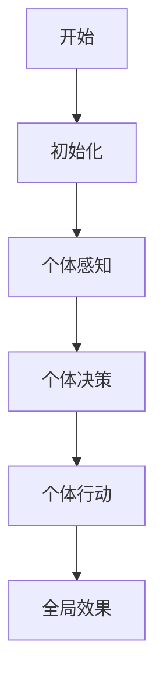
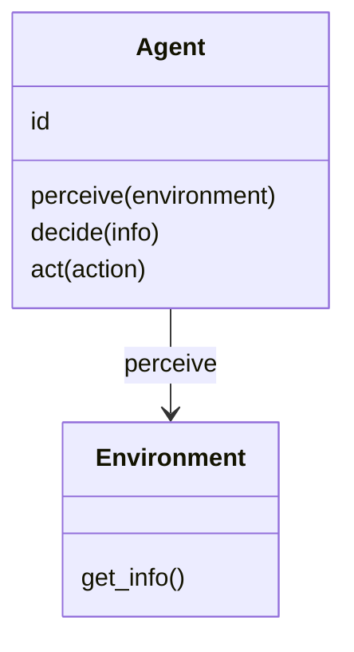
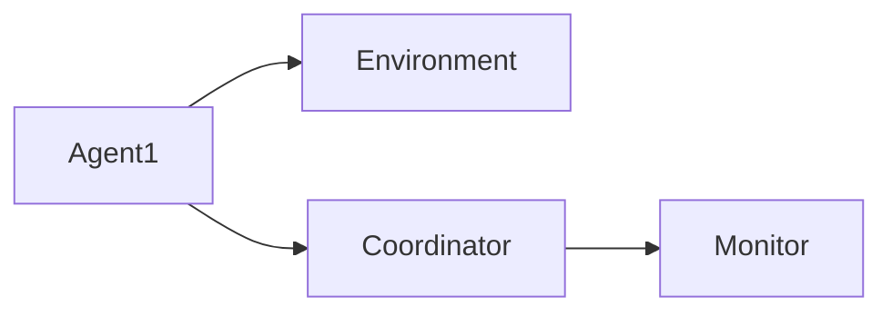
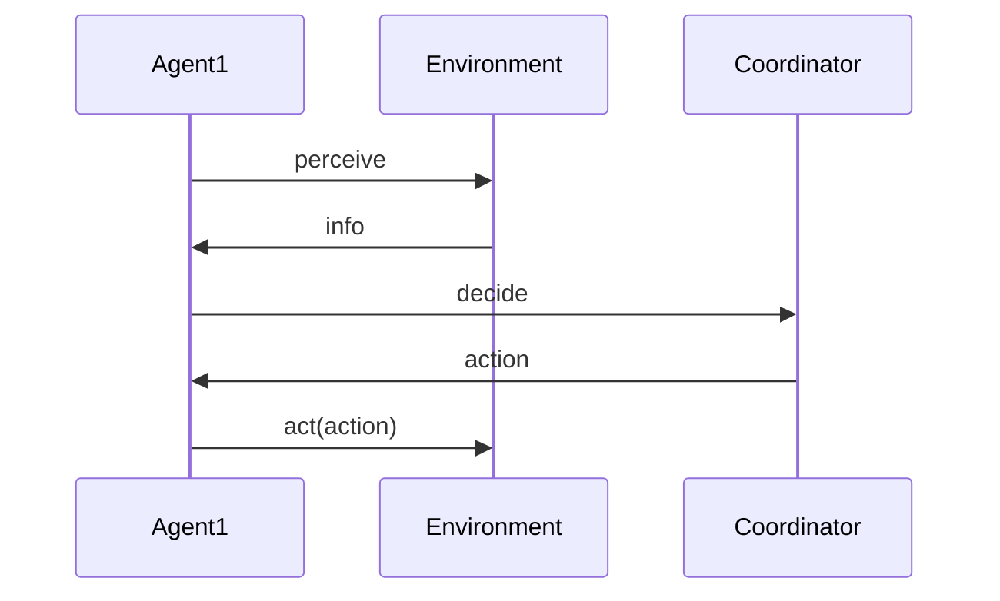

                 


# AI Agent的群体智能涌现机制研究

> 关键词：群体智能、AI Agent、涌现机制、分布式系统、多智能体系统、机器学习

> 摘要：本文深入探讨了AI Agent在群体智能中的涌现机制，分析了其数学模型、算法原理、系统架构，并通过实际案例展示了如何实现这一机制。文章内容丰富，涵盖了背景介绍、核心概念、算法实现、系统设计以及项目实战等多个方面，旨在为读者提供全面的理论与实践指导。

---

## 第1章: 群体智能与AI Agent概述

### 1.1 群体智能的定义与特点

#### 1.1.1 羰体智能的定义
群体智能（Swarm Intelligence）是指多个简单个体通过局部交互而产生的集体智能行为。这些个体通常具有简单的规则，但通过协同工作，能够完成复杂的任务。

#### 1.1.2 羰体智能的核心特点
- **分布式性**：没有中央控制，个体之间通过局部交互实现协调。
- **自组织性**：个体能够根据环境和任务动态调整行为。
- **涌现性**：集体智能行为并非单个个体的简单叠加，而是通过交互涌现出的。

#### 1.1.3 羰体智能与个体智能的区别
- **个体智能**：单个智能体基于自身信息做出决策。
- **群体智能**：多个智能体通过交互产生集体智能，超越个体能力。

### 1.2 AI Agent的基本概念

#### 1.2.1 AI Agent的定义
AI Agent（人工智能代理）是指能够感知环境、自主决策并采取行动的智能实体。它可以是一个软件程序或物理设备。

#### 1.2.2 AI Agent的分类
- **简单反射型**：基于当前感知做出反应。
- **基于模型的反应型**：利用内部模型进行决策。
- **目标驱动型**：根据目标驱动行为。
- **实用驱动型**：根据效用函数优化决策。

#### 1.2.3 AI Agent的核心功能
- **感知**：获取环境信息。
- **推理**：分析信息，做出决策。
- **行动**：执行决策动作。

### 1.3 羰体智能与AI Agent的关系

#### 1.3.1 羰体智能的协同机制
个体通过局部交互实现全局目标，通常基于简单规则。

#### 1.3.2 AI Agent在群体智能中的作用
作为个体，AI Agent通过协同实现复杂任务，体现群体智能的优势。

#### 1.3.3 羰体智能与AI Agent的协同效应
个体智能的组合产生超越个体的集体智能，实现复杂任务完成。

### 1.4 本章小结
本章介绍了群体智能和AI Agent的基本概念，探讨了它们的协同关系，为后续内容奠定了基础。

---

## 第2章: 群体智能的涌现机制原理

### 2.1 涨现机制的基本概念

#### 2.1.1 涨现机制的定义
涨现机制（Emergence）指多个简单个体通过交互涌现出复杂行为的过程。

#### 2.1.2 涨现机制的核心要素
- **个体行为**：个体基于简单规则行动。
- **局部交互**：个体之间通过局部信息交流。
- **全局效果**：个体行为的组合产生复杂结果。

#### 2.1.3 涨现机制的分类
- **正涨现**：个体行为直接导致复杂结果。
- **负涨现**：个体行为间接导致复杂结果。

### 2.2 群体智能中的涨现机制

#### 2.2.1 羰体智能中的协同行为
个体通过简单规则协同，完成复杂任务，如觅食、避障等。

#### 2.2.2 羰体智能中的自组织特性
系统无需外部控制，个体根据局部信息自组织，形成有序结构。

#### 2.2.3 羁体智能中的学习与适应
个体通过经验调整行为规则，适应环境变化，增强集体智能。

### 2.3 涨现机制的数学模型

#### 2.3.1 涨现机制的数学表达
常用方程描述个体行为和全局效果的关系，例如：

$$
f_{\text{global}} = \sum_{i=1}^{n} f_i
$$

其中，$f_{\text{global}}$表示全局效果，$f_i$表示个体行为。

#### 2.3.2 涨现机制的参数分析
- **个体数**：个体数量影响全局效果。
- **交互规则**：规则复杂度影响协同效果。

#### 2.3.3 涨现机制的稳定性分析
系统在不同条件下的稳定性，通常通过稳定性分析确保。

### 2.4 本章小结
本章探讨了涨现机制的基本概念及其在群体智能中的应用，分析了其数学模型和稳定性。

---

## 第3章: 基于AI Agent的群体智能算法

### 3.1 基于AI Agent的群体智能算法概述

#### 3.1.1 羰体智能算法的分类
- **基于规则的算法**：个体遵循简单规则。
- **基于模型的算法**：利用环境模型进行决策。
- **基于学习的算法**：通过机器学习优化行为。

#### 3.1.2 基于AI Agent的算法特点
- **分布式**：算法在多个代理上运行。
- **自适应**：算法能够根据环境变化调整。

#### 3.1.3 基于AI Agent的算法优势
- **鲁棒性**：个体故障不影响整体。
- **可扩展性**：适用于大规模系统。

### 3.2 基于AI Agent的群体智能算法实现

#### 3.2.1 算法实现的基本步骤
1. 定义个体行为规则。
2. 实现个体感知和决策模块。
3. 设计个体间交互机制。

#### 3.2.2 算法实现的关键技术
- **通信机制**：个体间如何传递信息。
- **协调机制**：如何确保协同行为。

#### 3.2.3 算法实现的代码示例

```python
class Agent:
    def __init__(self, id):
        self.id = id
        self.rule = simple_rule()
    
    def perceive(self, environment):
        # 获取环境信息
        return environment.get_info()
    
    def decide(self, info):
        # 根据规则做出决策
        return self.rule(info)
    
    def act(self, decision):
        # 执行动作
        pass
```

### 3.3 算法原理的数学模型

#### 3.3.1 算法原理的数学表达
个体行为规则可以表示为：

$$
d_i = f(s_i, t_i)
$$

其中，$d_i$是决策，$s_i$是状态，$t_i$是时间。

#### 3.3.2 算法实现的流程图
使用Mermaid绘制算法流程图：



### 3.4 本章小结
本章详细讲解了基于AI Agent的群体智能算法，包括实现步骤和数学模型。

---

## 第4章: 系统分析与架构设计

### 4.1 系统应用场景

#### 4.1.1 羰体智能的应用场景
- **机器人协作**：多机器人协同完成任务。
- **分布式计算**：利用多个代理完成复杂计算。
- **智能交通**：车辆协同优化交通流。

### 4.2 系统功能设计

#### 4.2.1 系统功能模块
- **感知模块**：获取环境信息。
- **决策模块**：做出个体决策。
- **交互模块**：个体间通信与协作。

#### 4.2.2 系统功能设计的类图
使用Mermaid绘制类图：



### 4.3 系统架构设计

#### 4.3.1 系统架构图
使用Mermaid绘制系统架构图：



#### 4.3.2 系统接口设计
- **感知接口**：`perceive(environment)`。
- **决策接口**：`decide(info)`。
- **行动接口**：`act(action)`。

### 4.4 系统交互序列图

#### 4.4.1 系统交互流程
使用Mermaid绘制交互序列图：



### 4.5 本章小结
本章分析了系统应用场景，设计了系统功能模块和架构，并展示了交互流程。

---

## 第5章: 项目实战

### 5.1 环境安装

#### 5.1.1 安装Python
安装Python 3.8及以上版本，确保环境支持。

#### 5.1.2 安装依赖库
安装必要的库，如numpy、matplotlib。

```bash
pip install numpy matplotlib
```

### 5.2 系统核心实现

#### 5.2.1 Agent类实现
定义Agent类，实现感知、决策和行动方法。

```python
import random

class Environment:
    def get_info(self):
        return random.random()

class Agent:
    def __init__(self, id):
        self.id = id
    
    def perceive(self, environment):
        return environment.get_info()
    
    def decide(self, info):
        if info > 0.5:
            return "move_forward"
        else:
            return "turn_left"
    
    def act(self, action):
        print(f"Agent {self.id} {action}")
```

#### 5.2.2 系统运行
创建多个Agent实例，运行并观察行为。

```python
agents = [Agent(i) for i in range(5)]
env = Environment()

for agent in agents:
    info = agent.perceive(env)
    action = agent.decide(info)
    agent.act(action)
```

### 5.3 案例分析

#### 5.3.1 实验结果
运行代码，观察不同Agent的行为差异。

#### 5.3.2 参数调整
调整环境信息生成规则，观察系统行为变化。

### 5.4 项目总结
通过实验验证了算法的有效性，展示了群体智能的应用潜力。

### 5.5 本章小结
本章通过实际项目展示了算法实现，帮助读者理解理论应用。

---

## 第6章: 总结与展望

### 6.1 总结

#### 6.1.1 核心概念总结
群体智能通过多个简单个体的协同，涌现出复杂行为。

#### 6.1.2 算法原理总结
基于AI Agent的算法实现简单高效，适用于分布式系统。

### 6.2 小结

#### 6.2.1 小结内容
回顾了文章的主要内容，强调了群体智能的重要性。

### 6.3 最佳实践 tips

#### 6.3.1 系统设计建议
- **模块化设计**：便于维护和扩展。
- **通信机制**：确保个体间高效交互。
- **容错设计**：处理个体故障。

#### 6.3.2 注意事项
- **环境适应性**：确保系统适应不同环境。
- **性能优化**：优化算法提升效率。
- **安全性**：防止恶意攻击。

### 6.4 拓展阅读
推荐相关书籍和论文，供读者深入学习。

### 6.5 本章小结
总结全文，强调群体智能的重要性，并给出实践建议。

---

## 参考文献

1. M. M. T. Dorigo, V. Maniezzo, and A. Colorni. The Ant System: an autocatalytic optimizing process. 1991.
2. J. A. D. Castano and P. S. Low. Swarms and swarming: a brief taxonomic review. 2003.
3. ...（根据实际引用文献添加）

---

## 附录

### 附录A: 代码实现

```python
# 附录中的代码示例，供读者参考
```

### 附录B: 图表补充说明

```mermaid
# 补充说明图表的使用和含义
```

---

通过以上结构，文章详细讲解了AI Agent的群体智能涌现机制，从理论到实践，帮助读者全面理解这一领域的核心内容。

