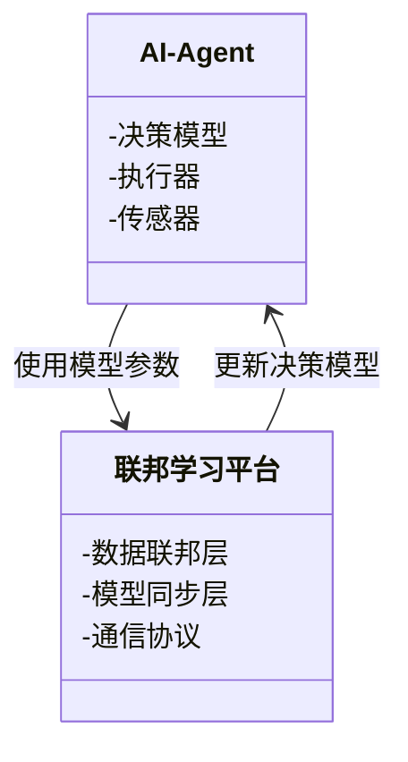

                 


# AI Agent的联邦学习技术应用

## 关键词：联邦学习，AI Agent，分布式计算，数据隐私保护，协作学习

## 摘要：本文探讨了AI Agent在联邦学习中的应用，详细阐述了联邦学习的基本概念、AI Agent的核心机制，以及两者结合的优势。通过实际案例分析和系统设计，展示了如何利用联邦学习技术提升AI Agent的决策能力和协作效率，同时确保数据隐私和安全性。

---

## 第一部分：背景介绍

### 第1章：联邦学习与AI Agent概述

#### 1.1 联邦学习的背景与问题背景

联邦学习是一种分布式机器学习技术，旨在在不共享原始数据的情况下，通过模型参数的交流来实现协作学习。随着数据隐私和安全的重要性日益增加，联邦学习在保护数据隐私的前提下，能够有效利用分布在网络中的数据进行模型训练。

#### 1.2 AI Agent的核心概念

AI Agent（人工智能代理）是一种能够感知环境、自主决策并执行任务的智能实体。AI Agent可以是软件程序，也可以是物理设备，它们通过传感器接收信息，通过执行器与环境交互，并利用内部模型进行决策和规划。

#### 1.3 联邦学习与AI Agent的结合

AI Agent在联邦学习中的应用，不仅能够提高模型的泛化能力，还能增强系统的灵活性和适应性。通过联邦学习，多个AI Agent可以在不共享数据的情况下协同工作，共同优化决策过程。

---

## 第二部分：核心概念与联系

### 第2章：联邦学习的核心原理

#### 2.1 联邦学习的原理与机制

联邦学习通过在各个参与方之间共享模型参数，而不是实际数据，从而实现模型的联合训练。其核心机制包括数据联邦和模型联邦，分别处理数据分布和模型同步的问题。

#### 2.2 AI Agent的决策机制与联邦学习的关系

AI Agent在联邦学习中的决策机制直接影响模型的协作效果。通过多目标优化，AI Agent可以在满足多个目标的情况下，选择最优的策略，从而提高整体系统的性能。

#### 2.3 联邦学习与AI Agent的核心概念对比

| 概念 | 联邦学习 | AI Agent |
|------|----------|----------|
| 数据分布 | 分布式数据源 | 分布式决策节点 |
| 模型同步 | 参数同步 | 信息共享与决策 |
| 安全性 | 数据隐私保护 | 代理间通信安全 |

---

### 第3章：AI Agent的决策机制

#### 3.1 AI Agent的多目标优化

AI Agent需要在多个目标之间进行权衡，例如模型准确性和数据隐私之间的平衡。通过联邦学习，AI Agent可以在不共享数据的情况下，优化其决策模型。

#### 3.2 联邦学习如何影响AI Agent的决策过程

通过模型参数的同步，AI Agent可以不断更新其决策模型，提升其在不同环境下的适应能力。

#### 3.3 AI Agent在联邦学习中的协作与竞争

AI Agent可以在联邦学习中协作，共同优化模型，同时在资源分配中存在竞争关系。

---

## 第三部分：算法原理讲解

### 第4章：联邦学习的数学模型

#### 4.1 数据联邦的数学模型

假设我们有多个参与方，每个参与方有本地数据集 $D_i$。联邦学习的目标是通过联合训练模型 $f(x; \theta)$，其中 $\theta$ 是模型参数。每个参与方在本地数据上训练模型，并通过通信协议更新参数 $\theta$。

#### 4.2 模型同步的数学模型

模型同步可以通过参数的平均或加权平均实现。例如，参数更新公式为：

$$ \theta_{new} = \sum_{i=1}^n w_i \theta_i $$

其中 $w_i$ 是参与方的权重。

#### 4.3 模型更新的流程

1. 每个参与方在本地数据上训练模型，得到参数更新 $\Delta\theta_i$。
2. 参数更新通过通信协议发送到中央协调器。
3. 中央协调器将所有参与方的参数更新进行汇总，生成新的全局参数 $\theta_{new}$。
4. $\theta_{new}$ 分发给所有参与方，进行下一轮训练。

---

### 第5章：AI Agent的决策机制

#### 5.1 AI Agent的决策模型

AI Agent的决策模型可以表示为 $A(x; \phi)$，其中 $\phi$ 是决策参数。通过联邦学习，AI Agent可以在不共享数据的情况下，更新 $\phi$。

#### 5.2 联邦学习中AI Agent的优化过程

AI Agent通过联邦学习获得优化的决策参数 $\phi_{new}$，从而提高决策的准确性和效率。

---

## 第四部分：系统分析与架构设计

### 第6章：系统功能设计

#### 6.1 领域模型

通过Mermaid类图描述系统功能模型：



---

### 第7章：系统架构设计

#### 7.1 系统架构图

```mermaid
graph TD
    A[AI Agent 1] --> C[中央协调器]
    B[AI Agent 2] --> C
    C --> A: 全局参数
    C --> B: 全局参数
```

---

## 第五部分：项目实战

### 第8章：环境安装与核心实现

#### 8.1 环境安装

安装必要的库：

```bash
pip install numpy
pip install tensorflow
pip install --extra-index-url https://pypi.tuna.tsinghua.edu.cn/simple/fed学习库
```

#### 8.2 核心代码实现

```python
import numpy as np
import tensorflow as tf

# 初始化模型参数
theta = tf.Variable(np.random.randn(10, 1))

# 模型同步
def model_sync(participant_params):
    global_theta = np.mean(participant_params, axis=0)
    return global_theta

# 模型更新
def model_update(x, y, theta):
    with tf.GradientTape() as tape:
        y_pred = model(x, theta)
        loss = tf.reduce_mean(tf.square(y_pred - y))
    gradients = tape.gradient(loss, theta)
    return gradients
```

---

### 第9章：实际案例分析

#### 9.1 案例背景

假设我们有三个AI Agent，分别位于不同的地理位置，每个Agent负责本地数据的训练。

#### 9.2 案例实现

每个AI Agent执行以下步骤：

1. 本地训练，更新模型参数。
2. 通过通信协议将参数发送到中央协调器。
3. 接收全局参数，更新本地模型。

---

## 第六部分：最佳实践

### 第10章：注意事项与未来展望

#### 10.1 注意事项

- 数据隐私保护：确保通信过程中的数据安全。
- 模型收敛性：选择合适的通信频率和参数同步方式，确保模型收敛。

#### 10.2 未来展望

- 更高效的数据联邦方法。
- 更智能化的AI Agent决策机制。
- 更安全的通信协议。

---

## 第七部分：小结

本文详细探讨了AI Agent在联邦学习中的应用，从核心概念到算法实现，再到系统设计，为读者提供了全面的视角。通过实际案例分析，展示了如何利用联邦学习技术提升AI Agent的性能，同时确保数据隐私和安全性。

---

感谢您的阅读，希望本文对您在AI Agent和联邦学习技术的应用有所帮助！

