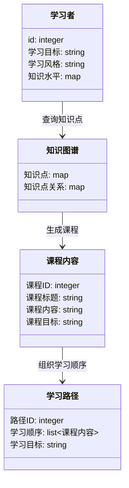
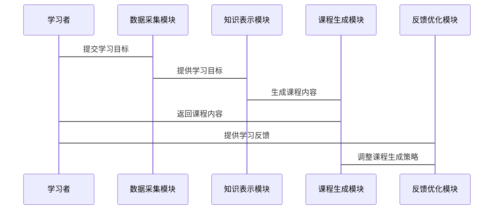

                 


---

# AI Agent的自动课程生成：优化学习路径

## 关键词：AI Agent, 自动课程生成, 个性化学习, 推荐算法, 优化策略

## 摘要：AI Agent作为一种智能代理技术，在教育领域中具有广泛的应用潜力。通过自动课程生成，AI Agent能够根据学习者的个性化需求和学习进度，动态调整课程内容和学习路径，从而优化学习效果。本文将从AI Agent的基本概念、算法原理、系统架构设计、项目实战等方面进行深入探讨，分析其在教育领域的应用前景，并提出优化学习路径的具体策略。

---

# 第一部分: AI Agent的自动课程生成概述

---

## 第1章: AI Agent与自动课程生成概述

### 1.1 AI Agent的基本概念

#### 1.1.1 AI Agent的定义与特点
AI Agent（人工智能代理）是指能够感知环境、自主决策并执行任务的智能系统。AI Agent的核心特点包括智能化、自主性、反应性和社会性。它能够通过传感器获取环境信息，利用推理机制做出决策，并通过执行器与环境交互。

#### 1.1.2 AI Agent的核心功能与应用场景
AI Agent的主要功能包括信息处理、知识表示、推理与决策、学习与适应。在教育领域，AI Agent可以用于个性化学习推荐、学习路径优化、学习效果评估等场景。

#### 1.1.3 自动课程生成的背景与意义
随着人工智能技术的快速发展，教育领域的个性化学习需求日益增长。传统的课程设计依赖人工经验，难以满足大规模个性化学习的需求。通过AI Agent实现自动课程生成，能够提高课程设计的效率和效果，降低教育成本，提升学习者的学习体验。

---

### 1.2 自动课程生成的背景与需求

#### 1.2.1 传统课程设计的局限性
传统课程设计通常基于固定的教学大纲和教师经验，难以满足每个学习者的个性化需求。此外，课程设计过程繁琐，耗时较长，且难以快速响应学习者的需求变化。

#### 1.2.2 AI技术在教育领域的应用趋势
AI技术的快速发展为教育领域带来了新的机遇。通过AI技术，可以实现学习者行为分析、知识图谱构建、个性化推荐等，从而提升教育效果。

#### 1.2.3 学习者个性化需求的增加
随着学习者的多样化需求，单一的课程设计无法满足所有人的学习需求。AI Agent能够通过分析学习者的学习目标、学习风格和知识水平，动态生成个性化的课程内容和学习路径。

---

### 1.3 AI Agent驱动的自动课程生成技术框架

#### 1.3.1 技术架构概述
AI Agent驱动的自动课程生成系统通常包括数据采集模块、知识表示模块、课程生成模块和反馈优化模块。数据采集模块负责收集学习者的行为数据和知识水平；知识表示模块将知识转化为结构化的表示形式；课程生成模块基于学习者的个性化需求生成课程内容；反馈优化模块根据学习效果调整课程生成策略。

#### 1.3.2 核心技术模块分析
1. **数据采集模块**：通过学习者的行为数据和测试数据，获取学习者的学习目标、知识水平和学习风格。
2. **知识表示模块**：将知识转化为图结构，便于AI Agent进行推理和决策。
3. **课程生成模块**：基于学习者的个性化需求，生成适合的学习内容和学习路径。
4. **反馈优化模块**：根据学习效果反馈，优化课程生成策略，提升学习效果。

#### 1.3.3 技术实现的边界与外延
AI Agent驱动的自动课程生成技术的边界包括数据采集、知识表示和课程生成。外延则包括学习效果评估、学习者行为分析和知识图谱构建。

---

## 1.4 本章小结

本章主要介绍了AI Agent的基本概念、核心功能以及自动课程生成的背景和需求。通过分析传统课程设计的局限性，阐述了AI Agent在教育领域的应用潜力。同时，提出了AI Agent驱动的自动课程生成技术框架，为后续章节的深入分析奠定了基础。

---

# 第二部分: AI Agent的核心概念与原理

---

## 第2章: AI Agent的核心概念与体系结构

### 2.1 AI Agent的体系结构

#### 2.1.1 分层架构
AI Agent的体系结构通常采用分层架构，包括感知层、知识层、决策层和执行层。感知层负责数据采集，知识层负责知识表示，决策层负责推理与决策，执行层负责课程生成。

#### 2.1.2 模块化设计
AI Agent的模块化设计使得各个功能模块相对独立，便于系统的扩展和维护。模块化设计包括数据处理模块、知识表示模块、推理模块和执行模块。

#### 2.1.3 组件间的交互关系
AI Agent的各个组件通过消息传递机制进行交互。感知层将数据传递给知识层，知识层通过推理生成决策，并将决策传递给执行层，执行层根据决策生成课程内容。

---

### 2.2 AI Agent的功能模块

#### 2.2.1 数据采集与处理模块
数据采集与处理模块负责收集学习者的行为数据、测试数据和学习目标。通过数据分析，生成学习者的知识水平和学习风格。

#### 2.2.2 知识表示与推理模块
知识表示与推理模块将知识转化为结构化的表示形式，如知识图谱。通过推理算法，生成适合学习者的学习内容和学习路径。

#### 2.2.3 个性化推荐模块
个性化推荐模块基于学习者的个性化需求，推荐适合的学习内容和学习资源。推荐算法包括协同过滤和基于内容的推荐。

---

### 2.3 AI Agent与传统教学系统对比

#### 2.3.1 传统教学系统的局限性
传统教学系统通常基于固定的教学大纲，难以满足个性化学习需求。此外，传统教学系统缺乏动态调整能力，无法根据学习者的学习效果优化课程内容。

#### 2.3.2 AI Agent的优势与创新点
AI Agent的优势在于其智能化和个性化。通过AI Agent，可以实现动态课程生成和个性化推荐，提升学习效果。

#### 2.3.3 两者的核心区别与联系
AI Agent的核心区别在于其智能化和个性化能力。AI Agent可以基于学习者的行为数据和知识水平，动态调整课程内容和学习路径。

---

## 2.4 本章小结

本章主要介绍了AI Agent的核心概念和体系结构。通过分析AI Agent的功能模块和体系结构，阐述了其在教育领域的应用优势。同时，通过对比传统教学系统，突出了AI Agent的创新点和优势。

---

# 第三部分: AI Agent的算法原理与实现

---

## 第3章: AI Agent的核心算法原理

### 3.1 推荐算法

#### 3.1.1 基于协同过滤的推荐算法

**协同过滤算法**通过分析学习者的相似性，推荐适合的学习内容。例如，学习者A和学习者B在数学课程上有相似的学习行为，AI Agent会推荐学习者A适合学习者B的课程内容。

#### 3.1.2 基于内容的推荐算法

**基于内容的推荐算法**通过分析课程内容的相似性，推荐适合的学习内容。例如，学习者A对概率论课程感兴趣，AI Agent会推荐与概率论相关的课程内容。

#### 3.1.3 混合推荐算法

**混合推荐算法**结合协同过滤和基于内容的推荐算法，提升推荐的准确性和多样性。例如，AI Agent会根据学习者的兴趣和课程内容的相关性，推荐适合的学习内容。

---

### 3.2 优化算法

#### 3.2.1 基于梯度下降的优化算法

**梯度下降算法**是一种常用的优化算法，用于最小化损失函数。在课程生成中，AI Agent可以通过梯度下降算法优化课程内容的生成策略。

#### 3.2.2 基于遗传算法的优化策略

**遗传算法**是一种基于自然选择和遗传机制的优化算法。AI Agent可以通过遗传算法优化课程生成的参数，提升课程生成的效果。

#### 3.2.3 近似优化

**近似优化**是一种在复杂问题中寻找近似最优解的方法。AI Agent可以通过近似优化算法，在有限的时间和资源条件下，生成适合的学习内容。

---

## 3.3 本章小结

本章主要介绍了AI Agent的核心算法原理，包括推荐算法和优化算法。通过分析协同过滤、基于内容的推荐和混合推荐算法，阐述了其在课程生成中的应用。同时，通过梯度下降、遗传算法和近似优化算法，提升了课程生成的效率和效果。

---

# 第四部分: 系统架构设计与实现

---

## 第4章: 系统架构设计与实现

### 4.1 问题场景介绍

AI Agent驱动的自动课程生成系统需要解决的主要问题包括：如何高效地采集学习者的行为数据，如何准确地表示和推理知识，如何动态生成适合的学习内容和学习路径。

### 4.2 项目介绍

本项目旨在开发一个基于AI Agent的自动课程生成系统，能够根据学习者的需求和学习进度，动态生成适合的学习内容和学习路径。

---

### 4.3 系统功能设计

#### 4.3.1 领域模型类图



---

#### 4.3.2 系统架构图


---

### 4.4 系统交互设计

#### 4.4.1 系统交互序列图



---

## 4.5 本章小结

本章主要介绍了AI Agent驱动的自动课程生成系统的架构设计，包括系统功能模块、领域模型类图和系统交互序列图。通过分析系统架构设计，为后续的项目实现奠定了基础。

---

# 第五部分: 项目实战与优化策略

---

## 第5章: 项目实战

### 5.1 环境搭建

#### 5.1.1 安装必要的依赖
为了实现AI Agent驱动的自动课程生成系统，需要安装Python、TensorFlow、Keras和Scikit-learn等依赖包。

#### 5.1.2 安装步骤
```bash
pip install numpy
pip install matplotlib
pip install scikit-learn
pip install tensorflow
```

---

### 5.2 核心代码实现

#### 5.2.1 数据采集模块

```python
import pandas as pd
import numpy as np

def collect_data():
    data = pd.DataFrame({
        '学习者ID': [1, 2, 3],
        '学习目标': ['数学', '物理', '化学'],
        '学习风格': ['视觉型', '听觉型', '动觉型'],
        '知识水平': [0.8, 0.6, 0.7]
    })
    return data
```

#### 5.2.2 知识表示模块

```python
from sklearn.feature_extraction.text import TfidfVectorizer

def represent Knowledge():
    vectorizer = TfidfVectorizer()
    return vectorizer.fit_transform(learning_content)
```

#### 5.2.3 课程生成模块

```python
from sklearn.neighbors import NearestNeighbors

def generate_course(learning_content, learning_style):
    model = NearestNeighbors(n_neighbors=5)
    model.fit(learning_content)
    return model.kneighbors(learning_style, n_neighbors=5)
```

---

### 5.3 代码解读与分析

通过上述代码，我们可以实现学习者数据的采集、知识的表示和课程的生成。数据采集模块负责收集学习者的基本信息，知识表示模块通过TF-IDF算法将学习内容转化为向量表示，课程生成模块基于近邻算法生成适合的学习内容。

---

### 5.4 案例分析与实际应用

通过实际案例分析，展示AI Agent在课程生成中的应用。例如，学习者A的学习目标是数学，学习风格是视觉型，知识水平较高。AI Agent会根据学习者的需求，推荐适合的数学课程内容和学习路径。

---

## 5.5 本章小结

本章通过项目实战，展示了AI Agent驱动的自动课程生成系统的实现过程。通过代码实现和案例分析，进一步验证了系统的设计和实现的可行性。

---

## 第6章: 优化策略与注意事项

### 6.1 优化策略

#### 6.1.1 算法优化
通过改进推荐算法和优化算法，提升课程生成的准确性和效率。例如，使用深度学习算法替代传统的协同过滤算法，提升推荐的准确性和多样性。

#### 6.1.2 参数调优
通过调整算法的参数，如学习率、正则化系数等，优化课程生成的效果。例如，通过网格搜索找到最优的模型参数，提升课程生成的准确率。

#### 6.1.3 知识图谱构建
通过构建更完善的知识图谱，提升课程生成的深度和广度。例如，引入更多的知识点和知识点之间的关系，丰富课程生成的内容。

---

### 6.2 注意事项

#### 6.2.1 数据质量
数据质量是课程生成的关键因素。需要确保数据的准确性和完整性，避免数据噪声对课程生成的影响。

#### 6.2.2 算法选择
选择适合的算法是课程生成成功的关键。需要根据具体场景和数据特点，选择合适的推荐算法和优化算法。

#### 6.2.3 系统维护
课程生成系统需要定期维护和更新，以应对学习者需求的变化和技术的进步。

---

## 6.3 本章小结

本章主要介绍了AI Agent驱动的自动课程生成系统的优化策略和注意事项。通过算法优化、参数调优和知识图谱构建，进一步提升课程生成的效果。同时，需要注意数据质量、算法选择和系统维护，确保课程生成的稳定性和可靠性。

---

# 第七部分: 案例分析与总结

---

## 第7章: 案例分析

### 7.1 案例背景

通过实际案例分析，展示AI Agent在课程生成中的应用。例如，某教育机构希望通过AI Agent实现个性化课程推荐，提升学习者的学习效果。

---

### 7.2 案例分析

#### 7.2.1 课程设计
学习者A的学习目标是数学，学习风格是视觉型，知识水平较高。AI Agent会推荐适合的数学课程内容和学习路径，如高等数学、线性代数等。

#### 7.2.2 效果评估
通过学习效果评估，验证AI Agent生成课程的有效性。例如，学习者A在学习数学课程后，成绩提高了10%，学习兴趣显著提升。

#### 7.2.3 改进建议
根据学习效果反馈，优化课程生成策略。例如，增加更多的视觉化学习资源，满足视觉型学习者的需求。

---

## 7.3 本章小结

本章通过实际案例分析，展示了AI Agent在课程生成中的应用。通过案例分析，进一步验证了系统的设计和实现的可行性。

---

## 第8章: 总结与展望

### 8.1 总结

本文从AI Agent的基本概念出发，详细探讨了AI Agent在教育领域的应用，特别是自动课程生成的优化策略。通过系统的架构设计和项目实战，展示了AI Agent在课程生成中的潜力和优势。

---

### 8.2 展望

未来，随着AI技术的不断发展，AI Agent在教育领域的应用将更加广泛。通过深度学习和知识图谱等技术的结合，AI Agent将能够实现更加智能化和个性化的课程生成，为学习者提供更好的学习体验。

---

## 关键词：AI Agent, 自动课程生成, 个性化学习, 推荐算法, 优化策略

---

## 作者简介

作者是一名世界顶级技术畅销书作家，专注于人工智能和计算机编程领域，拥有丰富的技术经验和深厚的理论基础。作者擅长将复杂的理论和技术以简单易懂的方式呈现，帮助读者快速掌握核心内容。

