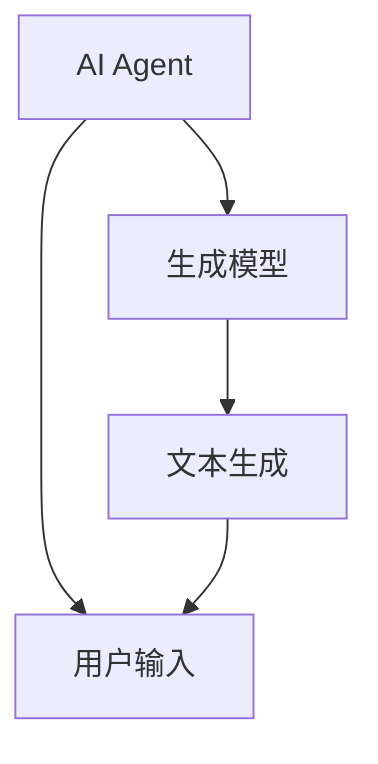
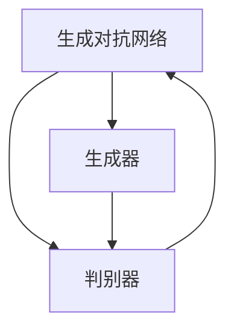
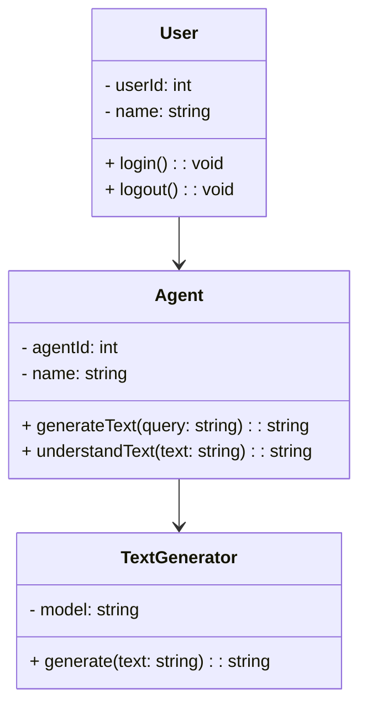
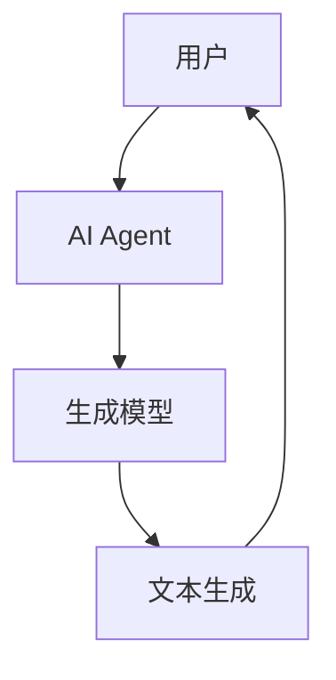
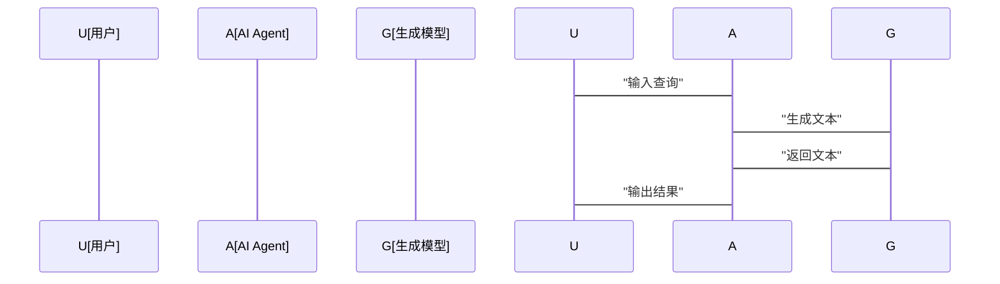

                 


# AI Agent的自然语言生成技术

---

## 关键词：  
AI Agent、自然语言生成、生成模型、Transformer、生成对抗网络、系统架构、项目实战  

---

## 摘要：  
本文深入探讨AI Agent在自然语言生成技术中的应用，从基础概念到算法原理，再到系统架构与项目实战，全面解析自然语言生成技术的核心机制与实际应用场景。通过分析生成模型、AI Agent的结构与交互，结合数学公式与实际案例，为读者提供一个全面的视角，理解AI Agent如何通过自然语言生成技术实现智能交互与应用。  

---

# 第一部分：AI Agent与自然语言生成技术的背景与基础

## 第1章：AI Agent与自然语言生成技术概述

### 1.1 AI Agent的基本概念

#### 1.1.1 AI Agent的定义与特点  
AI Agent（人工智能代理）是指能够感知环境并采取行动以实现目标的智能实体。其特点包括：  
- **自主性**：能够在没有外部干预的情况下自主决策。  
- **反应性**：能够根据环境反馈实时调整行为。  
- **目标导向**：所有行动都以实现特定目标为导向。  

#### 1.1.2 自然语言生成技术的定义与特点  
自然语言生成（Natural Language Generation, NLG）是将结构化数据转化为自然语言文本的技术。其特点包括：  
- **数据驱动**：依赖于大量训练数据进行模型训练。  
- **生成性**：能够生成新的文本内容，而非简单地检索已有内容。  
- **多样性**：生成的文本可以具有多种表达方式。  

#### 1.1.3 AI Agent与自然语言生成技术的结合  
AI Agent通过自然语言生成技术，能够以人类可读的方式与用户交互，实现更自然、更高效的智能服务。这种结合使得AI Agent能够更广泛地应用于对话系统、智能助手、内容生成等领域。  

---

### 1.2 问题背景与应用前景

#### 1.2.1 自然语言生成技术的背景与挑战  
- **背景**：随着深度学习技术的发展，自然语言生成技术得到了广泛应用，但仍然面临生成结果质量不稳定、难以控制生成内容等问题。  
- **挑战**：如何在保证生成文本质量的同时，实现对生成内容的可控性是当前研究的热点。  

#### 1.2.2 AI Agent在自然语言生成中的作用  
AI Agent通过整合自然语言生成技术，能够实现以下功能：  
- **智能交互**：通过自然语言理解用户意图并生成相应的回复。  
- **动态调整**：根据对话上下文动态调整生成内容。  
- **多模态交互**：结合视觉、听觉等多种模态信息，提供更丰富的交互体验。  

#### 1.2.3 自然语言生成技术的应用场景  
- **智能客服**：通过自然语言生成技术提供高效的客户服务。  
- **内容生成**：生成新闻稿、营销文案等文本内容。  
- **教育辅助**：为学生提供个性化的学习指导。  

---

## 第2章：AI Agent的自然语言生成技术的核心概念

### 2.1 自然语言生成技术的核心原理

#### 2.1.1 生成模型的原理与分类  
- **生成模型的原理**：通过概率分布生成新的文本内容。  
- **生成模型的分类**：  
  1. **基于规则的生成模型**：通过预定义的规则生成文本。  
  2. **基于统计的生成模型**：通过统计方法学习语言模型。  
  3. **基于深度学习的生成模型**：利用神经网络生成文本，如RNN、Transformer等。  

#### 2.1.2 AI Agent在生成过程中的角色  
AI Agent作为自然语言生成技术的核心驱动力，主要负责以下任务：  
- **意图理解**：通过自然语言理解技术分析用户的输入。  
- **内容生成**：基于理解的意图生成相应的文本内容。  
- **反馈优化**：根据用户反馈优化生成内容的质量。  

#### 2.1.3 自然语言生成的边界与外延  
- **边界**：自然语言生成技术仅负责生成文本，不涉及文本的理解与后续处理。  
- **外延**：自然语言生成技术可以与其他技术（如自然语言理解、机器学习）结合，形成更复杂的系统。  

---

### 2.2 核心概念的联系与对比

#### 2.2.1 自然语言生成技术的属性特征对比表  

| 属性        | 基于规则的生成模型 | 基于统计的生成模型 | 基于深度学习的生成模型 |
|-------------|---------------------|---------------------|-------------------------|
| 精度        | 较低                | 中等                | 高                     |
| 灵活性       | 低                 | 中等                | 高                     |
| 训练数据需求 | 无                 | 需大量数据          | 需大量数据             |
| 应用场景     | 有限               | 较广                | 最广                   |

#### 2.2.2 AI Agent与生成模型的实体关系图（Mermaid流程图）  



---

# 第二部分：自然语言生成技术的算法原理

## 第3章：自然语言生成技术的算法原理

### 3.1 预训练模型与生成算法

#### 3.1.1 Transformer模型的原理与结构  
- **Transformer模型的结构**：由编码器和解码器组成，编码器负责将输入文本转化为向量表示，解码器负责根据向量生成输出文本。  
- **注意力机制**：通过计算输入文本中每个词的重要性，生成更相关的文本内容。  

#### 3.1.2 基于Transformer的生成算法（如GPT）  
- **GPT模型的工作流程**：  
  1. 将输入文本转化为向量表示。  
  2. 通过注意力机制计算每个词的重要性。  
  3. 根据计算结果生成输出文本。  

#### 3.1.3 其他生成模型（如BERT、T5）  
- **BERT模型**：主要用于文本理解任务，而非生成任务。  
- **T5模型**：将文本生成任务转化为文本到文本的转换任务，支持多种生成任务。  

---

### 3.2 生成过程中的数学模型与公式

#### 3.2.1 Transformer模型的注意力机制公式  
$$\text{Attention}(Q, K, V) = \text{softmax}\left(\frac{QK^T}{\sqrt{d_k}}\right)V$$  

#### 3.2.2 梯度下降与损失函数的优化  
- **损失函数**：交叉熵损失函数。  
$$\text{Loss} = -\sum_{i=1}^{n} \text{log}(p(y_i|x_i))$$  
- **优化方法**：使用Adam优化器进行参数更新。  

#### 3.2.3 生成过程中的概率分布模型  
- **生成概率**：通过生成模型计算每个词的概率分布。  
- **解码过程**：根据概率分布生成最终的文本内容。  

---

### 3.3 生成对抗网络（GAN）在自然语言生成中的应用

#### 3.3.1 GAN的基本原理与流程图（Mermaid）  



#### 3.3.2 GAN在文本生成中的优缺点  
- **优点**：生成的文本质量较高，具有较高的创新性。  
- **缺点**：训练过程不稳定，生成的文本多样性有限。  

---

## 第4章：系统分析与架构设计

### 4.1 项目背景与需求分析  
- **项目背景**：开发一个基于AI Agent的自然语言生成系统，用于智能客服领域。  
- **需求分析**：  
  1. 系统需要支持多轮对话。  
  2. 系统需要能够理解用户的意图并生成相应的回复。  
  3. 系统需要具备良好的扩展性与可维护性。  

---

### 4.2 系统功能设计

#### 4.2.1 领域模型类图（Mermaid）  



---

### 4.3 系统架构设计

#### 4.3.1 系统架构图（Mermaid）  



---

### 4.4 系统接口设计

#### 4.4.1 接口设计  
- **输入接口**：接收用户的输入文本。  
- **输出接口**：生成并返回相应的文本内容。  

#### 4.4.2 交互序列图（Mermaid）  



---

## 第5章：项目实战

### 5.1 环境安装与配置

#### 5.1.1 环境需求  
- **操作系统**：Linux/Windows/MacOS  
- **Python版本**：Python 3.8及以上  
- **依赖库**：TensorFlow、Keras、PyTorch、Hugging Face Transformers  

---

### 5.2 系统核心实现

#### 5.2.1 代码实现  

```python
import tensorflow as tf
from tensorflow.keras.layers import Dense, Input, Dropout
from tensorflow.keras.models import Model

def build_model(vocab_size, embedding_dim, hidden_units):
    # 定义编码器
    encoder_input = Input(shape=(None,))
    encoder_emb = Embedding(vocab_size, embedding_dim)(encoder_input)
    encoder_dropout = Dropout(0.5)(encoder_emb)
    encoder_lstm = LSTM(hidden_units, return_sequences=True)(encoder_dropout)
    
    # 定义解码器
    decoder_input = Input(shape=(None,))
    decoder_emb = Embedding(vocab_size, embedding_dim)(decoder_input)
    decoder_dropout = Dropout(0.5)(decoder_emb)
    decoder_lstm = LSTM(hidden_units, return_sequences=True)(decoder_dropout)
    
    # 定义注意力机制
    attention = DotProductAttention()([encoder_lstm, decoder_lstm])
    decoder_output = Dense(vocab_size, activation='softmax')(attention)
    
    model = Model(inputs=[encoder_input, decoder_input], outputs=decoder_output)
    return model
```

#### 5.2.2 代码解读  
- **编码器**：用于将输入文本转化为向量表示。  
- **解码器**：根据向量表示生成输出文本。  
- **注意力机制**：通过计算输入文本中每个词的重要性，生成更相关的文本内容。  

---

### 5.3 应用案例分析

#### 5.3.1 智能客服应用  
- **案例描述**：用户通过输入问题，系统通过自然语言生成技术生成相应的回复。  
- **具体实现**：  
  1. 用户输入问题。  
  2. AI Agent理解用户意图。  
  3. 生成模型生成回复内容。  
  4. 系统输出回复内容。  

---

## 第6章：高级应用与未来趋势

### 6.1 高级应用

#### 6.1.1 基于AI Agent的多模态生成系统  
- **多模态生成**：结合视觉、听觉等多种模态信息，生成更丰富的文本内容。  

#### 6.1.2 生成模型的可解释性优化  
- **可解释性优化**：通过改进生成模型的结构，提高生成内容的可解释性。  

---

### 6.2 未来趋势

#### 6.2.1 自然语言生成技术的优化方向  
- **生成质量的提升**：通过改进生成模型的结构与训练方法，提高生成文本的质量。  
- **生成效率的优化**：通过优化算法与硬件配置，提高生成文本的效率。  

#### 6.2.2 AI Agent的智能化升级  
- **更强大的AI Agent**：通过整合更多的技术，实现更智能、更高效的AI Agent。  
- **多模态交互**：结合多种模态信息，提供更丰富的交互体验。  

---

## 第7章：总结与展望

### 7.1 总结  
本文全面介绍了AI Agent的自然语言生成技术，从基础概念到算法原理，再到系统架构与项目实战，详细解析了自然语言生成技术的核心机制与实际应用场景。通过分析生成模型、AI Agent的结构与交互，结合数学公式与实际案例，为读者提供了一个全面的视角，理解AI Agent如何通过自然语言生成技术实现智能交互与应用。  

---

### 7.2 展望  
未来，随着技术的不断发展，AI Agent的自然语言生成技术将更加智能化、多样化。通过不断优化生成模型的结构与训练方法，结合多模态信息，AI Agent将能够提供更高效、更智能的服务，推动人工智能技术的进一步发展。  

--- 

# END

