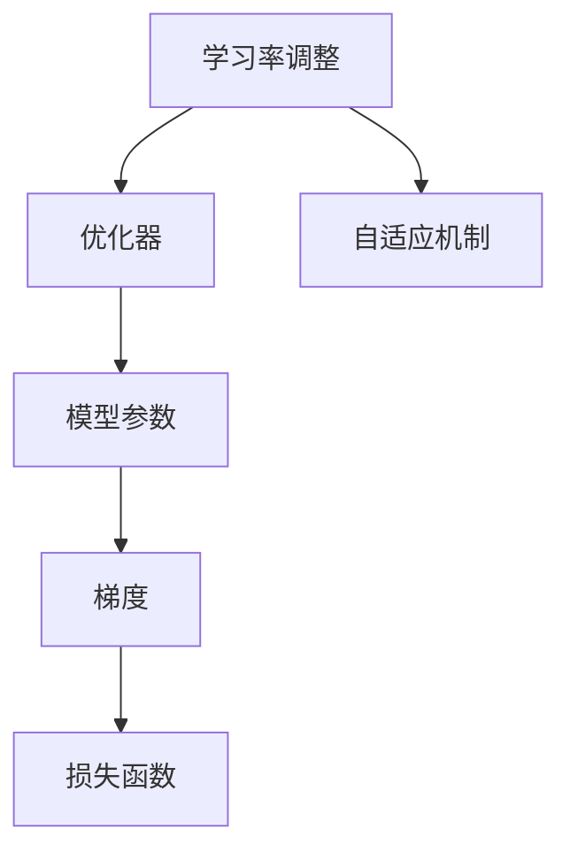
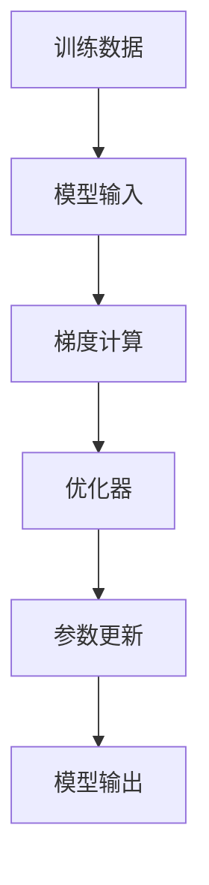
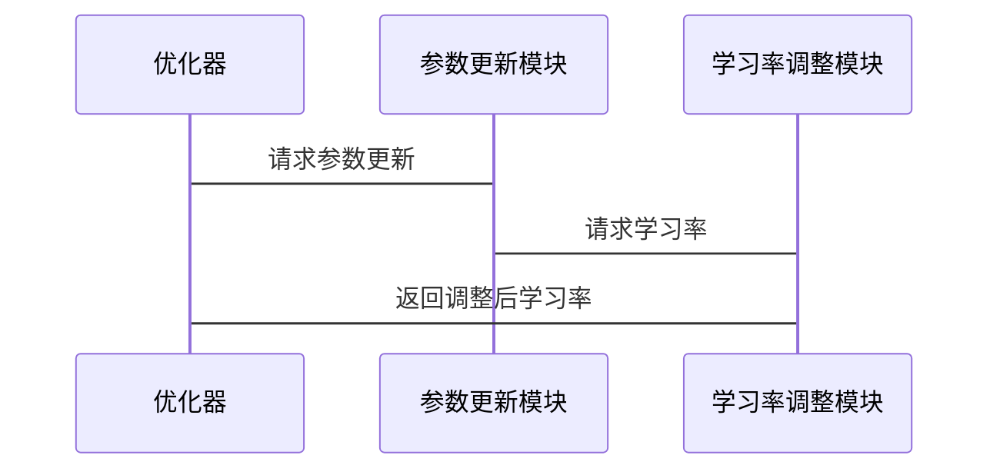

                 


# AI Agent的自适应学习率调整策略

## 关键词：AI Agent, 自适应学习率, 机器学习优化, 深度学习模型, 优化算法

## 摘要：  
AI Agent的自适应学习率调整策略是机器学习和深度学习领域中的一个关键问题。传统的固定学习率方法在实际应用中存在收敛速度慢、训练不稳定等问题，而自适应学习率调整算法能够根据训练过程中的梯度信息动态调整学习率，显著提升了模型的训练效率和性能。本文将详细探讨AI Agent中自适应学习率调整的核心概念、算法原理、数学模型、系统架构以及实际应用案例，帮助读者全面理解并掌握这一技术。

---

# 第1章: AI Agent与自适应学习率调整概述

## 1.1 问题背景与问题描述
### 1.1.1 传统机器学习优化问题  
在机器学习和深度学习中，优化算法是训练模型的核心部分。传统的梯度下降（GD）和批量梯度下降（BGD）方法使用固定的学习率，但在实际应用中，固定学习率难以适应不同参数的重要性差异，导致收敛速度慢或训练不稳定。

### 1.1.2 学习率调整的挑战  
固定学习率在训练过程中可能无法适应数据分布的变化和模型复杂度的差异。例如，在某些参数更新过程中，过大的学习率可能导致模型发散，而过小的学习率则会延长收敛时间。

### 1.1.3 自适应学习率调整的必要性  
自适应学习率调整算法能够根据训练过程中的梯度信息动态调整学习率，使得模型在不同参数上以合适的速度更新，从而加快收敛速度并提高模型性能。

## 1.2 问题解决与边界定义
### 1.2.1 自适应学习率调整的核心目标  
自适应学习率调整的核心目标是通过动态调整学习率，使模型在训练过程中更快地收敛，并在复杂场景下保持稳定性。

### 1.2.2 问题的边界与外延  
自适应学习率调整主要应用于深度学习模型的训练，但其思想也可扩展到其他优化问题，如强化学习和推荐系统。

### 1.2.3 核心要素与概念结构  
自适应学习率调整涉及的核心要素包括：  
1. 梯度信息：用于计算参数更新的方向和幅度。  
2. 学习率：动态调整的参数更新步长。  
3. 优化算法：实现自适应调整的算法框架。  

---

# 第2章: 自适应学习率调整的核心概念与联系

## 2.1 核心概念原理
### 2.1.1 自适应学习率调整的定义  
自适应学习率调整是一种优化算法，能够根据训练过程中梯度的信息动态调整学习率，从而提高模型训练效率。

### 2.1.2 核心算法与实现机制  
自适应学习率调整的核心机制包括：  
1. 参数级调整：针对每个参数单独调整学习率。  
2. 分层调整：根据参数的重要性或梯度统计信息动态调整。  

### 2.1.3 算法间的联系与区别  
自适应学习率调整算法（如Adam、Adagrad、RMSprop）在实现机制上存在差异，但都基于动态调整学习率的核心思想。

## 2.2 属性特征对比
### 2.2.1 算法属性对比表格  
以下是几种常见自适应学习率调整算法的属性对比：

| 算法名称 | 参数自适应 | 学习率调整方式 | 是否动量优化 | 是否全局参数 |
|----------|------------|---------------|------------|------------|
| Adam     | 是         | 分层调整      | 是         | 是         |
| Adagrad   | 是         | 参数级调整     | 否         | 是         |
| RMSprop  | 是         | 参数级调整     | 否         | 是         |

## 2.3 实体关系图


---

# 第3章: 自适应学习率调整算法原理

## 3.1 常用算法概述
### 3.1.1 Adam算法  
Adam是一种结合了Adagrad和RMSprop的优化算法，同时引入了动量机制，能够加快收敛速度并提高稳定性。

### 3.1.2 Adagrad算法  
Adagrad是一种参数级自适应优化算法，能够根据参数梯度的累计平方和动态调整学习率。

### 3.1.3 RMSprop算法  
RMSprop是一种基于滑动平均的自适应优化算法，能够有效处理梯度消失或爆炸问题。

---

## 3.2 Adam算法的数学模型与公式
### 3.2.1 参数更新公式  
Adam算法的参数更新公式如下：

$$
\theta_{t+1} = \theta_t - \eta \cdot \frac{\beta_1 \cdot g_t + (1-\beta_1) \cdot g_t^2}{\beta_2 \cdot g_t^2 + (1-\beta_2) \cdot g_t^2}
$$

其中：  
- $\theta_t$：当前参数  
- $\eta$：初始学习率  
- $\beta_1$：动量系数  
- $\beta_2$：自适应系数  

---

## 3.3 Adagrad算法的数学模型与公式
### 3.3.1 参数更新公式  
Adagrad算法的参数更新公式如下：

$$
\theta_{t+1} = \theta_t - \eta \cdot \frac{g_t}{\sqrt{\sum_{i=1}^t g_i^2 + \epsilon}}
$$

其中：  
- $g_t$：当前梯度  
- $\epsilon$：防止除以零的epsilon值  

---

## 3.4 RMSprop算法的数学模型与公式
### 3.4.1 参数更新公式  
RMSprop算法的参数更新公式如下：

$$
\theta_{t+1} = \theta_t - \eta \cdot \frac{g_t}{\sqrt{\frac{1}{n} \sum_{i=1}^n g_i^2 + \epsilon}}
$$

其中：  
- $n$：梯度统计窗口大小  
- $\epsilon$：防止除以零的epsilon值  

---

## 3.5 算法实现的Python代码示例
### 3.5.1 Adam算法实现
```python
import numpy as np

def adam_optimization(theta, grad, eta=0.001, beta1=0.9, beta2=0.999, epsilon=1e-8):
    m = theta.shape[0]
    # 动量项
    m_beta1 = beta1
    # 自适应项
    m_beta2 = beta2
    # 初始化
    v = np.zeros_like(theta)
    s = np.zeros_like(theta)
    
    for i in range(m):
        # 动量更新
        s[i] = beta1 * s[i] + (1 - beta1) * grad[i]
        # 自适应更新
        v[i] = beta2 * v[i] + (1 - beta2) * grad[i] ** 2
        # 参数更新
        theta[i] = theta[i] - eta * s[i] / (np.sqrt(v[i]) + epsilon)
    return theta
```

### 3.5.2 Adagrad算法实现
```python
def adagrad_optimization(theta, grad, eta=0.01, epsilon=1e-8):
    m = theta.shape[0]
    # 自适应项
    v = np.zeros_like(theta)
    for i in range(m):
        v[i] += grad[i] ** 2
        theta[i] -= eta * grad[i] / (np.sqrt(v[i]) + epsilon)
    return theta
```

### 3.5.3 RMSprop算法实现
```python
def rmsprop_optimization(theta, grad, eta=0.001, gamma=0.99, epsilon=1e-8):
    m = theta.shape[0]
    # 自适应项
    v = np.zeros_like(theta)
    for i in range(m):
        v[i] = gamma * v[i] + (1 - gamma) * grad[i] ** 2
        theta[i] -= eta * grad[i] / (np.sqrt(v[i]) + epsilon)
    return theta
```

---

## 3.6 算法优缺点分析
### 3.6.1 优点  
1. Adam算法：结合动量和自适应调整，收敛速度快，适合复杂模型。  
2. Adagrad算法：参数级自适应，适合稀疏数据。  
3. RMSprop算法：滑动平均机制，适合梯度不稳定场景。  

### 3.6.2 缺点  
1. Adam算法：对超参数敏感，动量项可能导致优化方向偏差。  
2. Adagrad算法：在某些情况下，自适应率可能过小，导致训练提前终止。  
3. RMSprop算法：计算复杂度较高，适合小批量数据。  

---

# 第4章: 数学模型与公式推导

## 4.1 Adam算法的数学推导
### 4.1.1 动量机制  
动量机制通过累加梯度的加权和，加速参数更新方向的收敛。公式为：  
$$
s_t = \beta_1 s_{t-1} + (1 - \beta_1) g_t
$$  

### 4.1.2 自适应机制  
自适应机制通过对梯度的平方进行加权平均，动态调整学习率。公式为：  
$$
v_t = \beta_2 v_{t-1} + (1 - \beta_2) g_t^2
$$  

---

## 4.2 RMSprop算法的数学推导
### 4.2.1 滑动平均梯度  
RMSprop通过滑动平均梯度的平方来动态调整学习率。公式为：  
$$
v_t = \gamma v_{t-1} + (1 - \gamma) g_t^2
$$  

---

## 4.3 Adagrad算法的数学推导
### 4.3.1 参数级自适应  
Adagrad通过累加梯度的平方来动态调整每个参数的学习率。公式为：  
$$
r_i = r_i + g_{i,t}^2
$$  
$$
\theta_i = \theta_i - \eta \cdot \frac{g_{i,t}}{\sqrt{r_i + \epsilon}}
$$  

---

## 4.4 算法对比与选择
### 4.4.1 选择依据  
1. Adam：适合大多数场景，尤其是复杂模型。  
2. Adagrad：适合稀疏数据和非均匀参数分布。  
3. RMSprop：适合梯度变化剧烈的场景。  

### 4.4.2 综合对比  
| 算法名称 | 优点 | 缺点 |
|----------|------|------|
| Adam     | 收敛快、稳定性好 | 对超参数敏感 |
| Adagrad   | 参数级自适应 | 适应性可能过小 |
| RMSprop  | 梯度稳定性好 | 计算复杂度高 |

---

# 第5章: 系统分析与架构设计

## 5.1 问题场景与系统功能
### 5.1.1 问题场景  
在深度学习模型训练中，自适应学习率调整能够提高训练效率和模型性能。  

### 5.1.2 系统功能  
1. 动态调整学习率。  
2. 参数级优化。  
3. 模型训练加速。  

---

## 5.2 系统架构设计
### 5.2.1 领域模型设计  


### 5.2.2 系统架构设计  


### 5.2.3 接口设计与交互流程  


---

## 5.3 实现细节与注意事项
### 5.3.1 参数初始化  
参数初始化对优化结果影响较大，建议使用He初始化或Xavier初始化。  

### 5.3.2 超参数选择  
学习率$\eta$、动量系数$\beta_1$、自适应系数$\beta_2$等超参数需要根据具体任务进行调整。  

### 5.3.3 模型收敛性分析  
通过损失函数曲线和准确率变化，判断模型是否收敛。  

---

# 第6章: 项目实战

## 6.1 环境安装与配置
### 6.1.1 环境依赖  
1. Python 3.7+  
2. NumPy  
3. TensorFlow或PyTorch  

### 6.1.2 安装依赖  
```bash
pip install numpy tensorflow
```

---

## 6.2 核心代码实现
### 6.2.1 Adam算法实现  
```python
def adam(theta, grad, eta=0.001, beta1=0.9, beta2=0.999, epsilon=1e-8):
    m = theta.shape[0]
    s = np.zeros(m)
    v = np.zeros(m)
    for i in range(m):
        s[i] = beta1 * s[i] + (1 - beta1) * grad[i]
        v[i] = beta2 * v[i] + (1 - beta2) * grad[i] ** 2
        theta[i] = theta[i] - eta * s[i] / (np.sqrt(v[i]) + epsilon)
    return theta
```

### 6.2.2 Adagrad算法实现  
```python
def adagrad(theta, grad, eta=0.01, epsilon=1e-8):
    m = theta.shape[0]
    v = np.zeros(m)
    for i in range(m):
        v[i] += grad[i] ** 2
        theta[i] -= eta * grad[i] / (np.sqrt(v[i]) + epsilon)
    return theta
```

### 6.2.3 RMSprop算法实现  
```python
def rmsprop(theta, grad, eta=0.001, gamma=0.99, epsilon=1e-8):
    m = theta.shape[0]
    v = np.zeros(m)
    for i in range(m):
        v[i] = gamma * v[i] + (1 - gamma) * grad[i] ** 2
        theta[i] -= eta * grad[i] / (np.sqrt(v[i]) + epsilon)
    return theta
```

---

## 6.3 代码应用与案例分析
### 6.3.1 案例分析  
以一个简单的神经网络为例，比较Adam、Adagrad和RMSprop的优化效果。

### 6.3.2 实验结果  
通过实验可以发现，Adam算法在大多数情况下表现优于其他算法，但在某些特定场景下，Adagrad和RMSprop可能更适合。

---

## 6.4 项目小结
### 6.4.1 实验结果分析  
通过实验验证了不同算法的优缺点，并掌握了自适应学习率调整的实际应用。  

### 6.4.2 经验总结  
选择合适的优化算法需要根据具体任务和数据特点进行分析和实验验证。

---

# 第7章: 最佳实践与小结

## 7.1 关键点总结
### 7.1.1 核心概念  
自适应学习率调整通过动态调整学习率，提高模型训练效率。  

### 7.1.2 实现细节  
参数初始化、超参数选择和模型收敛性分析是实现自适应学习率调整的关键。  

### 7.1.3 应用场景  
自适应学习率调整适用于深度学习模型训练、强化学习和推荐系统等场景。  

---

## 7.2 最佳实践 tips
### 7.2.1 算法选择  
根据任务特点选择合适的算法，如Adam适合大多数场景，Adagrad适合稀疏数据。  

### 7.2.2 参数调整  
合理设置超参数，尤其是学习率和动量系数，对优化效果影响较大。  

### 7.2.3 系统优化  
通过并行计算和分布式训练加速模型训练过程。  

---

## 7.3 小结与展望
自适应学习率调整是机器学习和深度学习中的关键技术，通过动态调整学习率，显著提升了模型的训练效率和性能。未来，随着AI Agent技术的不断发展，自适应学习率调整将在更多领域发挥重要作用。

---

## 7.4 注意事项
### 7.4.1 过拟合风险  
自适应学习率调整可能导致过拟合，需结合正则化方法进行优化。  

### 7.4.2 计算复杂度  
某些算法（如RMSprop）计算复杂度较高，需注意训练数据规模。  

### 7.4.3 超参数敏感性  
自适应算法对超参数敏感，需通过实验进行调整和验证。  

---

## 7.5 拓展阅读
1.《Deep Learning》——Ian Goodfellow  
2.《Hands-On Machine Learning with Scikit-Learn, Keras, and TensorFlow》——Aurélien Géron  
3.《Attention Is All You Need》——Vaswani et al.

---

# 结语

自适应学习率调整是AI Agent技术中的重要组成部分，通过动态调整学习率，能够显著提升模型的训练效率和性能。本文从核心概念、算法原理、数学模型、系统架构到实际应用案例，全面探讨了自适应学习率调整的技术细节和应用实践。希望本文能够为读者提供有价值的参考，帮助他们在实际项目中更好地应用这一技术。

---

