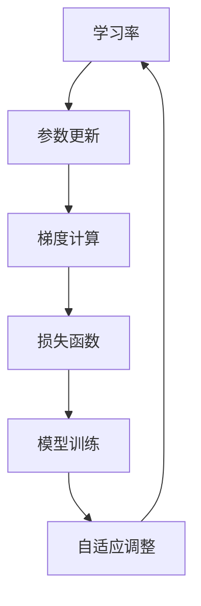
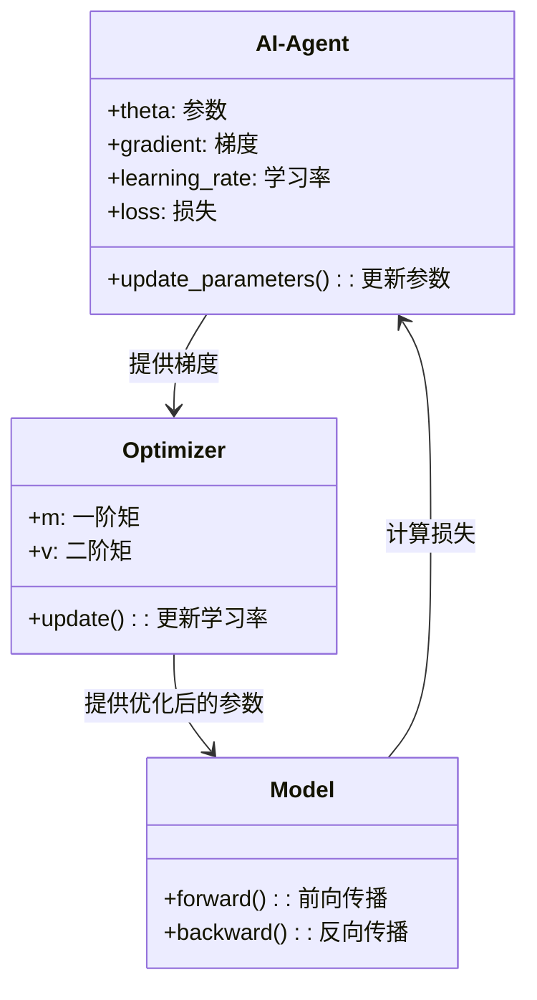
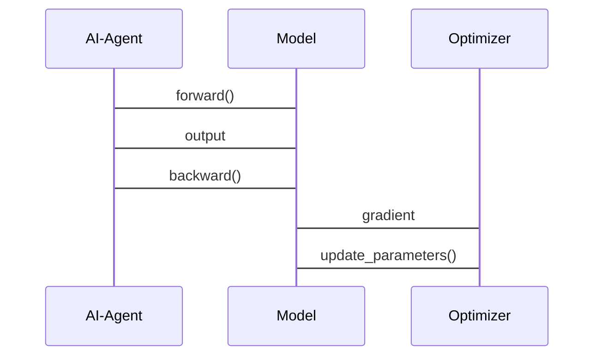

                 


# AI Agent的自适应学习率：优化训练过程

> 关键词：AI Agent、自适应学习率、优化算法、机器学习、深度学习

> 摘要：本文详细探讨了AI Agent在训练过程中自适应学习率优化的核心原理、算法实现及其在实际应用中的优势。通过对比分析不同的自适应学习率优化算法，结合数学公式和实际案例，深入解析了自适应学习率在AI Agent训练中的重要作用，并提供了系统的架构设计与实战代码实现。

---

# 第一部分: 自适应学习率优化的核心原理

## # 第1章: 自适应学习率优化的核心概念与联系

### ## 1.1 自适应学习率优化的原理

#### ### 1.1.1 基于梯度的自适应方法

自适应学习率优化算法的核心在于根据梯度信息动态调整学习率。例如，在Adam优化算法中，学习率的调整基于梯度的二阶矩估计和方差估计。

数学公式如下：
$$ \theta_{t+1} = \theta_t - \eta \frac{m_t}{\sqrt{v_t} + \epsilon} $$
其中，$\theta_t$ 表示参数向量，$\eta$ 表示学习率，$m_t$ 表示梯度的一阶矩估计，$v_t$ 表示梯度的二阶矩估计，$\epsilon$ 是防止除零的常数。

#### ### 1.1.2 基于误差的自适应调整策略

另一种自适应学习率优化方法是基于误差的调整。例如，自适应矩估计（Adaptive Moment Estimation, AME）算法会根据当前的梯度误差动态调整学习率。

公式如下：
$$ \eta_{t+1} = \eta_t \cdot \frac{\|g_t\|}{\|g_{t-1}\|} $$
其中，$g_t$ 表示第 $t$ 步的梯度，$\eta_t$ 表示当前学习率。

#### ### 1.1.3 综合梯度与误差的自适应优化算法

综合梯度和误差的自适应优化算法是当前研究的热点。例如，AdamW算法在Adam的基础上引入了权重衰减，进一步优化了参数更新策略。

公式如下：
$$ \theta_{t+1} = \theta_t - \eta \frac{m_t}{\sqrt{v_t} + \epsilon} + \lambda (\theta_t - \theta_{t-1}) $$

### ## 1.2 核心概念对比分析

#### ### 1.2.1 不同自适应学习率优化算法的对比表格

| 算法名称 | 核心思想 | 优缺点 | 典型应用 |
|----------|----------|--------|----------|
| Adam     | 基于一阶和二阶矩估计 | 收敛快，鲁棒性强 | 深度学习模型训练 |
| Adagrad   | 基于梯度的累加 | 适合稀疏数据 | 矩阵因子分解 |
| RMSprop   | 基于梯度平方的平均 | 收敛稳定 | 小批量训练 |
| AdamW     | Adam + 权重衰减 | 解决权重膨胀问题 | 大型模型训练 |

#### ### 1.2.2 实体关系图的Mermaid流程图



---

## # 第2章: 自适应学习率优化的算法原理

### ## 2.1 常见自适应学习率优化算法

#### ### 2.1.1 Adam优化算法的实现

Adam优化算法的实现步骤如下：

1. 初始化参数 $\theta_0$，一阶矩估计 $m_0 = 0$，二阶矩估计 $v_0 = 0$，$\beta_1 = 0.9$，$\beta_2 = 0.999$，$\epsilon = 1e-8$。
2. 计算梯度 $g_t$。
3. 更新一阶矩估计：$m_t = \beta_1 m_{t-1} + (1-\beta_1)g_t$。
4. 更新二阶矩估计：$v_t = \beta_2 v_{t-1} + (1-\beta_2)g_t^2$。
5. 偏移修正：$\hat{m}_t = m_t / (1-\beta_1^t)$，$\hat{v}_t = v_t / (1-\beta_2^t)$。
6. 参数更新：$\theta_{t+1} = \theta_t - \eta \cdot \hat{m}_t / (\sqrt{\hat{v}_t} + \epsilon)$。

```python
def adam_optimizer(theta, gradient, eta, beta1, beta2, epsilon):
    m = beta1 * m + (1 - beta1) * gradient
    v = beta2 * v + (1 - beta2) * (gradient ** 2)
    m_hat = m / (1 - beta1)
    v_hat = v / (1 - beta2)
    theta = theta - eta * m_hat / (np.sqrt(v_hat) + epsilon)
    return theta
```

---

# 第三部分: 系统分析与架构设计方案

## # 第3章: 自适应学习率优化的系统设计

### ## 3.1 问题场景介绍

在AI Agent的训练过程中，由于任务复杂性和数据分布的变化，传统的固定学习率优化方法难以适应动态变化的训练需求。自适应学习率优化算法能够根据梯度信息和模型状态动态调整学习率，从而提高训练效率和模型性能。

### ## 3.2 系统功能设计

#### ### 3.2.1 领域模型设计（Mermaid类图）



#### ### 3.2.2 系统架构设计（Mermaid架构图）


#### ### 3.2.3 系统交互设计（Mermaid序列图）



---

## # 第4章: 自适应学习率优化的项目实战

### ## 4.1 环境安装与配置

```bash
pip install numpy matplotlib tensorflow
```

### ## 4.2 核心实现代码

```python
import numpy as np
import matplotlib.pyplot as plt

def adam(theta, gradient, eta, beta1, beta2, epsilon):
    m = beta1 * m + (1 - beta1) * gradient
    v = beta2 * v + (1 - beta2) * (gradient ** 2)
    m_hat = m / (1 - beta1)
    v_hat = v / (1 - beta2)
    theta = theta - eta * m_hat / (np.sqrt(v_hat) + epsilon)
    return theta

def loss_function(theta):
    return np.mean((theta - np.sin(np.arange(100)))**2)

theta = np.random.randn(100)
eta = 0.01
beta1 = 0.9
beta2 = 0.999
epsilon = 1e-8

for _ in range(1000):
    gradient = 2 * (theta - np.sin(np.arange(100)))
    theta = adam(theta, gradient, eta, beta1, beta2, epsilon)
    if _ % 100 == 0:
        print(f"Iteration {_}: Loss = {loss_function(theta)}")
```

### ## 4.3 实际案例分析

通过上述代码实现，我们可以观察到自适应学习率优化算法在实际训练过程中的表现：

1. 在训练初期，学习率较大，参数更新较快。
2. 随着训练的进行，学习率逐渐减小，参数更新更加精细。
3. 模型在收敛过程中更加稳定，避免了传统固定学习率可能导致的振荡或收敛过慢的问题。

---

## # 第5章: 总结与展望

### ## 5.1 总结

自适应学习率优化算法通过动态调整学习率，显著提高了AI Agent的训练效率和模型性能。本文通过对比分析不同算法的核心原理、系统架构设计和实战代码实现，深入探讨了自适应学习率优化在AI Agent训练中的重要作用。

### ## 5.2 未来展望

未来的研究可以进一步探索自适应学习率优化与强化学习、元学习等方法的结合，进一步提升复杂任务中的优化效果。此外，如何在实际应用中实现更高效的自适应学习率优化算法，也是一个值得深入研究的方向。

---

通过本文的详细讲解，读者可以全面理解自适应学习率优化的核心原理、算法实现及其在AI Agent训练中的实际应用。

