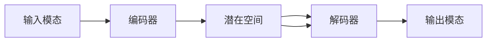
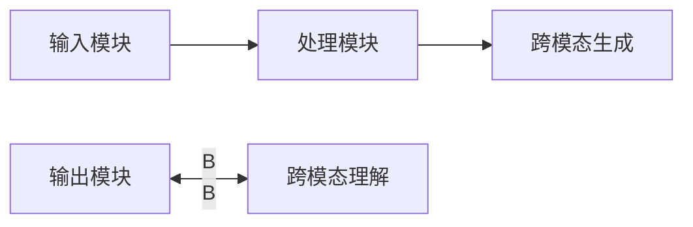

                 


# AI Agent的跨模态理解与生成

> **关键词**: AI Agent, 跨模态理解, 生成模型, 多模态数据, 深度学习

> **摘要**: 本文将探讨AI Agent在跨模态理解与生成方面的技术细节。通过分析多模态数据的感知、对齐与生成，结合实际项目案例，深入讲解AI Agent如何实现跨模态任务，从理论到实践，为您提供全面的技术解析。

---

## 第一部分: AI Agent的跨模态理解与生成基础

### 第1章: AI Agent的基本概念与背景

#### 1.1 AI Agent的定义与特点
##### 1.1.1 AI Agent的定义
AI Agent（人工智能代理）是指能够感知环境、做出决策并采取行动以实现目标的智能体。AI Agent可以是软件程序或机器人，旨在模拟人类或其他智能生物的行为。

##### 1.1.2 AI Agent的核心特点
- **自主性**: 能够自主决策，无需外部干预。
- **反应性**: 能够实时感知环境并做出反应。
- **目标导向**: 通过目标驱动行为，优化决策过程。
- **学习能力**: 能够通过经验改进自身性能。

##### 1.1.3 AI Agent与传统AI的区别
传统的AI系统（如专家系统）依赖于固定的规则和知识库，而AI Agent更加动态和自主，能够根据环境变化调整行为。

#### 1.2 跨模态理解与生成的背景
##### 1.2.1 跨模态问题的提出
现实世界中的数据通常是多模态的，例如图像、文本、语音、视频等。单一模态的数据往往不足以满足复杂任务的需求，因此需要将多种模态的数据进行融合。

##### 1.2.2 跨模态技术的发展历程
1. **早期阶段**: 基于特征提取的跨模态检索。
2. **深度学习阶段**: 利用深度神经网络进行跨模态对齐和生成。
3. **当前阶段**: 基于大语言模型的多模态生成。

##### 1.2.3 跨模态技术的当前应用现状
- **计算机视觉**: 图像描述生成、图像到文本的生成。
- **自然语言处理**: 文本到图像的生成、多语言翻译。
- **语音处理**: 语音识别与合成。

---

### 第2章: 跨模态理解与生成的核心概念

#### 2.1 跨模态理解的原理
##### 2.1.1 多模态数据的感知与整合
多模态数据的感知需要将不同类型的模态数据（如图像和文本）进行预处理和特征提取，以便后续处理。

##### 2.1.2 跨模态对齐机制
跨模态对齐是指将不同模态的数据映射到同一个潜在空间，以便进行有效融合。常用的方法包括对比学习、注意力机制等。

##### 2.1.3 跨模态特征提取方法
- **模态特定特征提取**: 对每种模态单独提取特征。
- **跨模态特征对齐**: 将不同模态的特征进行对齐和融合。

#### 2.2 跨模态生成的原理
##### 2.2.1 多模态生成模型的框架
多模态生成模型通常包括编码器和解码器两部分。编码器将输入的多模态数据映射到潜在空间，解码器从潜在空间生成目标模态的数据。

##### 2.2.2 跨模态生成的挑战
- **模态间信息不均衡**: 某些模态的数据量可能远少于其他模态。
- **跨模态对齐的复杂性**: 不同模态的数据结构差异较大，对齐困难。
- **生成结果的多样性**: 如何生成多样化且符合输入模态的输出。

##### 2.2.3 跨模态生成的评估指标
常用的评估指标包括BLEU、ROUGE、METEOR（文本生成）、PSNR、SSIM（图像生成）等。

---

#### 图2-1: 跨模态理解与生成的实体关系图



---

### 第3章: 跨模态理解与生成的数学模型

#### 3.1 跨模态对齐的数学模型
##### 3.1.1 注意力机制在跨模态对齐中的应用
注意力机制可以用于对齐不同模态的特征。例如，在图像-文本对齐中，可以使用交叉注意力机制。

公式：$$ \text{Attention}(Q, K, V) = \text{softmax}\left(\frac{QK^T}{\sqrt{d}}\right)V $$

##### 3.1.2 图神经网络在跨模态对齐中的应用
图神经网络可以用于建模模态之间的关系。例如，将图像和文本节点连接起来，学习跨模态关系。

公式：$$ Z = \sigma(A^{\top}XW_1 + B) $$

##### 3.1.3 跨模态对齐的损失函数
常用的损失函数包括对比损失和互信息损失。

公式：$$ L = -\log(\text{sim}(x, y)) $$

#### 3.2 跨模态生成的数学模型
##### 3.2.1 多模态编码器的数学表示
编码器将输入的多模态数据映射到潜在空间。

公式：$$ z = f_{\text{encoder}}(x) $$

##### 3.2.2 多模态解码器的数学表示
解码器从潜在空间生成目标模态的数据。

公式：$$ y = f_{\text{decoder}}(z) $$

##### 3.2.3 跨模态生成的优化算法
常用的优化算法包括Adam、SGD等。

公式：$$ \theta = \theta - \eta \nabla_{\theta} L $$

---

### 第4章: 跨模态理解与生成的算法原理

#### 4.1 跨模态对齐算法
##### 4.1.1 多模态对比学习算法
对比学习通过最大化正样本的相似性来学习跨模态表示。

公式：$$ L = -\sum_{i,j} \log \frac{\exp(s(x_i, y_j))}{\sum_{k} \exp(s(x_i, y_k))} $$

##### 4.1.2 跨模态注意力网络
注意力网络用于捕获不同模态之间的注意力权重。

公式：$$ \alpha_i = \text{softmax}(QK^T) $$

##### 4.1.3 图神经网络在跨模态对齐中的应用
图神经网络用于建模模态之间的关系。

公式：$$ Z = \sigma(A^{\top}XW_1 + B) $$

#### 4.2 跨模态生成算法
##### 4.2.1 多模态变体自编码器
变体自编码器通过重构输入数据来学习潜在空间。

公式：$$ y = f_{\text{decoder}}(f_{\text{encoder}}(x)) $$

##### 4.2.2 多模态生成对抗网络
生成对抗网络通过生成器和判别器的对抗训练来生成高质量的输出。

公式：$$ L_{\text{GAN}} = \mathbb{E}_{x}[D(x)] - \mathbb{E}_{z}[D(G(z))] $$

##### 4.2.3 多模态Transformer架构在生成任务中的应用
Transformer架构用于跨模态生成任务，如图像描述生成。

公式：$$ \text{Output} = \text{Transformer}(x) $$

---

### 第5章: 跨模态理解与生成的系统架构设计

#### 5.1 系统功能设计
##### 5.1.1 多模态数据输入模块
负责接收多种模态的数据输入，如图像、文本、语音等。

##### 5.1.2 跨模态理解模块
对输入的多模态数据进行预处理和特征提取，学习跨模态表示。

##### 5.1.3 跨模态生成模块
根据学习到的潜在表示生成目标模态的数据。

##### 5.1.4 输出结果展示模块
将生成的结果以用户友好的形式展示。

#### 5.2 系统架构设计
##### 5.2.1 分层架构设计
- **感知层**: 接收多模态数据。
- **计算层**: 进行跨模态理解和生成。
- **展示层**: 显示结果。

##### 5.2.2 模块化设计
- **输入模块**: 多模态数据输入。
- **处理模块**: 跨模态理解与生成。
- **输出模块**: 结果展示。

##### 5.2.3 可扩展性设计
系统设计应考虑到未来可能增加的新模态或新任务。

---

#### 图5-1: 跨模态理解与生成的系统架构图



---

### 第6章: 跨模态理解与生成的项目实战

#### 6.1 项目环境安装与配置
##### 6.1.1 Python环境的安装
需要安装Python 3.8及以上版本。

##### 6.1.2 依赖库的安装
安装PyTorch、Transformers、OpenCV等库。

```bash
pip install torch transformers opencv-python
```

#### 6.2 系统核心实现源代码
##### 6.2.1 编码器实现
```python
class MultiModalEncoder(nn.Module):
    def __init__(self, input_dim, hidden_dim):
        super().__init__()
        self.encoder = nn.Linear(input_dim, hidden_dim)
    
    def forward(self, x):
        return torch.relu(self.encoder(x))
```

##### 6.2.2 解码器实现
```python
class MultiModalDecoder(nn.Module):
    def __init__(self, hidden_dim, output_dim):
        super().__init__()
        self.decoder = nn.Linear(hidden_dim, output_dim)
    
    def forward(self, z):
        return torch.sigmoid(self.decoder(z))
```

#### 6.3 代码应用解读与分析
通过上述代码，可以实现多模态数据的编码和解码。编码器将输入数据映射到潜在空间，解码器从潜在空间生成目标模态的数据。

#### 6.4 实际案例分析和详细讲解剖析
以图像到文本的生成为例，输入一张图片，编码器提取图像特征，解码器生成对应的文本描述。

---

## 第七章: 跨模态理解与生成的最佳实践

### 7.1 最佳实践 tips
- **数据预处理**: 对不同模态的数据进行标准化处理。
- **模型调优**: 通过交叉验证和超参数优化提升性能。
- **模型评估**: 使用多种评估指标全面评估生成结果的质量。

### 7.2 小结
通过本文的讲解，您已经掌握了AI Agent跨模态理解与生成的核心技术，包括背景、原理、算法和系统设计等方面。

### 7.3 注意事项
- 注意数据的多样性和平衡性。
- 避免过拟合，使用正则化技术。
- 保护数据隐私，遵循相关法律法规。

### 7.4 拓展阅读
- 《Generating Multimodal Text and Images with Style Transfer》
- 《Cross-Modal Attention Networks for Image-Text Matching》
- 《Deepfake Detection via Multi-Modal Learning》

---

通过本文的详细讲解，您已经掌握了AI Agent跨模态理解与生成的核心技术，包括背景、原理、算法和系统设计等方面。希望本文能为您提供有价值的技术参考，帮助您更好地理解和应用AI Agent的跨模态技术。

