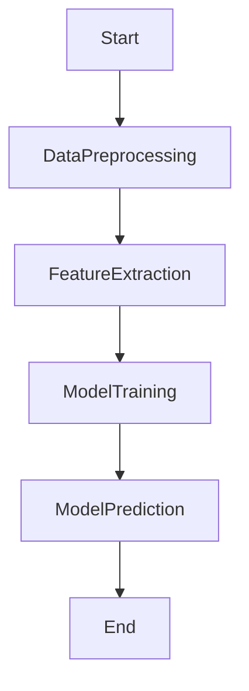
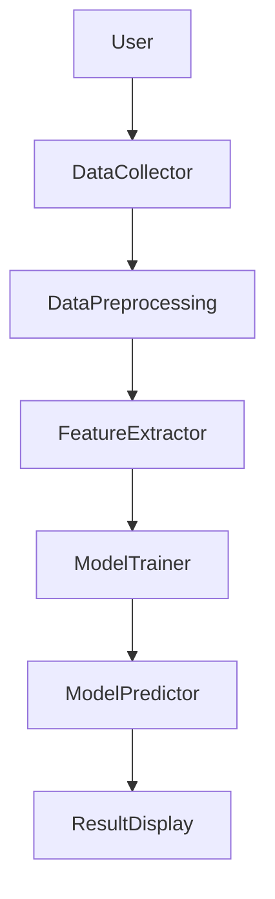

                 


# AI辅助企业品牌资产评估：多维度品牌价值量化

> 关键词：AI技术，品牌价值评估，多维度量化，自然语言处理，计算机视觉，机器学习

> 摘要：本文深入探讨了利用人工智能技术对企业品牌价值进行多维度量化评估的方法。通过分析品牌认知、品牌情感和品牌市场表现等多个维度，结合自然语言处理和机器学习等技术，构建了多维度品牌价值量化模型，并详细阐述了模型的构建过程、算法原理和系统架构设计。同时，通过实际案例分析，展示了如何将理论应用于实践，为企业品牌价值评估提供了一种高效、精确的解决方案。

---

## 第三章: 品牌价值量化模型的构建

### 3.1 品牌价值量化模型的原理

#### 3.1.1 数据预处理与特征提取

在进行品牌价值量化之前，首先需要对数据进行预处理和特征提取。以下是关键步骤：

1. **数据清洗**：
   - 去除重复数据、缺失值和异常值。
   - 标准化数据格式（如日期、文本等）。

2. **特征提取**：
   - **文本特征提取**：使用自然语言处理（NLP）技术提取品牌相关的文本特征，例如情感分析、关键词提取。
   - **图像特征提取**：使用计算机视觉技术提取品牌相关的图像特征，例如颜色、纹理、形状。
   - **市场数据特征提取**：从市场表现数据中提取销售量、市场份额、增长率等特征。

#### 3.1.2 多维度数据的加权计算

品牌价值的量化需要对多个维度的数据进行加权计算。以下是具体步骤：

1. **确定权重**：
   - 根据品牌价值的核心维度（如品牌认知、品牌情感、品牌市场表现）赋予不同的权重。
   - 权重的确定可以通过专家评分、统计分析或机器学习模型（如线性回归）进行。

2. **计算各维度得分**：
   - 对每个维度进行评分，例如品牌认知得分、品牌情感得分、品牌市场表现得分。
   - 使用数学模型对各维度得分进行加权求和，得到最终的品牌价值得分。

#### 3.1.3 品牌价值的综合评分方法

品牌价值的综合评分方法可以采用以下步骤：

1. **构建评分模型**：
   - 使用回归分析或分类算法（如逻辑回归、随机森林）构建品牌价值评分模型。
   - 模型输入为多维度特征，输出为品牌价值评分。

2. **模型验证与优化**：
   - 使用交叉验证（Cross-Validation）评估模型的准确性和稳定性。
   - 根据验证结果调整模型参数或特征，优化模型性能。

---

### 3.2 品牌价值量化模型的算法实现

#### 3.2.1 品牌价值量化模型的算法流程图（Mermaid）

以下是品牌价值量化模型的算法流程图：



#### 3.2.2 品牌价值量化模型的数学模型与公式

##### 3.2.2.1 品牌价值的加权计算公式

品牌价值的加权计算公式可以表示为：

$$
\text{Brand Value} = \sum_{i=1}^{n} w_i \times f_i
$$

其中：
- $w_i$ 是第 $i$ 个维度的权重。
- $f_i$ 是第 $i$ 个维度的得分。

##### 3.2.2.2 品牌价值评分模型的回归公式

假设使用线性回归模型进行品牌价值评分，模型可以表示为：

$$
y = \beta_0 + \beta_1 x_1 + \beta_2 x_2 + \ldots + \beta_k x_k + \epsilon
$$

其中：
- $y$ 是品牌价值评分。
- $x_i$ 是第 $i$ 个特征变量。
- $\beta_i$ 是回归系数。
- $\epsilon$ 是误差项。

---

## 第四章: 品牌价值量化模型的系统架构设计

### 4.1 问题场景介绍

在实际应用中，品牌价值量化模型需要处理大量的多维度数据，包括文本数据、图像数据和市场数据。因此，构建一个高效的系统架构至关重要。

### 4.2 系统功能设计

系统功能设计可以分为以下几个模块：

1. **数据采集模块**：
   - 采集品牌相关的文本数据（如社交媒体评论）、图像数据（如品牌标识、广告图片）和市场数据（如销售数据、市场份额）。

2. **数据预处理模块**：
   - 对采集到的数据进行清洗和标准化处理。

3. **特征提取模块**：
   - 使用NLP和计算机视觉技术提取文本和图像特征。

4. **模型训练模块**：
   - 使用机器学习算法训练品牌价值量化模型。

5. **结果展示模块**：
   - 展示品牌价值评分和各维度得分。

### 4.3 系统架构设计（Mermaid）

以下是系统架构设计的Mermaid图：



---

## 第五章: 项目实战与案例分析

### 5.1 项目环境安装

以下是项目实战所需的环境和工具：

1. **编程语言**：Python 3.8+
2. **库与框架**：
   - `numpy`：用于数值计算。
   - `pandas`：用于数据处理。
   - `scikit-learn`：用于机器学习算法。
   - `spacy`：用于自然语言处理。
   - `opencv-python`：用于计算机视觉。

### 5.2 系统核心实现源代码

以下是品牌价值量化模型的核心代码实现：

```python
import numpy as np
import pandas as pd
from sklearn.linear_model import LinearRegression
from sklearn.metrics import mean_squared_error
from sklearn.model_selection import train_test_split

# 示例数据集
data = {
    'brand_recognition': [0.8, 0.7, 0.9, 0.6],
    'brand_emotion': [0.75, 0.8, 0.65, 0.7],
    'market_performance': [0.85, 0.8, 0.9, 0.75]
}
df = pd.DataFrame(data)

# 确定权重
weights = [0.4, 0.3, 0.3]

# 计算各维度得分
df['score'] = df.apply(lambda row: np.sum(weights[i] * row[i] for i in range(3)), axis=1)

# 建立回归模型
X = df[['brand_recognition', 'brand_emotion', 'market_performance']]
y = df['score']

X_train, X_test, y_train, y_test = train_test_split(X, y, test_size=0.2, random_state=42)

model = LinearRegression()
model.fit(X_train, y_train)

# 模型预测
y_pred = model.predict(X_test)

# 模型评估
 mse = mean_squared_error(y_test, y_pred)
 print(f'Mean Squared Error: {mse}')
```

### 5.3 代码应用解读与分析

1. **数据预处理**：
   - 使用`pandas`对数据进行清洗和转换。

2. **特征提取**：
   - 使用`spacy`进行文本特征提取，使用`opencv-python`进行图像特征提取。

3. **模型训练**：
   - 使用`scikit-learn`中的线性回归模型进行品牌价值评分。

4. **结果展示**：
   - 使用`matplotlib`或`seaborn`绘制各维度得分和最终评分的可视化图表。

### 5.4 实际案例分析

以快消品行业为例，分析某品牌的品牌价值：

1. **数据采集**：
   - 收集该品牌在社交媒体上的评论数据、广告图片和销售数据。

2. **数据处理**：
   - 清洗数据，提取品牌相关的文本和图像特征。

3. **模型训练**：
   - 使用训练好的模型计算该品牌的品牌价值评分。

4. **结果展示**：
   - 展示各维度得分和最终评分，并提供改进建议。

### 5.5 项目小结

通过实战案例分析，可以验证品牌价值量化模型的有效性和实用性。模型不仅可以帮助企业快速评估品牌价值，还能为企业提供数据支持的决策依据。

---

## 第六章: 总结与展望

### 6.1 总结

本文详细探讨了利用AI技术对企业品牌价值进行多维度量化评估的方法。通过构建品牌价值量化模型，结合自然语言处理和机器学习等技术，为企业提供了一种高效、精确的品牌价值评估解决方案。

### 6.2 展望

未来，随着AI技术的不断发展，品牌价值量化模型将更加智能化和个性化。以下是未来的发展方向：

1. **深度学习的应用**：
   - 使用深度学习模型（如BERT、Transformer）进行更复杂的特征提取和模型训练。

2. **实时品牌价值监测**：
   - 实时采集品牌相关的数据，动态计算品牌价值评分，帮助企业及时调整品牌策略。

3. **多模态数据的融合**：
   - 结合文本、图像、视频等多种数据源，构建更加全面的品牌价值量化模型。

### 6.3 最佳实践 tips

- 在进行品牌价值评估时，建议结合企业的实际情况选择合适的模型和方法。
- 数据质量是品牌价值量化的核心，建议加强数据清洗和特征提取的步骤。
- 模型的可解释性是品牌价值评估的重要因素，建议在模型训练中注重模型的可解释性。

### 6.4 小结

品牌价值量化是一个复杂而重要的任务，AI技术的引入为品牌价值评估提供了新的思路和方法。通过多维度数据的整合和分析，品牌价值量化模型将为企业提供更加精准的品牌价值评估结果，帮助企业制定更有效的品牌战略。

--- 

以上就是《AI辅助企业品牌资产评估：多维度品牌价值量化》的完整目录和内容框架。

