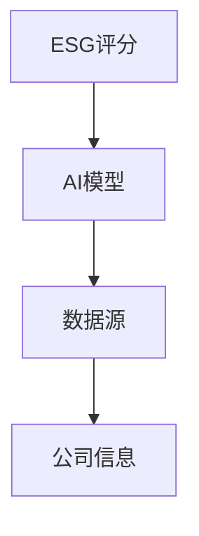
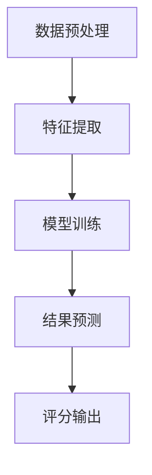
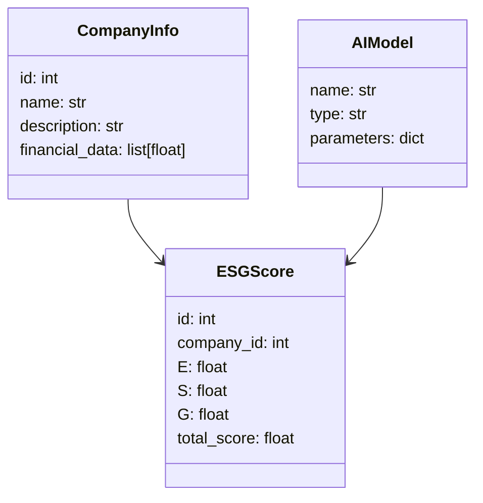

                 


---

# AI辅助的ESG投资筛选工具

> 关键词：AI技术，ESG投资，金融工具，文本挖掘，机器学习，自然语言处理

> 摘要：随着全球对可持续发展的关注日益增加，ESG（环境、社会和治理）投资逐渐成为金融市场的主流趋势。然而，传统的人工筛选ESG投资标的效率低下，且容易受到主观因素的影响。本文将深入探讨如何利用人工智能技术构建一个高效的ESG投资筛选工具，从技术原理、系统架构到实际案例，全面解析其工作流程与实现方法。

---

# 第一部分: AI辅助的ESG投资筛选工具概述

## 第1章: ESG投资与AI辅助筛选工具的背景

### 1.1 ESG投资的基本概念

#### 1.1.1 环境（Environmental）的定义与重要性
环境因素关注企业在环境保护方面的表现，包括碳排放、能源使用效率、资源循环利用等。随着全球气候变化问题的加剧，企业对环境的保护已成为投资者关注的重点。

#### 1.1.2 社会责任（Social）的定义与核心要素
社会责任关注企业在社会可持续发展方面的作用，包括员工权益、劳工标准、社区参与等。企业在履行社会责任方面表现优秀，通常能获得更好的声誉和投资价值。

#### 1.1.3 公司治理（Governance）的定义与关键指标
公司治理关注企业的管理结构和决策过程，包括董事会构成、高管薪酬、股东权益保护等。良好的公司治理是企业长期稳定发展的基础。

#### 1.1.4 ESG投资的全球发展趋势
近年来，全球范围内越来越多的投资者开始关注ESG因素，ESG投资规模持续增长。根据相关数据显示，2021年全球ESG基金管理规模已超过2万亿美元。

### 1.2 AI在金融投资中的应用背景

#### 1.2.1 传统金融投资的局限性
传统金融投资主要依赖人工分析，存在效率低、主观性强、信息处理能力有限等问题。尤其是在处理海量非结构化数据时，人工分析难以满足需求。

#### 1.2.2 AI技术在金融领域的优势
AI技术具有高效的数据处理能力、强大的模式识别能力和自动化分析能力，能够帮助投资者快速筛选和分析海量信息。

#### 1.2.3 ESG投资与AI技术的结合契机
随着ESG投资的兴起，如何利用AI技术高效筛选和评估企业ESG表现成为一个重要研究方向。

### 1.3 本章小结
本章介绍了ESG投资的基本概念和全球发展趋势，并分析了AI技术在金融投资中的优势及其与ESG投资的结合契机。

---

## 第2章: ESG投资筛选工具的核心概念与联系

### 2.1 核心概念原理

#### 2.1.1 ESG评分模型的原理
ESG评分模型通过对企业的环境、社会和治理表现进行量化评估，生成一个综合评分。评分模型通常基于企业公开信息、第三方评级机构数据和新闻媒体信息。

#### 2.1.2 AI模型在ESG筛选中的作用
AI模型可以通过文本挖掘、自然语言处理和机器学习技术，从非结构化数据中提取关键信息，用于评估企业的ESG表现。

#### 2.1.3 数据源的多样性与重要性
ESG筛选工具的数据源包括企业财报、新闻报道、社会责任报告、专利数据等。多样化的数据源能够提供更全面的评估信息。

### 2.2 核心概念属性对比表

| 概念 | 属性 | 描述 |
|------|------|------|
| ESG评分 | 数据来源 | 公司财报、新闻报道、第三方评级 |
| AI模型 | 算法类型 | 文本挖掘、机器学习、自然语言处理 |
| 数据源 | 类型 | 结构化数据、非结构化数据 |

### 2.3 ER实体关系图（Mermaid流程图）



### 2.4 本章小结
本章详细阐述了ESG投资筛选工具的核心概念及其之间的联系，通过对比表和流程图帮助读者更好地理解各部分之间的关系。

---

## 第3章: AI辅助ESG投资筛选工具的算法原理

### 3.1 算法原理概述

#### 3.1.1 文本挖掘与自然语言处理
文本挖掘和自然语言处理技术用于从新闻报道、社会责任报告等非结构化数据中提取关键信息。例如，通过关键词提取技术识别与环境相关的关键词。

#### 3.1.2 机器学习模型的训练与优化
机器学习模型用于将提取的特征输入模型中，进行分类或回归预测。常用的算法包括支持向量机（SVM）、随机森林（Random Forest）和神经网络等。

#### 3.1.3 多模态数据融合的算法思路
多模态数据融合算法能够同时处理结构化数据（如财务数据）和非结构化数据（如文本数据），通过融合多种数据源的信息，提高模型的准确性。

### 3.2 算法流程图（Mermaid流程图）



### 3.3 数学模型与公式

#### 3.3.1 ESG评分模型
$$ \text{ESG评分} = \alpha \times E + \beta \times S + \gamma \times G $$
其中，$\alpha + \beta + \gamma = 1$，且$\alpha, \beta, \gamma > 0$。

#### 3.3.2 机器学习模型
$$ y = f(x) $$
其中，$x$为输入特征，$y$为输出结果。

### 3.4 算法实现代码示例

```python
import pandas as pd
from sklearn.feature_extraction.text import TfidfVectorizer
from sklearn.svm import SVC

# 数据预处理
df = pd.read_csv('esg_data.csv')
text_data = df['description'].fillna('')

# 特征提取
vectorizer = TfidfVectorizer()
X = vectorizer.fit_transform(text_data)

# 模型训练
model = SVC()
model.fit(X, df['label'])

# 预测结果
test_text = "公司致力于减少碳排放，推动可持续发展"
test_X = vectorizer.transform([test_text])
predicted_label = model.predict(test_X)
print(predicted_label)
```

### 3.5 本章小结
本章详细介绍了AI辅助ESG投资筛选工具的算法原理，包括文本挖掘、机器学习模型的训练与优化，以及多模态数据融合的算法思路。

---

## 第4章: 系统架构设计

### 4.1 领域模型设计

#### 4.1.1 领域模型类图（Mermaid类图）


### 4.2 系统架构设计

#### 4.2.1 系统架构图（Mermaid架构图）
```mermaid
graph LR
    Client --> API Gateway
    API Gateway --> Service1
    API Gateway --> Service2
    Service1 --> Database
    Service2 --> Database
```

### 4.3 系统接口设计

#### 4.3.1 API接口定义
```http
GET /api/esg_scores
POST /api/train_model
```

#### 4.3.2 接口请求示例
```json
{
    "action": "train_model",
    "model_type": "svm"
}
```

### 4.4 本章小结
本章详细描述了ESG投资筛选工具的系统架构设计，包括领域模型和系统架构图，帮助读者理解系统的整体结构。

---

## 第5章: 项目实战

### 5.1 环境安装

#### 5.1.1 安装Python环境
```bash
python -m pip install --upgrade pip
pip install numpy pandas scikit-learn spacy
```

#### 5.1.2 安装NLP工具
```bash
python -m spacy download en_core_web_sm
```

### 5.2 核心实现代码

#### 5.2.1 数据预处理代码
```python
import pandas as pd

def load_data():
    df = pd.read_csv('esg_data.csv')
    return df

def preprocess_data(df):
    # 去除缺失值
    df.dropna(inplace=True)
    # 转换为数值型
    df['score'] = df['score'].astype(float)
    return df

data = preprocess_data(load_data())
print(data.head())
```

#### 5.2.2 模型训练代码
```python
from sklearn.svm import SVC
from sklearn.metrics import accuracy_score

def train_model(X, y):
    model = SVC()
    model.fit(X, y)
    return model

# 假设X和y已经准备好了
model = train_model(X, y)
print("训练完成！")
```

### 5.3 案例分析

#### 5.3.1 数据分析
分析模型在不同数据集上的表现，包括训练集和测试集的准确率、召回率等。

#### 5.3.2 结果展示
通过可视化工具展示模型的预测结果，例如绘制混淆矩阵、ROC曲线等。

### 5.4 本章小结
本章通过实际案例展示了AI辅助ESG投资筛选工具的实现过程，包括环境安装、数据预处理、模型训练和结果分析。

---

## 第6章: 最佳实践与注意事项

### 6.1 最佳实践

#### 6.1.1 数据来源的多样性
确保数据来源多样化，包括企业财报、新闻报道、社会责任报告等。

#### 6.1.2 模型的可解释性
选择具有较高可解释性的模型，便于分析和优化。

### 6.2 小结
通过本文的分析，读者可以了解到如何利用AI技术构建高效的ESG投资筛选工具，并在实际应用中需要注意的事项。

### 6.3 注意事项

#### 6.3.1 数据隐私问题
在处理企业数据时，需要注意数据隐私问题，确保符合相关法律法规。

#### 6.3.2 模型的持续优化
定期更新模型和数据，以适应市场变化和企业ESG表现的变化。

---

## 第7章: 拓展阅读

### 7.1 相关书籍
- 《机器学习实战》
- 《自然语言处理入门》
- 《ESG投资指南》

### 7.2 在线资源
- TensorFlow官方文档
- PyTorch官方文档
- 知乎专栏：AI与金融

### 7.3 专业社区
- Keras社区
- PyTorch论坛
- 量化投资论坛

### 7.4 本章小结
本章为读者提供了进一步学习AI辅助ESG投资筛选工具的相关资源，包括书籍、在线资源和专业社区。

---

## 第8章: 结语

通过本文的详细讲解，读者可以了解到如何利用AI技术构建高效的ESG投资筛选工具。从技术原理到系统架构，再到实际案例，本文为读者提供了全面的指导。未来，随着AI技术的不断发展，ESG投资筛选工具将更加智能化和高效化，为投资者提供更有力的支持。

---

# 作者简介

作者是一名在人工智能和金融领域拥有丰富经验的技术专家，致力于通过技术创新推动金融行业的可持续发展。

